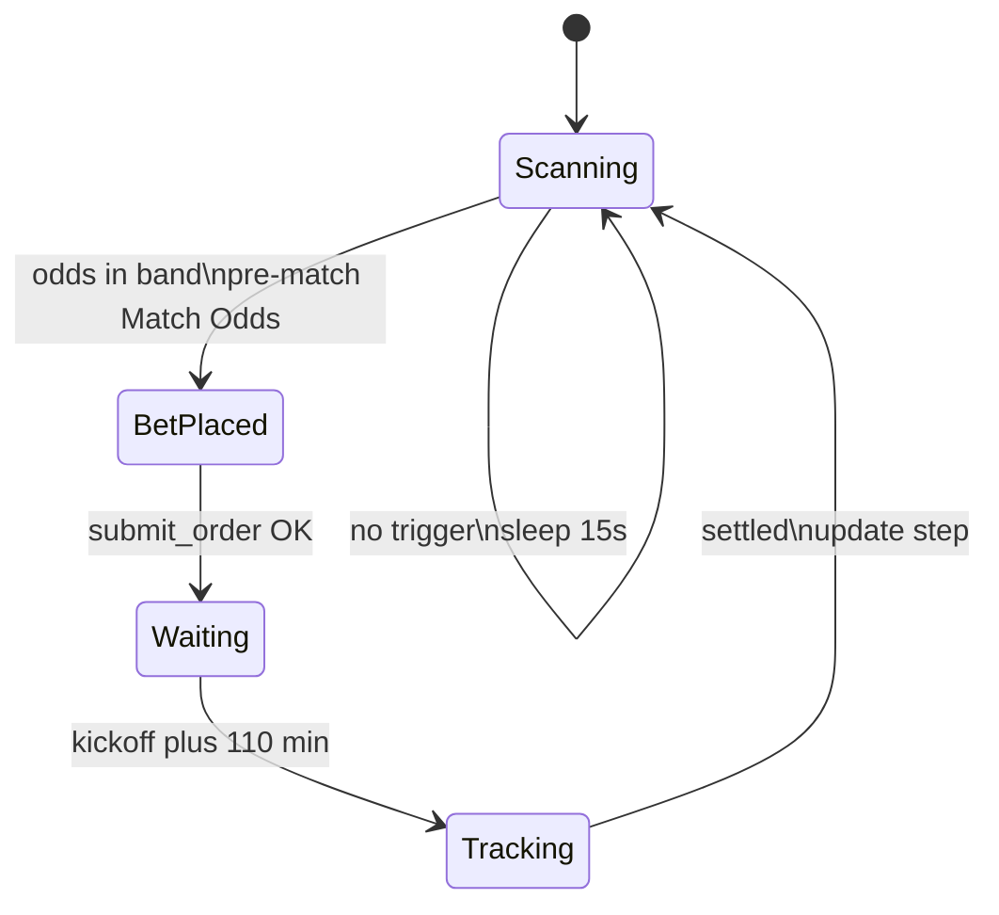

# Matchbook Trading Bot - Source Code Dump

This file contains the core Python implementation and logs for troubleshooting.

## File: src/api_client.py

```python
"""Matchbook REST API client and optional Telegram alerts.

See README.md and docs/API.md for usage and endpoints.
"""

import os
import requests
import json
import time

class MatchbookClient:
    def __init__(self):
        self.username = os.getenv("MATCHBOOK_USERNAME")
        self.password = os.getenv("MATCHBOOK_PASSWORD")
        self.tg_token = os.getenv("TELEGRAM_BOT_TOKEN")
        self.tg_chat_id = os.getenv("TELEGRAM_CHAT_ID")

        self.auth_url = "https://api.matchbook.com/bpapi/rest/security/session"
        self.base_url = "https://api.matchbook.com/edge/rest"
        self.session_token = None
        self.headers = {
            "content-type": "application/json;charset=UTF-8",
            "accept": "application/json"
        }

    def login(self):
        """Authenticates with Matchbook and stores the session token with rate-limit recovery."""
        payload = {
            "username": self.username,
            "password": self.password
        }
        
        attempt = 1
        wait_time = 10  # Start with a 10 second wait on 429 errors

        while True:
            try:
                response = requests.post(self.auth_url, data=json.dumps(payload), headers=self.headers)
                
                if response.status_code == 200:
                    data = response.json()
                    self.session_token = data.get("session-token")
                    self.headers["session-token"] = self.session_token
                    self.send_telegram("✅ Matchbook login successful. Session token acquired.")
                    return True
                
                elif response.status_code == 429:
                    print(f"⚠️ Matchbook API login returned 429 (Rate Limited). Attempt {attempt}. Retrying in {wait_time}s...")
                    time.sleep(wait_time)
                    attempt += 1
                    wait_time = min(wait_time * 2, 300)  # Double the wait time, capping at 5 minutes
                    continue
                    
                else:
                    self.send_telegram(f"❌ Login failed. Status: {response.status_code}")
                    return False
                    
            except Exception as e:
                self.send_telegram(f"❌ Login exception encountered: {str(e)}")
                return False

    def get_navigation(self):
        """Retrieves the navigation hierarchy to locate sports and markets."""
        url = f"{self.base_url}/navigation"
        try:
            response = requests.get(url, headers=self.headers)
            if response.status_code == 200:
                return response.json()
            return None
        except Exception as e:
            print(f"Error fetching navigation: {str(e)}")
            return None

    def get_live_events(self, sport_ids, per_page=20):
        """Fetches active events, runners, and exchange market odds for specified sport IDs."""
        url = f"{self.base_url}/events"
        params = {
            "sport-ids": sport_ids,
            "states": "open",
            "include-prices": "true",
            "price-depth": 3,
            "price-mode": "expanded",
            "odds-type": "DECIMAL",
            "exchange-type": "back-lay",
            "per-page": per_page
        }
        try:
            response = requests.get(url, params=params, headers=self.headers)
            if response.status_code == 200:
                return response.json()
            return None
        except Exception as e:
            print(f"Error fetching live events: {str(e)}")
            return None

    def submit_order(self, runner_id, side, odds, stake):
        """Submits an exchange order for a specific selection runner ID."""
        url = f"{self.base_url}/v2/offers"
        payload = {
            "odds-type": "DECIMAL",
            "exchange-type": "back-lay",
            "offers": [
                {
                    "runner-id": runner_id,
                    "side": side,
                    "odds": odds,
                    "stake": stake
                }
            ]
        }
        try:
            response = requests.post(url, data=json.dumps(payload), headers=self.headers)
            if response.status_code in [200, 201]:
                return response.json()
            print(f"Order submission rejected. Status: {response.status_code}, Response: {response.text}")
            return None
        except Exception as e:
            print(f"Exception during order submission: {str(e)}")
            return None

    def get_order_status(self, offer_id):
        """Fetch one offer by ID (Matchbook: GET /v2/offers?offer-ids=...)."""
        url = f"{self.base_url}/v2/offers"
        params = {"offer-ids": str(offer_id), "per-page": 1}
        try:
            response = requests.get(url, params=params, headers=self.headers)
            if response.status_code == 200:
                return response.json()
            return None
        except Exception as e:
            print(f"Error checking offer status: {str(e)}")
            return None

    @staticmethod
    def unwrap_offer(data):
        """Normalize GET offer response (single object or offers list)."""
        if not data:
            return None
        offers = data.get("offers")
        if offers:
            return offers[0]
        if data.get("id") is not None:
            return data
        return None

    def outcome_from_offer(self, offer):
        """Return 'won' or 'lost' from one offer object, or None if not settled."""
        if not offer:
            return None

        result = (offer.get("result") or "").upper()
        if result == "WIN":
            return "won"
        if result in ("LOSE", "LOST"):
            return "lost"

        status = (offer.get("status") or "").upper()

        for key in ("settled-items", "settled_items"):
            items = offer.get(key) or []
            if items:
                pl = items[0].get("profit-loss", items[0].get("profit_and_loss", 0))
                return "won" if pl > 0 else "lost"

        if status in ("SETTLED", "FLUSHED"):
            pl = offer.get("profit-loss", offer.get("profit_and_loss"))
            if pl is not None:
                return "won" if pl > 0 else "lost"

        for key in ("matched-bets", "matched_bets"):
            for bet in offer.get(key) or []:
                bet_result = (bet.get("result") or "").upper()
                if bet_result == "WIN":
                    return "won"
                if bet_result in ("LOSE", "LOST"):
                    return "lost"
                if status in ("SETTLED", "FLUSHED"):
                    pl = bet.get("profit-loss", bet.get("profit_and_loss"))
                    if pl is not None:
                        return "won" if pl > 0 else "lost"

        return None

    @staticmethod
    def _outcome_from_settled_bet(bet):
        bet_result = (bet.get("result") or "").upper()
        if bet_result == "WIN":
            return "won"
        if bet_result in ("LOSE", "LOST"):
            return "lost"
        if bet_result in ("PUSH_WIN",):
            return "won"
        if bet_result in ("PUSH", "PUSH_LOSE"):
            return "lost"
        pl = bet.get("profit-loss", bet.get("profit_and_loss"))
        if pl is not None:
            return "won" if pl > 0 else "lost"
        return None

    def get_settled_outcome_for_offer(self, offer_id, after_dt=None, event_id=None):
        """Look up offer in Matchbook settled-bets report (WIN / LOSE / profit-loss)."""
        url = f"{self.base_url}/reports/v2/bets/settled"
        target = str(offer_id)
        offset = 0
        per_page = 500

        while True:
            params = {"per-page": per_page, "offset": offset, "sport-ids": "15"}
            if after_dt:
                params["after"] = after_dt.strftime("%Y-%m-%dT%H:%M:%S.000Z")
            if event_id:
                params["event-ids"] = str(event_id)

            try:
                response = requests.get(url, params=params, headers=self.headers)
                if response.status_code != 200:
                    return None

                data = response.json()
                for market in data.get("markets", []):
                    for selection in market.get("selections", []):
                        for bet in selection.get("bets", []):
                            if str(bet.get("offer-id", bet.get("offer_id"))) != target:
                                continue
                            return self._outcome_from_settled_bet(bet)

                total = data.get("total", 0)
                offset += per_page
                if offset >= total:
                    return None
            except Exception as e:
                print(f"Error fetching settled bets: {str(e)}")
                return None

    def resolve_offer_outcome(self, offer_id, after_dt=None, event_id=None):
        """Resolve won/lost from Matchbook only (offers API + settled-bets report)."""
        outcome = self.get_settled_outcome_for_offer(offer_id, after_dt, event_id)
        if outcome:
            return outcome, "settled-report"

        raw = self.get_order_status(offer_id)
        offer = self.unwrap_offer(raw)
        outcome = self.outcome_from_offer(offer)
        status_label = (offer.get("status") if offer else None) or (
            "not_found" if raw is None else "unknown"
        )
        if outcome:
            return outcome, status_label

        return None, status_label

    def send_telegram(self, message):
        """Helper service to push instant alerts to your Telegram chat."""
        if not self.tg_token or not self.tg_chat_id:
            return
        url = f"https://api.telegram.org/bot{self.tg_token}/sendMessage"
        payload = {
            "chat_id": self.tg_chat_id,
            "text": message
        }
        try:
            requests.post(url, json=payload)
        except Exception:
            pass
```

## File: src/strategy_one.py

```python
"""Automated Matchbook strategy loop (scan, bet, settle, step ladder).

See README.md and docs/STRATEGY.md for behavior and configuration.
"""

import json
import os
import time
from datetime import datetime, timedelta
from api_client import MatchbookClient
from log_util import install_print_logger, setup_logging

STATE_FILE = os.path.join(os.path.dirname(__file__), "..", "config", "state.json")


def load_settings():
    path = os.path.join(os.path.dirname(__file__), "..", "config", "settings.json")
    if not os.path.isfile(path):
        raise FileNotFoundError(f"Missing config: {path}")
    with open(path, encoding="utf-8") as f:
        return json.load(f)


def stake_for_step(settings, step):
    mode = settings.get("mode", "testing")
    ladder = settings.get("stakes", {}).get(mode)
    if not ladder:
        ladder = settings.get("stakes", {}).get("testing", [0.10])
    idx = max(0, min(step - 1, len(ladder) - 1))
    return float(ladder[idx])


def load_state():
    """Loads active bet information and step tracking from disk if present."""
    if not os.path.isfile(STATE_FILE):
        return 1, None
    try:
        with open(STATE_FILE, "r", encoding="utf-8") as f:
            state = json.load(f)
            current_step = state.get("current_step", 1)
            active_bet_info = state.get("active_bet_info")
            
            if active_bet_info:
                # Restore datetime instances from stored string formats
                active_bet_info["start_time"] = datetime.fromisoformat(active_bet_info["start_time"])
                active_bet_info["placed_at"] = datetime.fromisoformat(active_bet_info["placed_at"])
                
            return current_step, active_bet_info
    except Exception as e:
        print(f"⚠️ Error loading state file: {str(e)}. Falling back to clean slate.")
        return 1, None


def save_state(current_step, active_bet_info):
    """Saves active bet information and step tracking securely to disk."""
    try:
        state_to_save = {
            "current_step": current_step,
            "active_bet_info": None
        }
        if active_bet_info:
            # Serialize datetime fields into ISO format strings for JSON compatibility
            state_to_save["active_bet_info"] = {
                **active_bet_info,
                "start_time": active_bet_info["start_time"].isoformat(),
                "placed_at": active_bet_info["placed_at"].isoformat()
            }
        with open(STATE_FILE, "w", encoding="utf-8") as f:
            json.dump(state_to_save, f, indent=2)
    except Exception as e:
        print(f"⚠️ Error updating state file: {str(e)}")


def main():
    log_path = setup_logging()
    install_print_logger()
    print(f"Log file: {log_path}")
    print("Starting automated execution strategy loop...")
    client = MatchbookClient()

    if not client.login():
        print("Initial authentication failed.")
        return

    settings = load_settings()
    max_steps = int(settings.get("max_steps", 6))
    odds_min = float(settings.get("odds_min", 1.45))
    odds_max = float(settings.get("odds_max", 1.60))
    mode = settings.get("mode", "testing")
    print(
        f"Config loaded: mode={mode}, max_steps={max_steps}, "
        f"odds {odds_min}-{odds_max}, stake step 1={stake_for_step(settings, 1)}"
    )

    target_sport_id = "15"
    loop_interval = 15

    # Recover state on startup sequence
    current_step, active_bet_info = load_state()
    if active_bet_info:
        print(f"🔄 Recovered existing active bet profile for: {active_bet_info['event_name']}")

    try:
        while True:
            # Skip scanning if we recovered an ongoing trackable bet profile
            if not active_bet_info:
                print(f"\n--- Scanning markets at {time.strftime('%Y-%m-%d %H:%M:%S')} (Step {current_step}/{max_steps}) ---")

                data = client.get_live_events(sport_ids=target_sport_id, per_page=30)

                if data and "events" in data:
                    current_utc = datetime.utcnow()

                    for event in data["events"]:
                        if event.get("in-play") is True or event.get("live-execution") is True:
                            continue

                        start_str = event.get("start")
                        if start_str:
                            try:
                                start_time = datetime.strptime(start_str.replace("Z", ""), "%Y-%m-%dT%H:%M:%S.%f")
                                if current_utc >= start_time:
                                    continue
                            except Exception:
                                continue
                        else:
                            continue

                        event_name = event.get("name", "Unknown Match")

                        meta_tags = event.get("meta-tags", [])
                        league_name = "Unknown League"
                        for tag in meta_tags:
                            if tag.get("type") == "COMPETITION":
                                league_name = tag.get("name")
                                break

                        for market in event.get("markets", []):
                            if market.get("name") == "Match Odds":
                                for runner in market.get("runners", []):
                                    runner_id = runner.get("id")
                                    runner_name = runner.get("name")
                                    prices = runner.get("prices", [])

                                    backs = [p for p in prices if p.get("side") == "back"]
                                    if backs:
                                        best_back = backs[0].get("odds")

                                        if odds_min <= best_back <= odds_max:
                                            print(f"🎯 Trigger conditions met for: {event_name} -> {runner_name}")

                                            target_side = "back"
                                            target_odds = best_back
                                            target_stake = stake_for_step(settings, current_step)

                                            order_status = client.submit_order(
                                                runner_id=runner_id,
                                                side=target_side,
                                                odds=target_odds,
                                                stake=target_stake
                                            )

                                            if order_status:
                                                offers = order_status.get("offers", [])
                                                placed_offer = offers[0] if offers else {}
                                                offer_id = placed_offer.get("id")
                                                event_id = placed_offer.get("event-id")

                                                athens_time = start_time + timedelta(hours=3)
                                                athens_time_str = athens_time.strftime("%H:%M")

                                                msg = (
                                                    f"🚀 Bet Placed!\n"
                                                    f"Step: {current_step}/{max_steps}\n"
                                                    f"League: {league_name}\n"
                                                    f"Match: {event_name}\n"
                                                    f"Selection: {runner_name}\n"
                                                    f"Action: {target_side}\n"
                                                    f"Odds: {target_odds}\n"
                                                    f"Stake: {target_stake}\n"
                                                    f"Start Time: {athens_time_str}"
                                                )
                                                print(msg)
                                                client.send_telegram(msg)

                                                active_bet_info = {
                                                    "offer_id": offer_id,
                                                    "event_id": event_id,
                                                    "start_time": start_time,
                                                    "placed_at": datetime.utcnow(),
                                                    "selection_name": runner_name,
                                                    "event_name": event_name,
                                                }
                                                # Persistent save after placing a new bet
                                                save_state(current_step, active_bet_info)
                                                break
                                            else:
                                                print(f"⚠️ Execution routing declined by backend exchange rules.")
                        if active_bet_info:
                            break

            if active_bet_info:
                resume_time = active_bet_info["start_time"] + timedelta(minutes=110)
                resume_athens = resume_time + timedelta(hours=3)
                
                if datetime.utcnow() < resume_time:
                    print(f"⏳ Active bet track verified. Holding market checks until 110 minutes after kickoff ({resume_athens.strftime('%H:%M')} Athens time)...")

                while datetime.utcnow() < resume_time:
                    time.sleep(30)

                print("⏰ 110 minutes elapsed since kickoff. Transitioning to minute-by-minute status tracking...")

                while True:
                    time.sleep(60)
                    offer_id = active_bet_info.get("offer_id")
                    if not offer_id:
                        print("No offer_id — waiting for Matchbook...")
                        continue

                    after_dt = active_bet_info.get("placed_at") or active_bet_info.get("start_time")
                    outcome, source = client.resolve_offer_outcome(
                        offer_id,
                        after_dt=after_dt,
                        event_id=active_bet_info.get("event_id"),
                    )
                    print(
                        f"Checking settlement for offer {offer_id} "
                        f"({source or 'pending'})..."
                    )

                    if outcome not in ("won", "lost"):
                        continue

                    result_label = "Won" if outcome == "won" else "Lost"
                    next_step = 1 if outcome == "won" else (
                        current_step + 1 if current_step < max_steps else 1
                    )

                    settle_msg = (
                        f"Settled\n"
                        f"Match: {active_bet_info['event_name']}\n"
                        f"Result: {result_label}\n"
                        f"Next step: {next_step}/{max_steps}"
                    )
                    print(settle_msg)
                    client.send_telegram(settle_msg)

                    current_step = next_step
                    active_bet_info = None
                    # Clear active bet profile and persist updated ladder step level
                    save_state(current_step, active_bet_info)
                    break

            time.sleep(loop_interval)

    except KeyboardInterrupt:
        print("\nStrategy engine loop safely terminated.")

if __name__ == "__main__":
    main()
```

## File: docs/STRATEGY.md

```markdown
# Strategy reference

This document describes **current runtime behavior** in `src/strategy_one.py`. For configuration files and environment variables, see [CONFIGURATION.md](CONFIGURATION.md).

## Overview

The bot runs an infinite loop that:

1. Scans open pre-match events for sport ID **15** (football).
2. Looks for **Match Odds** selections whose best **back** price is between **1.45** and **1.60**.
3. Places a **back** bet at stake **0.10** at the best back odds.
4. Pauses market scanning until **110 minutes after kickoff**.
5. Polls settlement every **60 seconds**, then updates a **6-step** progression ladder.
6. Resumes scanning after settlement.

## Flow diagram



## Market filters

When fetching `/events`, the strategy applies these filters **per event**:

| Filter | Rule |
|--------|------|
| Sport | `sport-ids=15` |
| State | `states=open` |
| In-play | Skip if `in-play` or `live-execution` is true |
| Kickoff | Skip if UTC `start` is missing or already passed |
| Market | Only `name == "Match Odds"` |
| Price | Best back (first back in price list) must satisfy `1.45 <= odds <= 1.60` |

The scan requests `per-page=30`, `price-depth=1`, decimal odds, back-lay exchange type.

## Order placement

When a selection matches:

| Field | Value |
|-------|-------|
| Side | `back` |
| Odds | Best back price from the scan |
| Stake | `0.10` (hardcoded) |

Orders are submitted via `MatchbookClient.submit_order()`. On success, a Telegram message includes league (from `meta-tags` type `COMPETITION`), match, selection, odds, stake, and kickoff time shown in **Athens time** (UTC + 3 hours) for display only.

## Post-bet wait

After a successful bet:

- Market scanning **stops** until `kickoff_utc + 110 minutes`.
- The loop sleeps in **30-second** chunks during this period.
- Console logs show the resume time in Athens time.

## Settlement tracking

After the 110-minute wait, the bot checks settlement **every 60 seconds**:

1. **Primary:** `get_order_status(offer_id)` — if status is `SETTLED` or `FLUSHED`, use `settled-items[0].profit-loss` (profit > 0 → win, else loss).
2. **Fallback:** If status is unavailable, re-fetch open events; if the event name no longer appears, treat as **won**.

When settled, a Telegram and console message report WIN/LOSS and the next step index.

## Step ladder

The bot tracks `current_step` from **1** to **6** (`max_steps = 6`):

| Result | Next step |
|--------|-----------|
| Win | Reset to **1** |
| Loss | **current_step + 1**, or **1** if already at step 6 |

The step number is included in bet-placed and settlement messages. It is **informational** today: stake does **not** change per step (always `0.10`).

## Telegram alerts

Sent when configured (see [CONFIGURATION.md](CONFIGURATION.md)):

- Successful login
- Failed login
- Bet placed (with match details)
- Settlement (result and next step)

## Known gaps

| Item | Status |
|------|--------|
| `config/settings.json` | **Not loaded** — `mode`, odds bounds, and stake ladders are unused |
| Per-step stakes | Hardcoded `0.10`; production ladder in settings is documentation-only |
| `get_navigation()` | Available in client but not used by strategy |
| `get_live_events()` | Available in client; strategy calls `/events` directly |

Loading `settings.json` into the strategy loop is a planned follow-up code change.

## Stopping the bot

Press **Ctrl+C** to exit gracefully. The main loop catches `KeyboardInterrupt` and prints a shutdown message.
```

## File: docs/TROUBLESHOOTING.md

```markdown
# Troubleshooting

## Authentication and session

### Login fails on startup

**Symptoms:** `Initial authentication failed.` or Telegram login failure message.

**Checks:**

- `MATCHBOOK_USERNAME` and `MATCHBOOK_PASSWORD` in `.env` are correct
- No extra spaces or quotes around values in `.env`
- Matchbook account is active and not locked
- Network can reach `api.matchbook.com`

### 401 errors mid-run

**Symptoms:** Empty event data, failed orders after running for a while.

**Cause:** Session token expired.

**Behavior:** `MatchbookClient` methods retry once after `login()`. Direct `requests.get` calls in `strategy_one.py` do **not** auto-refresh the session.

**Fix:** Restart the bot, or refactor event fetches to use client methods with 401 retry.

---

## Orders

### Order submission rejected

**Symptoms:** `Execution routing declined` or log: `Order submission rejected. Status: ...`

**Checks:**

- Sufficient account balance for stake `0.10`
- Market still open and selection valid
- Odds still available at submitted price
- Matchbook minimum stake and market rules

Read the printed HTTP status and response body from `submit_order()`.

### Bets never placed

**Symptoms:** Scan loop runs but no triggers.

**Checks:**

- Selection best **back** must be between **1.45** and **1.60**
- Event must be **pre-match** (not in-play; kickoff in the future)
- Market name must be exactly **Match Odds**
- Sport ID `15` events must exist in the API response
- Another bet may be in progress (scanning pauses until settlement)

---

## Telegram

### No notifications

**Symptoms:** Bot runs but no Telegram messages.

**Checks:**

- Both `TELEGRAM_BOT_TOKEN` and `TELEGRAM_CHAT_ID` are set in `.env`
- Bot has been started in Telegram (`/start` with your bot)
- Chat ID is correct (user ID or group ID)
- Container/process has updated env after editing `.env` (restart required)

**Note:** Missing Telegram config fails **silently** by design.

### Login messages only

Telegram is sent on login, bet, and settlement. If you only see login messages, the strategy may not be finding qualifying markets or orders may be failing.

---

## Docker

### Build fails

**Symptoms:** `docker build` errors on `Dockerfile`.

**Checks:**

- `Dockerfile` is a single valid image definition (no duplicated `FROM` blocks)
- `requirements.txt` exists at project root
- Docker has network access to pull `python:3.11-slim` and pip packages

### Container exits immediately

**Checks:**

- View logs: `docker compose logs`
- Login failure causes early `return` from `main()`
- `restart: "no"` — container stays stopped after exit

### Code changes not applied

With the default volume mount, `src/` is mounted from the host. Restart the container after edits if the process cached imports oddly, or confirm you saved files on the host path mounted into `/app/src`.

---

## Configuration

### `settings.json` has no effect

Expected: the file is **not loaded** yet. Only hardcoded values in `strategy_one.py` apply. See [CONFIGURATION.md](CONFIGURATION.md).

### Wrong stake or odds

Edit `strategy_one.py` (current code) or implement loading from `settings.json` (planned).

---

## Secrets exposed in git

If `.env` or real credentials were committed to a remote repository:

1. **Rotate immediately:** change Matchbook password; revoke and recreate Telegram bot token via [@BotFather](https://t.me/BotFather).
2. Ensure `.env` is in `.gitignore` and not tracked: `git rm --cached .env` if needed.
3. Consider rewriting git history (`git filter-repo` or BFG) if secrets remain in old commits.
4. Never paste real tokens or passwords into issues, docs, or chat logs.

Documentation and `.env.example` use placeholders only.

---

## Getting help

When reporting issues, include:

- Relevant log lines (redact credentials)
- Docker vs local run
- Whether login succeeds
- Sample API response status codes (not passwords)

See also [DEPLOYMENT.md](DEPLOYMENT.md) and [API.md](API.md).
```

## File: logs/bot.log

```text
2026-06-13 08:46:04 Log file: /app/logs/bot.log
2026-06-13 08:46:04 Starting automated execution strategy loop...
2026-06-13 08:46:04 Initial authentication failed.
2026-06-13 09:00:53 Log file: /app/logs/bot.log
2026-06-13 09:00:53 Starting automated execution strategy loop...
2026-06-13 09:00:54 Initial authentication failed.
2026-06-13 09:02:02 Log file: /app/logs/bot.log
2026-06-13 09:02:02 Starting automated execution strategy loop...
2026-06-13 09:02:03 ⚠️ Matchbook API login returned 429 (Rate Limited). Attempt 1. Retrying in 10s...
2026-06-13 09:02:13 ⚠️ Matchbook API login returned 429 (Rate Limited). Attempt 2. Retrying in 20s...
2026-06-13 09:02:33 ⚠️ Matchbook API login returned 429 (Rate Limited). Attempt 3. Retrying in 40s...
2026-06-13 09:03:13 ⚠️ Matchbook API login returned 429 (Rate Limited). Attempt 4. Retrying in 80s...
2026-06-13 09:04:33 ⚠️ Matchbook API login returned 429 (Rate Limited). Attempt 5. Retrying in 160s...
2026-06-13 09:07:14 Config loaded: mode=testing, max_steps=6, odds 1.45-1.6, stake step 1=0.11
2026-06-13 09:07:14 🔄 Recovered existing active bet profile for: Jiangxi Lushan vs Chengdu Rongcheng II
2026-06-13 09:07:14 ⏳ Active bet track verified. Holding market checks until 110 minutes after kickoff (16:20 Athens time)...
2026-06-13 09:14:33 Log file: /app/logs/bot.log
2026-06-13 09:14:33 Starting automated execution strategy loop...
2026-06-13 09:14:34 Config loaded: mode=production, max_steps=6, odds 1.45-1.6, stake step 1=0.1
2026-06-13 09:14:34 🔄 Recovered existing active bet profile for: Jiangxi Lushan vs Chengdu Rongcheng II
2026-06-13 09:14:34 ⏳ Active bet track verified. Holding market checks until 110 minutes after kickoff (16:20 Athens time)...
2026-06-13 13:20:04 ⏰ 110 minutes elapsed since kickoff. Transitioning to minute-by-minute status tracking...
2026-06-13 13:21:04 Checking settlement for offer 33538037501900060 (matched)...
2026-06-13 13:22:05 Checking settlement for offer 33538037501900060 (matched)...
2026-06-13 13:23:05 Checking settlement for offer 33538037501900060 (settled-report)...
2026-06-13 13:23:05 Settled
Match: Jiangxi Lushan vs Chengdu Rongcheng II
Result: Won
Next step: 1/6
2026-06-13 13:23:20 
--- Scanning markets at 2026-06-13 13:23:20 (Step 1/6) ---
2026-06-13 13:23:21 🎯 Trigger conditions met for: Fylkir vs Grotta -> Fylkir
2026-06-13 13:23:21 🚀 Bet Placed!
Step: 1/6
League: Iceland Cup
Match: Fylkir vs Grotta
Selection: Fylkir
Action: back
Odds: 1.57
Stake: 0.1
Start Time: 17:00
2026-06-13 13:23:22 ⏳ Active bet track verified. Holding market checks until 110 minutes after kickoff (18:50 Athens time)...
2026-06-13 15:50:22 ⏰ 110 minutes elapsed since kickoff. Transitioning to minute-by-minute status tracking...
2026-06-13 15:51:22 Checking settlement for offer 33540013022800022 (matched)...
2026-06-13 15:52:22 Checking settlement for offer 33540013022800022 (matched)...
2026-06-13 15:53:23 Checking settlement for offer 33540013022800022 (matched)...
2026-06-13 15:54:23 Checking settlement for offer 33540013022800022 (settled-report)...
2026-06-13 15:54:23 Settled
Match: Fylkir vs Grotta
Result: Lost
Next step: 2/6
2026-06-13 15:54:38 
--- Scanning markets at 2026-06-13 15:54:38 (Step 2/6) ---
2026-06-13 15:54:54 
--- Scanning markets at 2026-06-13 15:54:54 (Step 2/6) ---
2026-06-13 15:55:10 
--- Scanning markets at 2026-06-13 15:55:10 (Step 2/6) ---
2026-06-13 15:55:25 
--- Scanning markets at 2026-06-13 15:55:25 (Step 2/6) ---
2026-06-13 15:55:41 
--- Scanning markets at 2026-06-13 15:55:41 (Step 2/6) ---
2026-06-13 15:55:56 
--- Scanning markets at 2026-06-13 15:55:56 (Step 2/6) ---
2026-06-13 15:56:11 
--- Scanning markets at 2026-06-13 15:56:11 (Step 2/6) ---
2026-06-13 15:56:27 
--- Scanning markets at 2026-06-13 15:56:27 (Step 2/6) ---
2026-06-13 15:56:42 
--- Scanning markets at 2026-06-13 15:56:42 (Step 2/6) ---
2026-06-13 15:56:58 
--- Scanning markets at 2026-06-13 15:56:58 (Step 2/6) ---
2026-06-13 15:57:13 
--- Scanning markets at 2026-06-13 15:57:13 (Step 2/6) ---
2026-06-13 15:57:29 
--- Scanning markets at 2026-06-13 15:57:29 (Step 2/6) ---
2026-06-13 15:57:44 
--- Scanning markets at 2026-06-13 15:57:44 (Step 2/6) ---
2026-06-13 15:58:00 
--- Scanning markets at 2026-06-13 15:58:00 (Step 2/6) ---
2026-06-13 15:58:15 
--- Scanning markets at 2026-06-13 15:58:15 (Step 2/6) ---
2026-06-13 15:58:31 
--- Scanning markets at 2026-06-13 15:58:31 (Step 2/6) ---
2026-06-13 15:58:46 
--- Scanning markets at 2026-06-13 15:58:46 (Step 2/6) ---
2026-06-13 15:59:02 
--- Scanning markets at 2026-06-13 15:59:02 (Step 2/6) ---
2026-06-13 15:59:17 
--- Scanning markets at 2026-06-13 15:59:17 (Step 2/6) ---
2026-06-13 15:59:33 
--- Scanning markets at 2026-06-13 15:59:33 (Step 2/6) ---
2026-06-13 15:59:48 
--- Scanning markets at 2026-06-13 15:59:48 (Step 2/6) ---
2026-06-13 16:00:04 
--- Scanning markets at 2026-06-13 16:00:04 (Step 2/6) ---
2026-06-13 16:00:19 
--- Scanning markets at 2026-06-13 16:00:19 (Step 2/6) ---
2026-06-13 16:00:35 
--- Scanning markets at 2026-06-13 16:00:35 (Step 2/6) ---
2026-06-13 16:00:50 
--- Scanning markets at 2026-06-13 16:00:50 (Step 2/6) ---
2026-06-13 16:01:06 
--- Scanning markets at 2026-06-13 16:01:06 (Step 2/6) ---
2026-06-13 16:01:21 
--- Scanning markets at 2026-06-13 16:01:21 (Step 2/6) ---
2026-06-13 16:01:37 
--- Scanning markets at 2026-06-13 16:01:37 (Step 2/6) ---
2026-06-13 16:01:52 
--- Scanning markets at 2026-06-13 16:01:52 (Step 2/6) ---
2026-06-13 16:02:08 
--- Scanning markets at 2026-06-13 16:02:08 (Step 2/6) ---
2026-06-13 16:02:23 
--- Scanning markets at 2026-06-13 16:02:23 (Step 2/6) ---
2026-06-13 16:02:39 
--- Scanning markets at 2026-06-13 16:02:39 (Step 2/6) ---
2026-06-13 16:02:55 
--- Scanning markets at 2026-06-13 16:02:55 (Step 2/6) ---
2026-06-13 16:03:10 
--- Scanning markets at 2026-06-13 16:03:10 (Step 2/6) ---
2026-06-13 16:03:26 
--- Scanning markets at 2026-06-13 16:03:26 (Step 2/6) ---
2026-06-13 16:03:41 
--- Scanning markets at 2026-06-13 16:03:41 (Step 2/6) ---
2026-06-13 16:03:57 
--- Scanning markets at 2026-06-13 16:03:57 (Step 2/6) ---
2026-06-13 16:04:12 
--- Scanning markets at 2026-06-13 16:04:12 (Step 2/6) ---
2026-06-13 16:04:28 
--- Scanning markets at 2026-06-13 16:04:28 (Step 2/6) ---
2026-06-13 16:04:43 
--- Scanning markets at 2026-06-13 16:04:43 (Step 2/6) ---
2026-06-13 16:04:58 
--- Scanning markets at 2026-06-13 16:04:58 (Step 2/6) ---
2026-06-13 16:05:14 
--- Scanning markets at 2026-06-13 16:05:14 (Step 2/6) ---
2026-06-13 16:05:29 
--- Scanning markets at 2026-06-13 16:05:29 (Step 2/6) ---
2026-06-13 16:05:45 
--- Scanning markets at 2026-06-13 16:05:45 (Step 2/6) ---
2026-06-13 16:06:00 
--- Scanning markets at 2026-06-13 16:06:00 (Step 2/6) ---
2026-06-13 16:06:16 
--- Scanning markets at 2026-06-13 16:06:16 (Step 2/6) ---
2026-06-13 16:06:31 
--- Scanning markets at 2026-06-13 16:06:31 (Step 2/6) ---
2026-06-13 16:06:47 
--- Scanning markets at 2026-06-13 16:06:47 (Step 2/6) ---
2026-06-13 16:07:02 
--- Scanning markets at 2026-06-13 16:07:02 (Step 2/6) ---
2026-06-13 16:07:18 
--- Scanning markets at 2026-06-13 16:07:18 (Step 2/6) ---
2026-06-13 16:07:33 
--- Scanning markets at 2026-06-13 16:07:33 (Step 2/6) ---
2026-06-13 16:07:49 
--- Scanning markets at 2026-06-13 16:07:49 (Step 2/6) ---
2026-06-13 16:08:04 
--- Scanning markets at 2026-06-13 16:08:04 (Step 2/6) ---
2026-06-13 16:08:20 
--- Scanning markets at 2026-06-13 16:08:20 (Step 2/6) ---
2026-06-13 16:08:35 
--- Scanning markets at 2026-06-13 16:08:35 (Step 2/6) ---
2026-06-13 16:08:51 
--- Scanning markets at 2026-06-13 16:08:51 (Step 2/6) ---
2026-06-13 16:09:06 
--- Scanning markets at 2026-06-13 16:09:06 (Step 2/6) ---
2026-06-13 16:09:22 
--- Scanning markets at 2026-06-13 16:09:22 (Step 2/6) ---
2026-06-13 16:09:37 
--- Scanning markets at 2026-06-13 16:09:37 (Step 2/6) ---
2026-06-13 16:09:53 
--- Scanning markets at 2026-06-13 16:09:53 (Step 2/6) ---
2026-06-13 16:10:08 
--- Scanning markets at 2026-06-13 16:10:08 (Step 2/6) ---
2026-06-13 16:10:24 
--- Scanning markets at 2026-06-13 16:10:24 (Step 2/6) ---
2026-06-13 16:10:39 
--- Scanning markets at 2026-06-13 16:10:39 (Step 2/6) ---
2026-06-13 16:10:55 
--- Scanning markets at 2026-06-13 16:10:55 (Step 2/6) ---
2026-06-13 16:11:10 
--- Scanning markets at 2026-06-13 16:11:10 (Step 2/6) ---
2026-06-13 16:11:26 
--- Scanning markets at 2026-06-13 16:11:26 (Step 2/6) ---
2026-06-13 16:11:41 
--- Scanning markets at 2026-06-13 16:11:41 (Step 2/6) ---
2026-06-13 16:11:57 
--- Scanning markets at 2026-06-13 16:11:57 (Step 2/6) ---
2026-06-13 16:12:12 
--- Scanning markets at 2026-06-13 16:12:12 (Step 2/6) ---
2026-06-13 16:12:28 
--- Scanning markets at 2026-06-13 16:12:28 (Step 2/6) ---
2026-06-13 16:12:43 
--- Scanning markets at 2026-06-13 16:12:43 (Step 2/6) ---
2026-06-13 16:12:59 
--- Scanning markets at 2026-06-13 16:12:59 (Step 2/6) ---
2026-06-13 16:13:14 
--- Scanning markets at 2026-06-13 16:13:14 (Step 2/6) ---
2026-06-13 16:13:30 
--- Scanning markets at 2026-06-13 16:13:30 (Step 2/6) ---
2026-06-13 16:13:45 
--- Scanning markets at 2026-06-13 16:13:45 (Step 2/6) ---
2026-06-13 16:14:01 
--- Scanning markets at 2026-06-13 16:14:01 (Step 2/6) ---
2026-06-13 16:14:16 
--- Scanning markets at 2026-06-13 16:14:16 (Step 2/6) ---
2026-06-13 16:14:32 
--- Scanning markets at 2026-06-13 16:14:32 (Step 2/6) ---
2026-06-13 16:14:47 
--- Scanning markets at 2026-06-13 16:14:47 (Step 2/6) ---
2026-06-13 16:15:03 
--- Scanning markets at 2026-06-13 16:15:03 (Step 2/6) ---
2026-06-13 16:15:18 
--- Scanning markets at 2026-06-13 16:15:18 (Step 2/6) ---
2026-06-13 16:15:34 
--- Scanning markets at 2026-06-13 16:15:34 (Step 2/6) ---
2026-06-13 16:15:49 
--- Scanning markets at 2026-06-13 16:15:49 (Step 2/6) ---
2026-06-13 16:16:05 
--- Scanning markets at 2026-06-13 16:16:05 (Step 2/6) ---
2026-06-13 16:16:20 
--- Scanning markets at 2026-06-13 16:16:20 (Step 2/6) ---
2026-06-13 16:16:35 
--- Scanning markets at 2026-06-13 16:16:35 (Step 2/6) ---
2026-06-13 16:16:51 
--- Scanning markets at 2026-06-13 16:16:51 (Step 2/6) ---
2026-06-13 16:17:06 
--- Scanning markets at 2026-06-13 16:17:06 (Step 2/6) ---
2026-06-13 16:17:22 
--- Scanning markets at 2026-06-13 16:17:22 (Step 2/6) ---
2026-06-13 16:17:37 
--- Scanning markets at 2026-06-13 16:17:37 (Step 2/6) ---
2026-06-13 16:17:53 
--- Scanning markets at 2026-06-13 16:17:53 (Step 2/6) ---
2026-06-13 16:18:08 
--- Scanning markets at 2026-06-13 16:18:08 (Step 2/6) ---
2026-06-13 16:18:24 
--- Scanning markets at 2026-06-13 16:18:24 (Step 2/6) ---
2026-06-13 16:18:39 
--- Scanning markets at 2026-06-13 16:18:39 (Step 2/6) ---
2026-06-13 16:18:55 
--- Scanning markets at 2026-06-13 16:18:55 (Step 2/6) ---
2026-06-13 16:19:10 
--- Scanning markets at 2026-06-13 16:19:10 (Step 2/6) ---
2026-06-13 16:19:26 
--- Scanning markets at 2026-06-13 16:19:26 (Step 2/6) ---
2026-06-13 16:19:41 
--- Scanning markets at 2026-06-13 16:19:41 (Step 2/6) ---
2026-06-13 16:19:56 
--- Scanning markets at 2026-06-13 16:19:56 (Step 2/6) ---
2026-06-13 16:20:12 
--- Scanning markets at 2026-06-13 16:20:12 (Step 2/6) ---
2026-06-13 16:20:27 
--- Scanning markets at 2026-06-13 16:20:27 (Step 2/6) ---
2026-06-13 16:20:43 
--- Scanning markets at 2026-06-13 16:20:43 (Step 2/6) ---
2026-06-13 16:20:58 
--- Scanning markets at 2026-06-13 16:20:58 (Step 2/6) ---
2026-06-13 16:21:14 
--- Scanning markets at 2026-06-13 16:21:14 (Step 2/6) ---
2026-06-13 16:21:29 
--- Scanning markets at 2026-06-13 16:21:29 (Step 2/6) ---
2026-06-13 16:21:45 
--- Scanning markets at 2026-06-13 16:21:45 (Step 2/6) ---
2026-06-13 16:22:00 
--- Scanning markets at 2026-06-13 16:22:00 (Step 2/6) ---
2026-06-13 16:22:16 
--- Scanning markets at 2026-06-13 16:22:16 (Step 2/6) ---
2026-06-13 16:22:31 
--- Scanning markets at 2026-06-13 16:22:31 (Step 2/6) ---
2026-06-13 16:22:47 
--- Scanning markets at 2026-06-13 16:22:47 (Step 2/6) ---
2026-06-13 16:23:02 
--- Scanning markets at 2026-06-13 16:23:02 (Step 2/6) ---
2026-06-13 16:23:17 
--- Scanning markets at 2026-06-13 16:23:17 (Step 2/6) ---
2026-06-13 16:23:33 
--- Scanning markets at 2026-06-13 16:23:33 (Step 2/6) ---
2026-06-13 16:23:48 
--- Scanning markets at 2026-06-13 16:23:48 (Step 2/6) ---
2026-06-13 16:24:04 
--- Scanning markets at 2026-06-13 16:24:04 (Step 2/6) ---
2026-06-13 16:24:21 
--- Scanning markets at 2026-06-13 16:24:21 (Step 2/6) ---
2026-06-13 16:24:36 
--- Scanning markets at 2026-06-13 16:24:36 (Step 2/6) ---
2026-06-13 16:24:52 
--- Scanning markets at 2026-06-13 16:24:52 (Step 2/6) ---
2026-06-13 16:25:08 
--- Scanning markets at 2026-06-13 16:25:08 (Step 2/6) ---
2026-06-13 16:25:23 
--- Scanning markets at 2026-06-13 16:25:23 (Step 2/6) ---
2026-06-13 16:25:39 
--- Scanning markets at 2026-06-13 16:25:39 (Step 2/6) ---
2026-06-13 16:25:54 
--- Scanning markets at 2026-06-13 16:25:54 (Step 2/6) ---
2026-06-13 16:26:10 
--- Scanning markets at 2026-06-13 16:26:10 (Step 2/6) ---
2026-06-13 16:26:25 
--- Scanning markets at 2026-06-13 16:26:25 (Step 2/6) ---
2026-06-13 16:26:41 
--- Scanning markets at 2026-06-13 16:26:41 (Step 2/6) ---
2026-06-13 16:26:56 
--- Scanning markets at 2026-06-13 16:26:56 (Step 2/6) ---
2026-06-13 16:27:12 
--- Scanning markets at 2026-06-13 16:27:12 (Step 2/6) ---
2026-06-13 16:27:27 
--- Scanning markets at 2026-06-13 16:27:27 (Step 2/6) ---
2026-06-13 16:27:43 
--- Scanning markets at 2026-06-13 16:27:43 (Step 2/6) ---
2026-06-13 16:27:58 
--- Scanning markets at 2026-06-13 16:27:58 (Step 2/6) ---
2026-06-13 16:28:13 
--- Scanning markets at 2026-06-13 16:28:13 (Step 2/6) ---
2026-06-13 16:28:29 
--- Scanning markets at 2026-06-13 16:28:29 (Step 2/6) ---
2026-06-13 16:28:44 
--- Scanning markets at 2026-06-13 16:28:44 (Step 2/6) ---
2026-06-13 16:29:00 
--- Scanning markets at 2026-06-13 16:29:00 (Step 2/6) ---
2026-06-13 16:29:15 
--- Scanning markets at 2026-06-13 16:29:15 (Step 2/6) ---
2026-06-13 16:29:31 
--- Scanning markets at 2026-06-13 16:29:31 (Step 2/6) ---
2026-06-13 16:29:46 
--- Scanning markets at 2026-06-13 16:29:46 (Step 2/6) ---
2026-06-13 16:30:02 
--- Scanning markets at 2026-06-13 16:30:02 (Step 2/6) ---
2026-06-13 16:30:18 
--- Scanning markets at 2026-06-13 16:30:18 (Step 2/6) ---
2026-06-13 16:30:34 
--- Scanning markets at 2026-06-13 16:30:34 (Step 2/6) ---
2026-06-13 16:30:49 
--- Scanning markets at 2026-06-13 16:30:49 (Step 2/6) ---
2026-06-13 16:31:05 
--- Scanning markets at 2026-06-13 16:31:05 (Step 2/6) ---
2026-06-13 16:31:20 
--- Scanning markets at 2026-06-13 16:31:20 (Step 2/6) ---
2026-06-13 16:31:36 
--- Scanning markets at 2026-06-13 16:31:36 (Step 2/6) ---
2026-06-13 16:31:51 
--- Scanning markets at 2026-06-13 16:31:51 (Step 2/6) ---
2026-06-13 16:32:07 
--- Scanning markets at 2026-06-13 16:32:07 (Step 2/6) ---
2026-06-13 16:32:22 
--- Scanning markets at 2026-06-13 16:32:22 (Step 2/6) ---
2026-06-13 16:32:38 
--- Scanning markets at 2026-06-13 16:32:38 (Step 2/6) ---
2026-06-13 16:32:53 
--- Scanning markets at 2026-06-13 16:32:53 (Step 2/6) ---
2026-06-13 16:33:09 
--- Scanning markets at 2026-06-13 16:33:09 (Step 2/6) ---
2026-06-13 16:33:24 
--- Scanning markets at 2026-06-13 16:33:24 (Step 2/6) ---
2026-06-13 16:33:40 
--- Scanning markets at 2026-06-13 16:33:40 (Step 2/6) ---
2026-06-13 16:33:55 
--- Scanning markets at 2026-06-13 16:33:55 (Step 2/6) ---
2026-06-13 16:34:11 
--- Scanning markets at 2026-06-13 16:34:11 (Step 2/6) ---
2026-06-13 16:34:26 
--- Scanning markets at 2026-06-13 16:34:26 (Step 2/6) ---
2026-06-13 16:34:42 
--- Scanning markets at 2026-06-13 16:34:42 (Step 2/6) ---
2026-06-13 16:34:57 
--- Scanning markets at 2026-06-13 16:34:57 (Step 2/6) ---
2026-06-13 16:35:12 
--- Scanning markets at 2026-06-13 16:35:12 (Step 2/6) ---
2026-06-13 16:35:28 
--- Scanning markets at 2026-06-13 16:35:28 (Step 2/6) ---
2026-06-13 16:35:43 
--- Scanning markets at 2026-06-13 16:35:43 (Step 2/6) ---
2026-06-13 16:35:59 
--- Scanning markets at 2026-06-13 16:35:59 (Step 2/6) ---
2026-06-13 16:36:15 
--- Scanning markets at 2026-06-13 16:36:15 (Step 2/6) ---
2026-06-13 16:36:30 
--- Scanning markets at 2026-06-13 16:36:30 (Step 2/6) ---
2026-06-13 16:36:46 
--- Scanning markets at 2026-06-13 16:36:46 (Step 2/6) ---
2026-06-13 16:37:01 
--- Scanning markets at 2026-06-13 16:37:01 (Step 2/6) ---
2026-06-13 16:37:17 
--- Scanning markets at 2026-06-13 16:37:17 (Step 2/6) ---
2026-06-13 16:37:32 
--- Scanning markets at 2026-06-13 16:37:32 (Step 2/6) ---
2026-06-13 16:37:48 
--- Scanning markets at 2026-06-13 16:37:48 (Step 2/6) ---
2026-06-13 16:38:03 
--- Scanning markets at 2026-06-13 16:38:03 (Step 2/6) ---
2026-06-13 16:38:19 
--- Scanning markets at 2026-06-13 16:38:19 (Step 2/6) ---
2026-06-13 16:38:34 
--- Scanning markets at 2026-06-13 16:38:34 (Step 2/6) ---
2026-06-13 16:38:50 
--- Scanning markets at 2026-06-13 16:38:50 (Step 2/6) ---
2026-06-13 16:39:05 
--- Scanning markets at 2026-06-13 16:39:05 (Step 2/6) ---
2026-06-13 16:39:21 
--- Scanning markets at 2026-06-13 16:39:21 (Step 2/6) ---
2026-06-13 16:39:36 
--- Scanning markets at 2026-06-13 16:39:36 (Step 2/6) ---
2026-06-13 16:39:52 
--- Scanning markets at 2026-06-13 16:39:52 (Step 2/6) ---
2026-06-13 16:40:07 
--- Scanning markets at 2026-06-13 16:40:07 (Step 2/6) ---
2026-06-13 16:40:23 
--- Scanning markets at 2026-06-13 16:40:23 (Step 2/6) ---
2026-06-13 16:40:38 
--- Scanning markets at 2026-06-13 16:40:38 (Step 2/6) ---
2026-06-13 16:40:55 
--- Scanning markets at 2026-06-13 16:40:55 (Step 2/6) ---
2026-06-13 16:41:10 
--- Scanning markets at 2026-06-13 16:41:10 (Step 2/6) ---
2026-06-13 16:41:26 
--- Scanning markets at 2026-06-13 16:41:26 (Step 2/6) ---
2026-06-13 16:41:41 
--- Scanning markets at 2026-06-13 16:41:41 (Step 2/6) ---
2026-06-13 16:41:57 
--- Scanning markets at 2026-06-13 16:41:57 (Step 2/6) ---
2026-06-13 16:42:12 
--- Scanning markets at 2026-06-13 16:42:12 (Step 2/6) ---
2026-06-13 16:42:28 
--- Scanning markets at 2026-06-13 16:42:28 (Step 2/6) ---
2026-06-13 16:42:43 
--- Scanning markets at 2026-06-13 16:42:43 (Step 2/6) ---
2026-06-13 16:42:59 
--- Scanning markets at 2026-06-13 16:42:59 (Step 2/6) ---
2026-06-13 16:43:14 
--- Scanning markets at 2026-06-13 16:43:14 (Step 2/6) ---
2026-06-13 16:43:30 
--- Scanning markets at 2026-06-13 16:43:30 (Step 2/6) ---
2026-06-13 16:43:45 
--- Scanning markets at 2026-06-13 16:43:45 (Step 2/6) ---
2026-06-13 16:44:01 
--- Scanning markets at 2026-06-13 16:44:01 (Step 2/6) ---
2026-06-13 16:44:16 
--- Scanning markets at 2026-06-13 16:44:16 (Step 2/6) ---
2026-06-13 16:44:32 
--- Scanning markets at 2026-06-13 16:44:32 (Step 2/6) ---
2026-06-13 16:44:47 
--- Scanning markets at 2026-06-13 16:44:47 (Step 2/6) ---
2026-06-13 16:45:03 
--- Scanning markets at 2026-06-13 16:45:03 (Step 2/6) ---
2026-06-13 16:45:18 
--- Scanning markets at 2026-06-13 16:45:18 (Step 2/6) ---
2026-06-13 16:45:34 
--- Scanning markets at 2026-06-13 16:45:34 (Step 2/6) ---
2026-06-13 16:45:49 
--- Scanning markets at 2026-06-13 16:45:49 (Step 2/6) ---
2026-06-13 16:46:05 
--- Scanning markets at 2026-06-13 16:46:05 (Step 2/6) ---
2026-06-13 16:46:20 
--- Scanning markets at 2026-06-13 16:46:20 (Step 2/6) ---
2026-06-13 16:46:36 
--- Scanning markets at 2026-06-13 16:46:36 (Step 2/6) ---
2026-06-13 16:46:51 
--- Scanning markets at 2026-06-13 16:46:51 (Step 2/6) ---
2026-06-13 16:47:07 
--- Scanning markets at 2026-06-13 16:47:07 (Step 2/6) ---
2026-06-13 16:47:22 
--- Scanning markets at 2026-06-13 16:47:22 (Step 2/6) ---
2026-06-13 16:47:38 
--- Scanning markets at 2026-06-13 16:47:38 (Step 2/6) ---
2026-06-13 16:47:53 
--- Scanning markets at 2026-06-13 16:47:53 (Step 2/6) ---
2026-06-13 16:48:09 
--- Scanning markets at 2026-06-13 16:48:09 (Step 2/6) ---
2026-06-13 16:48:24 
--- Scanning markets at 2026-06-13 16:48:24 (Step 2/6) ---
2026-06-13 16:48:40 
--- Scanning markets at 2026-06-13 16:48:40 (Step 2/6) ---
2026-06-13 16:48:55 
--- Scanning markets at 2026-06-13 16:48:55 (Step 2/6) ---
2026-06-13 16:49:11 
--- Scanning markets at 2026-06-13 16:49:11 (Step 2/6) ---
2026-06-13 16:49:26 
--- Scanning markets at 2026-06-13 16:49:26 (Step 2/6) ---
2026-06-13 16:49:42 
--- Scanning markets at 2026-06-13 16:49:42 (Step 2/6) ---
2026-06-13 16:49:57 
--- Scanning markets at 2026-06-13 16:49:57 (Step 2/6) ---
2026-06-13 16:50:13 
--- Scanning markets at 2026-06-13 16:50:13 (Step 2/6) ---
2026-06-13 16:50:28 
--- Scanning markets at 2026-06-13 16:50:28 (Step 2/6) ---
2026-06-13 16:50:43 
--- Scanning markets at 2026-06-13 16:50:43 (Step 2/6) ---
2026-06-13 16:50:59 
--- Scanning markets at 2026-06-13 16:50:59 (Step 2/6) ---
2026-06-13 16:51:14 
--- Scanning markets at 2026-06-13 16:51:14 (Step 2/6) ---
2026-06-13 16:51:30 
--- Scanning markets at 2026-06-13 16:51:30 (Step 2/6) ---
2026-06-13 16:51:46 
--- Scanning markets at 2026-06-13 16:51:46 (Step 2/6) ---
2026-06-13 16:52:01 
--- Scanning markets at 2026-06-13 16:52:01 (Step 2/6) ---
2026-06-13 16:52:16 
--- Scanning markets at 2026-06-13 16:52:16 (Step 2/6) ---
2026-06-13 16:52:32 
--- Scanning markets at 2026-06-13 16:52:32 (Step 2/6) ---
2026-06-13 16:52:47 
--- Scanning markets at 2026-06-13 16:52:47 (Step 2/6) ---
2026-06-13 16:53:03 
--- Scanning markets at 2026-06-13 16:53:03 (Step 2/6) ---
2026-06-13 16:53:18 
--- Scanning markets at 2026-06-13 16:53:18 (Step 2/6) ---
2026-06-13 16:53:34 
--- Scanning markets at 2026-06-13 16:53:34 (Step 2/6) ---
2026-06-13 16:53:49 
--- Scanning markets at 2026-06-13 16:53:49 (Step 2/6) ---
2026-06-13 16:54:05 
--- Scanning markets at 2026-06-13 16:54:05 (Step 2/6) ---
2026-06-13 16:54:20 
--- Scanning markets at 2026-06-13 16:54:20 (Step 2/6) ---
2026-06-13 16:54:36 
--- Scanning markets at 2026-06-13 16:54:36 (Step 2/6) ---
2026-06-13 16:54:52 
--- Scanning markets at 2026-06-13 16:54:52 (Step 2/6) ---
2026-06-13 16:55:07 
--- Scanning markets at 2026-06-13 16:55:07 (Step 2/6) ---
2026-06-13 16:55:23 
--- Scanning markets at 2026-06-13 16:55:23 (Step 2/6) ---
2026-06-13 16:55:38 
--- Scanning markets at 2026-06-13 16:55:38 (Step 2/6) ---
2026-06-13 16:55:54 
--- Scanning markets at 2026-06-13 16:55:54 (Step 2/6) ---
2026-06-13 16:56:09 
--- Scanning markets at 2026-06-13 16:56:09 (Step 2/6) ---
2026-06-13 16:56:25 
--- Scanning markets at 2026-06-13 16:56:25 (Step 2/6) ---
2026-06-13 16:56:40 
--- Scanning markets at 2026-06-13 16:56:40 (Step 2/6) ---
2026-06-13 16:56:56 
--- Scanning markets at 2026-06-13 16:56:56 (Step 2/6) ---
2026-06-13 16:57:11 
--- Scanning markets at 2026-06-13 16:57:11 (Step 2/6) ---
2026-06-13 16:57:26 
--- Scanning markets at 2026-06-13 16:57:26 (Step 2/6) ---
2026-06-13 16:57:42 
--- Scanning markets at 2026-06-13 16:57:42 (Step 2/6) ---
2026-06-13 16:57:58 
--- Scanning markets at 2026-06-13 16:57:58 (Step 2/6) ---
2026-06-13 16:58:13 
--- Scanning markets at 2026-06-13 16:58:13 (Step 2/6) ---
2026-06-13 16:58:29 
--- Scanning markets at 2026-06-13 16:58:29 (Step 2/6) ---
2026-06-13 16:58:44 
--- Scanning markets at 2026-06-13 16:58:44 (Step 2/6) ---
2026-06-13 16:59:00 
--- Scanning markets at 2026-06-13 16:59:00 (Step 2/6) ---
2026-06-13 16:59:15 
--- Scanning markets at 2026-06-13 16:59:15 (Step 2/6) ---
2026-06-13 16:59:31 
--- Scanning markets at 2026-06-13 16:59:31 (Step 2/6) ---
2026-06-13 16:59:46 
--- Scanning markets at 2026-06-13 16:59:46 (Step 2/6) ---
2026-06-13 17:00:02 
--- Scanning markets at 2026-06-13 17:00:02 (Step 2/6) ---
2026-06-13 17:00:02 🎯 Trigger conditions met for: Ferroviário AC vs Fluminense-PI -> Ferroviário AC
2026-06-13 17:00:03 🚀 Bet Placed!
Step: 2/6
League: Brazil Serie D
Match: Ferroviário AC vs Fluminense-PI
Selection: Ferroviário AC
Action: back
Odds: 1.59
Stake: 0.3
Start Time: 22:00
2026-06-13 17:00:03 ⏳ Active bet track verified. Holding market checks until 110 minutes after kickoff (23:50 Athens time)...
2026-06-13 20:50:03 ⏰ 110 minutes elapsed since kickoff. Transitioning to minute-by-minute status tracking...
2026-06-13 20:51:03 Checking settlement for offer 33541313154000061 (matched)...
2026-06-13 20:52:04 Checking settlement for offer 33541313154000061 (matched)...
2026-06-13 20:53:04 Checking settlement for offer 33541313154000061 (matched)...
2026-06-13 20:54:04 Checking settlement for offer 33541313154000061 (matched)...
2026-06-13 20:55:05 Checking settlement for offer 33541313154000061 (matched)...
2026-06-13 20:56:05 Checking settlement for offer 33541313154000061 (matched)...
2026-06-13 20:57:05 Checking settlement for offer 33541313154000061 (settled-report)...
2026-06-13 20:57:05 Settled
Match: Ferroviário AC vs Fluminense-PI
Result: Won
Next step: 1/6
2026-06-13 20:57:21 
--- Scanning markets at 2026-06-13 20:57:21 (Step 1/6) ---
2026-06-13 20:57:21 🎯 Trigger conditions met for: Tampa Bay Rowdies vs Hartford Athletic FC -> Tampa Bay Rowdies
2026-06-13 20:57:21 🚀 Bet Placed!
Step: 1/6
League: US USL Championship
Match: Tampa Bay Rowdies vs Hartford Athletic FC
Selection: Tampa Bay Rowdies
Action: back
Odds: 1.52
Stake: 0.1
Start Time: 02:30
2026-06-13 20:57:22 ⏳ Active bet track verified. Holding market checks until 110 minutes after kickoff (04:20 Athens time)...
2026-06-14 01:20:22 ⏰ 110 minutes elapsed since kickoff. Transitioning to minute-by-minute status tracking...
2026-06-14 01:21:22 Checking settlement for offer 33542737036100061 (not_found)...
2026-06-14 01:22:23 Checking settlement for offer 33542737036100061 (not_found)...
2026-06-14 01:23:23 Checking settlement for offer 33542737036100061 (not_found)...
2026-06-14 01:24:23 Checking settlement for offer 33542737036100061 (not_found)...
2026-06-14 01:25:24 Checking settlement for offer 33542737036100061 (not_found)...
2026-06-14 01:26:24 Checking settlement for offer 33542737036100061 (not_found)...
2026-06-14 01:27:26 Checking settlement for offer 33542737036100061 (not_found)...
2026-06-14 01:28:26 Checking settlement for offer 33542737036100061 (not_found)...
2026-06-14 01:29:26 Checking settlement for offer 33542737036100061 (not_found)...
2026-06-14 01:30:27 Checking settlement for offer 33542737036100061 (not_found)...
2026-06-14 01:31:27 Checking settlement for offer 33542737036100061 (not_found)...
2026-06-14 01:32:28 Checking settlement for offer 33542737036100061 (not_found)...
2026-06-14 01:33:28 Checking settlement for offer 33542737036100061 (not_found)...
2026-06-14 01:34:28 Checking settlement for offer 33542737036100061 (not_found)...
2026-06-14 01:35:29 Checking settlement for offer 33542737036100061 (not_found)...
2026-06-14 01:36:29 Checking settlement for offer 33542737036100061 (not_found)...
2026-06-14 01:37:29 Checking settlement for offer 33542737036100061 (not_found)...
2026-06-14 01:38:29 Checking settlement for offer 33542737036100061 (not_found)...
2026-06-14 01:39:30 Checking settlement for offer 33542737036100061 (not_found)...
2026-06-14 01:40:30 Checking settlement for offer 33542737036100061 (not_found)...
2026-06-14 01:41:31 Checking settlement for offer 33542737036100061 (not_found)...
2026-06-14 01:42:31 Checking settlement for offer 33542737036100061 (not_found)...
2026-06-14 01:43:31 Checking settlement for offer 33542737036100061 (not_found)...
2026-06-14 01:44:32 Checking settlement for offer 33542737036100061 (not_found)...
2026-06-14 01:45:32 Checking settlement for offer 33542737036100061 (not_found)...
2026-06-14 01:46:32 Checking settlement for offer 33542737036100061 (not_found)...
2026-06-14 01:47:33 Checking settlement for offer 33542737036100061 (not_found)...
2026-06-14 01:48:33 Checking settlement for offer 33542737036100061 (not_found)...
2026-06-14 01:49:34 Checking settlement for offer 33542737036100061 (not_found)...
2026-06-14 01:50:34 Checking settlement for offer 33542737036100061 (not_found)...
2026-06-14 01:51:34 Checking settlement for offer 33542737036100061 (not_found)...
2026-06-14 01:52:35 Checking settlement for offer 33542737036100061 (not_found)...
2026-06-14 01:53:35 Checking settlement for offer 33542737036100061 (not_found)...
2026-06-14 01:54:35 Checking settlement for offer 33542737036100061 (not_found)...
2026-06-14 01:55:36 Checking settlement for offer 33542737036100061 (not_found)...
2026-06-14 01:56:36 Checking settlement for offer 33542737036100061 (not_found)...
2026-06-14 01:57:36 Checking settlement for offer 33542737036100061 (not_found)...
2026-06-14 01:58:37 Checking settlement for offer 33542737036100061 (not_found)...
2026-06-14 01:59:37 Checking settlement for offer 33542737036100061 (not_found)...
2026-06-14 02:00:37 Checking settlement for offer 33542737036100061 (not_found)...
2026-06-14 02:01:38 Checking settlement for offer 33542737036100061 (not_found)...
2026-06-14 02:02:38 Checking settlement for offer 33542737036100061 (not_found)...
2026-06-14 02:03:38 Checking settlement for offer 33542737036100061 (not_found)...
2026-06-14 02:04:39 Checking settlement for offer 33542737036100061 (not_found)...
2026-06-14 02:05:39 Checking settlement for offer 33542737036100061 (not_found)...
2026-06-14 02:06:39 Checking settlement for offer 33542737036100061 (not_found)...
2026-06-14 02:07:41 Checking settlement for offer 33542737036100061 (not_found)...
2026-06-14 02:08:42 Checking settlement for offer 33542737036100061 (not_found)...
2026-06-14 02:09:42 Checking settlement for offer 33542737036100061 (not_found)...
2026-06-14 02:10:43 Checking settlement for offer 33542737036100061 (not_found)...
2026-06-14 02:11:43 Checking settlement for offer 33542737036100061 (not_found)...
2026-06-14 02:12:43 Checking settlement for offer 33542737036100061 (not_found)...
2026-06-14 02:13:44 Checking settlement for offer 33542737036100061 (not_found)...
2026-06-14 02:14:44 Checking settlement for offer 33542737036100061 (not_found)...
2026-06-14 02:15:44 Checking settlement for offer 33542737036100061 (not_found)...
2026-06-14 02:16:45 Checking settlement for offer 33542737036100061 (not_found)...
2026-06-14 02:17:45 Checking settlement for offer 33542737036100061 (not_found)...
2026-06-14 02:18:45 Checking settlement for offer 33542737036100061 (not_found)...
2026-06-14 02:19:46 Checking settlement for offer 33542737036100061 (not_found)...
2026-06-14 02:20:46 Checking settlement for offer 33542737036100061 (not_found)...
2026-06-14 02:21:46 Checking settlement for offer 33542737036100061 (not_found)...
2026-06-14 02:22:47 Checking settlement for offer 33542737036100061 (not_found)...
2026-06-14 02:23:47 Checking settlement for offer 33542737036100061 (not_found)...
2026-06-14 02:24:47 Checking settlement for offer 33542737036100061 (not_found)...
2026-06-14 02:25:48 Checking settlement for offer 33542737036100061 (not_found)...
2026-06-14 02:26:48 Checking settlement for offer 33542737036100061 (not_found)...
2026-06-14 02:27:48 Checking settlement for offer 33542737036100061 (not_found)...
2026-06-14 02:28:49 Checking settlement for offer 33542737036100061 (not_found)...
2026-06-14 02:29:49 Checking settlement for offer 33542737036100061 (not_found)...
2026-06-14 02:30:49 Checking settlement for offer 33542737036100061 (not_found)...
2026-06-14 02:31:50 Checking settlement for offer 33542737036100061 (not_found)...
2026-06-14 02:32:50 Checking settlement for offer 33542737036100061 (not_found)...
2026-06-14 02:33:51 Checking settlement for offer 33542737036100061 (not_found)...
2026-06-14 02:34:51 Checking settlement for offer 33542737036100061 (not_found)...
2026-06-14 02:35:51 Checking settlement for offer 33542737036100061 (not_found)...
2026-06-14 02:36:52 Checking settlement for offer 33542737036100061 (not_found)...
2026-06-14 02:37:52 Checking settlement for offer 33542737036100061 (not_found)...
2026-06-14 02:38:52 Checking settlement for offer 33542737036100061 (not_found)...
2026-06-14 02:39:52 Checking settlement for offer 33542737036100061 (not_found)...
2026-06-14 02:40:53 Checking settlement for offer 33542737036100061 (not_found)...
2026-06-14 02:41:53 Checking settlement for offer 33542737036100061 (not_found)...
2026-06-14 02:42:54 Checking settlement for offer 33542737036100061 (not_found)...
2026-06-14 02:43:54 Checking settlement for offer 33542737036100061 (not_found)...
2026-06-14 02:44:54 Checking settlement for offer 33542737036100061 (not_found)...
2026-06-14 02:45:55 Checking settlement for offer 33542737036100061 (not_found)...
2026-06-14 02:46:55 Checking settlement for offer 33542737036100061 (not_found)...
2026-06-14 02:47:55 Checking settlement for offer 33542737036100061 (not_found)...
2026-06-14 02:48:56 Checking settlement for offer 33542737036100061 (not_found)...
2026-06-14 02:49:56 Checking settlement for offer 33542737036100061 (not_found)...
2026-06-14 02:50:56 Checking settlement for offer 33542737036100061 (not_found)...
2026-06-14 02:51:57 Checking settlement for offer 33542737036100061 (not_found)...
2026-06-14 02:52:57 Checking settlement for offer 33542737036100061 (not_found)...
2026-06-14 02:53:57 Checking settlement for offer 33542737036100061 (not_found)...
2026-06-14 02:54:58 Checking settlement for offer 33542737036100061 (not_found)...
2026-06-14 02:55:58 Checking settlement for offer 33542737036100061 (not_found)...
2026-06-14 02:56:58 Checking settlement for offer 33542737036100061 (not_found)...
2026-06-14 02:57:59 Checking settlement for offer 33542737036100061 (not_found)...
2026-06-14 02:58:59 Checking settlement for offer 33542737036100061 (not_found)...
2026-06-14 02:59:59 Checking settlement for offer 33542737036100061 (not_found)...
2026-06-14 03:01:00 Checking settlement for offer 33542737036100061 (not_found)...
2026-06-14 03:02:00 Checking settlement for offer 33542737036100061 (not_found)...
2026-06-14 03:03:01 Checking settlement for offer 33542737036100061 (not_found)...
2026-06-14 03:04:01 Checking settlement for offer 33542737036100061 (not_found)...
2026-06-14 03:05:01 Checking settlement for offer 33542737036100061 (not_found)...
2026-06-14 03:06:02 Checking settlement for offer 33542737036100061 (not_found)...
2026-06-14 03:07:02 Checking settlement for offer 33542737036100061 (not_found)...
2026-06-14 03:08:02 Checking settlement for offer 33542737036100061 (not_found)...
2026-06-14 03:09:03 Checking settlement for offer 33542737036100061 (not_found)...
2026-06-14 03:10:03 Checking settlement for offer 33542737036100061 (not_found)...
2026-06-14 03:11:03 Checking settlement for offer 33542737036100061 (not_found)...
2026-06-14 03:12:04 Checking settlement for offer 33542737036100061 (not_found)...
2026-06-14 03:13:04 Checking settlement for offer 33542737036100061 (not_found)...
2026-06-14 03:14:04 Checking settlement for offer 33542737036100061 (not_found)...
2026-06-14 03:15:05 Checking settlement for offer 33542737036100061 (not_found)...
2026-06-14 03:16:05 Checking settlement for offer 33542737036100061 (not_found)...
2026-06-14 03:17:05 Checking settlement for offer 33542737036100061 (not_found)...
2026-06-14 03:18:06 Checking settlement for offer 33542737036100061 (not_found)...
2026-06-14 03:19:06 Checking settlement for offer 33542737036100061 (not_found)...
2026-06-14 03:20:07 Checking settlement for offer 33542737036100061 (not_found)...
2026-06-14 03:21:07 Checking settlement for offer 33542737036100061 (not_found)...
2026-06-14 03:22:07 Checking settlement for offer 33542737036100061 (not_found)...
2026-06-14 03:23:08 Checking settlement for offer 33542737036100061 (not_found)...
2026-06-14 03:24:08 Checking settlement for offer 33542737036100061 (not_found)...
2026-06-14 03:25:08 Checking settlement for offer 33542737036100061 (not_found)...
2026-06-14 03:26:09 Checking settlement for offer 33542737036100061 (not_found)...
2026-06-14 03:27:09 Checking settlement for offer 33542737036100061 (not_found)...
2026-06-14 03:28:09 Checking settlement for offer 33542737036100061 (not_found)...
2026-06-14 03:29:10 Checking settlement for offer 33542737036100061 (not_found)...
2026-06-14 03:30:10 Checking settlement for offer 33542737036100061 (not_found)...
2026-06-14 03:31:10 Checking settlement for offer 33542737036100061 (not_found)...
2026-06-14 03:32:11 Checking settlement for offer 33542737036100061 (not_found)...
2026-06-14 03:33:11 Checking settlement for offer 33542737036100061 (not_found)...
2026-06-14 03:34:11 Checking settlement for offer 33542737036100061 (not_found)...
2026-06-14 03:35:12 Checking settlement for offer 33542737036100061 (not_found)...
2026-06-14 03:36:12 Checking settlement for offer 33542737036100061 (not_found)...
2026-06-14 03:37:13 Checking settlement for offer 33542737036100061 (not_found)...
2026-06-14 03:38:13 Checking settlement for offer 33542737036100061 (not_found)...
2026-06-14 03:39:13 Checking settlement for offer 33542737036100061 (not_found)...
2026-06-14 03:40:14 Checking settlement for offer 33542737036100061 (not_found)...
2026-06-14 03:41:14 Checking settlement for offer 33542737036100061 (not_found)...
2026-06-14 03:42:14 Checking settlement for offer 33542737036100061 (not_found)...
2026-06-14 03:43:15 Checking settlement for offer 33542737036100061 (not_found)...
2026-06-14 03:44:15 Checking settlement for offer 33542737036100061 (not_found)...
2026-06-14 03:45:16 Checking settlement for offer 33542737036100061 (not_found)...
2026-06-14 03:46:16 Checking settlement for offer 33542737036100061 (not_found)...
2026-06-14 03:47:16 Checking settlement for offer 33542737036100061 (not_found)...
2026-06-14 03:48:17 Checking settlement for offer 33542737036100061 (not_found)...
2026-06-14 03:49:17 Checking settlement for offer 33542737036100061 (not_found)...
2026-06-14 03:50:17 Checking settlement for offer 33542737036100061 (not_found)...
2026-06-14 03:51:18 Checking settlement for offer 33542737036100061 (not_found)...
2026-06-14 03:52:18 Checking settlement for offer 33542737036100061 (not_found)...
2026-06-14 03:53:18 Checking settlement for offer 33542737036100061 (not_found)...
2026-06-14 03:54:18 Checking settlement for offer 33542737036100061 (not_found)...
2026-06-14 03:55:19 Checking settlement for offer 33542737036100061 (not_found)...
2026-06-14 03:56:19 Checking settlement for offer 33542737036100061 (not_found)...
2026-06-14 03:57:19 Checking settlement for offer 33542737036100061 (not_found)...
2026-06-14 03:58:20 Checking settlement for offer 33542737036100061 (not_found)...
2026-06-14 03:59:20 Checking settlement for offer 33542737036100061 (not_found)...
2026-06-14 04:00:20 Checking settlement for offer 33542737036100061 (not_found)...
2026-06-14 04:01:21 Checking settlement for offer 33542737036100061 (not_found)...
2026-06-14 04:02:21 Checking settlement for offer 33542737036100061 (not_found)...
2026-06-14 04:03:21 Checking settlement for offer 33542737036100061 (not_found)...
2026-06-14 04:04:22 Checking settlement for offer 33542737036100061 (not_found)...
2026-06-14 04:05:22 Checking settlement for offer 33542737036100061 (not_found)...
2026-06-14 04:06:22 Checking settlement for offer 33542737036100061 (not_found)...
2026-06-14 04:07:23 Checking settlement for offer 33542737036100061 (not_found)...
2026-06-14 04:08:23 Checking settlement for offer 33542737036100061 (not_found)...
2026-06-14 04:09:24 Checking settlement for offer 33542737036100061 (not_found)...
2026-06-14 04:10:24 Checking settlement for offer 33542737036100061 (not_found)...
2026-06-14 04:11:24 Checking settlement for offer 33542737036100061 (not_found)...
2026-06-14 04:12:25 Checking settlement for offer 33542737036100061 (not_found)...
2026-06-14 04:13:25 Checking settlement for offer 33542737036100061 (not_found)...
2026-06-14 04:14:25 Checking settlement for offer 33542737036100061 (not_found)...
2026-06-14 04:15:26 Checking settlement for offer 33542737036100061 (not_found)...
2026-06-14 04:16:26 Checking settlement for offer 33542737036100061 (not_found)...
2026-06-14 04:17:26 Checking settlement for offer 33542737036100061 (not_found)...
2026-06-14 04:18:27 Checking settlement for offer 33542737036100061 (not_found)...
2026-06-14 04:19:27 Checking settlement for offer 33542737036100061 (not_found)...
2026-06-14 04:20:27 Checking settlement for offer 33542737036100061 (not_found)...
2026-06-14 04:21:28 Checking settlement for offer 33542737036100061 (not_found)...
2026-06-14 04:22:28 Checking settlement for offer 33542737036100061 (not_found)...
2026-06-14 04:23:28 Checking settlement for offer 33542737036100061 (not_found)...
2026-06-14 04:24:29 Checking settlement for offer 33542737036100061 (not_found)...
2026-06-14 04:25:29 Checking settlement for offer 33542737036100061 (not_found)...
2026-06-14 04:26:29 Checking settlement for offer 33542737036100061 (not_found)...
2026-06-14 04:27:30 Checking settlement for offer 33542737036100061 (not_found)...
2026-06-14 04:28:30 Checking settlement for offer 33542737036100061 (not_found)...
2026-06-14 04:29:30 Checking settlement for offer 33542737036100061 (not_found)...
2026-06-14 04:30:31 Checking settlement for offer 33542737036100061 (not_found)...
2026-06-14 04:31:31 Checking settlement for offer 33542737036100061 (not_found)...
2026-06-14 04:32:31 Checking settlement for offer 33542737036100061 (not_found)...
2026-06-14 04:33:32 Checking settlement for offer 33542737036100061 (not_found)...
2026-06-14 04:34:32 Checking settlement for offer 33542737036100061 (not_found)...
2026-06-14 04:35:32 Checking settlement for offer 33542737036100061 (not_found)...
2026-06-14 04:36:33 Checking settlement for offer 33542737036100061 (not_found)...
2026-06-14 04:37:33 Checking settlement for offer 33542737036100061 (not_found)...
2026-06-14 04:38:33 Checking settlement for offer 33542737036100061 (not_found)...
2026-06-14 04:39:34 Checking settlement for offer 33542737036100061 (not_found)...
2026-06-14 04:40:34 Checking settlement for offer 33542737036100061 (not_found)...
2026-06-14 04:41:34 Checking settlement for offer 33542737036100061 (not_found)...
2026-06-14 04:42:35 Checking settlement for offer 33542737036100061 (not_found)...
2026-06-14 04:43:35 Checking settlement for offer 33542737036100061 (not_found)...
2026-06-14 04:44:35 Checking settlement for offer 33542737036100061 (not_found)...
2026-06-14 04:45:36 Checking settlement for offer 33542737036100061 (not_found)...
2026-06-14 04:46:36 Checking settlement for offer 33542737036100061 (not_found)...
2026-06-14 04:47:37 Checking settlement for offer 33542737036100061 (not_found)...
2026-06-14 04:48:37 Checking settlement for offer 33542737036100061 (not_found)...
2026-06-14 04:49:37 Checking settlement for offer 33542737036100061 (not_found)...
2026-06-14 04:50:37 Checking settlement for offer 33542737036100061 (not_found)...
2026-06-14 04:51:38 Checking settlement for offer 33542737036100061 (not_found)...
2026-06-14 04:52:38 Checking settlement for offer 33542737036100061 (not_found)...
2026-06-14 04:53:38 Checking settlement for offer 33542737036100061 (not_found)...
2026-06-14 04:54:39 Checking settlement for offer 33542737036100061 (not_found)...
2026-06-14 04:55:39 Checking settlement for offer 33542737036100061 (not_found)...
2026-06-14 04:56:40 Checking settlement for offer 33542737036100061 (not_found)...
2026-06-14 04:57:40 Checking settlement for offer 33542737036100061 (not_found)...
2026-06-14 04:58:40 Checking settlement for offer 33542737036100061 (not_found)...
2026-06-14 04:59:41 Checking settlement for offer 33542737036100061 (not_found)...
2026-06-14 05:00:41 Checking settlement for offer 33542737036100061 (not_found)...
2026-06-14 05:01:41 Checking settlement for offer 33542737036100061 (not_found)...
2026-06-14 05:02:42 Checking settlement for offer 33542737036100061 (not_found)...
2026-06-14 05:03:42 Checking settlement for offer 33542737036100061 (not_found)...
2026-06-14 05:04:42 Checking settlement for offer 33542737036100061 (not_found)...
2026-06-14 05:05:43 Checking settlement for offer 33542737036100061 (not_found)...
2026-06-14 05:06:43 Checking settlement for offer 33542737036100061 (not_found)...
2026-06-14 05:07:44 Checking settlement for offer 33542737036100061 (not_found)...
2026-06-14 05:08:44 Checking settlement for offer 33542737036100061 (not_found)...
2026-06-14 05:09:44 Checking settlement for offer 33542737036100061 (not_found)...
2026-06-14 05:10:45 Checking settlement for offer 33542737036100061 (not_found)...
2026-06-14 05:11:45 Checking settlement for offer 33542737036100061 (not_found)...
2026-06-14 05:12:46 Checking settlement for offer 33542737036100061 (not_found)...
2026-06-14 05:13:46 Checking settlement for offer 33542737036100061 (not_found)...
2026-06-14 05:14:46 Checking settlement for offer 33542737036100061 (not_found)...
2026-06-14 05:15:47 Checking settlement for offer 33542737036100061 (not_found)...
2026-06-14 05:16:47 Checking settlement for offer 33542737036100061 (not_found)...
2026-06-14 05:17:47 Checking settlement for offer 33542737036100061 (not_found)...
2026-06-14 05:18:48 Checking settlement for offer 33542737036100061 (not_found)...
2026-06-14 05:19:48 Checking settlement for offer 33542737036100061 (not_found)...
2026-06-14 05:20:48 Checking settlement for offer 33542737036100061 (not_found)...
2026-06-14 05:21:49 Checking settlement for offer 33542737036100061 (not_found)...
2026-06-14 05:22:49 Checking settlement for offer 33542737036100061 (not_found)...
2026-06-14 05:23:49 Checking settlement for offer 33542737036100061 (not_found)...
2026-06-14 05:24:50 Checking settlement for offer 33542737036100061 (not_found)...
2026-06-14 05:25:50 Checking settlement for offer 33542737036100061 (not_found)...
2026-06-14 05:26:51 Checking settlement for offer 33542737036100061 (not_found)...
2026-06-14 05:27:51 Checking settlement for offer 33542737036100061 (not_found)...
2026-06-14 05:28:51 Checking settlement for offer 33542737036100061 (not_found)...
2026-06-14 05:29:52 Checking settlement for offer 33542737036100061 (not_found)...
2026-06-14 05:30:52 Checking settlement for offer 33542737036100061 (not_found)...
2026-06-14 05:31:52 Checking settlement for offer 33542737036100061 (not_found)...
2026-06-14 05:32:53 Checking settlement for offer 33542737036100061 (not_found)...
2026-06-14 05:33:53 Checking settlement for offer 33542737036100061 (not_found)...
2026-06-14 05:34:53 Checking settlement for offer 33542737036100061 (not_found)...
2026-06-14 05:35:54 Checking settlement for offer 33542737036100061 (not_found)...
2026-06-14 05:36:54 Checking settlement for offer 33542737036100061 (not_found)...
```

