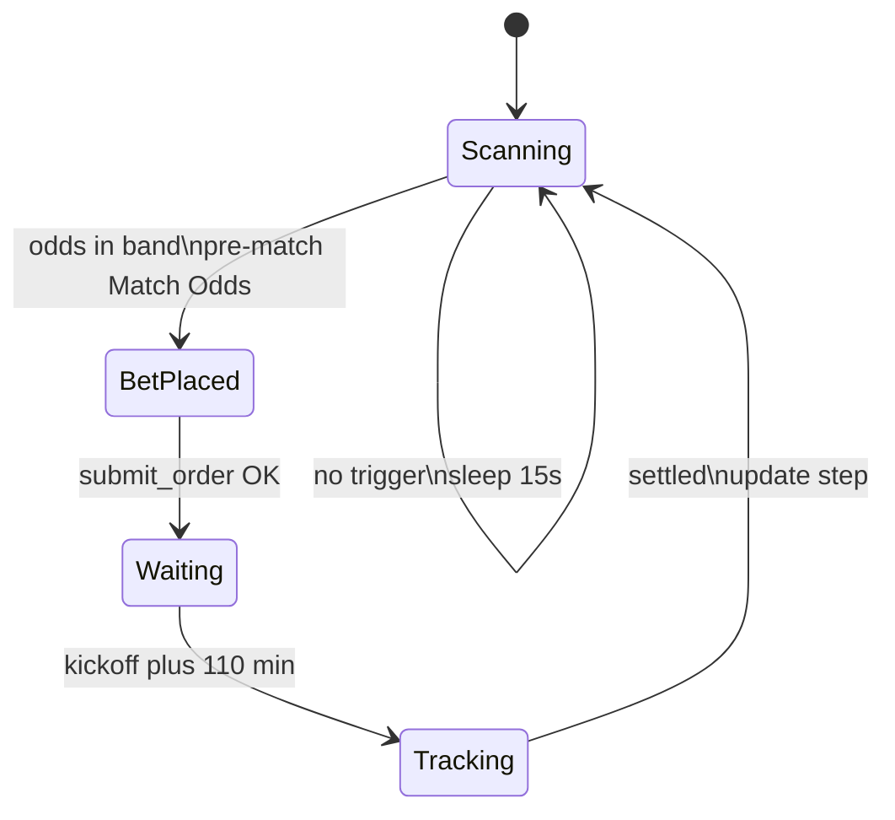

# Strategy reference

This document describes **current runtime behavior** in `src/strategy_one.py`. For configuration files and environment variables, see [CONFIGURATION.md](CONFIGURATION.md).

## Overview

The bot runs an infinite loop that:

1. Scans open pre-match events for sport ID **15** (football).
2. Looks for **Match Odds** selections whose best **back** price is between **1.45** and **1.60**.
3. Places a **back** bet at stake **0.10** at the best back odds.
4. Pauses market scanning until **110 minutes after kickoff**.
5. Polls settlement every **60 seconds**, then updates a **6-step** progression ladder.
6. Resumes scanning after settlement.

## Flow diagram

## Market filters

When fetching `/events`, the strategy applies these filters **per event**:

| Filter | Rule |
|--------|------|
| Sport | `sport-ids=15` |
| State | `states=open` |
| In-play | Skip if `in-play` or `live-execution` is true |
| Kickoff | Skip if UTC `start` is missing or already passed |
| Market | Only `name == "Match Odds"` |
| Price | Best back (first back in price list) must satisfy `1.45 <= odds <= 1.60` |

The scan requests `per-page=30`, `price-depth=1`, decimal odds, back-lay exchange type.

## Order placement

When a selection matches:

| Field | Value |
|-------|-------|
| Side | `back` |
| Odds | Best back price from the scan |
| Stake | `0.10` (hardcoded) |

Orders are submitted via `MatchbookClient.submit_order()`. On success, a Telegram message includes league (from `meta-tags` type `COMPETITION`), match, selection, odds, stake, and kickoff time shown in **Athens time** (UTC + 3 hours) for display only.

## Post-bet wait

After a successful bet:

- Market scanning **stops** until `kickoff_utc + 110 minutes`.
- The loop sleeps in **30-second** chunks during this period.
- Console logs show the resume time in Athens time.

## Settlement tracking

After the 110-minute wait, the bot checks settlement **every 60 seconds**:

1. **Primary:** `get_order_status(offer_id)` — if status is `SETTLED` or `FLUSHED`, use `settled-items[0].profit-loss` (profit > 0 → win, else loss).
2. **Fallback:** If status is unavailable, re-fetch open events; if the event name no longer appears, treat as **won**.

When settled, a Telegram and console message report WIN/LOSS and the next step index.

## Step ladder

The bot tracks `current_step` from **1** to **6** (`max_steps = 6`):

| Result | Next step |
|--------|-----------|
| Win | Reset to **1** |
| Loss | **current_step + 1**, or **1** if already at step 6 |

The step number is included in bet-placed and settlement messages. It is **informational** today: stake does **not** change per step (always `0.10`).

## Telegram alerts

Sent when configured (see [CONFIGURATION.md](CONFIGURATION.md)):

- Successful login
- Failed login
- Bet placed (with match details)
- Settlement (result and next step)

## Known gaps

| Item | Status |
|------|--------|
| `config/settings.json` | **Not loaded** — `mode`, odds bounds, and stake ladders are unused |
| Per-step stakes | Hardcoded `0.10`; production ladder in settings is documentation-only |
| `get_navigation()` | Available in client but not used by strategy |
| `get_live_events()` | Available in client; strategy calls `/events` directly |

Loading `settings.json` into the strategy loop is a planned follow-up code change.

## Stopping the bot

Press **Ctrl+C** to exit gracefully. The main loop catches `KeyboardInterrupt` and prints a shutdown message.
