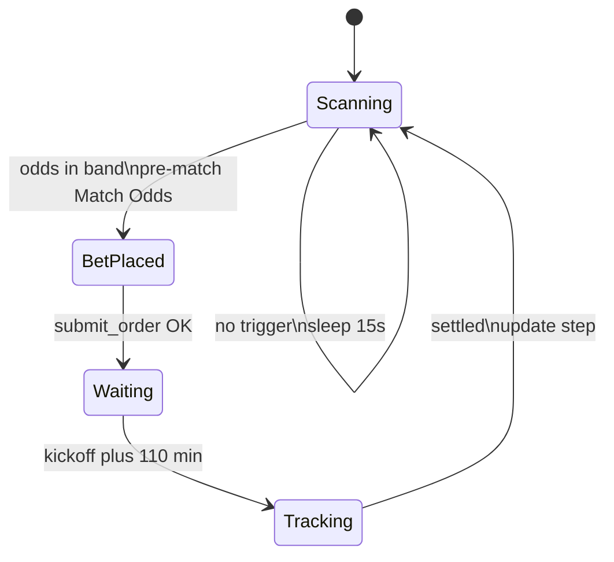

# Matchbook Trading Bot - Source Code Dump

This file contains the core Python implementation and logs for troubleshooting.

## File: src/api_client.py

```python
"""Matchbook REST API client and optional Telegram alerts.

See README.md and docs/API.md for usage and endpoints.
"""

import os
import requests
import json

class MatchbookClient:
    def __init__(self):
        self.username = os.getenv("MATCHBOOK_USERNAME")
        self.password = os.getenv("MATCHBOOK_PASSWORD")
        self.tg_token = os.getenv("TELEGRAM_BOT_TOKEN")
        self.tg_chat_id = os.getenv("TELEGRAM_CHAT_ID")
        
        self.auth_url = "https://api.matchbook.com/bpapi/rest/security/session"
        self.base_url = "https://api.matchbook.com/edge/rest"
        self.session_token = None
        self.headers = {
            "content-type": "application/json;charset=UTF-8",
            "accept": "application/json"
        }

    def login(self):
        """Authenticates with Matchbook and stores the session token."""
        payload = {
            "username": self.username,
            "password": self.password
        }
        try:
            response = requests.post(self.auth_url, data=json.dumps(payload), headers=self.headers)
            if response.status_code == 200:
                data = response.json()
                self.session_token = data.get("session-token")
                self.headers["session-token"] = self.session_token
                self.send_telegram("✅ Matchbook login successful. Session token acquired.")
                return True
            else:
                self.send_telegram(f"❌ Login failed. Status: {response.status_code}")
                return False
        except Exception as e:
            self.send_telegram(f"❌ Login exception encountered: {str(e)}")
            return False

    def get_navigation(self):
        """Retrieves the navigation hierarchy to locate sports and markets."""
        url = f"{self.base_url}/navigation"
        try:
            response = requests.get(url, headers=self.headers)
            if response.status_code == 200:
                return response.json()
            elif response.status_code == 401:
                if self.login():
                    return self.get_navigation()
            return None
        except Exception as e:
            print(f"Error fetching navigation: {str(e)}")
            return None

    def get_live_events(self, sport_ids, per_page=20):
        """Fetches active events, runners, and exchange market odds for specified sport IDs."""
        url = f"{self.base_url}/events"
        params = {
            "sport-ids": sport_ids,
            "states": "open",
            "include-prices": "true",
            "price-depth": 3,
            "price-mode": "expanded",
            "odds-type": "DECIMAL",
            "exchange-type": "back-lay",
            "per-page": per_page
        }
        try:
            response = requests.get(url, params=params, headers=self.headers)
            if response.status_code == 200:
                return response.json()
            elif response.status_code == 401:
                if self.login():
                    return self.get_live_events(sport_ids, per_page)
            return None
        except Exception as e:
            print(f"Error fetching live events: {str(e)}")
            return None

    def submit_order(self, runner_id, side, odds, stake):
        """Submits an exchange order for a specific selection runner ID."""
        url = f"{self.base_url}/v2/offers"
        payload = {
            "odds-type": "DECIMAL",
            "exchange-type": "back-lay",
            "offers": [
                {
                    "runner-id": runner_id,
                    "side": side,
                    "odds": odds,
                    "stake": stake
                }
            ]
        }
        try:
            response = requests.post(url, data=json.dumps(payload), headers=self.headers)
            if response.status_code in [200, 201]:
                return response.json()
            elif response.status_code == 401:
                if self.login():
                    return self.submit_order(runner_id, side, odds, stake)
            print(f"Order submission rejected. Status: {response.status_code}, Response: {response.text}")
            return None
        except Exception as e:
            print(f"Exception during order submission: {str(e)}")
            return None

    def get_order_status(self, offer_id):
        """Fetch one offer by ID (Matchbook: GET /v2/offers?offer-ids=...)."""
        url = f"{self.base_url}/v2/offers"
        params = {"offer-ids": str(offer_id), "per-page": 1}
        try:
            response = requests.get(url, params=params, headers=self.headers)
            if response.status_code == 200:
                return response.json()
            elif response.status_code == 401:
                if self.login():
                    return self.get_order_status(offer_id)
            return None
        except Exception as e:
            print(f"Error checking offer status: {str(e)}")
            return None

    @staticmethod
    def unwrap_offer(data):
        """Normalize GET offer response (single object or offers list)."""
        if not data:
            return None
        offers = data.get("offers")
        if offers:
            return offers[0]
        if data.get("id") is not None:
            return data
        return None

    def outcome_from_offer(self, offer):
        """Return 'won' or 'lost' from one offer object, or None if not settled."""
        if not offer:
            return None

        result = (offer.get("result") or "").upper()
        if result == "WIN":
            return "won"
        if result in ("LOSE", "LOST"):
            return "lost"

        status = (offer.get("status") or "").upper()

        for key in ("settled-items", "settled_items"):
            items = offer.get(key) or []
            if items:
                pl = items[0].get("profit-loss", items[0].get("profit_and_loss", 0))
                return "won" if pl > 0 else "lost"

        if status in ("SETTLED", "FLUSHED"):
            pl = offer.get("profit-loss", offer.get("profit_and_loss"))
            if pl is not None:
                return "won" if pl > 0 else "lost"

        for key in ("matched-bets", "matched_bets"):
            for bet in offer.get(key) or []:
                bet_result = (bet.get("result") or "").upper()
                if bet_result == "WIN":
                    return "won"
                if bet_result in ("LOSE", "LOST"):
                    return "lost"
                if status in ("SETTLED", "FLUSHED"):
                    pl = bet.get("profit-loss", bet.get("profit_and_loss"))
                    if pl is not None:
                        return "won" if pl > 0 else "lost"

        return None

    @staticmethod
    def _outcome_from_settled_bet(bet):
        bet_result = (bet.get("result") or "").upper()
        if bet_result == "WIN":
            return "won"
        if bet_result in ("LOSE", "LOST"):
            return "lost"
        if bet_result in ("PUSH_WIN",):
            return "won"
        if bet_result in ("PUSH", "PUSH_LOSE"):
            return "lost"
        pl = bet.get("profit-loss", bet.get("profit_and_loss"))
        if pl is not None:
            return "won" if pl > 0 else "lost"
        return None

    def get_settled_outcome_for_offer(self, offer_id, after_dt=None, event_id=None):
        """Look up offer in Matchbook settled-bets report (WIN / LOSE / profit-loss)."""
        url = f"{self.base_url}/reports/v2/bets/settled"
        target = str(offer_id)
        offset = 0
        per_page = 500

        while True:
            params = {"per-page": per_page, "offset": offset, "sport-ids": "15"}
            if after_dt:
                params["after"] = after_dt.strftime("%Y-%m-%dT%H:%M:%S.000Z")
            if event_id:
                params["event-ids"] = str(event_id)

            try:
                response = requests.get(url, params=params, headers=self.headers)
                if response.status_code == 401:
                    if self.login():
                        continue
                    return None
                if response.status_code != 200:
                    return None

                data = response.json()
                for market in data.get("markets", []):
                    for selection in market.get("selections", []):
                        for bet in selection.get("bets", []):
                            if str(bet.get("offer-id", bet.get("offer_id"))) != target:
                                continue
                            return self._outcome_from_settled_bet(bet)

                total = data.get("total", 0)
                offset += per_page
                if offset >= total:
                    return None
            except Exception as e:
                print(f"Error fetching settled bets: {str(e)}")
                return None

    def resolve_offer_outcome(self, offer_id, after_dt=None, event_id=None):
        """Resolve won/lost from Matchbook only (offers API + settled-bets report)."""
        outcome = self.get_settled_outcome_for_offer(offer_id, after_dt, event_id)
        if outcome:
            return outcome, "settled-report"

        raw = self.get_order_status(offer_id)
        offer = self.unwrap_offer(raw)
        outcome = self.outcome_from_offer(offer)
        status_label = (offer.get("status") if offer else None) or (
            "not_found" if raw is None else "unknown"
        )
        if outcome:
            return outcome, status_label

        return None, status_label

    def send_telegram(self, message):
        """Helper service to push instant alerts to your Telegram chat."""
        if not self.tg_token or not self.tg_chat_id:
            return
        url = f"https://api.telegram.org/bot{self.tg_token}/sendMessage"
        payload = {
            "chat_id": self.tg_chat_id,
            "text": message
        }
        try:
            requests.post(url, json=payload)
        except Exception:
            pass
```

## File: src/strategy_one.py

```python
"""Automated Matchbook strategy loop (scan, bet, settle, step ladder).

See README.md and docs/STRATEGY.md for behavior and configuration.
"""

import json
import os
import time
import requests
from datetime import datetime, timedelta
from api_client import MatchbookClient
from log_util import install_print_logger, setup_logging


def load_settings():
    path = os.path.join(os.path.dirname(__file__), "..", "config", "settings.json")
    if not os.path.isfile(path):
        raise FileNotFoundError(f"Missing config: {path}")
    with open(path, encoding="utf-8") as f:
        return json.load(f)


def stake_for_step(settings, step):
    mode = settings.get("mode", "testing")
    ladder = settings.get("stakes", {}).get(mode)
    if not ladder:
        ladder = settings.get("stakes", {}).get("testing", [0.10])
    idx = max(0, min(step - 1, len(ladder) - 1))
    return float(ladder[idx])


def main():
    log_path = setup_logging()
    install_print_logger()
    print(f"Log file: {log_path}")
    print("Starting automated execution strategy loop...")
    client = MatchbookClient()

    if not client.login():
        print("Initial authentication failed.")
        return

    settings = load_settings()
    max_steps = int(settings.get("max_steps", 6))
    odds_min = float(settings.get("odds_min", 1.45))
    odds_max = float(settings.get("odds_max", 1.60))
    mode = settings.get("mode", "testing")
    print(
        f"Config loaded: mode={mode}, max_steps={max_steps}, "
        f"odds {odds_min}-{odds_max}, stake step 1={stake_for_step(settings, 1)}"
    )

    target_sport_id = "15"
    loop_interval = 15

    current_step = 1

    try:
        while True:
            print(f"\n--- Scanning markets at {time.strftime('%Y-%m-%d %H:%M:%S')} (Step {current_step}/{max_steps}) ---")

            url = f"{client.base_url}/events"
            params = {
                "sport-ids": target_sport_id,
                "states": "open",
                "include-prices": "true",
                "price-depth": 1,
                "price-mode": "expanded",
                "odds-type": "DECIMAL",
                "exchange-type": "back-lay",
                "per-page": 30
            }

            try:
                response = requests.get(url, params=params, headers=client.headers)
                data = response.json() if response.status_code == 200 else None
            except Exception as e:
                print(f"Error scanning markets: {str(e)}")
                data = None

            active_bet_info = None

            if data and "events" in data:
                current_utc = datetime.utcnow()

                for event in data["events"]:
                    if event.get("in-play") is True or event.get("live-execution") is True:
                        continue

                    start_str = event.get("start")
                    if start_str:
                        try:
                            start_time = datetime.strptime(start_str.replace("Z", ""), "%Y-%m-%dT%H:%M:%S.%f")
                            if current_utc >= start_time:
                                continue
                        except Exception:
                            continue
                    else:
                        continue

                    event_name = event.get("name", "Unknown Match")

                    meta_tags = event.get("meta-tags", [])
                    league_name = "Unknown League"
                    for tag in meta_tags:
                        if tag.get("type") == "COMPETITION":
                            league_name = tag.get("name")
                            break

                    for market in event.get("markets", []):
                        if market.get("name") == "Match Odds":
                            for runner in market.get("runners", []):
                                runner_id = runner.get("id")
                                runner_name = runner.get("name")
                                prices = runner.get("prices", [])

                                backs = [p for p in prices if p.get("side") == "back"]
                                if backs:
                                    best_back = backs[0].get("odds")

                                    if odds_min <= best_back <= odds_max:
                                        print(f"🎯 Trigger conditions met for: {event_name} -> {runner_name}")

                                        target_side = "back"
                                        target_odds = best_back
                                        target_stake = stake_for_step(settings, current_step)

                                        order_status = client.submit_order(
                                            runner_id=runner_id,
                                            side=target_side,
                                            odds=target_odds,
                                            stake=target_stake
                                        )

                                        if order_status:
                                            offers = order_status.get("offers", [])
                                            placed_offer = offers[0] if offers else {}
                                            offer_id = placed_offer.get("id")
                                            event_id = placed_offer.get("event-id")

                                            # Convert UTC start time to Athens time (+3 hours offset)
                                            athens_time = start_time + timedelta(hours=3)
                                            athens_time_str = athens_time.strftime("%H:%M")

                                            msg = (
                                                f"🚀 Bet Placed!\n"
                                                f"Step: {current_step}/{max_steps}\n"
                                                f"League: {league_name}\n"
                                                f"Match: {event_name}\n"
                                                f"Selection: {runner_name}\n"
                                                f"Action: {target_side}\n"
                                                f"Odds: {target_odds}\n"
                                                f"Stake: {target_stake}\n"
                                                f"Start Time: {athens_time_str}"
                                            )
                                            print(msg)
                                            client.send_telegram(msg)

                                            active_bet_info = {
                                                "offer_id": offer_id,
                                                "event_id": event_id,
                                                "start_time": start_time,
                                                "placed_at": datetime.utcnow(),
                                                "selection_name": runner_name,
                                                "event_name": event_name,
                                            }
                                            break
                                        else:
                                            print(f"⚠️ Execution routing declined by backend exchange rules.")
                    if active_bet_info:
                        break

            if active_bet_info:
                resume_time = active_bet_info["start_time"] + timedelta(minutes=110)
                resume_athens = resume_time + timedelta(hours=3)
                print(f"⏳ Bet placed. Holding all market checks until 110 minutes after kickoff ({resume_athens.strftime('%H:%M')} Athens time)...")

                while datetime.utcnow() < resume_time:
                    time.sleep(30)

                print("⏰ 110 minutes elapsed since kickoff. Transitioning to minute-by-minute status tracking...")

                while True:
                    time.sleep(60)
                    offer_id = active_bet_info.get("offer_id")
                    if not offer_id:
                        print("No offer_id — waiting for Matchbook...")
                        continue

                    after_dt = active_bet_info.get("placed_at") or active_bet_info.get("start_time")
                    outcome, source = client.resolve_offer_outcome(
                        offer_id,
                        after_dt=after_dt,
                        event_id=active_bet_info.get("event_id"),
                    )
                    print(
                        f"Checking settlement for offer {offer_id} "
                        f"({source or 'pending'})..."
                    )

                    if outcome not in ("won", "lost"):
                        continue

                    result_label = "Won" if outcome == "won" else "Lost"
                    next_step = 1 if outcome == "won" else (
                        current_step + 1 if current_step < max_steps else 1
                    )

                    settle_msg = (
                        f"Settled\n"
                        f"Match: {active_bet_info['event_name']}\n"
                        f"Result: {result_label}\n"
                        f"Next step: {next_step}/{max_steps}"
                    )
                    print(settle_msg)
                    client.send_telegram(settle_msg)

                    current_step = next_step
                    break

            time.sleep(loop_interval)

    except KeyboardInterrupt:
        print("\nStrategy engine loop safely terminated.")

if __name__ == "__main__":
    main()
```

## File: docs/STRATEGY.md

```markdown
# Strategy reference

This document describes **current runtime behavior** in `src/strategy_one.py`. For configuration files and environment variables, see [CONFIGURATION.md](CONFIGURATION.md).

## Overview

The bot runs an infinite loop that:

1. Scans open pre-match events for sport ID **15** (football).
2. Looks for **Match Odds** selections whose best **back** price is between **1.45** and **1.60**.
3. Places a **back** bet at stake **0.10** at the best back odds.
4. Pauses market scanning until **110 minutes after kickoff**.
5. Polls settlement every **60 seconds**, then updates a **6-step** progression ladder.
6. Resumes scanning after settlement.

## Flow diagram



## Market filters

When fetching `/events`, the strategy applies these filters **per event**:

| Filter | Rule |
|--------|------|
| Sport | `sport-ids=15` |
| State | `states=open` |
| In-play | Skip if `in-play` or `live-execution` is true |
| Kickoff | Skip if UTC `start` is missing or already passed |
| Market | Only `name == "Match Odds"` |
| Price | Best back (first back in price list) must satisfy `1.45 <= odds <= 1.60` |

The scan requests `per-page=30`, `price-depth=1`, decimal odds, back-lay exchange type.

## Order placement

When a selection matches:

| Field | Value |
|-------|-------|
| Side | `back` |
| Odds | Best back price from the scan |
| Stake | `0.10` (hardcoded) |

Orders are submitted via `MatchbookClient.submit_order()`. On success, a Telegram message includes league (from `meta-tags` type `COMPETITION`), match, selection, odds, stake, and kickoff time shown in **Athens time** (UTC + 3 hours) for display only.

## Post-bet wait

After a successful bet:

- Market scanning **stops** until `kickoff_utc + 110 minutes`.
- The loop sleeps in **30-second** chunks during this period.
- Console logs show the resume time in Athens time.

## Settlement tracking

After the 110-minute wait, the bot checks settlement **every 60 seconds**:

1. **Primary:** `get_order_status(offer_id)` — if status is `SETTLED` or `FLUSHED`, use `settled-items[0].profit-loss` (profit > 0 → win, else loss).
2. **Fallback:** If status is unavailable, re-fetch open events; if the event name no longer appears, treat as **won**.

When settled, a Telegram and console message report WIN/LOSS and the next step index.

## Step ladder

The bot tracks `current_step` from **1** to **6** (`max_steps = 6`):

| Result | Next step |
|--------|-----------|
| Win | Reset to **1** |
| Loss | **current_step + 1**, or **1** if already at step 6 |

The step number is included in bet-placed and settlement messages. It is **informational** today: stake does **not** change per step (always `0.10`).

## Telegram alerts

Sent when configured (see [CONFIGURATION.md](CONFIGURATION.md)):

- Successful login
- Failed login
- Bet placed (with match details)
- Settlement (result and next step)

## Known gaps

| Item | Status |
|------|--------|
| `config/settings.json` | **Not loaded** — `mode`, odds bounds, and stake ladders are unused |
| Per-step stakes | Hardcoded `0.10`; production ladder in settings is documentation-only |
| `get_navigation()` | Available in client but not used by strategy |
| `get_live_events()` | Available in client; strategy calls `/events` directly |

Loading `settings.json` into the strategy loop is a planned follow-up code change.

## Stopping the bot

Press **Ctrl+C** to exit gracefully. The main loop catches `KeyboardInterrupt` and prints a shutdown message.
```

## File: docs/TROUBLESHOOTING.md

```markdown
# Troubleshooting

## Authentication and session

### Login fails on startup

**Symptoms:** `Initial authentication failed.` or Telegram login failure message.

**Checks:**

- `MATCHBOOK_USERNAME` and `MATCHBOOK_PASSWORD` in `.env` are correct
- No extra spaces or quotes around values in `.env`
- Matchbook account is active and not locked
- Network can reach `api.matchbook.com`

### 401 errors mid-run

**Symptoms:** Empty event data, failed orders after running for a while.

**Cause:** Session token expired.

**Behavior:** `MatchbookClient` methods retry once after `login()`. Direct `requests.get` calls in `strategy_one.py` do **not** auto-refresh the session.

**Fix:** Restart the bot, or refactor event fetches to use client methods with 401 retry.

---

## Orders

### Order submission rejected

**Symptoms:** `Execution routing declined` or log: `Order submission rejected. Status: ...`

**Checks:**

- Sufficient account balance for stake `0.10`
- Market still open and selection valid
- Odds still available at submitted price
- Matchbook minimum stake and market rules

Read the printed HTTP status and response body from `submit_order()`.

### Bets never placed

**Symptoms:** Scan loop runs but no triggers.

**Checks:**

- Selection best **back** must be between **1.45** and **1.60**
- Event must be **pre-match** (not in-play; kickoff in the future)
- Market name must be exactly **Match Odds**
- Sport ID `15` events must exist in the API response
- Another bet may be in progress (scanning pauses until settlement)

---

## Telegram

### No notifications

**Symptoms:** Bot runs but no Telegram messages.

**Checks:**

- Both `TELEGRAM_BOT_TOKEN` and `TELEGRAM_CHAT_ID` are set in `.env`
- Bot has been started in Telegram (`/start` with your bot)
- Chat ID is correct (user ID or group ID)
- Container/process has updated env after editing `.env` (restart required)

**Note:** Missing Telegram config fails **silently** by design.

### Login messages only

Telegram is sent on login, bet, and settlement. If you only see login messages, the strategy may not be finding qualifying markets or orders may be failing.

---

## Docker

### Build fails

**Symptoms:** `docker build` errors on `Dockerfile`.

**Checks:**

- `Dockerfile` is a single valid image definition (no duplicated `FROM` blocks)
- `requirements.txt` exists at project root
- Docker has network access to pull `python:3.11-slim` and pip packages

### Container exits immediately

**Checks:**

- View logs: `docker compose logs`
- Login failure causes early `return` from `main()`
- `restart: "no"` — container stays stopped after exit

### Code changes not applied

With the default volume mount, `src/` is mounted from the host. Restart the container after edits if the process cached imports oddly, or confirm you saved files on the host path mounted into `/app/src`.

---

## Configuration

### `settings.json` has no effect

Expected: the file is **not loaded** yet. Only hardcoded values in `strategy_one.py` apply. See [CONFIGURATION.md](CONFIGURATION.md).

### Wrong stake or odds

Edit `strategy_one.py` (current code) or implement loading from `settings.json` (planned).

---

## Secrets exposed in git

If `.env` or real credentials were committed to a remote repository:

1. **Rotate immediately:** change Matchbook password; revoke and recreate Telegram bot token via [@BotFather](https://t.me/BotFather).
2. Ensure `.env` is in `.gitignore` and not tracked: `git rm --cached .env` if needed.
3. Consider rewriting git history (`git filter-repo` or BFG) if secrets remain in old commits.
4. Never paste real tokens or passwords into issues, docs, or chat logs.

Documentation and `.env.example` use placeholders only.

---

## Getting help

When reporting issues, include:

- Relevant log lines (redact credentials)
- Docker vs local run
- Whether login succeeds
- Sample API response status codes (not passwords)

See also [DEPLOYMENT.md](DEPLOYMENT.md) and [API.md](API.md).
```

## File: logs/bot.log

```text
2026-06-01 06:34:51 Log file: /app/logs/bot.log
2026-06-01 06:34:51 Starting automated execution strategy loop...
2026-06-01 06:34:52 
--- Scanning markets at 2026-06-01 06:34:52 (Step 1/6) ---
2026-06-01 06:34:52 🎯 Trigger conditions met for: Austria vs Tunisia -> Austria
2026-06-01 06:34:52 🚀 Bet Placed!
Step: 1/6
League: International Friendlies
Match: Austria vs Tunisia
Selection: Austria
Action: back
Odds: 1.55
Stake: 0.1
Start Time: 21:45
2026-06-01 06:34:53 ⏳ Bet placed. Holding all market checks until 110 minutes after kickoff (23:35 Athens time)...
2026-06-01 15:37:02 Log file: /app/logs/bot.log
2026-06-01 15:37:02 Starting automated execution strategy loop...
2026-06-01 15:37:03 Config loaded: mode=testing, max_steps=6, odds 1.45-1.6, stake step 1=0.11
2026-06-01 15:37:03 
--- Scanning markets at 2026-06-01 15:37:03 (Step 1/6) ---
2026-06-01 15:37:03 🎯 Trigger conditions met for: Austria vs Tunisia -> Austria
2026-06-01 15:37:04 🚀 Bet Placed!
Step: 1/6
League: International Friendlies
Match: Austria vs Tunisia
Selection: Austria
Action: back
Odds: 1.51
Stake: 0.11
Start Time: 21:45
2026-06-01 15:37:04 ⏳ Bet placed. Holding all market checks until 110 minutes after kickoff (23:35 Athens time)...
2026-06-01 20:35:04 ⏰ 110 minutes elapsed since kickoff. Transitioning to minute-by-minute status tracking...
2026-06-01 20:36:04 Checking settlement for offer 33437135253800022 (matched)...
2026-06-01 20:37:05 Checking settlement for offer 33437135253800022 (matched)...
2026-06-01 20:38:05 Checking settlement for offer 33437135253800022 (matched)...
2026-06-01 20:39:06 Checking settlement for offer 33437135253800022 (matched)...
2026-06-01 20:40:06 Checking settlement for offer 33437135253800022 (matched)...
2026-06-01 20:41:06 Checking settlement for offer 33437135253800022 (matched)...
2026-06-01 20:42:07 Checking settlement for offer 33437135253800022 (matched)...
2026-06-01 20:43:07 Checking settlement for offer 33437135253800022 (matched)...
2026-06-01 20:44:07 Checking settlement for offer 33437135253800022 (settled-report)...
2026-06-01 20:44:07 Settled
Match: Austria vs Tunisia
Result: Won
Next step: 1/6
2026-06-01 20:44:23 
--- Scanning markets at 2026-06-01 20:44:23 (Step 1/6) ---
2026-06-01 20:44:23 🎯 Trigger conditions met for: CA Peñarol vs Central Español -> CA Peñarol
2026-06-01 20:44:23 🚀 Bet Placed!
Step: 1/6
League: Uruguay Primera División
Match: CA Peñarol vs Central Español
Selection: CA Peñarol
Action: back
Odds: 1.52
Stake: 0.11
Start Time: 02:00
2026-06-01 20:44:24 ⏳ Bet placed. Holding all market checks until 110 minutes after kickoff (03:50 Athens time)...
2026-06-02 00:50:24 ⏰ 110 minutes elapsed since kickoff. Transitioning to minute-by-minute status tracking...
2026-06-02 00:51:24 Checking settlement for offer 33438979225600060 (matched)...
2026-06-02 00:52:25 Checking settlement for offer 33438979225600060 (matched)...
2026-06-02 00:53:25 Checking settlement for offer 33438979225600060 (matched)...
2026-06-02 00:54:25 Checking settlement for offer 33438979225600060 (matched)...
2026-06-02 00:55:26 Checking settlement for offer 33438979225600060 (matched)...
2026-06-02 00:56:26 Checking settlement for offer 33438979225600060 (matched)...
2026-06-02 00:57:26 Checking settlement for offer 33438979225600060 (matched)...
2026-06-02 00:58:27 Checking settlement for offer 33438979225600060 (matched)...
2026-06-02 00:59:27 Checking settlement for offer 33438979225600060 (matched)...
2026-06-02 01:00:27 Checking settlement for offer 33438979225600060 (matched)...
2026-06-02 01:01:28 Checking settlement for offer 33438979225600060 (matched)...
2026-06-02 01:02:28 Checking settlement for offer 33438979225600060 (matched)...
2026-06-02 01:03:29 Checking settlement for offer 33438979225600060 (matched)...
2026-06-02 01:04:29 Checking settlement for offer 33438979225600060 (matched)...
2026-06-02 01:05:29 Checking settlement for offer 33438979225600060 (matched)...
2026-06-02 01:06:30 Checking settlement for offer 33438979225600060 (matched)...
2026-06-02 01:07:30 Checking settlement for offer 33438979225600060 (matched)...
2026-06-02 01:08:30 Checking settlement for offer 33438979225600060 (matched)...
2026-06-02 01:09:30 Checking settlement for offer 33438979225600060 (matched)...
2026-06-02 01:10:31 Checking settlement for offer 33438979225600060 (matched)...
2026-06-02 01:11:31 Checking settlement for offer 33438979225600060 (matched)...
2026-06-02 01:12:31 Checking settlement for offer 33438979225600060 (settled-report)...
2026-06-02 01:12:31 Settled
Match: CA Peñarol vs Central Español
Result: Lost
Next step: 2/6
2026-06-02 01:12:47 
--- Scanning markets at 2026-06-02 01:12:47 (Step 2/6) ---
2026-06-02 01:12:47 🎯 Trigger conditions met for: Independiente Medellín vs Cúcuta Deportivo -> Independiente Medellín
2026-06-02 01:12:47 🚀 Bet Placed!
Step: 2/6
League: Colombia Cup
Match: Independiente Medellín vs Cúcuta Deportivo
Selection: Independiente Medellín
Action: back
Odds: 1.57
Stake: 0.12
Start Time: 00:00
2026-06-02 01:12:48 ⏳ Bet placed. Holding all market checks until 110 minutes after kickoff (01:50 Athens time)...
2026-06-02 22:50:18 ⏰ 110 minutes elapsed since kickoff. Transitioning to minute-by-minute status tracking...
2026-06-02 22:51:19 Checking settlement for offer 33440589633400019 (matched)...
2026-06-02 22:52:20 Checking settlement for offer 33440589633400019 (matched)...
2026-06-02 22:53:20 Checking settlement for offer 33440589633400019 (matched)...
2026-06-02 22:54:20 Checking settlement for offer 33440589633400019 (matched)...
2026-06-02 22:55:21 Checking settlement for offer 33440589633400019 (settled-report)...
2026-06-02 22:55:21 Settled
Match: Independiente Medellín vs Cúcuta Deportivo
Result: Won
Next step: 1/6
2026-06-02 22:55:36 
--- Scanning markets at 2026-06-02 22:55:36 (Step 1/6) ---
2026-06-02 22:55:36 🎯 Trigger conditions met for: Luxembourg vs Italy -> Italy
2026-06-02 22:55:37 🚀 Bet Placed!
Step: 1/6
League: International Friendlies
Match: Luxembourg vs Italy
Selection: Italy
Action: back
Odds: 1.55
Stake: 0.11
Start Time: 21:45
2026-06-02 22:55:37 ⏳ Bet placed. Holding all market checks until 110 minutes after kickoff (23:35 Athens time)...
2026-06-03 20:35:07 ⏰ 110 minutes elapsed since kickoff. Transitioning to minute-by-minute status tracking...
2026-06-03 20:36:08 Checking settlement for offer 33448406558100022 (matched)...
2026-06-03 20:37:09 Checking settlement for offer 33448406558100022 (matched)...
2026-06-03 20:38:09 Checking settlement for offer 33448406558100022 (settled-report)...
2026-06-03 20:38:09 Settled
Match: Luxembourg vs Italy
Result: Won
Next step: 1/6
2026-06-03 20:38:24 
--- Scanning markets at 2026-06-03 20:38:24 (Step 1/6) ---
2026-06-03 20:38:25 🎯 Trigger conditions met for: Andorra vs Liechtenstein -> Andorra
2026-06-03 20:38:25 🚀 Bet Placed!
Step: 1/6
League: International Friendlies
Match: Andorra vs Liechtenstein
Selection: Andorra
Action: back
Odds: 1.55
Stake: 0.11
Start Time: 20:00
2026-06-03 20:38:25 ⏳ Bet placed. Holding all market checks until 110 minutes after kickoff (21:50 Athens time)...
2026-06-04 18:50:26 ⏰ 110 minutes elapsed since kickoff. Transitioning to minute-by-minute status tracking...
2026-06-04 18:51:27 Checking settlement for offer 33456223386300019 (settled-report)...
2026-06-04 18:51:27 Settled
Match: Andorra vs Liechtenstein
Result: Won
Next step: 1/6
2026-06-04 18:51:42 
--- Scanning markets at 2026-06-04 18:51:42 (Step 1/6) ---
2026-06-04 18:51:42 🎯 Trigger conditions met for: Central Córdoba Reserves vs San Martin-San Juan Reserves -> Central Córdoba Reserves
2026-06-04 18:51:43 🚀 Bet Placed!
Step: 1/6
League: Argentina Liga Profesional de Fútbol Reserves
Match: Central Córdoba Reserves vs San Martin-San Juan Reserves
Selection: Central Córdoba Reserves
Action: back
Odds: 1.47
Stake: 0.11
Start Time: 01:00
2026-06-04 18:51:43 ⏳ Bet placed. Holding all market checks until 110 minutes after kickoff (02:50 Athens time)...
2026-06-04 23:50:13 ⏰ 110 minutes elapsed since kickoff. Transitioning to minute-by-minute status tracking...
2026-06-04 23:51:13 Checking settlement for offer 33464223156200061 (settled-report)...
2026-06-04 23:51:13 Settled
Match: Central Córdoba Reserves vs San Martin-San Juan Reserves
Result: Won
Next step: 1/6
2026-06-04 23:51:29 
--- Scanning markets at 2026-06-04 23:51:29 (Step 1/6) ---
2026-06-04 23:51:29 🎯 Trigger conditions met for: Daegu FC vs Paju Citizen FC -> Daegu FC
2026-06-04 23:51:29 🚀 Bet Placed!
Step: 1/6
League: Korea Republic K-League 2
Match: Daegu FC vs Paju Citizen FC
Selection: Daegu FC
Action: back
Odds: 1.49
Stake: 0.11
Start Time: 13:30
2026-06-04 23:51:30 ⏳ Bet placed. Holding all market checks until 110 minutes after kickoff (15:20 Athens time)...
2026-06-05 12:20:00 ⏰ 110 minutes elapsed since kickoff. Transitioning to minute-by-minute status tracking...
2026-06-05 12:21:01 Checking settlement for offer 33466021823000022 (matched)...
2026-06-05 12:22:01 Checking settlement for offer 33466021823000022 (matched)...
2026-06-05 12:23:01 Checking settlement for offer 33466021823000022 (matched)...
2026-06-05 12:24:02 Checking settlement for offer 33466021823000022 (matched)...
2026-06-05 12:25:02 Checking settlement for offer 33466021823000022 (matched)...
2026-06-05 12:26:02 Checking settlement for offer 33466021823000022 (matched)...
2026-06-05 12:27:03 Checking settlement for offer 33466021823000022 (matched)...
2026-06-05 12:28:03 Checking settlement for offer 33466021823000022 (matched)...
2026-06-05 12:29:04 Checking settlement for offer 33466021823000022 (matched)...
2026-06-05 12:30:04 Checking settlement for offer 33466021823000022 (matched)...
2026-06-05 12:31:04 Checking settlement for offer 33466021823000022 (matched)...
2026-06-05 12:32:05 Checking settlement for offer 33466021823000022 (matched)...
2026-06-05 12:33:05 Checking settlement for offer 33466021823000022 (matched)...
2026-06-05 12:34:06 Checking settlement for offer 33466021823000022 (matched)...
2026-06-05 12:35:06 Checking settlement for offer 33466021823000022 (matched)...
2026-06-05 12:36:06 Checking settlement for offer 33466021823000022 (settled-report)...
2026-06-05 12:36:06 Settled
Match: Daegu FC vs Paju Citizen FC
Result: Won
Next step: 1/6
2026-06-05 12:36:21 
--- Scanning markets at 2026-06-05 12:36:21 (Step 1/6) ---
2026-06-05 12:36:22 🎯 Trigger conditions met for: FC Haka vs JäPS -> FC Haka
2026-06-05 12:36:22 🚀 Bet Placed!
Step: 1/6
League: Finland Ykkösliiga
Match: FC Haka vs JäPS
Selection: FC Haka
Action: back
Odds: 1.5
Stake: 0.11
Start Time: 18:30
2026-06-05 12:36:22 ⏳ Bet placed. Holding all market checks until 110 minutes after kickoff (20:20 Athens time)...
2026-06-05 17:20:22 ⏰ 110 minutes elapsed since kickoff. Transitioning to minute-by-minute status tracking...
2026-06-05 17:21:23 Checking settlement for offer 33470611095400060 (matched)...
2026-06-05 17:22:23 Checking settlement for offer 33470611095400060 (matched)...
2026-06-05 17:23:23 Checking settlement for offer 33470611095400060 (matched)...
2026-06-05 17:24:24 Checking settlement for offer 33470611095400060 (matched)...
2026-06-05 17:25:24 Checking settlement for offer 33470611095400060 (matched)...
2026-06-05 17:26:24 Checking settlement for offer 33470611095400060 (matched)...
2026-06-05 17:27:24 Checking settlement for offer 33470611095400060 (settled-report)...
2026-06-05 17:27:24 Settled
Match: FC Haka vs JäPS
Result: Lost
Next step: 2/6
2026-06-05 17:27:40 
--- Scanning markets at 2026-06-05 17:27:40 (Step 2/6) ---
2026-06-05 17:27:40 🎯 Trigger conditions met for: MC Alger vs ASO Chlef -> MC Alger
2026-06-05 17:27:40 🚀 Bet Placed!
Step: 2/6
League: Algeria Ligue Professionnelle 1
Match: MC Alger vs ASO Chlef
Selection: MC Alger
Action: back
Odds: 1.5
Stake: 0.12
Start Time: 20:30
2026-06-05 17:27:41 ⏳ Bet placed. Holding all market checks until 110 minutes after kickoff (22:20 Athens time)...
2026-06-05 19:20:11 ⏰ 110 minutes elapsed since kickoff. Transitioning to minute-by-minute status tracking...
2026-06-05 19:21:11 Checking settlement for offer 33472358945200019 (matched)...
2026-06-05 19:22:12 Checking settlement for offer 33472358945200019 (matched)...
2026-06-05 19:23:12 Checking settlement for offer 33472358945200019 (matched)...
2026-06-05 19:24:12 Checking settlement for offer 33472358945200019 (matched)...
2026-06-05 19:25:13 Checking settlement for offer 33472358945200019 (matched)...
2026-06-05 19:26:13 Checking settlement for offer 33472358945200019 (matched)...
2026-06-05 19:27:13 Checking settlement for offer 33472358945200019 (matched)...
2026-06-05 19:28:14 Checking settlement for offer 33472358945200019 (matched)...
2026-06-05 19:29:14 Checking settlement for offer 33472358945200019 (matched)...
2026-06-05 19:30:14 Checking settlement for offer 33472358945200019 (matched)...
2026-06-05 19:31:15 Checking settlement for offer 33472358945200019 (matched)...
2026-06-05 19:32:15 Checking settlement for offer 33472358945200019 (settled-report)...
2026-06-05 19:32:15 Settled
Match: MC Alger vs ASO Chlef
Result: Won
Next step: 1/6
2026-06-05 19:32:30 
--- Scanning markets at 2026-06-05 19:32:30 (Step 1/6) ---
2026-06-05 19:32:31 🎯 Trigger conditions met for: Deportes Concepción vs Coquimbo Unido -> Coquimbo Unido
2026-06-05 19:32:31 🚀 Bet Placed!
Step: 1/6
League: Chile Copa de la Liga
Match: Deportes Concepción vs Coquimbo Unido
Selection: Coquimbo Unido
Action: back
Odds: 1.57
Stake: 0.11
Start Time: 03:00
2026-06-05 19:32:31 ⏳ Bet placed. Holding all market checks until 110 minutes after kickoff (04:50 Athens time)...
2026-06-06 01:50:01 ⏰ 110 minutes elapsed since kickoff. Transitioning to minute-by-minute status tracking...
2026-06-06 01:51:02 Checking settlement for offer 33473107972500022 (matched)...
2026-06-06 01:52:03 Checking settlement for offer 33473107972500022 (matched)...
2026-06-06 01:53:03 Checking settlement for offer 33473107972500022 (matched)...
2026-06-06 01:54:03 Checking settlement for offer 33473107972500022 (matched)...
2026-06-06 01:55:03 Checking settlement for offer 33473107972500022 (matched)...
2026-06-06 01:56:04 Checking settlement for offer 33473107972500022 (matched)...
2026-06-06 01:57:04 Checking settlement for offer 33473107972500022 (matched)...
2026-06-06 01:58:04 Checking settlement for offer 33473107972500022 (matched)...
2026-06-06 01:59:04 Checking settlement for offer 33473107972500022 (settled-report)...
2026-06-06 01:59:04 Settled
Match: Deportes Concepción vs Coquimbo Unido
Result: Won
Next step: 1/6
2026-06-06 01:59:20 
--- Scanning markets at 2026-06-06 01:59:20 (Step 1/6) ---
2026-06-06 01:59:35 
--- Scanning markets at 2026-06-06 01:59:35 (Step 1/6) ---
2026-06-06 01:59:50 
--- Scanning markets at 2026-06-06 01:59:50 (Step 1/6) ---
2026-06-06 02:00:06 
--- Scanning markets at 2026-06-06 02:00:06 (Step 1/6) ---
2026-06-06 02:00:21 
--- Scanning markets at 2026-06-06 02:00:21 (Step 1/6) ---
2026-06-06 02:00:36 
--- Scanning markets at 2026-06-06 02:00:36 (Step 1/6) ---
2026-06-06 02:00:52 
--- Scanning markets at 2026-06-06 02:00:52 (Step 1/6) ---
2026-06-06 02:01:07 
--- Scanning markets at 2026-06-06 02:01:07 (Step 1/6) ---
2026-06-06 02:01:22 
--- Scanning markets at 2026-06-06 02:01:22 (Step 1/6) ---
2026-06-06 02:01:38 
--- Scanning markets at 2026-06-06 02:01:38 (Step 1/6) ---
2026-06-06 02:01:53 
--- Scanning markets at 2026-06-06 02:01:53 (Step 1/6) ---
2026-06-06 02:02:09 
--- Scanning markets at 2026-06-06 02:02:09 (Step 1/6) ---
2026-06-06 02:02:24 
--- Scanning markets at 2026-06-06 02:02:24 (Step 1/6) ---
2026-06-06 02:02:39 
--- Scanning markets at 2026-06-06 02:02:39 (Step 1/6) ---
2026-06-06 02:02:55 
--- Scanning markets at 2026-06-06 02:02:55 (Step 1/6) ---
2026-06-06 02:03:10 
--- Scanning markets at 2026-06-06 02:03:10 (Step 1/6) ---
2026-06-06 02:03:26 
--- Scanning markets at 2026-06-06 02:03:26 (Step 1/6) ---
2026-06-06 02:03:41 
--- Scanning markets at 2026-06-06 02:03:41 (Step 1/6) ---
2026-06-06 02:03:56 
--- Scanning markets at 2026-06-06 02:03:56 (Step 1/6) ---
2026-06-06 02:04:12 
--- Scanning markets at 2026-06-06 02:04:12 (Step 1/6) ---
2026-06-06 02:04:28 
--- Scanning markets at 2026-06-06 02:04:28 (Step 1/6) ---
2026-06-06 02:04:43 
--- Scanning markets at 2026-06-06 02:04:43 (Step 1/6) ---
2026-06-06 02:04:58 
--- Scanning markets at 2026-06-06 02:04:58 (Step 1/6) ---
2026-06-06 02:05:14 
--- Scanning markets at 2026-06-06 02:05:14 (Step 1/6) ---
2026-06-06 02:05:29 
--- Scanning markets at 2026-06-06 02:05:29 (Step 1/6) ---
2026-06-06 02:05:45 
--- Scanning markets at 2026-06-06 02:05:45 (Step 1/6) ---
2026-06-06 02:06:00 
--- Scanning markets at 2026-06-06 02:06:00 (Step 1/6) ---
2026-06-06 02:06:15 
--- Scanning markets at 2026-06-06 02:06:15 (Step 1/6) ---
2026-06-06 02:06:31 
--- Scanning markets at 2026-06-06 02:06:31 (Step 1/6) ---
2026-06-06 02:06:46 
--- Scanning markets at 2026-06-06 02:06:46 (Step 1/6) ---
2026-06-06 02:07:02 
--- Scanning markets at 2026-06-06 02:07:02 (Step 1/6) ---
2026-06-06 02:07:17 
--- Scanning markets at 2026-06-06 02:07:17 (Step 1/6) ---
2026-06-06 02:07:32 
--- Scanning markets at 2026-06-06 02:07:32 (Step 1/6) ---
2026-06-06 02:07:48 
--- Scanning markets at 2026-06-06 02:07:48 (Step 1/6) ---
2026-06-06 02:08:03 
--- Scanning markets at 2026-06-06 02:08:03 (Step 1/6) ---
2026-06-06 02:08:18 
--- Scanning markets at 2026-06-06 02:08:18 (Step 1/6) ---
2026-06-06 02:08:34 
--- Scanning markets at 2026-06-06 02:08:34 (Step 1/6) ---
2026-06-06 02:08:49 
--- Scanning markets at 2026-06-06 02:08:49 (Step 1/6) ---
2026-06-06 02:09:05 
--- Scanning markets at 2026-06-06 02:09:05 (Step 1/6) ---
2026-06-06 02:09:20 
--- Scanning markets at 2026-06-06 02:09:20 (Step 1/6) ---
2026-06-06 02:09:35 
--- Scanning markets at 2026-06-06 02:09:35 (Step 1/6) ---
2026-06-06 02:09:51 
--- Scanning markets at 2026-06-06 02:09:51 (Step 1/6) ---
2026-06-06 02:10:06 
--- Scanning markets at 2026-06-06 02:10:06 (Step 1/6) ---
2026-06-06 02:10:22 
--- Scanning markets at 2026-06-06 02:10:22 (Step 1/6) ---
2026-06-06 02:10:22 🎯 Trigger conditions met for: Vanuatu vs Fiji -> Vanuatu
2026-06-06 02:10:22 🚀 Bet Placed!
Step: 1/6
League: International Friendlies
Match: Vanuatu vs Fiji
Selection: Vanuatu
Action: back
Odds: 1.5
Stake: 0.11
Start Time: 06:30
2026-06-06 02:10:22 ⏳ Bet placed. Holding all market checks until 110 minutes after kickoff (08:20 Athens time)...
2026-06-06 05:20:22 ⏰ 110 minutes elapsed since kickoff. Transitioning to minute-by-minute status tracking...
2026-06-06 05:21:23 Checking settlement for offer 33475495119100022 (matched)...
2026-06-06 05:22:23 Checking settlement for offer 33475495119100022 (matched)...
2026-06-06 05:23:23 Checking settlement for offer 33475495119100022 (matched)...
2026-06-06 05:24:24 Checking settlement for offer 33475495119100022 (matched)...
2026-06-06 05:25:24 Checking settlement for offer 33475495119100022 (matched)...
2026-06-06 05:26:24 Checking settlement for offer 33475495119100022 (matched)...
2026-06-06 05:27:25 Checking settlement for offer 33475495119100022 (matched)...
2026-06-06 05:28:25 Checking settlement for offer 33475495119100022 (matched)...
2026-06-06 05:29:25 Checking settlement for offer 33475495119100022 (matched)...
2026-06-06 05:30:25 Checking settlement for offer 33475495119100022 (matched)...
2026-06-06 05:31:26 Checking settlement for offer 33475495119100022 (matched)...
2026-06-06 05:32:26 Checking settlement for offer 33475495119100022 (matched)...
2026-06-06 05:33:26 Checking settlement for offer 33475495119100022 (matched)...
2026-06-06 05:34:27 Checking settlement for offer 33475495119100022 (matched)...
2026-06-06 05:35:27 Checking settlement for offer 33475495119100022 (matched)...
2026-06-06 05:36:27 Checking settlement for offer 33475495119100022 (matched)...
2026-06-06 05:37:28 Checking settlement for offer 33475495119100022 (matched)...
2026-06-06 05:38:28 Checking settlement for offer 33475495119100022 (matched)...
2026-06-06 05:39:28 Checking settlement for offer 33475495119100022 (matched)...
2026-06-06 05:40:29 Checking settlement for offer 33475495119100022 (matched)...
2026-06-06 05:41:30 Checking settlement for offer 33475495119100022 (matched)...
2026-06-06 05:42:30 Checking settlement for offer 33475495119100022 (matched)...
2026-06-06 05:43:30 Checking settlement for offer 33475495119100022 (matched)...
2026-06-06 05:44:31 Checking settlement for offer 33475495119100022 (matched)...
2026-06-06 05:45:31 Checking settlement for offer 33475495119100022 (matched)...
2026-06-06 05:46:31 Checking settlement for offer 33475495119100022 (matched)...
2026-06-06 05:47:31 Checking settlement for offer 33475495119100022 (matched)...
2026-06-06 05:48:32 Checking settlement for offer 33475495119100022 (matched)...
2026-06-06 05:49:32 Checking settlement for offer 33475495119100022 (matched)...
2026-06-06 05:50:32 Checking settlement for offer 33475495119100022 (matched)...
2026-06-06 05:51:33 Checking settlement for offer 33475495119100022 (matched)...
2026-06-06 05:52:33 Checking settlement for offer 33475495119100022 (matched)...
2026-06-06 05:53:33 Checking settlement for offer 33475495119100022 (matched)...
2026-06-06 05:54:34 Checking settlement for offer 33475495119100022 (matched)...
2026-06-06 05:55:34 Checking settlement for offer 33475495119100022 (matched)...
2026-06-06 05:56:34 Checking settlement for offer 33475495119100022 (matched)...
2026-06-06 05:57:35 Checking settlement for offer 33475495119100022 (matched)...
2026-06-06 05:58:35 Checking settlement for offer 33475495119100022 (matched)...
2026-06-06 05:59:35 Checking settlement for offer 33475495119100022 (matched)...
2026-06-06 06:00:35 Checking settlement for offer 33475495119100022 (matched)...
2026-06-06 06:01:36 Checking settlement for offer 33475495119100022 (matched)...
2026-06-06 06:02:36 Checking settlement for offer 33475495119100022 (matched)...
2026-06-06 06:03:37 Checking settlement for offer 33475495119100022 (matched)...
2026-06-06 06:04:37 Checking settlement for offer 33475495119100022 (matched)...
2026-06-06 06:05:37 Checking settlement for offer 33475495119100022 (matched)...
2026-06-06 06:06:38 Checking settlement for offer 33475495119100022 (matched)...
2026-06-06 06:07:38 Checking settlement for offer 33475495119100022 (matched)...
2026-06-06 06:08:38 Checking settlement for offer 33475495119100022 (matched)...
2026-06-06 06:09:40 Checking settlement for offer 33475495119100022 (matched)...
2026-06-06 06:10:40 Checking settlement for offer 33475495119100022 (matched)...
2026-06-06 06:11:40 Checking settlement for offer 33475495119100022 (matched)...
2026-06-06 06:12:41 Checking settlement for offer 33475495119100022 (matched)...
2026-06-06 06:13:41 Checking settlement for offer 33475495119100022 (matched)...
2026-06-06 06:14:42 Checking settlement for offer 33475495119100022 (matched)...
2026-06-06 06:15:42 Checking settlement for offer 33475495119100022 (matched)...
2026-06-06 06:16:42 Checking settlement for offer 33475495119100022 (matched)...
2026-06-06 06:17:42 Checking settlement for offer 33475495119100022 (matched)...
2026-06-06 06:18:43 Checking settlement for offer 33475495119100022 (matched)...
2026-06-06 06:19:43 Checking settlement for offer 33475495119100022 (matched)...
2026-06-06 06:20:43 Checking settlement for offer 33475495119100022 (matched)...
2026-06-06 06:21:44 Checking settlement for offer 33475495119100022 (matched)...
2026-06-06 06:22:44 Checking settlement for offer 33475495119100022 (matched)...
2026-06-06 06:23:44 Checking settlement for offer 33475495119100022 (matched)...
2026-06-06 06:24:45 Checking settlement for offer 33475495119100022 (matched)...
2026-06-06 06:25:45 Checking settlement for offer 33475495119100022 (matched)...
2026-06-06 06:26:45 Checking settlement for offer 33475495119100022 (matched)...
2026-06-06 06:27:45 Checking settlement for offer 33475495119100022 (matched)...
2026-06-06 06:28:46 Checking settlement for offer 33475495119100022 (matched)...
2026-06-06 06:29:46 Checking settlement for offer 33475495119100022 (matched)...
2026-06-06 06:30:46 Checking settlement for offer 33475495119100022 (matched)...
2026-06-06 06:31:48 Checking settlement for offer 33475495119100022 (matched)...
2026-06-06 06:32:48 Checking settlement for offer 33475495119100022 (matched)...
2026-06-06 06:33:48 Checking settlement for offer 33475495119100022 (matched)...
2026-06-06 06:34:48 Checking settlement for offer 33475495119100022 (matched)...
2026-06-06 06:35:49 Checking settlement for offer 33475495119100022 (settled-report)...
2026-06-06 06:35:49 Settled
Match: Vanuatu vs Fiji
Result: Won
Next step: 1/6
2026-06-06 06:36:04 
--- Scanning markets at 2026-06-06 06:36:04 (Step 1/6) ---
2026-06-06 06:36:04 🎯 Trigger conditions met for: Shanghai Port B vs Shanghai Second -> Shanghai Port B
2026-06-06 06:36:04 🚀 Bet Placed!
Step: 1/6
League: China League Two
Match: Shanghai Port B vs Shanghai Second
Selection: Shanghai Port B
Action: back
Odds: 1.54
Stake: 0.11
Start Time: 11:00
2026-06-06 06:36:05 ⏳ Bet placed. Holding all market checks until 110 minutes after kickoff (12:50 Athens time)...
2026-06-06 09:50:05 ⏰ 110 minutes elapsed since kickoff. Transitioning to minute-by-minute status tracking...
2026-06-06 09:51:05 Checking settlement for offer 33477089342800019 (matched)...
2026-06-06 09:52:05 Checking settlement for offer 33477089342800019 (matched)...
2026-06-06 09:53:06 Checking settlement for offer 33477089342800019 (matched)...
2026-06-06 09:54:06 Checking settlement for offer 33477089342800019 (matched)...
2026-06-06 09:55:06 Checking settlement for offer 33477089342800019 (matched)...
2026-06-06 09:56:06 Checking settlement for offer 33477089342800019 (settled-report)...
2026-06-06 09:56:06 Settled
Match: Shanghai Port B vs Shanghai Second
Result: Lost
Next step: 2/6
2026-06-06 09:56:22 
--- Scanning markets at 2026-06-06 09:56:22 (Step 2/6) ---
2026-06-06 09:56:22 🎯 Trigger conditions met for: Beijing Institute of Technology FC vs Shanxi Chongde Ronghai -> Shanxi Chongde Ronghai
2026-06-06 09:56:22 🚀 Bet Placed!
Step: 2/6
League: China League Two
Match: Beijing Institute of Technology FC vs Shanxi Chongde Ronghai
Selection: Shanxi Chongde Ronghai
Action: back
Odds: 1.51
Stake: 0.12
Start Time: 14:00
2026-06-06 09:56:23 ⏳ Bet placed. Holding all market checks until 110 minutes after kickoff (15:50 Athens time)...
2026-06-06 12:50:23 ⏰ 110 minutes elapsed since kickoff. Transitioning to minute-by-minute status tracking...
2026-06-06 12:51:23 Checking settlement for offer 33478291133200060 (matched)...
2026-06-06 12:52:23 Checking settlement for offer 33478291133200060 (settled-report)...
2026-06-06 12:52:23 Settled
Match: Beijing Institute of Technology FC vs Shanxi Chongde Ronghai
Result: Won
Next step: 1/6
2026-06-06 12:52:38 
--- Scanning markets at 2026-06-06 12:52:38 (Step 1/6) ---
2026-06-06 12:52:39 🎯 Trigger conditions met for: Criciúma EC vs Londrina -> Criciúma EC
2026-06-06 12:52:39 🚀 Bet Placed!
Step: 1/6
League: Brazil Serie B
Match: Criciúma EC vs Londrina
Selection: Criciúma EC
Action: back
Odds: 1.6
Stake: 0.11
Start Time: 17:00
2026-06-06 12:52:39 ⏳ Bet placed. Holding all market checks until 110 minutes after kickoff (18:50 Athens time)...
2026-06-06 15:50:09 ⏰ 110 minutes elapsed since kickoff. Transitioning to minute-by-minute status tracking...
2026-06-06 15:51:11 Checking settlement for offer 33479348803000019 (matched)...
2026-06-06 15:52:11 Checking settlement for offer 33479348803000019 (matched)...
2026-06-06 15:53:11 Checking settlement for offer 33479348803000019 (matched)...
2026-06-06 15:54:11 Checking settlement for offer 33479348803000019 (matched)...
2026-06-06 15:55:12 Checking settlement for offer 33479348803000019 (matched)...
2026-06-06 15:56:12 Checking settlement for offer 33479348803000019 (matched)...
2026-06-06 15:57:12 Checking settlement for offer 33479348803000019 (settled-report)...
2026-06-06 15:57:12 Settled
Match: Criciúma EC vs Londrina
Result: Won
Next step: 1/6
2026-06-06 15:57:27 
--- Scanning markets at 2026-06-06 15:57:27 (Step 1/6) ---
2026-06-06 15:57:28 🎯 Trigger conditions met for: Portuguesa SP vs Portuguesa RJ -> Portuguesa SP
2026-06-06 15:57:28 🚀 Bet Placed!
Step: 1/6
League: Brazil Serie D
Match: Portuguesa SP vs Portuguesa RJ
Selection: Portuguesa SP
Action: back
Odds: 1.53
Stake: 0.11
Start Time: 21:00
2026-06-06 15:57:29 ⏳ Bet placed. Holding all market checks until 110 minutes after kickoff (22:50 Athens time)...
2026-06-06 19:50:29 ⏰ 110 minutes elapsed since kickoff. Transitioning to minute-by-minute status tracking...
2026-06-06 19:51:29 Checking settlement for offer 33480457738800061 (matched)...
2026-06-06 19:52:30 Checking settlement for offer 33480457738800061 (matched)...
2026-06-06 19:53:30 Checking settlement for offer 33480457738800061 (matched)...
2026-06-06 19:54:31 Checking settlement for offer 33480457738800061 (matched)...
2026-06-06 19:55:31 Checking settlement for offer 33480457738800061 (matched)...
2026-06-06 19:56:31 Checking settlement for offer 33480457738800061 (matched)...
2026-06-06 19:57:32 Checking settlement for offer 33480457738800061 (matched)...
2026-06-06 19:58:32 Checking settlement for offer 33480457738800061 (settled-report)...
2026-06-06 19:58:32 Settled
Match: Portuguesa SP vs Portuguesa RJ
Result: Won
Next step: 1/6
2026-06-06 19:58:47 
--- Scanning markets at 2026-06-06 19:58:47 (Step 1/6) ---
2026-06-06 19:58:48 🎯 Trigger conditions met for: Bolivia vs Scotland -> Scotland
2026-06-06 19:58:48 🚀 Bet Placed!
Step: 1/6
League: International Friendlies
Match: Bolivia vs Scotland
Selection: Scotland
Action: back
Odds: 1.6
Stake: 0.11
Start Time: 23:00
2026-06-06 19:58:48 ⏳ Bet placed. Holding all market checks until 110 minutes after kickoff (00:50 Athens time)...
2026-06-06 21:50:18 ⏰ 110 minutes elapsed since kickoff. Transitioning to minute-by-minute status tracking...
2026-06-06 21:51:19 Checking settlement for offer 33481905691400061 (matched)...
2026-06-06 21:52:19 Checking settlement for offer 33481905691400061 (matched)...
2026-06-06 21:53:19 Checking settlement for offer 33481905691400061 (matched)...
2026-06-06 21:54:20 Checking settlement for offer 33481905691400061 (matched)...
2026-06-06 21:55:20 Checking settlement for offer 33481905691400061 (matched)...
2026-06-06 21:56:20 Checking settlement for offer 33481905691400061 (matched)...
2026-06-06 21:57:21 Checking settlement for offer 33481905691400061 (matched)...
2026-06-06 21:58:21 Checking settlement for offer 33481905691400061 (settled-report)...
2026-06-06 21:58:21 Settled
Match: Bolivia vs Scotland
Result: Won
Next step: 1/6
2026-06-06 21:58:36 
--- Scanning markets at 2026-06-06 21:58:36 (Step 1/6) ---
2026-06-06 21:58:37 🎯 Trigger conditions met for: Turkey vs Venezuela -> Turkey
2026-06-06 21:58:37 🚀 Bet Placed!
Step: 1/6
League: International Friendlies
Match: Turkey vs Venezuela
Selection: Turkey
Action: back
Odds: 1.55
Stake: 0.11
Start Time: 01:00
2026-06-06 21:58:37 ⏳ Bet placed. Holding all market checks until 110 minutes after kickoff (02:50 Athens time)...
2026-06-06 23:50:07 ⏰ 110 minutes elapsed since kickoff. Transitioning to minute-by-minute status tracking...
2026-06-06 23:51:08 Checking settlement for offer 33482624593700060 (matched)...
2026-06-06 23:52:08 Checking settlement for offer 33482624593700060 (matched)...
2026-06-06 23:53:08 Checking settlement for offer 33482624593700060 (settled-report)...
2026-06-06 23:53:08 Settled
Match: Turkey vs Venezuela
Result: Won
Next step: 1/6
2026-06-06 23:53:23 
--- Scanning markets at 2026-06-06 23:53:23 (Step 1/6) ---
2026-06-06 23:53:24 🎯 Trigger conditions met for: Ninh Binh Football Club vs Hong Linh Ha Tinh -> Ninh Binh Football Club
2026-06-06 23:53:24 🚀 Bet Placed!
Step: 1/6
League: Vietnam V.League 1
Match: Ninh Binh Football Club vs Hong Linh Ha Tinh
Selection: Ninh Binh Football Club
Action: back
Odds: 1.53
Stake: 0.11
Start Time: 14:00
2026-06-06 23:53:24 ⏳ Bet placed. Holding all market checks until 110 minutes after kickoff (15:50 Athens time)...
2026-06-07 12:50:25 ⏰ 110 minutes elapsed since kickoff. Transitioning to minute-by-minute status tracking...
2026-06-07 12:51:26 Checking settlement for offer 33483313297000019 (matched)...
2026-06-07 12:52:28 Checking settlement for offer 33483313297000019 (matched)...
2026-06-07 12:53:28 Checking settlement for offer 33483313297000019 (matched)...
2026-06-07 12:54:28 Checking settlement for offer 33483313297000019 (matched)...
2026-06-07 12:55:29 Checking settlement for offer 33483313297000019 (settled-report)...
2026-06-07 12:55:29 Settled
Match: Ninh Binh Football Club vs Hong Linh Ha Tinh
Result: Won
Next step: 1/6
2026-06-07 12:55:44 
--- Scanning markets at 2026-06-07 12:55:44 (Step 1/6) ---
2026-06-07 12:55:45 🎯 Trigger conditions met for: CA Cerro vs CA Peñarol -> CA Peñarol
2026-06-07 12:55:45 🚀 Bet Placed!
Step: 1/6
League: Uruguay Primera División
Match: CA Cerro vs CA Peñarol
Selection: CA Peñarol
Action: back
Odds: 1.6
Stake: 0.11
Start Time: 21:00
2026-06-07 12:55:45 ⏳ Bet placed. Holding all market checks until 110 minutes after kickoff (22:50 Athens time)...
2026-06-07 19:50:16 ⏰ 110 minutes elapsed since kickoff. Transitioning to minute-by-minute status tracking...
2026-06-07 19:51:16 Checking settlement for offer 33488007399000061 (matched)...
2026-06-07 19:52:17 Checking settlement for offer 33488007399000061 (matched)...
2026-06-07 19:53:17 Checking settlement for offer 33488007399000061 (matched)...
2026-06-07 19:54:17 Checking settlement for offer 33488007399000061 (matched)...
2026-06-07 19:55:18 Checking settlement for offer 33488007399000061 (matched)...
2026-06-07 19:56:18 Checking settlement for offer 33488007399000061 (matched)...
2026-06-07 19:57:19 Checking settlement for offer 33488007399000061 (matched)...
2026-06-07 19:58:19 Checking settlement for offer 33488007399000061 (matched)...
2026-06-07 19:59:20 Checking settlement for offer 33488007399000061 (matched)...
2026-06-07 20:00:20 Checking settlement for offer 33488007399000061 (matched)...
2026-06-07 20:01:20 Checking settlement for offer 33488007399000061 (matched)...
2026-06-07 20:02:21 Checking settlement for offer 33488007399000061 (matched)...
2026-06-07 20:03:21 Checking settlement for offer 33488007399000061 (matched)...
2026-06-07 20:04:22 Checking settlement for offer 33488007399000061 (matched)...
2026-06-07 20:05:22 Checking settlement for offer 33488007399000061 (matched)...
2026-06-07 20:06:23 Checking settlement for offer 33488007399000061 (matched)...
2026-06-07 20:07:23 Checking settlement for offer 33488007399000061 (matched)...
2026-06-07 20:08:23 Checking settlement for offer 33488007399000061 (settled-report)...
2026-06-07 20:08:23 Settled
Match: CA Cerro vs CA Peñarol
Result: Won
Next step: 1/6
2026-06-07 20:08:41 
--- Scanning markets at 2026-06-07 20:08:41 (Step 1/6) ---
2026-06-07 20:08:57 
--- Scanning markets at 2026-06-07 20:08:57 (Step 1/6) ---
2026-06-07 20:09:13 
--- Scanning markets at 2026-06-07 20:09:13 (Step 1/6) ---
2026-06-07 20:09:28 
--- Scanning markets at 2026-06-07 20:09:28 (Step 1/6) ---
2026-06-07 20:09:43 
--- Scanning markets at 2026-06-07 20:09:43 (Step 1/6) ---
2026-06-07 20:10:00 
--- Scanning markets at 2026-06-07 20:10:00 (Step 1/6) ---
2026-06-07 20:10:15 
--- Scanning markets at 2026-06-07 20:10:15 (Step 1/6) ---
2026-06-07 20:10:31 
--- Scanning markets at 2026-06-07 20:10:31 (Step 1/6) ---
2026-06-07 20:10:46 
--- Scanning markets at 2026-06-07 20:10:46 (Step 1/6) ---
2026-06-07 20:11:01 
--- Scanning markets at 2026-06-07 20:11:01 (Step 1/6) ---
2026-06-07 20:11:17 
--- Scanning markets at 2026-06-07 20:11:17 (Step 1/6) ---
2026-06-07 20:11:32 
--- Scanning markets at 2026-06-07 20:11:32 (Step 1/6) ---
2026-06-07 20:11:48 
--- Scanning markets at 2026-06-07 20:11:48 (Step 1/6) ---
2026-06-07 20:12:03 
--- Scanning markets at 2026-06-07 20:12:03 (Step 1/6) ---
2026-06-07 20:12:18 
--- Scanning markets at 2026-06-07 20:12:18 (Step 1/6) ---
2026-06-07 20:12:34 
--- Scanning markets at 2026-06-07 20:12:34 (Step 1/6) ---
2026-06-07 20:12:49 
--- Scanning markets at 2026-06-07 20:12:49 (Step 1/6) ---
2026-06-07 20:13:04 
--- Scanning markets at 2026-06-07 20:13:04 (Step 1/6) ---
2026-06-07 20:13:20 
--- Scanning markets at 2026-06-07 20:13:20 (Step 1/6) ---
2026-06-07 20:13:35 
--- Scanning markets at 2026-06-07 20:13:35 (Step 1/6) ---
2026-06-07 20:13:51 
--- Scanning markets at 2026-06-07 20:13:51 (Step 1/6) ---
2026-06-07 20:14:06 
--- Scanning markets at 2026-06-07 20:14:06 (Step 1/6) ---
2026-06-07 20:14:21 
--- Scanning markets at 2026-06-07 20:14:21 (Step 1/6) ---
2026-06-07 20:14:37 
--- Scanning markets at 2026-06-07 20:14:37 (Step 1/6) ---
2026-06-07 20:14:52 
--- Scanning markets at 2026-06-07 20:14:52 (Step 1/6) ---
2026-06-07 20:15:08 
--- Scanning markets at 2026-06-07 20:15:08 (Step 1/6) ---
2026-06-07 20:15:23 
--- Scanning markets at 2026-06-07 20:15:23 (Step 1/6) ---
2026-06-07 20:15:38 
--- Scanning markets at 2026-06-07 20:15:38 (Step 1/6) ---
2026-06-07 20:15:55 
--- Scanning markets at 2026-06-07 20:15:55 (Step 1/6) ---
2026-06-07 20:16:11 
--- Scanning markets at 2026-06-07 20:16:11 (Step 1/6) ---
2026-06-07 20:16:26 
--- Scanning markets at 2026-06-07 20:16:26 (Step 1/6) ---
2026-06-07 20:16:41 
--- Scanning markets at 2026-06-07 20:16:41 (Step 1/6) ---
2026-06-07 20:16:57 
--- Scanning markets at 2026-06-07 20:16:57 (Step 1/6) ---
2026-06-07 20:17:12 
--- Scanning markets at 2026-06-07 20:17:12 (Step 1/6) ---
2026-06-07 20:17:28 
--- Scanning markets at 2026-06-07 20:17:28 (Step 1/6) ---
2026-06-07 20:17:43 
--- Scanning markets at 2026-06-07 20:17:43 (Step 1/6) ---
2026-06-07 20:17:58 
--- Scanning markets at 2026-06-07 20:17:58 (Step 1/6) ---
2026-06-07 20:18:14 
--- Scanning markets at 2026-06-07 20:18:14 (Step 1/6) ---
2026-06-07 20:18:29 
--- Scanning markets at 2026-06-07 20:18:29 (Step 1/6) ---
2026-06-07 20:18:45 
--- Scanning markets at 2026-06-07 20:18:45 (Step 1/6) ---
2026-06-07 20:19:00 
--- Scanning markets at 2026-06-07 20:19:00 (Step 1/6) ---
2026-06-07 20:19:16 
--- Scanning markets at 2026-06-07 20:19:16 (Step 1/6) ---
2026-06-07 20:19:31 
--- Scanning markets at 2026-06-07 20:19:31 (Step 1/6) ---
2026-06-07 20:19:46 
--- Scanning markets at 2026-06-07 20:19:46 (Step 1/6) ---
2026-06-07 20:20:02 
--- Scanning markets at 2026-06-07 20:20:02 (Step 1/6) ---
2026-06-07 20:20:17 
--- Scanning markets at 2026-06-07 20:20:17 (Step 1/6) ---
2026-06-07 20:20:32 
--- Scanning markets at 2026-06-07 20:20:32 (Step 1/6) ---
2026-06-07 20:20:48 
--- Scanning markets at 2026-06-07 20:20:48 (Step 1/6) ---
2026-06-07 20:21:03 
--- Scanning markets at 2026-06-07 20:21:03 (Step 1/6) ---
2026-06-07 20:21:19 
--- Scanning markets at 2026-06-07 20:21:19 (Step 1/6) ---
2026-06-07 20:21:34 
--- Scanning markets at 2026-06-07 20:21:34 (Step 1/6) ---
2026-06-07 20:21:49 
--- Scanning markets at 2026-06-07 20:21:49 (Step 1/6) ---
2026-06-07 20:22:05 
--- Scanning markets at 2026-06-07 20:22:05 (Step 1/6) ---
2026-06-07 20:22:20 
--- Scanning markets at 2026-06-07 20:22:20 (Step 1/6) ---
2026-06-07 20:22:36 
--- Scanning markets at 2026-06-07 20:22:36 (Step 1/6) ---
2026-06-07 20:22:51 
--- Scanning markets at 2026-06-07 20:22:51 (Step 1/6) ---
2026-06-07 20:23:07 
--- Scanning markets at 2026-06-07 20:23:07 (Step 1/6) ---
2026-06-07 20:23:22 
--- Scanning markets at 2026-06-07 20:23:22 (Step 1/6) ---
2026-06-07 20:23:37 
--- Scanning markets at 2026-06-07 20:23:37 (Step 1/6) ---
2026-06-07 20:23:53 
--- Scanning markets at 2026-06-07 20:23:53 (Step 1/6) ---
2026-06-07 20:24:08 
--- Scanning markets at 2026-06-07 20:24:08 (Step 1/6) ---
2026-06-07 20:24:23 
--- Scanning markets at 2026-06-07 20:24:23 (Step 1/6) ---
2026-06-07 20:24:39 
--- Scanning markets at 2026-06-07 20:24:39 (Step 1/6) ---
2026-06-07 20:24:54 
--- Scanning markets at 2026-06-07 20:24:54 (Step 1/6) ---
2026-06-07 20:25:10 
--- Scanning markets at 2026-06-07 20:25:10 (Step 1/6) ---
2026-06-07 20:25:25 
--- Scanning markets at 2026-06-07 20:25:25 (Step 1/6) ---
2026-06-07 20:25:41 
--- Scanning markets at 2026-06-07 20:25:41 (Step 1/6) ---
2026-06-07 20:25:56 
--- Scanning markets at 2026-06-07 20:25:56 (Step 1/6) ---
2026-06-07 20:26:12 
--- Scanning markets at 2026-06-07 20:26:12 (Step 1/6) ---
2026-06-07 20:26:27 
--- Scanning markets at 2026-06-07 20:26:27 (Step 1/6) ---
2026-06-07 20:26:43 
--- Scanning markets at 2026-06-07 20:26:43 (Step 1/6) ---
2026-06-07 20:26:58 
--- Scanning markets at 2026-06-07 20:26:58 (Step 1/6) ---
2026-06-07 20:26:58 🎯 Trigger conditions met for: Paysandu PA vs Anápolis FC -> Paysandu PA
2026-06-07 20:26:58 🚀 Bet Placed!
Step: 1/6
League: Brazil Copa Verde
Match: Paysandu PA vs Anápolis FC
Selection: Paysandu PA
Action: back
Odds: 1.56
Stake: 0.11
Start Time: 00:30
2026-06-07 20:26:59 ⏳ Bet placed. Holding all market checks until 110 minutes after kickoff (02:20 Athens time)...
2026-06-07 23:20:29 ⏰ 110 minutes elapsed since kickoff. Transitioning to minute-by-minute status tracking...
2026-06-07 23:21:29 Checking settlement for offer 33490714734200022 (matched)...
2026-06-07 23:22:30 Checking settlement for offer 33490714734200022 (matched)...
2026-06-07 23:23:30 Checking settlement for offer 33490714734200022 (matched)...
2026-06-07 23:24:30 Checking settlement for offer 33490714734200022 (matched)...
2026-06-07 23:25:31 Checking settlement for offer 33490714734200022 (matched)...
2026-06-07 23:26:31 Checking settlement for offer 33490714734200022 (matched)...
2026-06-07 23:27:32 Checking settlement for offer 33490714734200022 (matched)...
2026-06-07 23:28:32 Checking settlement for offer 33490714734200022 (matched)...
2026-06-07 23:29:32 Checking settlement for offer 33490714734200022 (settled-report)...
2026-06-07 23:29:32 Settled
Match: Paysandu PA vs Anápolis FC
Result: Won
Next step: 1/6
2026-06-07 23:29:47 
--- Scanning markets at 2026-06-07 23:29:47 (Step 1/6) ---
2026-06-07 23:29:48 🎯 Trigger conditions met for: Sri Lanka vs Bhutan -> Sri Lanka
2026-06-07 23:29:48 🚀 Bet Placed!
Step: 1/6
League: International Friendlies
Match: Sri Lanka vs Bhutan
Selection: Sri Lanka
Action: back
Odds: 1.57
Stake: 0.11
Start Time: 18:00
2026-06-07 23:29:48 ⏳ Bet placed. Holding all market checks until 110 minutes after kickoff (19:50 Athens time)...
2026-06-08 16:50:19 ⏰ 110 minutes elapsed since kickoff. Transitioning to minute-by-minute status tracking...
2026-06-08 16:51:20 Checking settlement for offer 33491811700600060 (settled-report)...
2026-06-08 16:51:20 Settled
Match: Sri Lanka vs Bhutan
Result: Won
Next step: 1/6
2026-06-08 16:51:35 
--- Scanning markets at 2026-06-08 16:51:35 (Step 1/6) ---
2026-06-08 16:51:35 🎯 Trigger conditions met for: Wydad Casablanca vs Olympique Safi -> Wydad Casablanca
2026-06-08 16:51:36 🚀 Bet Placed!
Step: 1/6
League: Morocco Botola
Match: Wydad Casablanca vs Olympique Safi
Selection: Wydad Casablanca
Action: back
Odds: 1.57
Stake: 0.11
Start Time: 21:00
2026-06-08 16:51:36 ⏳ Bet placed. Holding all market checks until 110 minutes after kickoff (22:50 Athens time)...
2026-06-08 19:50:06 ⏰ 110 minutes elapsed since kickoff. Transitioning to minute-by-minute status tracking...
2026-06-08 19:51:07 Checking settlement for offer 33498062459400060 (matched)...
2026-06-08 19:52:07 Checking settlement for offer 33498062459400060 (matched)...
2026-06-08 19:53:07 Checking settlement for offer 33498062459400060 (matched)...
2026-06-08 19:54:08 Checking settlement for offer 33498062459400060 (matched)...
2026-06-08 19:55:08 Checking settlement for offer 33498062459400060 (matched)...
2026-06-08 19:56:08 Checking settlement for offer 33498062459400060 (matched)...
2026-06-08 19:57:09 Checking settlement for offer 33498062459400060 (settled-report)...
2026-06-08 19:57:09 Settled
Match: Wydad Casablanca vs Olympique Safi
Result: Won
Next step: 1/6
2026-06-08 19:57:24 
--- Scanning markets at 2026-06-08 19:57:24 (Step 1/6) ---
2026-06-08 19:57:24 🎯 Trigger conditions met for: Atlético Nacional vs Junior -> Atlético Nacional
2026-06-08 19:57:25 🚀 Bet Placed!
Step: 1/6
League: Colombia Categoría Primera A
Match: Atlético Nacional vs Junior
Selection: Atlético Nacional
Action: back
Odds: 1.48
Stake: 0.11
Start Time: 01:00
2026-06-08 19:57:25 ⏳ Bet placed. Holding all market checks until 110 minutes after kickoff (02:50 Athens time)...
2026-06-08 23:50:25 ⏰ 110 minutes elapsed since kickoff. Transitioning to minute-by-minute status tracking...
2026-06-08 23:51:26 Checking settlement for offer 33499177364700022 (matched)...
2026-06-08 23:52:26 Checking settlement for offer 33499177364700022 (matched)...
2026-06-08 23:53:26 Checking settlement for offer 33499177364700022 (matched)...
2026-06-08 23:54:26 Checking settlement for offer 33499177364700022 (matched)...
2026-06-08 23:55:27 Checking settlement for offer 33499177364700022 (matched)...
2026-06-08 23:56:27 Checking settlement for offer 33499177364700022 (matched)...
2026-06-08 23:57:27 Checking settlement for offer 33499177364700022 (matched)...
2026-06-08 23:58:28 Checking settlement for offer 33499177364700022 (matched)...
2026-06-08 23:59:28 Checking settlement for offer 33499177364700022 (matched)...
2026-06-09 00:00:28 Checking settlement for offer 33499177364700022 (matched)...
2026-06-09 00:01:28 Checking settlement for offer 33499177364700022 (matched)...
2026-06-09 00:02:29 Checking settlement for offer 33499177364700022 (matched)...
2026-06-09 00:03:29 Checking settlement for offer 33499177364700022 (matched)...
2026-06-09 00:04:29 Checking settlement for offer 33499177364700022 (settled-report)...
2026-06-09 00:04:29 Settled
Match: Atlético Nacional vs Junior
Result: Won
Next step: 1/6
2026-06-09 00:04:45 
--- Scanning markets at 2026-06-09 00:04:45 (Step 1/6) ---
2026-06-09 00:04:45 🎯 Trigger conditions met for: Philippines vs Myanmar -> Philippines
2026-06-09 00:04:45 🚀 Bet Placed!
Step: 1/6
League: International Friendlies
Match: Philippines vs Myanmar
Selection: Philippines
Action: back
Odds: 1.6
Stake: 0.11
Start Time: 14:30
2026-06-09 00:04:45 ⏳ Bet placed. Holding all market checks until 110 minutes after kickoff (16:20 Athens time)...
2026-06-09 18:23:15 Log file: /app/logs/bot.log
2026-06-09 18:23:15 Starting automated execution strategy loop...
2026-06-09 18:23:16 Config loaded: mode=testing, max_steps=6, odds 1.45-1.6, stake step 1=0.11
2026-06-09 18:23:16 
--- Scanning markets at 2026-06-09 18:23:16 (Step 1/6) ---
2026-06-09 18:23:31 
--- Scanning markets at 2026-06-09 18:23:31 (Step 1/6) ---
2026-06-09 18:23:47 
--- Scanning markets at 2026-06-09 18:23:47 (Step 1/6) ---
2026-06-09 18:24:02 
--- Scanning markets at 2026-06-09 18:24:02 (Step 1/6) ---
2026-06-09 18:24:17 
--- Scanning markets at 2026-06-09 18:24:17 (Step 1/6) ---
2026-06-09 18:24:33 
--- Scanning markets at 2026-06-09 18:24:33 (Step 1/6) ---
2026-06-09 18:24:48 
--- Scanning markets at 2026-06-09 18:24:48 (Step 1/6) ---
2026-06-09 18:25:03 
--- Scanning markets at 2026-06-09 18:25:03 (Step 1/6) ---
2026-06-09 18:25:19 
--- Scanning markets at 2026-06-09 18:25:19 (Step 1/6) ---
2026-06-09 18:25:34 
--- Scanning markets at 2026-06-09 18:25:34 (Step 1/6) ---
2026-06-09 18:25:49 
--- Scanning markets at 2026-06-09 18:25:49 (Step 1/6) ---
2026-06-09 18:26:05 
--- Scanning markets at 2026-06-09 18:26:05 (Step 1/6) ---
2026-06-09 18:26:20 
--- Scanning markets at 2026-06-09 18:26:20 (Step 1/6) ---
2026-06-09 18:26:35 
--- Scanning markets at 2026-06-09 18:26:35 (Step 1/6) ---
2026-06-09 18:26:51 
--- Scanning markets at 2026-06-09 18:26:51 (Step 1/6) ---
2026-06-09 18:27:06 
--- Scanning markets at 2026-06-09 18:27:06 (Step 1/6) ---
2026-06-09 18:27:21 
--- Scanning markets at 2026-06-09 18:27:21 (Step 1/6) ---
2026-06-09 18:27:37 
--- Scanning markets at 2026-06-09 18:27:37 (Step 1/6) ---
2026-06-09 18:27:52 
--- Scanning markets at 2026-06-09 18:27:52 (Step 1/6) ---
2026-06-09 18:28:07 
--- Scanning markets at 2026-06-09 18:28:07 (Step 1/6) ---
2026-06-09 18:28:23 
--- Scanning markets at 2026-06-09 18:28:23 (Step 1/6) ---
2026-06-09 18:28:38 
--- Scanning markets at 2026-06-09 18:28:38 (Step 1/6) ---
2026-06-09 18:28:53 
--- Scanning markets at 2026-06-09 18:28:53 (Step 1/6) ---
2026-06-09 18:29:09 
--- Scanning markets at 2026-06-09 18:29:09 (Step 1/6) ---
2026-06-09 18:29:24 
--- Scanning markets at 2026-06-09 18:29:24 (Step 1/6) ---
2026-06-09 18:29:39 
--- Scanning markets at 2026-06-09 18:29:39 (Step 1/6) ---
2026-06-09 18:29:55 
--- Scanning markets at 2026-06-09 18:29:55 (Step 1/6) ---
2026-06-09 18:30:10 
--- Scanning markets at 2026-06-09 18:30:10 (Step 1/6) ---
2026-06-09 18:30:25 
--- Scanning markets at 2026-06-09 18:30:25 (Step 1/6) ---
2026-06-09 18:30:41 
--- Scanning markets at 2026-06-09 18:30:41 (Step 1/6) ---
2026-06-09 18:30:56 
--- Scanning markets at 2026-06-09 18:30:56 (Step 1/6) ---
2026-06-09 18:31:11 
--- Scanning markets at 2026-06-09 18:31:11 (Step 1/6) ---
2026-06-09 18:31:27 
--- Scanning markets at 2026-06-09 18:31:27 (Step 1/6) ---
2026-06-09 18:31:42 
--- Scanning markets at 2026-06-09 18:31:42 (Step 1/6) ---
2026-06-09 18:31:57 
--- Scanning markets at 2026-06-09 18:31:57 (Step 1/6) ---
2026-06-09 18:32:13 
--- Scanning markets at 2026-06-09 18:32:13 (Step 1/6) ---
2026-06-09 18:32:28 
--- Scanning markets at 2026-06-09 18:32:28 (Step 1/6) ---
2026-06-09 18:32:44 
--- Scanning markets at 2026-06-09 18:32:44 (Step 1/6) ---
2026-06-09 18:32:59 
--- Scanning markets at 2026-06-09 18:32:59 (Step 1/6) ---
2026-06-09 18:33:14 
--- Scanning markets at 2026-06-09 18:33:14 (Step 1/6) ---
2026-06-09 18:33:30 
--- Scanning markets at 2026-06-09 18:33:30 (Step 1/6) ---
2026-06-09 18:33:45 
--- Scanning markets at 2026-06-09 18:33:45 (Step 1/6) ---
2026-06-09 18:34:00 
--- Scanning markets at 2026-06-09 18:34:00 (Step 1/6) ---
2026-06-09 18:34:16 
--- Scanning markets at 2026-06-09 18:34:16 (Step 1/6) ---
2026-06-09 18:34:31 
--- Scanning markets at 2026-06-09 18:34:31 (Step 1/6) ---
2026-06-09 18:34:46 
--- Scanning markets at 2026-06-09 18:34:46 (Step 1/6) ---
2026-06-09 18:35:02 
--- Scanning markets at 2026-06-09 18:35:02 (Step 1/6) ---
2026-06-09 18:35:17 
--- Scanning markets at 2026-06-09 18:35:17 (Step 1/6) ---
2026-06-09 18:35:33 
--- Scanning markets at 2026-06-09 18:35:33 (Step 1/6) ---
2026-06-09 18:35:48 
--- Scanning markets at 2026-06-09 18:35:48 (Step 1/6) ---
2026-06-09 18:36:03 
--- Scanning markets at 2026-06-09 18:36:03 (Step 1/6) ---
2026-06-09 18:36:19 
--- Scanning markets at 2026-06-09 18:36:19 (Step 1/6) ---
2026-06-09 18:36:34 
--- Scanning markets at 2026-06-09 18:36:34 (Step 1/6) ---
2026-06-09 18:36:49 
--- Scanning markets at 2026-06-09 18:36:49 (Step 1/6) ---
2026-06-09 18:37:05 
--- Scanning markets at 2026-06-09 18:37:05 (Step 1/6) ---
2026-06-09 18:37:20 
--- Scanning markets at 2026-06-09 18:37:20 (Step 1/6) ---
2026-06-09 18:37:35 
--- Scanning markets at 2026-06-09 18:37:35 (Step 1/6) ---
2026-06-09 18:37:51 
--- Scanning markets at 2026-06-09 18:37:51 (Step 1/6) ---
2026-06-09 18:38:06 
--- Scanning markets at 2026-06-09 18:38:06 (Step 1/6) ---
2026-06-09 18:38:22 
--- Scanning markets at 2026-06-09 18:38:22 (Step 1/6) ---
2026-06-09 18:38:37 
--- Scanning markets at 2026-06-09 18:38:37 (Step 1/6) ---
2026-06-09 18:38:52 
--- Scanning markets at 2026-06-09 18:38:52 (Step 1/6) ---
2026-06-09 18:39:08 
--- Scanning markets at 2026-06-09 18:39:08 (Step 1/6) ---
2026-06-09 18:39:23 
--- Scanning markets at 2026-06-09 18:39:23 (Step 1/6) ---
2026-06-09 18:39:38 
--- Scanning markets at 2026-06-09 18:39:38 (Step 1/6) ---
2026-06-09 18:39:54 
--- Scanning markets at 2026-06-09 18:39:54 (Step 1/6) ---
2026-06-09 18:40:09 
--- Scanning markets at 2026-06-09 18:40:09 (Step 1/6) ---
2026-06-09 18:40:24 
--- Scanning markets at 2026-06-09 18:40:24 (Step 1/6) ---
2026-06-09 18:40:40 
--- Scanning markets at 2026-06-09 18:40:40 (Step 1/6) ---
2026-06-09 18:40:55 
--- Scanning markets at 2026-06-09 18:40:55 (Step 1/6) ---
2026-06-09 18:41:10 
--- Scanning markets at 2026-06-09 18:41:10 (Step 1/6) ---
2026-06-09 18:41:26 
--- Scanning markets at 2026-06-09 18:41:26 (Step 1/6) ---
2026-06-09 18:41:41 
--- Scanning markets at 2026-06-09 18:41:41 (Step 1/6) ---
2026-06-09 18:41:56 
--- Scanning markets at 2026-06-09 18:41:56 (Step 1/6) ---
2026-06-09 18:42:12 
--- Scanning markets at 2026-06-09 18:42:12 (Step 1/6) ---
2026-06-09 18:42:27 
--- Scanning markets at 2026-06-09 18:42:27 (Step 1/6) ---
2026-06-09 18:42:43 
--- Scanning markets at 2026-06-09 18:42:43 (Step 1/6) ---
2026-06-09 18:42:58 
--- Scanning markets at 2026-06-09 18:42:58 (Step 1/6) ---
2026-06-09 18:43:13 
--- Scanning markets at 2026-06-09 18:43:13 (Step 1/6) ---
2026-06-09 18:43:29 
--- Scanning markets at 2026-06-09 18:43:29 (Step 1/6) ---
2026-06-09 18:43:44 
--- Scanning markets at 2026-06-09 18:43:44 (Step 1/6) ---
2026-06-09 18:43:59 
--- Scanning markets at 2026-06-09 18:43:59 (Step 1/6) ---
2026-06-09 18:44:15 
--- Scanning markets at 2026-06-09 18:44:15 (Step 1/6) ---
2026-06-09 18:44:30 
--- Scanning markets at 2026-06-09 18:44:30 (Step 1/6) ---
2026-06-09 18:44:45 
--- Scanning markets at 2026-06-09 18:44:45 (Step 1/6) ---
2026-06-09 18:45:01 
--- Scanning markets at 2026-06-09 18:45:01 (Step 1/6) ---
2026-06-09 18:45:16 
--- Scanning markets at 2026-06-09 18:45:16 (Step 1/6) ---
2026-06-09 18:45:31 
--- Scanning markets at 2026-06-09 18:45:31 (Step 1/6) ---
2026-06-09 18:45:47 
--- Scanning markets at 2026-06-09 18:45:47 (Step 1/6) ---
2026-06-09 18:46:02 
--- Scanning markets at 2026-06-09 18:46:02 (Step 1/6) ---
2026-06-09 18:46:17 
--- Scanning markets at 2026-06-09 18:46:17 (Step 1/6) ---
2026-06-09 18:46:33 
--- Scanning markets at 2026-06-09 18:46:33 (Step 1/6) ---
2026-06-09 18:46:48 
--- Scanning markets at 2026-06-09 18:46:48 (Step 1/6) ---
2026-06-09 18:47:04 
--- Scanning markets at 2026-06-09 18:47:04 (Step 1/6) ---
2026-06-09 18:47:19 
--- Scanning markets at 2026-06-09 18:47:19 (Step 1/6) ---
2026-06-09 18:47:35 
--- Scanning markets at 2026-06-09 18:47:35 (Step 1/6) ---
2026-06-09 18:47:50 
--- Scanning markets at 2026-06-09 18:47:50 (Step 1/6) ---
2026-06-09 18:48:05 
--- Scanning markets at 2026-06-09 18:48:05 (Step 1/6) ---
2026-06-09 18:48:21 
--- Scanning markets at 2026-06-09 18:48:21 (Step 1/6) ---
2026-06-09 18:48:36 
--- Scanning markets at 2026-06-09 18:48:36 (Step 1/6) ---
2026-06-09 18:48:51 
--- Scanning markets at 2026-06-09 18:48:51 (Step 1/6) ---
2026-06-09 18:49:07 
--- Scanning markets at 2026-06-09 18:49:07 (Step 1/6) ---
2026-06-09 18:49:22 
--- Scanning markets at 2026-06-09 18:49:22 (Step 1/6) ---
2026-06-09 18:49:38 
--- Scanning markets at 2026-06-09 18:49:38 (Step 1/6) ---
2026-06-09 18:49:53 
--- Scanning markets at 2026-06-09 18:49:53 (Step 1/6) ---
2026-06-09 18:50:08 
--- Scanning markets at 2026-06-09 18:50:08 (Step 1/6) ---
2026-06-09 18:50:24 
--- Scanning markets at 2026-06-09 18:50:24 (Step 1/6) ---
2026-06-09 18:50:39 
--- Scanning markets at 2026-06-09 18:50:39 (Step 1/6) ---
2026-06-09 18:50:54 
--- Scanning markets at 2026-06-09 18:50:54 (Step 1/6) ---
2026-06-09 18:51:10 
--- Scanning markets at 2026-06-09 18:51:10 (Step 1/6) ---
2026-06-09 18:51:25 
--- Scanning markets at 2026-06-09 18:51:25 (Step 1/6) ---
2026-06-09 18:51:40 
--- Scanning markets at 2026-06-09 18:51:40 (Step 1/6) ---
2026-06-09 18:51:56 
--- Scanning markets at 2026-06-09 18:51:56 (Step 1/6) ---
2026-06-09 18:52:11 
--- Scanning markets at 2026-06-09 18:52:11 (Step 1/6) ---
2026-06-09 18:52:26 
--- Scanning markets at 2026-06-09 18:52:26 (Step 1/6) ---
2026-06-09 18:52:42 
--- Scanning markets at 2026-06-09 18:52:42 (Step 1/6) ---
2026-06-09 18:52:57 
--- Scanning markets at 2026-06-09 18:52:57 (Step 1/6) ---
2026-06-09 18:53:13 
--- Scanning markets at 2026-06-09 18:53:13 (Step 1/6) ---
2026-06-09 18:53:28 
--- Scanning markets at 2026-06-09 18:53:28 (Step 1/6) ---
2026-06-09 18:53:43 
--- Scanning markets at 2026-06-09 18:53:43 (Step 1/6) ---
2026-06-09 18:53:59 
--- Scanning markets at 2026-06-09 18:53:59 (Step 1/6) ---
2026-06-09 18:54:14 
--- Scanning markets at 2026-06-09 18:54:14 (Step 1/6) ---
2026-06-09 18:54:30 
--- Scanning markets at 2026-06-09 18:54:30 (Step 1/6) ---
2026-06-09 18:54:45 
--- Scanning markets at 2026-06-09 18:54:45 (Step 1/6) ---
2026-06-09 18:55:01 
--- Scanning markets at 2026-06-09 18:55:01 (Step 1/6) ---
2026-06-09 18:55:16 
--- Scanning markets at 2026-06-09 18:55:16 (Step 1/6) ---
2026-06-09 18:55:31 
--- Scanning markets at 2026-06-09 18:55:31 (Step 1/6) ---
2026-06-09 18:55:47 
--- Scanning markets at 2026-06-09 18:55:47 (Step 1/6) ---
2026-06-09 18:56:02 
--- Scanning markets at 2026-06-09 18:56:02 (Step 1/6) ---
2026-06-09 18:56:18 
--- Scanning markets at 2026-06-09 18:56:18 (Step 1/6) ---
2026-06-09 18:56:33 
--- Scanning markets at 2026-06-09 18:56:33 (Step 1/6) ---
2026-06-09 18:56:49 
--- Scanning markets at 2026-06-09 18:56:49 (Step 1/6) ---
2026-06-09 18:57:04 
--- Scanning markets at 2026-06-09 18:57:04 (Step 1/6) ---
2026-06-09 18:57:19 
--- Scanning markets at 2026-06-09 18:57:19 (Step 1/6) ---
2026-06-09 18:57:35 
--- Scanning markets at 2026-06-09 18:57:35 (Step 1/6) ---
2026-06-09 18:57:50 
--- Scanning markets at 2026-06-09 18:57:50 (Step 1/6) ---
2026-06-09 18:58:06 
--- Scanning markets at 2026-06-09 18:58:06 (Step 1/6) ---
2026-06-09 18:58:21 
--- Scanning markets at 2026-06-09 18:58:21 (Step 1/6) ---
2026-06-09 18:58:37 
--- Scanning markets at 2026-06-09 18:58:37 (Step 1/6) ---
2026-06-09 18:58:52 
--- Scanning markets at 2026-06-09 18:58:52 (Step 1/6) ---
2026-06-09 18:59:08 
--- Scanning markets at 2026-06-09 18:59:08 (Step 1/6) ---
2026-06-09 18:59:23 
--- Scanning markets at 2026-06-09 18:59:23 (Step 1/6) ---
2026-06-09 18:59:39 
--- Scanning markets at 2026-06-09 18:59:39 (Step 1/6) ---
2026-06-09 18:59:54 
--- Scanning markets at 2026-06-09 18:59:54 (Step 1/6) ---
2026-06-09 19:00:10 
--- Scanning markets at 2026-06-09 19:00:10 (Step 1/6) ---
2026-06-09 19:00:25 
--- Scanning markets at 2026-06-09 19:00:25 (Step 1/6) ---
2026-06-09 19:00:41 
--- Scanning markets at 2026-06-09 19:00:41 (Step 1/6) ---
2026-06-09 19:00:56 
--- Scanning markets at 2026-06-09 19:00:56 (Step 1/6) ---
2026-06-09 19:01:11 
--- Scanning markets at 2026-06-09 19:01:11 (Step 1/6) ---
2026-06-09 19:01:27 
--- Scanning markets at 2026-06-09 19:01:27 (Step 1/6) ---
2026-06-09 19:01:42 
--- Scanning markets at 2026-06-09 19:01:42 (Step 1/6) ---
2026-06-09 19:01:58 
--- Scanning markets at 2026-06-09 19:01:58 (Step 1/6) ---
2026-06-09 19:02:13 
--- Scanning markets at 2026-06-09 19:02:13 (Step 1/6) ---
2026-06-09 19:02:29 
--- Scanning markets at 2026-06-09 19:02:29 (Step 1/6) ---
2026-06-09 19:02:44 
--- Scanning markets at 2026-06-09 19:02:44 (Step 1/6) ---
2026-06-09 19:03:00 
--- Scanning markets at 2026-06-09 19:03:00 (Step 1/6) ---
2026-06-09 19:03:15 
--- Scanning markets at 2026-06-09 19:03:15 (Step 1/6) ---
2026-06-09 19:03:31 
--- Scanning markets at 2026-06-09 19:03:31 (Step 1/6) ---
2026-06-09 19:03:46 
--- Scanning markets at 2026-06-09 19:03:46 (Step 1/6) ---
2026-06-09 19:04:02 
--- Scanning markets at 2026-06-09 19:04:02 (Step 1/6) ---
2026-06-09 19:04:17 
--- Scanning markets at 2026-06-09 19:04:17 (Step 1/6) ---
2026-06-09 19:04:32 
--- Scanning markets at 2026-06-09 19:04:32 (Step 1/6) ---
2026-06-09 19:04:48 
--- Scanning markets at 2026-06-09 19:04:48 (Step 1/6) ---
2026-06-09 19:05:03 
--- Scanning markets at 2026-06-09 19:05:03 (Step 1/6) ---
2026-06-09 19:05:19 
--- Scanning markets at 2026-06-09 19:05:19 (Step 1/6) ---
2026-06-09 19:05:34 
--- Scanning markets at 2026-06-09 19:05:34 (Step 1/6) ---
2026-06-09 19:05:50 
--- Scanning markets at 2026-06-09 19:05:50 (Step 1/6) ---
2026-06-09 19:06:05 
--- Scanning markets at 2026-06-09 19:06:05 (Step 1/6) ---
2026-06-09 19:06:21 
--- Scanning markets at 2026-06-09 19:06:21 (Step 1/6) ---
2026-06-09 19:06:36 
--- Scanning markets at 2026-06-09 19:06:36 (Step 1/6) ---
2026-06-09 19:06:51 
--- Scanning markets at 2026-06-09 19:06:51 (Step 1/6) ---
2026-06-09 19:07:07 
--- Scanning markets at 2026-06-09 19:07:07 (Step 1/6) ---
2026-06-09 19:07:22 
--- Scanning markets at 2026-06-09 19:07:22 (Step 1/6) ---
2026-06-09 19:07:38 
--- Scanning markets at 2026-06-09 19:07:38 (Step 1/6) ---
2026-06-09 19:07:53 
--- Scanning markets at 2026-06-09 19:07:53 (Step 1/6) ---
2026-06-09 19:08:09 
--- Scanning markets at 2026-06-09 19:08:09 (Step 1/6) ---
2026-06-09 19:08:24 
--- Scanning markets at 2026-06-09 19:08:24 (Step 1/6) ---
2026-06-09 19:08:39 
--- Scanning markets at 2026-06-09 19:08:39 (Step 1/6) ---
2026-06-09 19:08:55 
--- Scanning markets at 2026-06-09 19:08:55 (Step 1/6) ---
2026-06-09 19:09:10 
--- Scanning markets at 2026-06-09 19:09:10 (Step 1/6) ---
2026-06-09 19:09:26 
--- Scanning markets at 2026-06-09 19:09:26 (Step 1/6) ---
2026-06-09 19:09:41 
--- Scanning markets at 2026-06-09 19:09:41 (Step 1/6) ---
2026-06-09 19:09:57 
--- Scanning markets at 2026-06-09 19:09:57 (Step 1/6) ---
2026-06-09 19:10:12 
--- Scanning markets at 2026-06-09 19:10:12 (Step 1/6) ---
2026-06-09 19:10:28 
--- Scanning markets at 2026-06-09 19:10:28 (Step 1/6) ---
2026-06-09 19:10:43 
--- Scanning markets at 2026-06-09 19:10:43 (Step 1/6) ---
2026-06-09 19:10:58 
--- Scanning markets at 2026-06-09 19:10:58 (Step 1/6) ---
2026-06-09 19:11:14 
--- Scanning markets at 2026-06-09 19:11:14 (Step 1/6) ---
2026-06-09 19:11:29 
--- Scanning markets at 2026-06-09 19:11:29 (Step 1/6) ---
2026-06-09 19:11:45 
--- Scanning markets at 2026-06-09 19:11:45 (Step 1/6) ---
2026-06-09 19:12:00 
--- Scanning markets at 2026-06-09 19:12:00 (Step 1/6) ---
2026-06-09 19:12:16 
--- Scanning markets at 2026-06-09 19:12:16 (Step 1/6) ---
2026-06-09 19:12:32 
--- Scanning markets at 2026-06-09 19:12:32 (Step 1/6) ---
2026-06-09 19:12:48 
--- Scanning markets at 2026-06-09 19:12:48 (Step 1/6) ---
2026-06-09 19:13:03 
--- Scanning markets at 2026-06-09 19:13:03 (Step 1/6) ---
2026-06-09 19:13:19 
--- Scanning markets at 2026-06-09 19:13:19 (Step 1/6) ---
2026-06-09 19:13:34 
--- Scanning markets at 2026-06-09 19:13:34 (Step 1/6) ---
2026-06-09 19:13:52 
--- Scanning markets at 2026-06-09 19:13:52 (Step 1/6) ---
2026-06-09 19:14:07 
--- Scanning markets at 2026-06-09 19:14:07 (Step 1/6) ---
2026-06-09 19:14:23 
--- Scanning markets at 2026-06-09 19:14:23 (Step 1/6) ---
2026-06-09 19:14:38 
--- Scanning markets at 2026-06-09 19:14:38 (Step 1/6) ---
2026-06-09 19:14:54 
--- Scanning markets at 2026-06-09 19:14:54 (Step 1/6) ---
2026-06-09 19:15:09 
--- Scanning markets at 2026-06-09 19:15:09 (Step 1/6) ---
2026-06-09 19:15:25 
--- Scanning markets at 2026-06-09 19:15:25 (Step 1/6) ---
2026-06-09 19:15:40 
--- Scanning markets at 2026-06-09 19:15:40 (Step 1/6) ---
2026-06-09 19:15:56 
--- Scanning markets at 2026-06-09 19:15:56 (Step 1/6) ---
2026-06-09 19:16:11 
--- Scanning markets at 2026-06-09 19:16:11 (Step 1/6) ---
2026-06-09 19:16:27 
--- Scanning markets at 2026-06-09 19:16:27 (Step 1/6) ---
2026-06-09 19:16:42 
--- Scanning markets at 2026-06-09 19:16:42 (Step 1/6) ---
2026-06-09 19:16:57 
--- Scanning markets at 2026-06-09 19:16:57 (Step 1/6) ---
2026-06-09 19:17:13 
--- Scanning markets at 2026-06-09 19:17:13 (Step 1/6) ---
2026-06-09 19:17:29 
--- Scanning markets at 2026-06-09 19:17:29 (Step 1/6) ---
2026-06-09 19:17:45 
--- Scanning markets at 2026-06-09 19:17:45 (Step 1/6) ---
2026-06-09 19:18:00 
--- Scanning markets at 2026-06-09 19:18:00 (Step 1/6) ---
2026-06-09 19:18:16 
--- Scanning markets at 2026-06-09 19:18:16 (Step 1/6) ---
2026-06-09 19:18:31 
--- Scanning markets at 2026-06-09 19:18:31 (Step 1/6) ---
2026-06-09 19:18:46 
--- Scanning markets at 2026-06-09 19:18:46 (Step 1/6) ---
2026-06-09 19:19:02 
--- Scanning markets at 2026-06-09 19:19:02 (Step 1/6) ---
2026-06-09 19:19:17 
--- Scanning markets at 2026-06-09 19:19:17 (Step 1/6) ---
2026-06-09 19:19:33 
--- Scanning markets at 2026-06-09 19:19:33 (Step 1/6) ---
2026-06-09 19:19:48 
--- Scanning markets at 2026-06-09 19:19:48 (Step 1/6) ---
2026-06-09 19:20:04 
--- Scanning markets at 2026-06-09 19:20:04 (Step 1/6) ---
2026-06-09 19:20:19 
--- Scanning markets at 2026-06-09 19:20:19 (Step 1/6) ---
2026-06-09 19:20:35 
--- Scanning markets at 2026-06-09 19:20:35 (Step 1/6) ---
2026-06-09 19:20:50 
--- Scanning markets at 2026-06-09 19:20:50 (Step 1/6) ---
2026-06-09 19:21:06 
--- Scanning markets at 2026-06-09 19:21:06 (Step 1/6) ---
2026-06-09 19:21:22 
--- Scanning markets at 2026-06-09 19:21:22 (Step 1/6) ---
2026-06-09 19:21:38 
--- Scanning markets at 2026-06-09 19:21:38 (Step 1/6) ---
2026-06-09 19:21:53 
--- Scanning markets at 2026-06-09 19:21:53 (Step 1/6) ---
2026-06-09 19:22:09 
--- Scanning markets at 2026-06-09 19:22:09 (Step 1/6) ---
2026-06-09 19:22:24 
--- Scanning markets at 2026-06-09 19:22:24 (Step 1/6) ---
2026-06-09 19:22:40 
--- Scanning markets at 2026-06-09 19:22:40 (Step 1/6) ---
2026-06-09 19:22:55 
--- Scanning markets at 2026-06-09 19:22:55 (Step 1/6) ---
2026-06-09 19:23:11 
--- Scanning markets at 2026-06-09 19:23:11 (Step 1/6) ---
2026-06-09 19:23:26 
--- Scanning markets at 2026-06-09 19:23:26 (Step 1/6) ---
2026-06-09 19:23:42 
--- Scanning markets at 2026-06-09 19:23:42 (Step 1/6) ---
2026-06-09 19:23:57 
--- Scanning markets at 2026-06-09 19:23:57 (Step 1/6) ---
2026-06-09 19:24:13 
--- Scanning markets at 2026-06-09 19:24:13 (Step 1/6) ---
2026-06-09 19:24:28 
--- Scanning markets at 2026-06-09 19:24:28 (Step 1/6) ---
2026-06-09 19:24:43 
--- Scanning markets at 2026-06-09 19:24:43 (Step 1/6) ---
2026-06-09 19:24:59 
--- Scanning markets at 2026-06-09 19:24:59 (Step 1/6) ---
2026-06-09 19:25:15 
--- Scanning markets at 2026-06-09 19:25:15 (Step 1/6) ---
2026-06-09 19:25:30 
--- Scanning markets at 2026-06-09 19:25:30 (Step 1/6) ---
2026-06-09 19:25:45 
--- Scanning markets at 2026-06-09 19:25:45 (Step 1/6) ---
2026-06-09 19:26:01 
--- Scanning markets at 2026-06-09 19:26:01 (Step 1/6) ---
2026-06-09 19:26:17 
--- Scanning markets at 2026-06-09 19:26:17 (Step 1/6) ---
2026-06-09 19:26:32 
--- Scanning markets at 2026-06-09 19:26:32 (Step 1/6) ---
2026-06-09 19:26:48 
--- Scanning markets at 2026-06-09 19:26:48 (Step 1/6) ---
2026-06-09 19:27:03 
--- Scanning markets at 2026-06-09 19:27:03 (Step 1/6) ---
2026-06-09 19:27:19 
--- Scanning markets at 2026-06-09 19:27:19 (Step 1/6) ---
2026-06-09 19:27:34 
--- Scanning markets at 2026-06-09 19:27:34 (Step 1/6) ---
2026-06-09 19:27:49 
--- Scanning markets at 2026-06-09 19:27:49 (Step 1/6) ---
2026-06-09 19:28:05 
--- Scanning markets at 2026-06-09 19:28:05 (Step 1/6) ---
2026-06-09 19:28:20 
--- Scanning markets at 2026-06-09 19:28:20 (Step 1/6) ---
2026-06-09 19:28:36 
--- Scanning markets at 2026-06-09 19:28:36 (Step 1/6) ---
2026-06-09 19:28:51 
--- Scanning markets at 2026-06-09 19:28:51 (Step 1/6) ---
2026-06-09 19:29:07 
--- Scanning markets at 2026-06-09 19:29:07 (Step 1/6) ---
2026-06-09 19:29:22 
--- Scanning markets at 2026-06-09 19:29:22 (Step 1/6) ---
2026-06-09 19:29:38 
--- Scanning markets at 2026-06-09 19:29:38 (Step 1/6) ---
2026-06-09 19:29:53 
--- Scanning markets at 2026-06-09 19:29:53 (Step 1/6) ---
2026-06-09 19:30:09 
--- Scanning markets at 2026-06-09 19:30:09 (Step 1/6) ---
2026-06-09 19:30:24 
--- Scanning markets at 2026-06-09 19:30:24 (Step 1/6) ---
2026-06-09 19:30:40 
--- Scanning markets at 2026-06-09 19:30:40 (Step 1/6) ---
2026-06-09 19:30:55 
--- Scanning markets at 2026-06-09 19:30:55 (Step 1/6) ---
2026-06-09 19:31:11 
--- Scanning markets at 2026-06-09 19:31:11 (Step 1/6) ---
2026-06-09 19:31:27 
--- Scanning markets at 2026-06-09 19:31:27 (Step 1/6) ---
2026-06-09 19:31:42 
--- Scanning markets at 2026-06-09 19:31:42 (Step 1/6) ---
2026-06-09 19:31:58 
--- Scanning markets at 2026-06-09 19:31:58 (Step 1/6) ---
2026-06-09 19:32:13 
--- Scanning markets at 2026-06-09 19:32:13 (Step 1/6) ---
2026-06-09 19:32:28 
--- Scanning markets at 2026-06-09 19:32:28 (Step 1/6) ---
2026-06-09 19:32:44 
--- Scanning markets at 2026-06-09 19:32:44 (Step 1/6) ---
2026-06-09 19:32:59 
--- Scanning markets at 2026-06-09 19:32:59 (Step 1/6) ---
2026-06-09 19:33:15 
--- Scanning markets at 2026-06-09 19:33:15 (Step 1/6) ---
2026-06-09 19:33:30 
--- Scanning markets at 2026-06-09 19:33:30 (Step 1/6) ---
2026-06-09 19:33:46 
--- Scanning markets at 2026-06-09 19:33:46 (Step 1/6) ---
2026-06-09 19:34:01 
--- Scanning markets at 2026-06-09 19:34:01 (Step 1/6) ---
2026-06-09 19:34:16 
--- Scanning markets at 2026-06-09 19:34:16 (Step 1/6) ---
2026-06-09 19:34:32 
--- Scanning markets at 2026-06-09 19:34:32 (Step 1/6) ---
2026-06-09 19:34:47 
--- Scanning markets at 2026-06-09 19:34:47 (Step 1/6) ---
2026-06-09 19:35:03 
--- Scanning markets at 2026-06-09 19:35:03 (Step 1/6) ---
2026-06-09 19:35:18 
--- Scanning markets at 2026-06-09 19:35:18 (Step 1/6) ---
2026-06-09 19:35:33 
--- Scanning markets at 2026-06-09 19:35:33 (Step 1/6) ---
2026-06-09 19:35:49 
--- Scanning markets at 2026-06-09 19:35:49 (Step 1/6) ---
2026-06-09 19:36:05 
--- Scanning markets at 2026-06-09 19:36:05 (Step 1/6) ---
2026-06-09 19:36:20 
--- Scanning markets at 2026-06-09 19:36:20 (Step 1/6) ---
2026-06-09 19:36:35 
--- Scanning markets at 2026-06-09 19:36:35 (Step 1/6) ---
2026-06-09 19:36:51 
--- Scanning markets at 2026-06-09 19:36:51 (Step 1/6) ---
2026-06-09 19:37:06 
--- Scanning markets at 2026-06-09 19:37:06 (Step 1/6) ---
2026-06-09 19:37:22 
--- Scanning markets at 2026-06-09 19:37:22 (Step 1/6) ---
2026-06-09 19:37:37 
--- Scanning markets at 2026-06-09 19:37:37 (Step 1/6) ---
2026-06-09 19:37:53 
--- Scanning markets at 2026-06-09 19:37:53 (Step 1/6) ---
2026-06-09 19:38:08 
--- Scanning markets at 2026-06-09 19:38:08 (Step 1/6) ---
2026-06-09 19:38:24 
--- Scanning markets at 2026-06-09 19:38:24 (Step 1/6) ---
2026-06-09 19:38:39 
--- Scanning markets at 2026-06-09 19:38:39 (Step 1/6) ---
2026-06-09 19:38:54 
--- Scanning markets at 2026-06-09 19:38:54 (Step 1/6) ---
2026-06-09 19:39:10 
--- Scanning markets at 2026-06-09 19:39:10 (Step 1/6) ---
2026-06-09 19:39:25 
--- Scanning markets at 2026-06-09 19:39:25 (Step 1/6) ---
2026-06-09 19:39:41 
--- Scanning markets at 2026-06-09 19:39:41 (Step 1/6) ---
2026-06-09 19:39:56 
--- Scanning markets at 2026-06-09 19:39:56 (Step 1/6) ---
2026-06-09 19:40:12 
--- Scanning markets at 2026-06-09 19:40:12 (Step 1/6) ---
2026-06-09 19:40:27 
--- Scanning markets at 2026-06-09 19:40:27 (Step 1/6) ---
2026-06-09 19:40:42 
--- Scanning markets at 2026-06-09 19:40:42 (Step 1/6) ---
2026-06-09 19:40:58 
--- Scanning markets at 2026-06-09 19:40:58 (Step 1/6) ---
2026-06-09 19:41:13 
--- Scanning markets at 2026-06-09 19:41:13 (Step 1/6) ---
2026-06-09 19:41:29 
--- Scanning markets at 2026-06-09 19:41:29 (Step 1/6) ---
2026-06-09 19:41:44 
--- Scanning markets at 2026-06-09 19:41:44 (Step 1/6) ---
2026-06-09 19:42:00 
--- Scanning markets at 2026-06-09 19:42:00 (Step 1/6) ---
2026-06-09 19:42:15 
--- Scanning markets at 2026-06-09 19:42:15 (Step 1/6) ---
2026-06-09 19:42:32 
--- Scanning markets at 2026-06-09 19:42:32 (Step 1/6) ---
2026-06-09 19:42:47 
--- Scanning markets at 2026-06-09 19:42:47 (Step 1/6) ---
2026-06-09 19:43:02 
--- Scanning markets at 2026-06-09 19:43:02 (Step 1/6) ---
2026-06-09 19:43:18 
--- Scanning markets at 2026-06-09 19:43:18 (Step 1/6) ---
2026-06-09 19:43:33 
--- Scanning markets at 2026-06-09 19:43:33 (Step 1/6) ---
2026-06-09 19:43:49 
--- Scanning markets at 2026-06-09 19:43:49 (Step 1/6) ---
2026-06-09 19:44:04 
--- Scanning markets at 2026-06-09 19:44:04 (Step 1/6) ---
2026-06-09 19:44:20 
--- Scanning markets at 2026-06-09 19:44:20 (Step 1/6) ---
2026-06-09 19:44:35 
--- Scanning markets at 2026-06-09 19:44:35 (Step 1/6) ---
2026-06-09 19:44:51 
--- Scanning markets at 2026-06-09 19:44:51 (Step 1/6) ---
2026-06-09 19:45:06 
--- Scanning markets at 2026-06-09 19:45:06 (Step 1/6) ---
2026-06-09 19:45:22 
--- Scanning markets at 2026-06-09 19:45:22 (Step 1/6) ---
2026-06-09 19:45:37 
--- Scanning markets at 2026-06-09 19:45:37 (Step 1/6) ---
2026-06-09 19:45:53 
--- Scanning markets at 2026-06-09 19:45:53 (Step 1/6) ---
2026-06-09 19:46:08 
--- Scanning markets at 2026-06-09 19:46:08 (Step 1/6) ---
2026-06-09 19:46:23 
--- Scanning markets at 2026-06-09 19:46:23 (Step 1/6) ---
2026-06-09 19:46:39 
--- Scanning markets at 2026-06-09 19:46:39 (Step 1/6) ---
2026-06-09 19:46:54 
--- Scanning markets at 2026-06-09 19:46:54 (Step 1/6) ---
2026-06-09 19:47:10 
--- Scanning markets at 2026-06-09 19:47:10 (Step 1/6) ---
2026-06-09 19:47:25 
--- Scanning markets at 2026-06-09 19:47:25 (Step 1/6) ---
2026-06-09 19:47:41 
--- Scanning markets at 2026-06-09 19:47:41 (Step 1/6) ---
2026-06-09 19:47:56 
--- Scanning markets at 2026-06-09 19:47:56 (Step 1/6) ---
2026-06-09 19:48:12 
--- Scanning markets at 2026-06-09 19:48:12 (Step 1/6) ---
2026-06-09 19:48:27 
--- Scanning markets at 2026-06-09 19:48:27 (Step 1/6) ---
2026-06-09 19:48:42 
--- Scanning markets at 2026-06-09 19:48:42 (Step 1/6) ---
2026-06-09 19:48:58 
--- Scanning markets at 2026-06-09 19:48:58 (Step 1/6) ---
2026-06-09 19:49:13 
--- Scanning markets at 2026-06-09 19:49:13 (Step 1/6) ---
2026-06-09 19:49:29 
--- Scanning markets at 2026-06-09 19:49:29 (Step 1/6) ---
2026-06-09 19:49:44 
--- Scanning markets at 2026-06-09 19:49:44 (Step 1/6) ---
2026-06-09 19:50:01 
--- Scanning markets at 2026-06-09 19:50:01 (Step 1/6) ---
2026-06-09 19:50:16 
--- Scanning markets at 2026-06-09 19:50:16 (Step 1/6) ---
2026-06-09 19:50:32 
--- Scanning markets at 2026-06-09 19:50:32 (Step 1/6) ---
2026-06-09 19:50:47 
--- Scanning markets at 2026-06-09 19:50:47 (Step 1/6) ---
2026-06-09 19:51:03 
--- Scanning markets at 2026-06-09 19:51:03 (Step 1/6) ---
2026-06-09 19:51:19 
--- Scanning markets at 2026-06-09 19:51:19 (Step 1/6) ---
2026-06-09 19:51:35 
--- Scanning markets at 2026-06-09 19:51:35 (Step 1/6) ---
2026-06-09 19:51:50 
--- Scanning markets at 2026-06-09 19:51:50 (Step 1/6) ---
2026-06-09 19:52:06 
--- Scanning markets at 2026-06-09 19:52:06 (Step 1/6) ---
2026-06-09 19:52:21 
--- Scanning markets at 2026-06-09 19:52:21 (Step 1/6) ---
2026-06-09 19:52:37 
--- Scanning markets at 2026-06-09 19:52:37 (Step 1/6) ---
2026-06-09 19:52:52 
--- Scanning markets at 2026-06-09 19:52:52 (Step 1/6) ---
2026-06-09 19:53:08 
--- Scanning markets at 2026-06-09 19:53:08 (Step 1/6) ---
2026-06-09 19:53:23 
--- Scanning markets at 2026-06-09 19:53:23 (Step 1/6) ---
2026-06-09 19:53:39 
--- Scanning markets at 2026-06-09 19:53:39 (Step 1/6) ---
2026-06-09 19:53:54 
--- Scanning markets at 2026-06-09 19:53:54 (Step 1/6) ---
2026-06-09 19:54:09 
--- Scanning markets at 2026-06-09 19:54:09 (Step 1/6) ---
2026-06-09 19:54:25 
--- Scanning markets at 2026-06-09 19:54:25 (Step 1/6) ---
2026-06-09 19:54:41 
--- Scanning markets at 2026-06-09 19:54:41 (Step 1/6) ---
2026-06-09 19:54:56 
--- Scanning markets at 2026-06-09 19:54:56 (Step 1/6) ---
2026-06-09 19:55:12 
--- Scanning markets at 2026-06-09 19:55:12 (Step 1/6) ---
2026-06-09 19:55:27 
--- Scanning markets at 2026-06-09 19:55:27 (Step 1/6) ---
2026-06-09 19:55:43 
--- Scanning markets at 2026-06-09 19:55:43 (Step 1/6) ---
2026-06-09 19:55:58 
--- Scanning markets at 2026-06-09 19:55:58 (Step 1/6) ---
2026-06-09 19:56:13 
--- Scanning markets at 2026-06-09 19:56:13 (Step 1/6) ---
2026-06-09 19:56:29 
--- Scanning markets at 2026-06-09 19:56:29 (Step 1/6) ---
2026-06-09 19:56:44 
--- Scanning markets at 2026-06-09 19:56:44 (Step 1/6) ---
2026-06-09 19:57:00 
--- Scanning markets at 2026-06-09 19:57:00 (Step 1/6) ---
2026-06-09 19:57:15 
--- Scanning markets at 2026-06-09 19:57:15 (Step 1/6) ---
2026-06-09 19:57:31 
--- Scanning markets at 2026-06-09 19:57:31 (Step 1/6) ---
2026-06-09 19:57:46 
--- Scanning markets at 2026-06-09 19:57:46 (Step 1/6) ---
2026-06-09 19:58:02 
--- Scanning markets at 2026-06-09 19:58:02 (Step 1/6) ---
2026-06-09 19:58:17 
--- Scanning markets at 2026-06-09 19:58:17 (Step 1/6) ---
2026-06-09 19:58:33 
--- Scanning markets at 2026-06-09 19:58:33 (Step 1/6) ---
2026-06-09 19:58:48 
--- Scanning markets at 2026-06-09 19:58:48 (Step 1/6) ---
2026-06-09 19:59:03 
--- Scanning markets at 2026-06-09 19:59:03 (Step 1/6) ---
2026-06-09 19:59:19 
--- Scanning markets at 2026-06-09 19:59:19 (Step 1/6) ---
2026-06-09 19:59:34 
--- Scanning markets at 2026-06-09 19:59:34 (Step 1/6) ---
2026-06-09 19:59:50 
--- Scanning markets at 2026-06-09 19:59:50 (Step 1/6) ---
2026-06-09 20:00:05 
--- Scanning markets at 2026-06-09 20:00:05 (Step 1/6) ---
2026-06-09 20:00:21 
--- Scanning markets at 2026-06-09 20:00:21 (Step 1/6) ---
2026-06-09 20:00:36 
--- Scanning markets at 2026-06-09 20:00:36 (Step 1/6) ---
2026-06-09 20:00:52 
--- Scanning markets at 2026-06-09 20:00:52 (Step 1/6) ---
2026-06-09 20:01:07 
--- Scanning markets at 2026-06-09 20:01:07 (Step 1/6) ---
2026-06-09 20:01:22 
--- Scanning markets at 2026-06-09 20:01:22 (Step 1/6) ---
2026-06-09 20:01:38 
--- Scanning markets at 2026-06-09 20:01:38 (Step 1/6) ---
2026-06-09 20:01:53 
--- Scanning markets at 2026-06-09 20:01:53 (Step 1/6) ---
2026-06-09 20:02:09 
--- Scanning markets at 2026-06-09 20:02:09 (Step 1/6) ---
2026-06-09 20:02:24 
--- Scanning markets at 2026-06-09 20:02:24 (Step 1/6) ---
2026-06-09 20:02:40 
--- Scanning markets at 2026-06-09 20:02:40 (Step 1/6) ---
2026-06-09 20:02:55 
--- Scanning markets at 2026-06-09 20:02:55 (Step 1/6) ---
2026-06-09 20:03:11 
--- Scanning markets at 2026-06-09 20:03:11 (Step 1/6) ---
2026-06-09 20:03:26 
--- Scanning markets at 2026-06-09 20:03:26 (Step 1/6) ---
2026-06-09 20:03:42 
--- Scanning markets at 2026-06-09 20:03:42 (Step 1/6) ---
2026-06-09 20:03:57 
--- Scanning markets at 2026-06-09 20:03:57 (Step 1/6) ---
2026-06-09 20:04:12 
--- Scanning markets at 2026-06-09 20:04:12 (Step 1/6) ---
2026-06-09 20:04:28 
--- Scanning markets at 2026-06-09 20:04:28 (Step 1/6) ---
2026-06-09 20:04:43 
--- Scanning markets at 2026-06-09 20:04:43 (Step 1/6) ---
2026-06-09 20:04:59 
--- Scanning markets at 2026-06-09 20:04:59 (Step 1/6) ---
2026-06-09 20:05:14 
--- Scanning markets at 2026-06-09 20:05:14 (Step 1/6) ---
2026-06-09 20:05:30 
--- Scanning markets at 2026-06-09 20:05:30 (Step 1/6) ---
2026-06-09 20:05:45 
--- Scanning markets at 2026-06-09 20:05:45 (Step 1/6) ---
2026-06-09 20:06:01 
--- Scanning markets at 2026-06-09 20:06:01 (Step 1/6) ---
2026-06-09 20:06:16 
--- Scanning markets at 2026-06-09 20:06:16 (Step 1/6) ---
2026-06-09 20:06:32 
--- Scanning markets at 2026-06-09 20:06:32 (Step 1/6) ---
2026-06-09 20:06:47 
--- Scanning markets at 2026-06-09 20:06:47 (Step 1/6) ---
2026-06-09 20:07:02 
--- Scanning markets at 2026-06-09 20:07:02 (Step 1/6) ---
2026-06-09 20:07:18 
--- Scanning markets at 2026-06-09 20:07:18 (Step 1/6) ---
2026-06-09 20:07:33 
--- Scanning markets at 2026-06-09 20:07:33 (Step 1/6) ---
2026-06-09 20:07:49 
--- Scanning markets at 2026-06-09 20:07:49 (Step 1/6) ---
2026-06-09 20:08:04 
--- Scanning markets at 2026-06-09 20:08:04 (Step 1/6) ---
2026-06-09 20:08:20 
--- Scanning markets at 2026-06-09 20:08:20 (Step 1/6) ---
2026-06-09 20:08:35 
--- Scanning markets at 2026-06-09 20:08:35 (Step 1/6) ---
2026-06-09 20:08:51 
--- Scanning markets at 2026-06-09 20:08:51 (Step 1/6) ---
2026-06-09 20:09:06 
--- Scanning markets at 2026-06-09 20:09:06 (Step 1/6) ---
2026-06-09 20:09:22 
--- Scanning markets at 2026-06-09 20:09:22 (Step 1/6) ---
2026-06-09 20:09:37 
--- Scanning markets at 2026-06-09 20:09:37 (Step 1/6) ---
2026-06-09 20:09:52 
--- Scanning markets at 2026-06-09 20:09:52 (Step 1/6) ---
2026-06-09 20:10:09 
--- Scanning markets at 2026-06-09 20:10:09 (Step 1/6) ---
2026-06-09 20:10:24 
--- Scanning markets at 2026-06-09 20:10:24 (Step 1/6) ---
2026-06-09 20:10:40 
--- Scanning markets at 2026-06-09 20:10:40 (Step 1/6) ---
2026-06-09 20:10:55 
--- Scanning markets at 2026-06-09 20:10:55 (Step 1/6) ---
2026-06-09 20:11:11 
--- Scanning markets at 2026-06-09 20:11:11 (Step 1/6) ---
2026-06-09 20:11:26 
--- Scanning markets at 2026-06-09 20:11:26 (Step 1/6) ---
2026-06-09 20:11:42 
--- Scanning markets at 2026-06-09 20:11:42 (Step 1/6) ---
2026-06-09 20:11:57 
--- Scanning markets at 2026-06-09 20:11:57 (Step 1/6) ---
2026-06-09 20:12:13 
--- Scanning markets at 2026-06-09 20:12:13 (Step 1/6) ---
2026-06-09 20:12:28 
--- Scanning markets at 2026-06-09 20:12:28 (Step 1/6) ---
2026-06-09 20:12:44 
--- Scanning markets at 2026-06-09 20:12:44 (Step 1/6) ---
2026-06-09 20:12:59 
--- Scanning markets at 2026-06-09 20:12:59 (Step 1/6) ---
2026-06-09 20:13:14 
--- Scanning markets at 2026-06-09 20:13:14 (Step 1/6) ---
2026-06-09 20:13:30 
--- Scanning markets at 2026-06-09 20:13:30 (Step 1/6) ---
2026-06-09 20:13:45 
--- Scanning markets at 2026-06-09 20:13:45 (Step 1/6) ---
2026-06-09 20:14:01 
--- Scanning markets at 2026-06-09 20:14:01 (Step 1/6) ---
2026-06-09 20:14:16 
--- Scanning markets at 2026-06-09 20:14:16 (Step 1/6) ---
2026-06-09 20:14:32 
--- Scanning markets at 2026-06-09 20:14:32 (Step 1/6) ---
2026-06-09 20:14:47 
--- Scanning markets at 2026-06-09 20:14:47 (Step 1/6) ---
2026-06-09 20:15:03 
--- Scanning markets at 2026-06-09 20:15:03 (Step 1/6) ---
2026-06-09 20:15:18 
--- Scanning markets at 2026-06-09 20:15:18 (Step 1/6) ---
2026-06-09 20:15:33 
--- Scanning markets at 2026-06-09 20:15:33 (Step 1/6) ---
2026-06-09 20:15:49 
--- Scanning markets at 2026-06-09 20:15:49 (Step 1/6) ---
2026-06-09 20:16:04 
--- Scanning markets at 2026-06-09 20:16:04 (Step 1/6) ---
2026-06-09 20:16:20 
--- Scanning markets at 2026-06-09 20:16:20 (Step 1/6) ---
2026-06-09 20:16:35 
--- Scanning markets at 2026-06-09 20:16:35 (Step 1/6) ---
2026-06-09 20:16:51 
--- Scanning markets at 2026-06-09 20:16:51 (Step 1/6) ---
2026-06-09 20:17:06 
--- Scanning markets at 2026-06-09 20:17:06 (Step 1/6) ---
2026-06-09 20:17:21 
--- Scanning markets at 2026-06-09 20:17:21 (Step 1/6) ---
2026-06-09 20:17:37 
--- Scanning markets at 2026-06-09 20:17:37 (Step 1/6) ---
2026-06-09 20:17:52 
--- Scanning markets at 2026-06-09 20:17:52 (Step 1/6) ---
2026-06-09 20:18:08 
--- Scanning markets at 2026-06-09 20:18:08 (Step 1/6) ---
2026-06-09 20:18:23 
--- Scanning markets at 2026-06-09 20:18:23 (Step 1/6) ---
2026-06-09 20:18:39 
--- Scanning markets at 2026-06-09 20:18:39 (Step 1/6) ---
2026-06-09 20:18:54 
--- Scanning markets at 2026-06-09 20:18:54 (Step 1/6) ---
2026-06-09 20:19:10 
--- Scanning markets at 2026-06-09 20:19:10 (Step 1/6) ---
2026-06-09 20:19:25 
--- Scanning markets at 2026-06-09 20:19:25 (Step 1/6) ---
2026-06-09 20:19:40 
--- Scanning markets at 2026-06-09 20:19:40 (Step 1/6) ---
2026-06-09 20:19:56 
--- Scanning markets at 2026-06-09 20:19:56 (Step 1/6) ---
2026-06-09 20:20:11 
--- Scanning markets at 2026-06-09 20:20:11 (Step 1/6) ---
2026-06-09 20:20:27 
--- Scanning markets at 2026-06-09 20:20:27 (Step 1/6) ---
2026-06-09 20:20:43 
--- Scanning markets at 2026-06-09 20:20:43 (Step 1/6) ---
2026-06-09 20:20:59 
--- Scanning markets at 2026-06-09 20:20:59 (Step 1/6) ---
2026-06-09 20:21:14 
--- Scanning markets at 2026-06-09 20:21:14 (Step 1/6) ---
2026-06-09 20:21:30 
--- Scanning markets at 2026-06-09 20:21:30 (Step 1/6) ---
2026-06-09 20:21:45 
--- Scanning markets at 2026-06-09 20:21:45 (Step 1/6) ---
2026-06-09 20:22:00 
--- Scanning markets at 2026-06-09 20:22:00 (Step 1/6) ---
2026-06-09 20:22:16 
--- Scanning markets at 2026-06-09 20:22:16 (Step 1/6) ---
2026-06-09 20:22:31 
--- Scanning markets at 2026-06-09 20:22:31 (Step 1/6) ---
2026-06-09 20:22:47 
--- Scanning markets at 2026-06-09 20:22:47 (Step 1/6) ---
2026-06-09 20:23:02 
--- Scanning markets at 2026-06-09 20:23:02 (Step 1/6) ---
2026-06-09 20:23:18 
--- Scanning markets at 2026-06-09 20:23:18 (Step 1/6) ---
2026-06-09 20:23:33 
--- Scanning markets at 2026-06-09 20:23:33 (Step 1/6) ---
2026-06-09 20:23:49 
--- Scanning markets at 2026-06-09 20:23:49 (Step 1/6) ---
2026-06-09 20:24:04 
--- Scanning markets at 2026-06-09 20:24:04 (Step 1/6) ---
2026-06-09 20:24:20 
--- Scanning markets at 2026-06-09 20:24:20 (Step 1/6) ---
2026-06-09 20:24:35 
--- Scanning markets at 2026-06-09 20:24:35 (Step 1/6) ---
2026-06-09 20:24:50 
--- Scanning markets at 2026-06-09 20:24:50 (Step 1/6) ---
2026-06-09 20:25:06 
--- Scanning markets at 2026-06-09 20:25:06 (Step 1/6) ---
2026-06-09 20:25:21 
--- Scanning markets at 2026-06-09 20:25:21 (Step 1/6) ---
2026-06-09 20:25:37 
--- Scanning markets at 2026-06-09 20:25:37 (Step 1/6) ---
2026-06-09 20:25:52 
--- Scanning markets at 2026-06-09 20:25:52 (Step 1/6) ---
2026-06-09 20:26:08 
--- Scanning markets at 2026-06-09 20:26:08 (Step 1/6) ---
2026-06-09 20:26:23 
--- Scanning markets at 2026-06-09 20:26:23 (Step 1/6) ---
2026-06-09 20:26:38 
--- Scanning markets at 2026-06-09 20:26:38 (Step 1/6) ---
2026-06-09 20:26:54 
--- Scanning markets at 2026-06-09 20:26:54 (Step 1/6) ---
2026-06-09 20:27:09 
--- Scanning markets at 2026-06-09 20:27:09 (Step 1/6) ---
2026-06-09 20:27:25 
--- Scanning markets at 2026-06-09 20:27:25 (Step 1/6) ---
2026-06-09 20:27:40 
--- Scanning markets at 2026-06-09 20:27:40 (Step 1/6) ---
2026-06-09 20:27:56 
--- Scanning markets at 2026-06-09 20:27:56 (Step 1/6) ---
2026-06-09 20:28:11 
--- Scanning markets at 2026-06-09 20:28:11 (Step 1/6) ---
2026-06-09 20:28:27 
--- Scanning markets at 2026-06-09 20:28:27 (Step 1/6) ---
2026-06-09 20:28:42 
--- Scanning markets at 2026-06-09 20:28:42 (Step 1/6) ---
2026-06-09 20:28:58 
--- Scanning markets at 2026-06-09 20:28:58 (Step 1/6) ---
2026-06-09 20:29:13 
--- Scanning markets at 2026-06-09 20:29:13 (Step 1/6) ---
2026-06-09 20:29:29 
--- Scanning markets at 2026-06-09 20:29:29 (Step 1/6) ---
2026-06-09 20:29:44 
--- Scanning markets at 2026-06-09 20:29:44 (Step 1/6) ---
2026-06-09 20:29:59 
--- Scanning markets at 2026-06-09 20:29:59 (Step 1/6) ---
2026-06-09 20:30:15 
--- Scanning markets at 2026-06-09 20:30:15 (Step 1/6) ---
2026-06-09 20:30:30 
--- Scanning markets at 2026-06-09 20:30:30 (Step 1/6) ---
2026-06-09 20:30:46 
--- Scanning markets at 2026-06-09 20:30:46 (Step 1/6) ---
2026-06-09 20:31:01 
--- Scanning markets at 2026-06-09 20:31:01 (Step 1/6) ---
2026-06-09 20:31:17 
--- Scanning markets at 2026-06-09 20:31:17 (Step 1/6) ---
2026-06-09 20:31:32 
--- Scanning markets at 2026-06-09 20:31:32 (Step 1/6) ---
2026-06-09 20:31:48 
--- Scanning markets at 2026-06-09 20:31:48 (Step 1/6) ---
2026-06-09 20:32:03 
--- Scanning markets at 2026-06-09 20:32:03 (Step 1/6) ---
2026-06-09 20:32:19 
--- Scanning markets at 2026-06-09 20:32:19 (Step 1/6) ---
2026-06-09 20:32:34 
--- Scanning markets at 2026-06-09 20:32:34 (Step 1/6) ---
2026-06-09 20:32:49 
--- Scanning markets at 2026-06-09 20:32:49 (Step 1/6) ---
2026-06-09 20:33:05 
--- Scanning markets at 2026-06-09 20:33:05 (Step 1/6) ---
2026-06-09 20:33:20 
--- Scanning markets at 2026-06-09 20:33:20 (Step 1/6) ---
2026-06-09 20:33:36 
--- Scanning markets at 2026-06-09 20:33:36 (Step 1/6) ---
2026-06-09 20:33:51 
--- Scanning markets at 2026-06-09 20:33:51 (Step 1/6) ---
2026-06-09 20:34:07 
--- Scanning markets at 2026-06-09 20:34:07 (Step 1/6) ---
2026-06-09 20:34:22 
--- Scanning markets at 2026-06-09 20:34:22 (Step 1/6) ---
2026-06-09 20:34:38 
--- Scanning markets at 2026-06-09 20:34:38 (Step 1/6) ---
2026-06-09 20:34:53 
--- Scanning markets at 2026-06-09 20:34:53 (Step 1/6) ---
2026-06-09 20:35:09 
--- Scanning markets at 2026-06-09 20:35:09 (Step 1/6) ---
2026-06-09 20:35:24 
--- Scanning markets at 2026-06-09 20:35:24 (Step 1/6) ---
2026-06-09 20:35:39 
--- Scanning markets at 2026-06-09 20:35:39 (Step 1/6) ---
2026-06-09 20:35:55 
--- Scanning markets at 2026-06-09 20:35:55 (Step 1/6) ---
2026-06-09 20:36:10 
--- Scanning markets at 2026-06-09 20:36:10 (Step 1/6) ---
2026-06-09 20:36:26 
--- Scanning markets at 2026-06-09 20:36:26 (Step 1/6) ---
2026-06-09 20:36:41 
--- Scanning markets at 2026-06-09 20:36:41 (Step 1/6) ---
2026-06-09 20:36:56 
--- Scanning markets at 2026-06-09 20:36:56 (Step 1/6) ---
2026-06-09 20:37:12 
--- Scanning markets at 2026-06-09 20:37:12 (Step 1/6) ---
2026-06-09 20:37:27 
--- Scanning markets at 2026-06-09 20:37:27 (Step 1/6) ---
2026-06-09 20:37:43 
--- Scanning markets at 2026-06-09 20:37:43 (Step 1/6) ---
2026-06-09 20:37:58 
--- Scanning markets at 2026-06-09 20:37:58 (Step 1/6) ---
2026-06-09 20:38:14 
--- Scanning markets at 2026-06-09 20:38:14 (Step 1/6) ---
2026-06-09 20:38:29 
--- Scanning markets at 2026-06-09 20:38:29 (Step 1/6) ---
2026-06-09 20:38:45 
--- Scanning markets at 2026-06-09 20:38:45 (Step 1/6) ---
2026-06-09 20:39:01 
--- Scanning markets at 2026-06-09 20:39:01 (Step 1/6) ---
2026-06-09 20:39:17 
--- Scanning markets at 2026-06-09 20:39:17 (Step 1/6) ---
2026-06-09 20:39:32 
--- Scanning markets at 2026-06-09 20:39:32 (Step 1/6) ---
2026-06-09 20:39:47 
--- Scanning markets at 2026-06-09 20:39:47 (Step 1/6) ---
2026-06-09 20:40:03 
--- Scanning markets at 2026-06-09 20:40:03 (Step 1/6) ---
2026-06-09 20:40:18 
--- Scanning markets at 2026-06-09 20:40:18 (Step 1/6) ---
2026-06-09 20:40:34 
--- Scanning markets at 2026-06-09 20:40:34 (Step 1/6) ---
2026-06-09 20:40:49 
--- Scanning markets at 2026-06-09 20:40:49 (Step 1/6) ---
2026-06-09 20:41:05 
--- Scanning markets at 2026-06-09 20:41:05 (Step 1/6) ---
2026-06-09 20:41:20 
--- Scanning markets at 2026-06-09 20:41:20 (Step 1/6) ---
2026-06-09 20:41:35 
--- Scanning markets at 2026-06-09 20:41:35 (Step 1/6) ---
2026-06-09 20:41:51 
--- Scanning markets at 2026-06-09 20:41:51 (Step 1/6) ---
2026-06-09 20:42:06 
--- Scanning markets at 2026-06-09 20:42:06 (Step 1/6) ---
2026-06-09 20:42:22 
--- Scanning markets at 2026-06-09 20:42:22 (Step 1/6) ---
2026-06-09 20:42:37 
--- Scanning markets at 2026-06-09 20:42:37 (Step 1/6) ---
2026-06-09 20:42:53 
--- Scanning markets at 2026-06-09 20:42:53 (Step 1/6) ---
2026-06-09 20:43:08 
--- Scanning markets at 2026-06-09 20:43:08 (Step 1/6) ---
2026-06-09 20:43:24 
--- Scanning markets at 2026-06-09 20:43:24 (Step 1/6) ---
2026-06-09 20:43:39 
--- Scanning markets at 2026-06-09 20:43:39 (Step 1/6) ---
2026-06-09 20:43:54 
--- Scanning markets at 2026-06-09 20:43:54 (Step 1/6) ---
2026-06-09 20:44:10 
--- Scanning markets at 2026-06-09 20:44:10 (Step 1/6) ---
2026-06-09 20:44:25 
--- Scanning markets at 2026-06-09 20:44:25 (Step 1/6) ---
2026-06-09 20:44:41 
--- Scanning markets at 2026-06-09 20:44:41 (Step 1/6) ---
2026-06-09 20:44:56 
--- Scanning markets at 2026-06-09 20:44:56 (Step 1/6) ---
2026-06-09 20:45:12 
--- Scanning markets at 2026-06-09 20:45:12 (Step 1/6) ---
2026-06-09 20:45:27 
--- Scanning markets at 2026-06-09 20:45:27 (Step 1/6) ---
2026-06-09 20:45:43 
--- Scanning markets at 2026-06-09 20:45:43 (Step 1/6) ---
2026-06-09 20:45:58 
--- Scanning markets at 2026-06-09 20:45:58 (Step 1/6) ---
2026-06-09 20:46:13 
--- Scanning markets at 2026-06-09 20:46:13 (Step 1/6) ---
2026-06-09 20:46:29 
--- Scanning markets at 2026-06-09 20:46:29 (Step 1/6) ---
2026-06-09 20:46:44 
--- Scanning markets at 2026-06-09 20:46:44 (Step 1/6) ---
2026-06-09 20:47:00 
--- Scanning markets at 2026-06-09 20:47:00 (Step 1/6) ---
2026-06-09 20:47:15 
--- Scanning markets at 2026-06-09 20:47:15 (Step 1/6) ---
2026-06-09 20:47:31 
--- Scanning markets at 2026-06-09 20:47:31 (Step 1/6) ---
2026-06-09 20:47:46 
--- Scanning markets at 2026-06-09 20:47:46 (Step 1/6) ---
2026-06-09 20:48:01 
--- Scanning markets at 2026-06-09 20:48:01 (Step 1/6) ---
2026-06-09 20:48:17 
--- Scanning markets at 2026-06-09 20:48:17 (Step 1/6) ---
2026-06-09 20:48:32 
--- Scanning markets at 2026-06-09 20:48:32 (Step 1/6) ---
2026-06-09 20:48:48 
--- Scanning markets at 2026-06-09 20:48:48 (Step 1/6) ---
2026-06-09 20:49:03 
--- Scanning markets at 2026-06-09 20:49:03 (Step 1/6) ---
2026-06-09 20:49:19 
--- Scanning markets at 2026-06-09 20:49:19 (Step 1/6) ---
2026-06-09 20:49:34 
--- Scanning markets at 2026-06-09 20:49:34 (Step 1/6) ---
2026-06-09 20:49:49 
--- Scanning markets at 2026-06-09 20:49:49 (Step 1/6) ---
2026-06-09 20:50:05 
--- Scanning markets at 2026-06-09 20:50:05 (Step 1/6) ---
2026-06-09 20:50:20 
--- Scanning markets at 2026-06-09 20:50:20 (Step 1/6) ---
2026-06-09 20:50:36 
--- Scanning markets at 2026-06-09 20:50:36 (Step 1/6) ---
2026-06-09 20:50:51 
--- Scanning markets at 2026-06-09 20:50:51 (Step 1/6) ---
2026-06-09 20:51:06 
--- Scanning markets at 2026-06-09 20:51:06 (Step 1/6) ---
2026-06-09 20:51:22 
--- Scanning markets at 2026-06-09 20:51:22 (Step 1/6) ---
2026-06-09 20:51:37 
--- Scanning markets at 2026-06-09 20:51:37 (Step 1/6) ---
2026-06-09 20:51:53 
--- Scanning markets at 2026-06-09 20:51:53 (Step 1/6) ---
2026-06-09 20:52:08 
--- Scanning markets at 2026-06-09 20:52:08 (Step 1/6) ---
2026-06-09 20:52:24 
--- Scanning markets at 2026-06-09 20:52:24 (Step 1/6) ---
2026-06-09 20:52:39 
--- Scanning markets at 2026-06-09 20:52:39 (Step 1/6) ---
2026-06-09 20:52:54 
--- Scanning markets at 2026-06-09 20:52:54 (Step 1/6) ---
2026-06-09 20:53:10 
--- Scanning markets at 2026-06-09 20:53:10 (Step 1/6) ---
2026-06-09 20:53:25 
--- Scanning markets at 2026-06-09 20:53:25 (Step 1/6) ---
2026-06-09 20:53:41 
--- Scanning markets at 2026-06-09 20:53:41 (Step 1/6) ---
2026-06-09 20:53:56 
--- Scanning markets at 2026-06-09 20:53:56 (Step 1/6) ---
2026-06-09 20:54:11 
--- Scanning markets at 2026-06-09 20:54:11 (Step 1/6) ---
2026-06-09 20:54:27 
--- Scanning markets at 2026-06-09 20:54:27 (Step 1/6) ---
2026-06-09 20:54:42 
--- Scanning markets at 2026-06-09 20:54:42 (Step 1/6) ---
2026-06-09 20:54:58 
--- Scanning markets at 2026-06-09 20:54:58 (Step 1/6) ---
2026-06-09 20:55:13 
--- Scanning markets at 2026-06-09 20:55:13 (Step 1/6) ---
2026-06-09 20:55:28 
--- Scanning markets at 2026-06-09 20:55:28 (Step 1/6) ---
2026-06-09 20:55:44 
--- Scanning markets at 2026-06-09 20:55:44 (Step 1/6) ---
2026-06-09 20:55:59 
--- Scanning markets at 2026-06-09 20:55:59 (Step 1/6) ---
2026-06-09 20:56:15 
--- Scanning markets at 2026-06-09 20:56:15 (Step 1/6) ---
2026-06-09 20:56:30 
--- Scanning markets at 2026-06-09 20:56:30 (Step 1/6) ---
2026-06-09 20:56:46 
--- Scanning markets at 2026-06-09 20:56:46 (Step 1/6) ---
2026-06-09 20:57:01 
--- Scanning markets at 2026-06-09 20:57:01 (Step 1/6) ---
2026-06-09 20:57:16 
--- Scanning markets at 2026-06-09 20:57:16 (Step 1/6) ---
2026-06-09 20:57:32 
--- Scanning markets at 2026-06-09 20:57:32 (Step 1/6) ---
2026-06-09 20:57:47 
--- Scanning markets at 2026-06-09 20:57:47 (Step 1/6) ---
2026-06-09 20:58:03 
--- Scanning markets at 2026-06-09 20:58:03 (Step 1/6) ---
2026-06-09 20:58:18 
--- Scanning markets at 2026-06-09 20:58:18 (Step 1/6) ---
2026-06-09 20:58:34 
--- Scanning markets at 2026-06-09 20:58:34 (Step 1/6) ---
2026-06-09 20:58:49 
--- Scanning markets at 2026-06-09 20:58:49 (Step 1/6) ---
2026-06-09 20:59:04 
--- Scanning markets at 2026-06-09 20:59:04 (Step 1/6) ---
2026-06-09 20:59:20 
--- Scanning markets at 2026-06-09 20:59:20 (Step 1/6) ---
2026-06-09 20:59:35 
--- Scanning markets at 2026-06-09 20:59:35 (Step 1/6) ---
2026-06-09 20:59:51 
--- Scanning markets at 2026-06-09 20:59:51 (Step 1/6) ---
2026-06-09 21:00:06 
--- Scanning markets at 2026-06-09 21:00:06 (Step 1/6) ---
2026-06-09 21:00:21 
--- Scanning markets at 2026-06-09 21:00:21 (Step 1/6) ---
2026-06-09 21:00:37 
--- Scanning markets at 2026-06-09 21:00:37 (Step 1/6) ---
2026-06-09 21:00:52 
--- Scanning markets at 2026-06-09 21:00:52 (Step 1/6) ---
2026-06-09 21:01:08 
--- Scanning markets at 2026-06-09 21:01:08 (Step 1/6) ---
2026-06-09 21:01:23 
--- Scanning markets at 2026-06-09 21:01:23 (Step 1/6) ---
2026-06-09 21:01:38 
--- Scanning markets at 2026-06-09 21:01:38 (Step 1/6) ---
2026-06-09 21:01:54 
--- Scanning markets at 2026-06-09 21:01:54 (Step 1/6) ---
2026-06-09 21:02:09 
--- Scanning markets at 2026-06-09 21:02:09 (Step 1/6) ---
2026-06-09 21:02:25 
--- Scanning markets at 2026-06-09 21:02:25 (Step 1/6) ---
2026-06-09 21:02:40 
--- Scanning markets at 2026-06-09 21:02:40 (Step 1/6) ---
2026-06-09 21:02:56 
--- Scanning markets at 2026-06-09 21:02:56 (Step 1/6) ---
2026-06-09 21:03:11 
--- Scanning markets at 2026-06-09 21:03:11 (Step 1/6) ---
2026-06-09 21:03:26 
--- Scanning markets at 2026-06-09 21:03:26 (Step 1/6) ---
2026-06-09 21:03:42 
--- Scanning markets at 2026-06-09 21:03:42 (Step 1/6) ---
2026-06-09 21:03:57 
--- Scanning markets at 2026-06-09 21:03:57 (Step 1/6) ---
2026-06-09 21:04:13 
--- Scanning markets at 2026-06-09 21:04:13 (Step 1/6) ---
2026-06-09 21:04:28 
--- Scanning markets at 2026-06-09 21:04:28 (Step 1/6) ---
2026-06-09 21:04:44 
--- Scanning markets at 2026-06-09 21:04:44 (Step 1/6) ---
2026-06-09 21:04:59 
--- Scanning markets at 2026-06-09 21:04:59 (Step 1/6) ---
2026-06-09 21:05:14 
--- Scanning markets at 2026-06-09 21:05:14 (Step 1/6) ---
2026-06-09 21:05:30 
--- Scanning markets at 2026-06-09 21:05:30 (Step 1/6) ---
2026-06-09 21:05:46 
--- Scanning markets at 2026-06-09 21:05:46 (Step 1/6) ---
2026-06-09 21:06:02 
--- Scanning markets at 2026-06-09 21:06:02 (Step 1/6) ---
2026-06-09 21:06:17 
--- Scanning markets at 2026-06-09 21:06:17 (Step 1/6) ---
2026-06-09 21:06:33 
--- Scanning markets at 2026-06-09 21:06:33 (Step 1/6) ---
2026-06-09 21:06:48 
--- Scanning markets at 2026-06-09 21:06:48 (Step 1/6) ---
2026-06-09 21:07:03 
--- Scanning markets at 2026-06-09 21:07:03 (Step 1/6) ---
2026-06-09 21:07:19 
--- Scanning markets at 2026-06-09 21:07:19 (Step 1/6) ---
2026-06-09 21:07:34 
--- Scanning markets at 2026-06-09 21:07:34 (Step 1/6) ---
2026-06-09 21:07:50 
--- Scanning markets at 2026-06-09 21:07:50 (Step 1/6) ---
2026-06-09 21:08:06 
--- Scanning markets at 2026-06-09 21:08:06 (Step 1/6) ---
2026-06-09 21:08:21 
--- Scanning markets at 2026-06-09 21:08:21 (Step 1/6) ---
2026-06-09 21:08:37 
--- Scanning markets at 2026-06-09 21:08:37 (Step 1/6) ---
2026-06-09 21:08:52 
--- Scanning markets at 2026-06-09 21:08:52 (Step 1/6) ---
2026-06-09 21:09:07 
--- Scanning markets at 2026-06-09 21:09:07 (Step 1/6) ---
2026-06-09 21:09:23 
--- Scanning markets at 2026-06-09 21:09:23 (Step 1/6) ---
2026-06-09 21:09:38 
--- Scanning markets at 2026-06-09 21:09:38 (Step 1/6) ---
2026-06-09 21:09:54 
--- Scanning markets at 2026-06-09 21:09:54 (Step 1/6) ---
2026-06-09 21:10:09 
--- Scanning markets at 2026-06-09 21:10:09 (Step 1/6) ---
2026-06-09 21:10:25 
--- Scanning markets at 2026-06-09 21:10:25 (Step 1/6) ---
2026-06-09 21:10:40 
--- Scanning markets at 2026-06-09 21:10:40 (Step 1/6) ---
2026-06-09 21:10:56 
--- Scanning markets at 2026-06-09 21:10:56 (Step 1/6) ---
2026-06-09 21:11:11 
--- Scanning markets at 2026-06-09 21:11:11 (Step 1/6) ---
2026-06-09 21:11:26 
--- Scanning markets at 2026-06-09 21:11:26 (Step 1/6) ---
2026-06-09 21:11:42 
--- Scanning markets at 2026-06-09 21:11:42 (Step 1/6) ---
2026-06-09 21:11:57 
--- Scanning markets at 2026-06-09 21:11:57 (Step 1/6) ---
2026-06-09 21:12:13 
--- Scanning markets at 2026-06-09 21:12:13 (Step 1/6) ---
2026-06-09 21:12:28 
--- Scanning markets at 2026-06-09 21:12:28 (Step 1/6) ---
2026-06-09 21:12:43 
--- Scanning markets at 2026-06-09 21:12:43 (Step 1/6) ---
2026-06-09 21:12:59 
--- Scanning markets at 2026-06-09 21:12:59 (Step 1/6) ---
2026-06-09 21:13:14 
--- Scanning markets at 2026-06-09 21:13:14 (Step 1/6) ---
2026-06-09 21:13:30 
--- Scanning markets at 2026-06-09 21:13:30 (Step 1/6) ---
2026-06-09 21:13:45 
--- Scanning markets at 2026-06-09 21:13:45 (Step 1/6) ---
2026-06-09 21:14:00 
--- Scanning markets at 2026-06-09 21:14:00 (Step 1/6) ---
2026-06-09 21:14:16 
--- Scanning markets at 2026-06-09 21:14:16 (Step 1/6) ---
2026-06-09 21:14:31 
--- Scanning markets at 2026-06-09 21:14:31 (Step 1/6) ---
2026-06-09 21:14:47 
--- Scanning markets at 2026-06-09 21:14:47 (Step 1/6) ---
2026-06-09 21:15:02 
--- Scanning markets at 2026-06-09 21:15:02 (Step 1/6) ---
2026-06-09 21:15:18 
--- Scanning markets at 2026-06-09 21:15:18 (Step 1/6) ---
2026-06-09 21:15:33 
--- Scanning markets at 2026-06-09 21:15:33 (Step 1/6) ---
2026-06-09 21:15:49 
--- Scanning markets at 2026-06-09 21:15:49 (Step 1/6) ---
2026-06-09 21:16:04 
--- Scanning markets at 2026-06-09 21:16:04 (Step 1/6) ---
2026-06-09 21:16:20 
--- Scanning markets at 2026-06-09 21:16:20 (Step 1/6) ---
2026-06-09 21:16:35 
--- Scanning markets at 2026-06-09 21:16:35 (Step 1/6) ---
2026-06-09 21:16:51 
--- Scanning markets at 2026-06-09 21:16:51 (Step 1/6) ---
2026-06-09 21:17:06 
--- Scanning markets at 2026-06-09 21:17:06 (Step 1/6) ---
2026-06-09 21:17:22 
--- Scanning markets at 2026-06-09 21:17:22 (Step 1/6) ---
2026-06-09 21:17:37 
--- Scanning markets at 2026-06-09 21:17:37 (Step 1/6) ---
2026-06-09 21:17:52 
--- Scanning markets at 2026-06-09 21:17:52 (Step 1/6) ---
2026-06-09 21:18:08 
--- Scanning markets at 2026-06-09 21:18:08 (Step 1/6) ---
2026-06-09 21:18:23 
--- Scanning markets at 2026-06-09 21:18:23 (Step 1/6) ---
2026-06-09 21:18:39 
--- Scanning markets at 2026-06-09 21:18:39 (Step 1/6) ---
2026-06-09 21:18:54 
--- Scanning markets at 2026-06-09 21:18:54 (Step 1/6) ---
2026-06-09 21:19:09 
--- Scanning markets at 2026-06-09 21:19:09 (Step 1/6) ---
2026-06-09 21:19:25 
--- Scanning markets at 2026-06-09 21:19:25 (Step 1/6) ---
2026-06-09 21:19:40 
--- Scanning markets at 2026-06-09 21:19:40 (Step 1/6) ---
2026-06-09 21:19:56 
--- Scanning markets at 2026-06-09 21:19:56 (Step 1/6) ---
2026-06-09 21:20:11 
--- Scanning markets at 2026-06-09 21:20:11 (Step 1/6) ---
2026-06-09 21:20:27 
--- Scanning markets at 2026-06-09 21:20:27 (Step 1/6) ---
2026-06-09 21:20:42 
--- Scanning markets at 2026-06-09 21:20:42 (Step 1/6) ---
2026-06-09 21:20:57 
--- Scanning markets at 2026-06-09 21:20:57 (Step 1/6) ---
2026-06-09 21:21:13 
--- Scanning markets at 2026-06-09 21:21:13 (Step 1/6) ---
2026-06-09 21:21:28 
--- Scanning markets at 2026-06-09 21:21:28 (Step 1/6) ---
2026-06-09 21:21:44 
--- Scanning markets at 2026-06-09 21:21:44 (Step 1/6) ---
2026-06-09 21:21:59 
--- Scanning markets at 2026-06-09 21:21:59 (Step 1/6) ---
2026-06-09 21:22:14 
--- Scanning markets at 2026-06-09 21:22:14 (Step 1/6) ---
2026-06-09 21:22:30 
--- Scanning markets at 2026-06-09 21:22:30 (Step 1/6) ---
2026-06-09 21:22:45 
--- Scanning markets at 2026-06-09 21:22:45 (Step 1/6) ---
2026-06-09 21:23:01 
--- Scanning markets at 2026-06-09 21:23:01 (Step 1/6) ---
2026-06-09 21:23:16 
--- Scanning markets at 2026-06-09 21:23:16 (Step 1/6) ---
2026-06-09 21:23:32 
--- Scanning markets at 2026-06-09 21:23:32 (Step 1/6) ---
2026-06-09 21:23:47 
--- Scanning markets at 2026-06-09 21:23:47 (Step 1/6) ---
2026-06-09 21:24:03 
--- Scanning markets at 2026-06-09 21:24:03 (Step 1/6) ---
2026-06-09 21:24:18 
--- Scanning markets at 2026-06-09 21:24:18 (Step 1/6) ---
2026-06-09 21:24:33 
--- Scanning markets at 2026-06-09 21:24:33 (Step 1/6) ---
2026-06-09 21:24:49 
--- Scanning markets at 2026-06-09 21:24:49 (Step 1/6) ---
2026-06-09 21:25:04 
--- Scanning markets at 2026-06-09 21:25:04 (Step 1/6) ---
2026-06-09 21:25:20 
--- Scanning markets at 2026-06-09 21:25:20 (Step 1/6) ---
2026-06-09 21:25:35 
--- Scanning markets at 2026-06-09 21:25:35 (Step 1/6) ---
2026-06-09 21:25:51 
--- Scanning markets at 2026-06-09 21:25:51 (Step 1/6) ---
2026-06-09 21:26:06 
--- Scanning markets at 2026-06-09 21:26:06 (Step 1/6) ---
2026-06-09 21:26:21 
--- Scanning markets at 2026-06-09 21:26:21 (Step 1/6) ---
2026-06-09 21:26:37 
--- Scanning markets at 2026-06-09 21:26:37 (Step 1/6) ---
2026-06-09 21:26:52 
--- Scanning markets at 2026-06-09 21:26:52 (Step 1/6) ---
2026-06-09 21:27:08 
--- Scanning markets at 2026-06-09 21:27:08 (Step 1/6) ---
2026-06-09 21:27:23 
--- Scanning markets at 2026-06-09 21:27:23 (Step 1/6) ---
2026-06-09 21:27:38 
--- Scanning markets at 2026-06-09 21:27:38 (Step 1/6) ---
2026-06-09 21:27:54 
--- Scanning markets at 2026-06-09 21:27:54 (Step 1/6) ---
2026-06-09 21:28:09 
--- Scanning markets at 2026-06-09 21:28:09 (Step 1/6) ---
2026-06-09 21:28:25 
--- Scanning markets at 2026-06-09 21:28:25 (Step 1/6) ---
2026-06-09 21:28:40 
--- Scanning markets at 2026-06-09 21:28:40 (Step 1/6) ---
2026-06-09 21:28:55 
--- Scanning markets at 2026-06-09 21:28:55 (Step 1/6) ---
2026-06-09 21:29:11 
--- Scanning markets at 2026-06-09 21:29:11 (Step 1/6) ---
2026-06-09 21:29:26 
--- Scanning markets at 2026-06-09 21:29:26 (Step 1/6) ---
2026-06-09 21:29:42 
--- Scanning markets at 2026-06-09 21:29:42 (Step 1/6) ---
2026-06-09 21:29:57 
--- Scanning markets at 2026-06-09 21:29:57 (Step 1/6) ---
2026-06-09 21:30:13 
--- Scanning markets at 2026-06-09 21:30:13 (Step 1/6) ---
2026-06-09 21:30:28 
--- Scanning markets at 2026-06-09 21:30:28 (Step 1/6) ---
2026-06-09 21:30:43 
--- Scanning markets at 2026-06-09 21:30:43 (Step 1/6) ---
2026-06-09 21:30:59 
--- Scanning markets at 2026-06-09 21:30:59 (Step 1/6) ---
2026-06-09 21:31:14 
--- Scanning markets at 2026-06-09 21:31:14 (Step 1/6) ---
2026-06-09 21:31:30 
--- Scanning markets at 2026-06-09 21:31:30 (Step 1/6) ---
2026-06-09 21:31:45 
--- Scanning markets at 2026-06-09 21:31:45 (Step 1/6) ---
2026-06-09 21:32:01 
--- Scanning markets at 2026-06-09 21:32:01 (Step 1/6) ---
2026-06-09 21:32:16 
--- Scanning markets at 2026-06-09 21:32:16 (Step 1/6) ---
2026-06-09 21:32:32 
--- Scanning markets at 2026-06-09 21:32:32 (Step 1/6) ---
2026-06-09 21:32:47 
--- Scanning markets at 2026-06-09 21:32:47 (Step 1/6) ---
2026-06-09 21:33:02 
--- Scanning markets at 2026-06-09 21:33:02 (Step 1/6) ---
2026-06-09 21:33:18 
--- Scanning markets at 2026-06-09 21:33:18 (Step 1/6) ---
2026-06-09 21:33:33 
--- Scanning markets at 2026-06-09 21:33:33 (Step 1/6) ---
2026-06-09 21:33:49 
--- Scanning markets at 2026-06-09 21:33:49 (Step 1/6) ---
2026-06-09 21:34:04 
--- Scanning markets at 2026-06-09 21:34:04 (Step 1/6) ---
2026-06-09 21:34:19 
--- Scanning markets at 2026-06-09 21:34:19 (Step 1/6) ---
2026-06-09 21:34:35 
--- Scanning markets at 2026-06-09 21:34:35 (Step 1/6) ---
2026-06-09 21:34:50 
--- Scanning markets at 2026-06-09 21:34:50 (Step 1/6) ---
2026-06-09 21:35:06 
--- Scanning markets at 2026-06-09 21:35:06 (Step 1/6) ---
2026-06-09 21:35:21 
--- Scanning markets at 2026-06-09 21:35:21 (Step 1/6) ---
2026-06-09 21:35:37 
--- Scanning markets at 2026-06-09 21:35:37 (Step 1/6) ---
2026-06-09 21:35:52 
--- Scanning markets at 2026-06-09 21:35:52 (Step 1/6) ---
2026-06-09 21:36:08 
--- Scanning markets at 2026-06-09 21:36:08 (Step 1/6) ---
2026-06-09 21:36:23 
--- Scanning markets at 2026-06-09 21:36:23 (Step 1/6) ---
2026-06-09 21:36:39 
--- Scanning markets at 2026-06-09 21:36:39 (Step 1/6) ---
2026-06-09 21:36:54 
--- Scanning markets at 2026-06-09 21:36:54 (Step 1/6) ---
2026-06-09 21:37:10 
--- Scanning markets at 2026-06-09 21:37:10 (Step 1/6) ---
2026-06-09 21:37:25 
--- Scanning markets at 2026-06-09 21:37:25 (Step 1/6) ---
2026-06-09 21:37:40 
--- Scanning markets at 2026-06-09 21:37:40 (Step 1/6) ---
2026-06-09 21:37:56 
--- Scanning markets at 2026-06-09 21:37:56 (Step 1/6) ---
2026-06-09 21:38:11 
--- Scanning markets at 2026-06-09 21:38:11 (Step 1/6) ---
2026-06-09 21:38:27 
--- Scanning markets at 2026-06-09 21:38:27 (Step 1/6) ---
2026-06-09 21:38:42 
--- Scanning markets at 2026-06-09 21:38:42 (Step 1/6) ---
2026-06-09 21:38:57 
--- Scanning markets at 2026-06-09 21:38:57 (Step 1/6) ---
2026-06-09 21:39:13 
--- Scanning markets at 2026-06-09 21:39:13 (Step 1/6) ---
2026-06-09 21:39:28 
--- Scanning markets at 2026-06-09 21:39:28 (Step 1/6) ---
2026-06-09 21:39:44 
--- Scanning markets at 2026-06-09 21:39:44 (Step 1/6) ---
2026-06-09 21:39:59 
--- Scanning markets at 2026-06-09 21:39:59 (Step 1/6) ---
2026-06-09 21:40:15 
--- Scanning markets at 2026-06-09 21:40:15 (Step 1/6) ---
2026-06-09 21:40:30 
--- Scanning markets at 2026-06-09 21:40:30 (Step 1/6) ---
2026-06-09 21:40:45 
--- Scanning markets at 2026-06-09 21:40:45 (Step 1/6) ---
2026-06-09 21:41:01 
--- Scanning markets at 2026-06-09 21:41:01 (Step 1/6) ---
2026-06-09 21:41:16 
--- Scanning markets at 2026-06-09 21:41:16 (Step 1/6) ---
2026-06-09 21:41:32 
--- Scanning markets at 2026-06-09 21:41:32 (Step 1/6) ---
2026-06-09 21:41:47 
--- Scanning markets at 2026-06-09 21:41:47 (Step 1/6) ---
2026-06-09 21:42:03 
--- Scanning markets at 2026-06-09 21:42:03 (Step 1/6) ---
2026-06-09 21:42:18 
--- Scanning markets at 2026-06-09 21:42:18 (Step 1/6) ---
2026-06-09 21:42:33 
--- Scanning markets at 2026-06-09 21:42:33 (Step 1/6) ---
2026-06-09 21:42:49 
--- Scanning markets at 2026-06-09 21:42:49 (Step 1/6) ---
2026-06-09 21:43:04 
--- Scanning markets at 2026-06-09 21:43:04 (Step 1/6) ---
2026-06-09 21:43:20 
--- Scanning markets at 2026-06-09 21:43:20 (Step 1/6) ---
2026-06-09 21:43:35 
--- Scanning markets at 2026-06-09 21:43:35 (Step 1/6) ---
2026-06-09 21:43:51 
--- Scanning markets at 2026-06-09 21:43:51 (Step 1/6) ---
2026-06-09 21:44:06 
--- Scanning markets at 2026-06-09 21:44:06 (Step 1/6) ---
2026-06-09 21:44:22 
--- Scanning markets at 2026-06-09 21:44:22 (Step 1/6) ---
2026-06-09 21:44:37 
--- Scanning markets at 2026-06-09 21:44:37 (Step 1/6) ---
2026-06-09 21:44:52 
--- Scanning markets at 2026-06-09 21:44:52 (Step 1/6) ---
2026-06-09 21:45:08 
--- Scanning markets at 2026-06-09 21:45:08 (Step 1/6) ---
2026-06-09 21:45:23 
--- Scanning markets at 2026-06-09 21:45:23 (Step 1/6) ---
2026-06-09 21:45:39 
--- Scanning markets at 2026-06-09 21:45:39 (Step 1/6) ---
2026-06-09 21:45:54 
--- Scanning markets at 2026-06-09 21:45:54 (Step 1/6) ---
2026-06-09 21:46:10 
--- Scanning markets at 2026-06-09 21:46:10 (Step 1/6) ---
2026-06-09 21:46:25 
--- Scanning markets at 2026-06-09 21:46:25 (Step 1/6) ---
2026-06-09 21:46:40 
--- Scanning markets at 2026-06-09 21:46:40 (Step 1/6) ---
2026-06-09 21:46:56 
--- Scanning markets at 2026-06-09 21:46:56 (Step 1/6) ---
2026-06-09 21:47:11 
--- Scanning markets at 2026-06-09 21:47:11 (Step 1/6) ---
2026-06-09 21:47:27 
--- Scanning markets at 2026-06-09 21:47:27 (Step 1/6) ---
2026-06-09 21:47:42 
--- Scanning markets at 2026-06-09 21:47:42 (Step 1/6) ---
2026-06-09 21:47:58 
--- Scanning markets at 2026-06-09 21:47:58 (Step 1/6) ---
2026-06-09 21:48:13 
--- Scanning markets at 2026-06-09 21:48:13 (Step 1/6) ---
2026-06-09 21:48:29 
--- Scanning markets at 2026-06-09 21:48:29 (Step 1/6) ---
2026-06-09 21:48:44 
--- Scanning markets at 2026-06-09 21:48:44 (Step 1/6) ---
2026-06-09 21:48:59 
--- Scanning markets at 2026-06-09 21:48:59 (Step 1/6) ---
2026-06-09 21:49:15 
--- Scanning markets at 2026-06-09 21:49:15 (Step 1/6) ---
2026-06-09 21:49:30 
--- Scanning markets at 2026-06-09 21:49:30 (Step 1/6) ---
2026-06-09 21:49:46 
--- Scanning markets at 2026-06-09 21:49:46 (Step 1/6) ---
2026-06-09 21:50:01 
--- Scanning markets at 2026-06-09 21:50:01 (Step 1/6) ---
2026-06-09 21:50:16 
--- Scanning markets at 2026-06-09 21:50:16 (Step 1/6) ---
2026-06-09 21:50:32 
--- Scanning markets at 2026-06-09 21:50:32 (Step 1/6) ---
2026-06-09 21:50:47 
--- Scanning markets at 2026-06-09 21:50:47 (Step 1/6) ---
2026-06-09 21:51:03 
--- Scanning markets at 2026-06-09 21:51:03 (Step 1/6) ---
2026-06-09 21:51:18 
--- Scanning markets at 2026-06-09 21:51:18 (Step 1/6) ---
2026-06-09 21:51:33 
--- Scanning markets at 2026-06-09 21:51:33 (Step 1/6) ---
2026-06-09 21:51:49 
--- Scanning markets at 2026-06-09 21:51:49 (Step 1/6) ---
2026-06-09 21:52:04 
--- Scanning markets at 2026-06-09 21:52:04 (Step 1/6) ---
2026-06-09 21:52:20 
--- Scanning markets at 2026-06-09 21:52:20 (Step 1/6) ---
2026-06-09 21:52:35 
--- Scanning markets at 2026-06-09 21:52:35 (Step 1/6) ---
2026-06-09 21:52:50 
--- Scanning markets at 2026-06-09 21:52:50 (Step 1/6) ---
2026-06-09 21:53:06 
--- Scanning markets at 2026-06-09 21:53:06 (Step 1/6) ---
2026-06-09 21:53:21 
--- Scanning markets at 2026-06-09 21:53:21 (Step 1/6) ---
2026-06-09 21:53:37 
--- Scanning markets at 2026-06-09 21:53:37 (Step 1/6) ---
2026-06-09 21:53:52 
--- Scanning markets at 2026-06-09 21:53:52 (Step 1/6) ---
2026-06-09 21:54:08 
--- Scanning markets at 2026-06-09 21:54:08 (Step 1/6) ---
2026-06-09 21:54:23 
--- Scanning markets at 2026-06-09 21:54:23 (Step 1/6) ---
2026-06-09 21:54:38 
--- Scanning markets at 2026-06-09 21:54:38 (Step 1/6) ---
2026-06-09 21:54:54 
--- Scanning markets at 2026-06-09 21:54:54 (Step 1/6) ---
2026-06-09 21:55:09 
--- Scanning markets at 2026-06-09 21:55:09 (Step 1/6) ---
2026-06-09 21:55:25 
--- Scanning markets at 2026-06-09 21:55:25 (Step 1/6) ---
2026-06-09 21:55:40 
--- Scanning markets at 2026-06-09 21:55:40 (Step 1/6) ---
2026-06-09 21:55:56 
--- Scanning markets at 2026-06-09 21:55:56 (Step 1/6) ---
2026-06-09 21:56:11 
--- Scanning markets at 2026-06-09 21:56:11 (Step 1/6) ---
2026-06-09 21:56:26 
--- Scanning markets at 2026-06-09 21:56:26 (Step 1/6) ---
2026-06-09 21:56:42 
--- Scanning markets at 2026-06-09 21:56:42 (Step 1/6) ---
2026-06-09 21:56:57 
--- Scanning markets at 2026-06-09 21:56:57 (Step 1/6) ---
2026-06-09 21:57:13 
--- Scanning markets at 2026-06-09 21:57:13 (Step 1/6) ---
2026-06-09 21:57:28 
--- Scanning markets at 2026-06-09 21:57:28 (Step 1/6) ---
2026-06-09 21:57:43 
--- Scanning markets at 2026-06-09 21:57:43 (Step 1/6) ---
2026-06-09 21:57:59 
--- Scanning markets at 2026-06-09 21:57:59 (Step 1/6) ---
2026-06-09 21:58:14 
--- Scanning markets at 2026-06-09 21:58:14 (Step 1/6) ---
2026-06-09 21:58:30 
--- Scanning markets at 2026-06-09 21:58:30 (Step 1/6) ---
2026-06-09 21:58:45 
--- Scanning markets at 2026-06-09 21:58:45 (Step 1/6) ---
2026-06-09 21:59:00 
--- Scanning markets at 2026-06-09 21:59:00 (Step 1/6) ---
2026-06-09 21:59:16 
--- Scanning markets at 2026-06-09 21:59:16 (Step 1/6) ---
2026-06-09 21:59:31 
--- Scanning markets at 2026-06-09 21:59:31 (Step 1/6) ---
2026-06-09 21:59:47 
--- Scanning markets at 2026-06-09 21:59:47 (Step 1/6) ---
2026-06-09 22:00:02 
--- Scanning markets at 2026-06-09 22:00:02 (Step 1/6) ---
2026-06-09 22:00:18 
--- Scanning markets at 2026-06-09 22:00:18 (Step 1/6) ---
2026-06-09 22:00:33 
--- Scanning markets at 2026-06-09 22:00:33 (Step 1/6) ---
2026-06-09 22:00:49 
--- Scanning markets at 2026-06-09 22:00:49 (Step 1/6) ---
2026-06-09 22:01:04 
--- Scanning markets at 2026-06-09 22:01:04 (Step 1/6) ---
2026-06-09 22:01:19 
--- Scanning markets at 2026-06-09 22:01:19 (Step 1/6) ---
2026-06-09 22:01:36 
--- Scanning markets at 2026-06-09 22:01:36 (Step 1/6) ---
2026-06-09 22:01:51 
--- Scanning markets at 2026-06-09 22:01:51 (Step 1/6) ---
2026-06-09 22:02:07 
--- Scanning markets at 2026-06-09 22:02:07 (Step 1/6) ---
2026-06-09 22:02:22 
--- Scanning markets at 2026-06-09 22:02:22 (Step 1/6) ---
2026-06-09 22:02:37 
--- Scanning markets at 2026-06-09 22:02:37 (Step 1/6) ---
2026-06-09 22:02:53 
--- Scanning markets at 2026-06-09 22:02:53 (Step 1/6) ---
2026-06-09 22:03:08 
--- Scanning markets at 2026-06-09 22:03:08 (Step 1/6) ---
2026-06-09 22:03:24 
--- Scanning markets at 2026-06-09 22:03:24 (Step 1/6) ---
2026-06-09 22:03:39 
--- Scanning markets at 2026-06-09 22:03:39 (Step 1/6) ---
2026-06-09 22:03:54 
--- Scanning markets at 2026-06-09 22:03:54 (Step 1/6) ---
2026-06-09 22:04:10 
--- Scanning markets at 2026-06-09 22:04:10 (Step 1/6) ---
2026-06-09 22:04:25 
--- Scanning markets at 2026-06-09 22:04:25 (Step 1/6) ---
2026-06-09 22:04:41 
--- Scanning markets at 2026-06-09 22:04:41 (Step 1/6) ---
2026-06-09 22:04:56 
--- Scanning markets at 2026-06-09 22:04:56 (Step 1/6) ---
2026-06-09 22:05:12 
--- Scanning markets at 2026-06-09 22:05:12 (Step 1/6) ---
2026-06-09 22:05:27 
--- Scanning markets at 2026-06-09 22:05:27 (Step 1/6) ---
2026-06-09 22:05:43 
--- Scanning markets at 2026-06-09 22:05:43 (Step 1/6) ---
2026-06-09 22:05:58 
--- Scanning markets at 2026-06-09 22:05:58 (Step 1/6) ---
2026-06-09 22:06:13 
--- Scanning markets at 2026-06-09 22:06:13 (Step 1/6) ---
2026-06-09 22:06:29 
--- Scanning markets at 2026-06-09 22:06:29 (Step 1/6) ---
2026-06-09 22:06:44 
--- Scanning markets at 2026-06-09 22:06:44 (Step 1/6) ---
2026-06-09 22:07:00 
--- Scanning markets at 2026-06-09 22:07:00 (Step 1/6) ---
2026-06-09 22:07:15 
--- Scanning markets at 2026-06-09 22:07:15 (Step 1/6) ---
2026-06-09 22:07:30 
--- Scanning markets at 2026-06-09 22:07:30 (Step 1/6) ---
2026-06-09 22:07:46 
--- Scanning markets at 2026-06-09 22:07:46 (Step 1/6) ---
2026-06-09 22:08:01 
--- Scanning markets at 2026-06-09 22:08:01 (Step 1/6) ---
2026-06-09 22:08:16 
--- Scanning markets at 2026-06-09 22:08:16 (Step 1/6) ---
2026-06-09 22:08:32 
--- Scanning markets at 2026-06-09 22:08:32 (Step 1/6) ---
2026-06-09 22:08:47 
--- Scanning markets at 2026-06-09 22:08:47 (Step 1/6) ---
2026-06-09 22:09:03 
--- Scanning markets at 2026-06-09 22:09:03 (Step 1/6) ---
2026-06-09 22:09:18 
--- Scanning markets at 2026-06-09 22:09:18 (Step 1/6) ---
2026-06-09 22:09:34 
--- Scanning markets at 2026-06-09 22:09:34 (Step 1/6) ---
2026-06-09 22:09:49 
--- Scanning markets at 2026-06-09 22:09:49 (Step 1/6) ---
2026-06-09 22:10:04 
--- Scanning markets at 2026-06-09 22:10:04 (Step 1/6) ---
2026-06-09 22:10:20 
--- Scanning markets at 2026-06-09 22:10:20 (Step 1/6) ---
2026-06-09 22:10:35 
--- Scanning markets at 2026-06-09 22:10:35 (Step 1/6) ---
2026-06-09 22:10:51 
--- Scanning markets at 2026-06-09 22:10:51 (Step 1/6) ---
2026-06-09 22:11:06 
--- Scanning markets at 2026-06-09 22:11:06 (Step 1/6) ---
2026-06-09 22:11:21 
--- Scanning markets at 2026-06-09 22:11:21 (Step 1/6) ---
2026-06-09 22:11:37 
--- Scanning markets at 2026-06-09 22:11:37 (Step 1/6) ---
2026-06-09 22:11:52 
--- Scanning markets at 2026-06-09 22:11:52 (Step 1/6) ---
2026-06-09 22:12:08 
--- Scanning markets at 2026-06-09 22:12:08 (Step 1/6) ---
2026-06-09 22:12:23 
--- Scanning markets at 2026-06-09 22:12:23 (Step 1/6) ---
2026-06-09 22:12:38 
--- Scanning markets at 2026-06-09 22:12:38 (Step 1/6) ---
2026-06-09 22:12:54 
--- Scanning markets at 2026-06-09 22:12:54 (Step 1/6) ---
2026-06-09 22:13:09 
--- Scanning markets at 2026-06-09 22:13:09 (Step 1/6) ---
2026-06-09 22:13:25 
--- Scanning markets at 2026-06-09 22:13:25 (Step 1/6) ---
2026-06-09 22:13:40 
--- Scanning markets at 2026-06-09 22:13:40 (Step 1/6) ---
2026-06-09 22:13:57 
--- Scanning markets at 2026-06-09 22:13:57 (Step 1/6) ---
2026-06-09 22:14:12 
--- Scanning markets at 2026-06-09 22:14:12 (Step 1/6) ---
2026-06-09 22:14:28 
--- Scanning markets at 2026-06-09 22:14:28 (Step 1/6) ---
2026-06-09 22:14:43 
--- Scanning markets at 2026-06-09 22:14:43 (Step 1/6) ---
2026-06-09 22:14:59 
--- Scanning markets at 2026-06-09 22:14:59 (Step 1/6) ---
2026-06-09 22:15:14 
--- Scanning markets at 2026-06-09 22:15:14 (Step 1/6) ---
2026-06-09 22:15:29 
--- Scanning markets at 2026-06-09 22:15:29 (Step 1/6) ---
2026-06-09 22:15:45 
--- Scanning markets at 2026-06-09 22:15:45 (Step 1/6) ---
2026-06-09 22:16:00 
--- Scanning markets at 2026-06-09 22:16:00 (Step 1/6) ---
2026-06-09 22:16:15 
--- Scanning markets at 2026-06-09 22:16:15 (Step 1/6) ---
2026-06-09 22:16:31 
--- Scanning markets at 2026-06-09 22:16:31 (Step 1/6) ---
2026-06-09 22:16:46 
--- Scanning markets at 2026-06-09 22:16:46 (Step 1/6) ---
2026-06-09 22:17:02 
--- Scanning markets at 2026-06-09 22:17:02 (Step 1/6) ---
2026-06-09 22:17:17 
--- Scanning markets at 2026-06-09 22:17:17 (Step 1/6) ---
2026-06-09 22:17:33 
--- Scanning markets at 2026-06-09 22:17:33 (Step 1/6) ---
2026-06-09 22:17:48 
--- Scanning markets at 2026-06-09 22:17:48 (Step 1/6) ---
2026-06-09 22:18:03 
--- Scanning markets at 2026-06-09 22:18:03 (Step 1/6) ---
2026-06-09 22:18:19 
--- Scanning markets at 2026-06-09 22:18:19 (Step 1/6) ---
2026-06-09 22:18:34 
--- Scanning markets at 2026-06-09 22:18:34 (Step 1/6) ---
2026-06-09 22:18:50 
--- Scanning markets at 2026-06-09 22:18:50 (Step 1/6) ---
2026-06-09 22:19:05 
--- Scanning markets at 2026-06-09 22:19:05 (Step 1/6) ---
2026-06-09 22:19:20 
--- Scanning markets at 2026-06-09 22:19:20 (Step 1/6) ---
2026-06-09 22:19:36 
--- Scanning markets at 2026-06-09 22:19:36 (Step 1/6) ---
2026-06-09 22:19:51 
--- Scanning markets at 2026-06-09 22:19:51 (Step 1/6) ---
2026-06-09 22:20:07 
--- Scanning markets at 2026-06-09 22:20:07 (Step 1/6) ---
2026-06-09 22:20:22 
--- Scanning markets at 2026-06-09 22:20:22 (Step 1/6) ---
2026-06-09 22:20:37 
--- Scanning markets at 2026-06-09 22:20:37 (Step 1/6) ---
2026-06-09 22:20:53 
--- Scanning markets at 2026-06-09 22:20:53 (Step 1/6) ---
2026-06-09 22:21:08 
--- Scanning markets at 2026-06-09 22:21:08 (Step 1/6) ---
2026-06-09 22:21:24 
--- Scanning markets at 2026-06-09 22:21:24 (Step 1/6) ---
2026-06-09 22:21:39 
--- Scanning markets at 2026-06-09 22:21:39 (Step 1/6) ---
2026-06-09 22:21:54 
--- Scanning markets at 2026-06-09 22:21:54 (Step 1/6) ---
2026-06-09 22:22:10 
--- Scanning markets at 2026-06-09 22:22:10 (Step 1/6) ---
2026-06-09 22:22:25 
--- Scanning markets at 2026-06-09 22:22:25 (Step 1/6) ---
2026-06-09 22:22:40 
--- Scanning markets at 2026-06-09 22:22:40 (Step 1/6) ---
2026-06-09 22:22:56 
--- Scanning markets at 2026-06-09 22:22:56 (Step 1/6) ---
2026-06-09 22:23:11 
--- Scanning markets at 2026-06-09 22:23:11 (Step 1/6) ---
2026-06-09 22:23:27 
--- Scanning markets at 2026-06-09 22:23:27 (Step 1/6) ---
2026-06-09 22:23:42 
--- Scanning markets at 2026-06-09 22:23:42 (Step 1/6) ---
2026-06-09 22:23:57 
--- Scanning markets at 2026-06-09 22:23:57 (Step 1/6) ---
2026-06-09 22:24:13 
--- Scanning markets at 2026-06-09 22:24:13 (Step 1/6) ---
2026-06-09 22:24:28 
--- Scanning markets at 2026-06-09 22:24:28 (Step 1/6) ---
2026-06-09 22:24:43 
--- Scanning markets at 2026-06-09 22:24:43 (Step 1/6) ---
2026-06-09 22:24:59 
--- Scanning markets at 2026-06-09 22:24:59 (Step 1/6) ---
2026-06-09 22:25:14 
--- Scanning markets at 2026-06-09 22:25:14 (Step 1/6) ---
2026-06-09 22:25:29 
--- Scanning markets at 2026-06-09 22:25:29 (Step 1/6) ---
2026-06-09 22:25:45 
--- Scanning markets at 2026-06-09 22:25:45 (Step 1/6) ---
2026-06-09 22:26:00 
--- Scanning markets at 2026-06-09 22:26:00 (Step 1/6) ---
2026-06-09 22:26:16 
--- Scanning markets at 2026-06-09 22:26:16 (Step 1/6) ---
2026-06-09 22:26:31 
--- Scanning markets at 2026-06-09 22:26:31 (Step 1/6) ---
2026-06-09 22:26:47 
--- Scanning markets at 2026-06-09 22:26:47 (Step 1/6) ---
2026-06-09 22:27:02 
--- Scanning markets at 2026-06-09 22:27:02 (Step 1/6) ---
2026-06-09 22:27:18 
--- Scanning markets at 2026-06-09 22:27:18 (Step 1/6) ---
2026-06-09 22:27:33 
--- Scanning markets at 2026-06-09 22:27:33 (Step 1/6) ---
2026-06-09 22:27:48 
--- Scanning markets at 2026-06-09 22:27:48 (Step 1/6) ---
2026-06-09 22:28:04 
--- Scanning markets at 2026-06-09 22:28:04 (Step 1/6) ---
2026-06-09 22:28:19 
--- Scanning markets at 2026-06-09 22:28:19 (Step 1/6) ---
2026-06-09 22:28:35 
--- Scanning markets at 2026-06-09 22:28:35 (Step 1/6) ---
2026-06-09 22:28:50 
--- Scanning markets at 2026-06-09 22:28:50 (Step 1/6) ---
2026-06-09 22:29:05 
--- Scanning markets at 2026-06-09 22:29:05 (Step 1/6) ---
2026-06-09 22:29:21 
--- Scanning markets at 2026-06-09 22:29:21 (Step 1/6) ---
2026-06-09 22:29:36 
--- Scanning markets at 2026-06-09 22:29:36 (Step 1/6) ---
2026-06-09 22:29:52 
--- Scanning markets at 2026-06-09 22:29:52 (Step 1/6) ---
2026-06-09 22:30:07 
--- Scanning markets at 2026-06-09 22:30:07 (Step 1/6) ---
2026-06-09 22:30:22 
--- Scanning markets at 2026-06-09 22:30:22 (Step 1/6) ---
2026-06-09 22:30:38 
--- Scanning markets at 2026-06-09 22:30:38 (Step 1/6) ---
2026-06-09 22:30:53 
--- Scanning markets at 2026-06-09 22:30:53 (Step 1/6) ---
2026-06-09 22:31:08 
--- Scanning markets at 2026-06-09 22:31:08 (Step 1/6) ---
2026-06-09 22:31:24 
--- Scanning markets at 2026-06-09 22:31:24 (Step 1/6) ---
2026-06-09 22:31:39 
--- Scanning markets at 2026-06-09 22:31:39 (Step 1/6) ---
2026-06-09 22:31:55 
--- Scanning markets at 2026-06-09 22:31:55 (Step 1/6) ---
2026-06-09 22:32:10 
--- Scanning markets at 2026-06-09 22:32:10 (Step 1/6) ---
2026-06-09 22:32:25 
--- Scanning markets at 2026-06-09 22:32:25 (Step 1/6) ---
2026-06-09 22:32:41 
--- Scanning markets at 2026-06-09 22:32:41 (Step 1/6) ---
2026-06-09 22:32:56 
--- Scanning markets at 2026-06-09 22:32:56 (Step 1/6) ---
2026-06-09 22:33:11 
--- Scanning markets at 2026-06-09 22:33:11 (Step 1/6) ---
2026-06-09 22:33:27 
--- Scanning markets at 2026-06-09 22:33:27 (Step 1/6) ---
2026-06-09 22:33:42 
--- Scanning markets at 2026-06-09 22:33:42 (Step 1/6) ---
2026-06-09 22:33:57 
--- Scanning markets at 2026-06-09 22:33:57 (Step 1/6) ---
2026-06-09 22:34:13 
--- Scanning markets at 2026-06-09 22:34:13 (Step 1/6) ---
2026-06-09 22:34:28 
--- Scanning markets at 2026-06-09 22:34:28 (Step 1/6) ---
2026-06-09 22:34:43 
--- Scanning markets at 2026-06-09 22:34:43 (Step 1/6) ---
2026-06-09 22:34:59 
--- Scanning markets at 2026-06-09 22:34:59 (Step 1/6) ---
2026-06-09 22:35:14 
--- Scanning markets at 2026-06-09 22:35:14 (Step 1/6) ---
2026-06-09 22:35:30 
--- Scanning markets at 2026-06-09 22:35:30 (Step 1/6) ---
2026-06-09 22:35:45 
--- Scanning markets at 2026-06-09 22:35:45 (Step 1/6) ---
2026-06-09 22:36:00 
--- Scanning markets at 2026-06-09 22:36:00 (Step 1/6) ---
2026-06-09 22:36:16 
--- Scanning markets at 2026-06-09 22:36:16 (Step 1/6) ---
2026-06-09 22:36:31 
--- Scanning markets at 2026-06-09 22:36:31 (Step 1/6) ---
2026-06-09 22:36:46 
--- Scanning markets at 2026-06-09 22:36:46 (Step 1/6) ---
2026-06-09 22:37:02 
--- Scanning markets at 2026-06-09 22:37:02 (Step 1/6) ---
2026-06-09 22:37:17 
--- Scanning markets at 2026-06-09 22:37:17 (Step 1/6) ---
2026-06-09 22:37:32 
--- Scanning markets at 2026-06-09 22:37:32 (Step 1/6) ---
2026-06-09 22:37:48 
--- Scanning markets at 2026-06-09 22:37:48 (Step 1/6) ---
2026-06-09 22:38:03 
--- Scanning markets at 2026-06-09 22:38:03 (Step 1/6) ---
2026-06-09 22:38:19 
--- Scanning markets at 2026-06-09 22:38:19 (Step 1/6) ---
2026-06-09 22:38:34 
--- Scanning markets at 2026-06-09 22:38:34 (Step 1/6) ---
2026-06-09 22:38:50 
--- Scanning markets at 2026-06-09 22:38:50 (Step 1/6) ---
2026-06-09 22:39:05 
--- Scanning markets at 2026-06-09 22:39:05 (Step 1/6) ---
2026-06-09 22:39:20 
--- Scanning markets at 2026-06-09 22:39:20 (Step 1/6) ---
2026-06-09 22:39:36 
--- Scanning markets at 2026-06-09 22:39:36 (Step 1/6) ---
2026-06-09 22:39:51 
--- Scanning markets at 2026-06-09 22:39:51 (Step 1/6) ---
2026-06-09 22:40:06 
--- Scanning markets at 2026-06-09 22:40:06 (Step 1/6) ---
2026-06-09 22:40:22 
--- Scanning markets at 2026-06-09 22:40:22 (Step 1/6) ---
2026-06-09 22:40:37 
--- Scanning markets at 2026-06-09 22:40:37 (Step 1/6) ---
2026-06-09 22:40:53 
--- Scanning markets at 2026-06-09 22:40:53 (Step 1/6) ---
2026-06-09 22:41:08 
--- Scanning markets at 2026-06-09 22:41:08 (Step 1/6) ---
2026-06-09 22:41:23 
--- Scanning markets at 2026-06-09 22:41:23 (Step 1/6) ---
2026-06-09 22:41:39 
--- Scanning markets at 2026-06-09 22:41:39 (Step 1/6) ---
2026-06-09 22:41:54 
--- Scanning markets at 2026-06-09 22:41:54 (Step 1/6) ---
2026-06-09 22:42:09 
--- Scanning markets at 2026-06-09 22:42:09 (Step 1/6) ---
2026-06-09 22:42:25 
--- Scanning markets at 2026-06-09 22:42:25 (Step 1/6) ---
2026-06-09 22:42:40 
--- Scanning markets at 2026-06-09 22:42:40 (Step 1/6) ---
2026-06-09 22:42:56 
--- Scanning markets at 2026-06-09 22:42:56 (Step 1/6) ---
2026-06-09 22:43:11 
--- Scanning markets at 2026-06-09 22:43:11 (Step 1/6) ---
2026-06-09 22:43:26 
--- Scanning markets at 2026-06-09 22:43:26 (Step 1/6) ---
2026-06-09 22:43:42 
--- Scanning markets at 2026-06-09 22:43:42 (Step 1/6) ---
2026-06-09 22:43:57 
--- Scanning markets at 2026-06-09 22:43:57 (Step 1/6) ---
2026-06-09 22:44:12 
--- Scanning markets at 2026-06-09 22:44:12 (Step 1/6) ---
2026-06-09 22:44:28 
--- Scanning markets at 2026-06-09 22:44:28 (Step 1/6) ---
2026-06-09 22:44:43 
--- Scanning markets at 2026-06-09 22:44:43 (Step 1/6) ---
2026-06-09 22:44:59 
--- Scanning markets at 2026-06-09 22:44:59 (Step 1/6) ---
2026-06-09 22:45:14 
--- Scanning markets at 2026-06-09 22:45:14 (Step 1/6) ---
2026-06-09 22:45:29 
--- Scanning markets at 2026-06-09 22:45:29 (Step 1/6) ---
2026-06-09 22:45:45 
--- Scanning markets at 2026-06-09 22:45:45 (Step 1/6) ---
2026-06-09 22:46:00 
--- Scanning markets at 2026-06-09 22:46:00 (Step 1/6) ---
2026-06-09 22:46:15 
--- Scanning markets at 2026-06-09 22:46:15 (Step 1/6) ---
2026-06-09 22:46:31 
--- Scanning markets at 2026-06-09 22:46:31 (Step 1/6) ---
2026-06-09 22:46:46 
--- Scanning markets at 2026-06-09 22:46:46 (Step 1/6) ---
2026-06-09 22:47:01 
--- Scanning markets at 2026-06-09 22:47:01 (Step 1/6) ---
2026-06-09 22:47:17 
--- Scanning markets at 2026-06-09 22:47:17 (Step 1/6) ---
2026-06-09 22:47:32 
--- Scanning markets at 2026-06-09 22:47:32 (Step 1/6) ---
2026-06-09 22:47:47 
--- Scanning markets at 2026-06-09 22:47:47 (Step 1/6) ---
2026-06-09 22:48:03 
--- Scanning markets at 2026-06-09 22:48:03 (Step 1/6) ---
2026-06-09 22:48:18 
--- Scanning markets at 2026-06-09 22:48:18 (Step 1/6) ---
2026-06-09 22:48:34 
--- Scanning markets at 2026-06-09 22:48:34 (Step 1/6) ---
2026-06-09 22:48:49 
--- Scanning markets at 2026-06-09 22:48:49 (Step 1/6) ---
2026-06-09 22:49:04 
--- Scanning markets at 2026-06-09 22:49:04 (Step 1/6) ---
2026-06-09 22:49:20 
--- Scanning markets at 2026-06-09 22:49:20 (Step 1/6) ---
2026-06-09 22:49:35 
--- Scanning markets at 2026-06-09 22:49:35 (Step 1/6) ---
2026-06-09 22:49:51 
--- Scanning markets at 2026-06-09 22:49:51 (Step 1/6) ---
2026-06-09 22:50:06 
--- Scanning markets at 2026-06-09 22:50:06 (Step 1/6) ---
2026-06-09 22:50:21 
--- Scanning markets at 2026-06-09 22:50:21 (Step 1/6) ---
2026-06-09 22:50:37 
--- Scanning markets at 2026-06-09 22:50:37 (Step 1/6) ---
2026-06-09 22:50:52 
--- Scanning markets at 2026-06-09 22:50:52 (Step 1/6) ---
2026-06-09 22:51:08 
--- Scanning markets at 2026-06-09 22:51:08 (Step 1/6) ---
2026-06-09 22:51:23 
--- Scanning markets at 2026-06-09 22:51:23 (Step 1/6) ---
2026-06-09 22:51:38 
--- Scanning markets at 2026-06-09 22:51:38 (Step 1/6) ---
2026-06-09 22:51:54 
--- Scanning markets at 2026-06-09 22:51:54 (Step 1/6) ---
2026-06-09 22:52:09 
--- Scanning markets at 2026-06-09 22:52:09 (Step 1/6) ---
2026-06-09 22:52:24 
--- Scanning markets at 2026-06-09 22:52:24 (Step 1/6) ---
2026-06-09 22:52:40 
--- Scanning markets at 2026-06-09 22:52:40 (Step 1/6) ---
2026-06-09 22:52:55 
--- Scanning markets at 2026-06-09 22:52:55 (Step 1/6) ---
2026-06-09 22:53:10 
--- Scanning markets at 2026-06-09 22:53:10 (Step 1/6) ---
2026-06-09 22:53:26 
--- Scanning markets at 2026-06-09 22:53:26 (Step 1/6) ---
2026-06-09 22:53:41 
--- Scanning markets at 2026-06-09 22:53:41 (Step 1/6) ---
2026-06-09 22:53:57 
--- Scanning markets at 2026-06-09 22:53:57 (Step 1/6) ---
2026-06-09 22:54:12 
--- Scanning markets at 2026-06-09 22:54:12 (Step 1/6) ---
2026-06-09 22:54:27 
--- Scanning markets at 2026-06-09 22:54:27 (Step 1/6) ---
2026-06-09 22:54:43 
--- Scanning markets at 2026-06-09 22:54:43 (Step 1/6) ---
2026-06-09 22:54:58 
--- Scanning markets at 2026-06-09 22:54:58 (Step 1/6) ---
2026-06-09 22:55:13 
--- Scanning markets at 2026-06-09 22:55:13 (Step 1/6) ---
2026-06-09 22:55:29 
--- Scanning markets at 2026-06-09 22:55:29 (Step 1/6) ---
2026-06-09 22:55:44 
--- Scanning markets at 2026-06-09 22:55:44 (Step 1/6) ---
2026-06-09 22:56:00 
--- Scanning markets at 2026-06-09 22:56:00 (Step 1/6) ---
2026-06-09 22:56:15 
--- Scanning markets at 2026-06-09 22:56:15 (Step 1/6) ---
2026-06-09 22:56:30 
--- Scanning markets at 2026-06-09 22:56:30 (Step 1/6) ---
2026-06-09 22:56:46 
--- Scanning markets at 2026-06-09 22:56:46 (Step 1/6) ---
2026-06-09 22:57:01 
--- Scanning markets at 2026-06-09 22:57:01 (Step 1/6) ---
2026-06-09 22:57:18 
--- Scanning markets at 2026-06-09 22:57:18 (Step 1/6) ---
2026-06-09 22:57:33 
--- Scanning markets at 2026-06-09 22:57:33 (Step 1/6) ---
2026-06-09 22:57:48 
--- Scanning markets at 2026-06-09 22:57:48 (Step 1/6) ---
2026-06-09 22:58:04 
--- Scanning markets at 2026-06-09 22:58:04 (Step 1/6) ---
2026-06-09 22:58:19 
--- Scanning markets at 2026-06-09 22:58:19 (Step 1/6) ---
2026-06-09 22:58:34 
--- Scanning markets at 2026-06-09 22:58:34 (Step 1/6) ---
2026-06-09 22:58:50 
--- Scanning markets at 2026-06-09 22:58:50 (Step 1/6) ---
2026-06-09 22:59:05 
--- Scanning markets at 2026-06-09 22:59:05 (Step 1/6) ---
2026-06-09 22:59:21 
--- Scanning markets at 2026-06-09 22:59:21 (Step 1/6) ---
2026-06-09 22:59:36 
--- Scanning markets at 2026-06-09 22:59:36 (Step 1/6) ---
2026-06-09 22:59:51 
--- Scanning markets at 2026-06-09 22:59:51 (Step 1/6) ---
2026-06-09 23:00:07 
--- Scanning markets at 2026-06-09 23:00:07 (Step 1/6) ---
2026-06-09 23:00:22 
--- Scanning markets at 2026-06-09 23:00:22 (Step 1/6) ---
2026-06-09 23:00:37 
--- Scanning markets at 2026-06-09 23:00:37 (Step 1/6) ---
2026-06-09 23:00:53 
--- Scanning markets at 2026-06-09 23:00:53 (Step 1/6) ---
2026-06-09 23:01:08 
--- Scanning markets at 2026-06-09 23:01:08 (Step 1/6) ---
2026-06-09 23:01:24 
--- Scanning markets at 2026-06-09 23:01:24 (Step 1/6) ---
2026-06-09 23:01:39 
--- Scanning markets at 2026-06-09 23:01:39 (Step 1/6) ---
2026-06-09 23:01:54 
--- Scanning markets at 2026-06-09 23:01:54 (Step 1/6) ---
2026-06-09 23:02:10 
--- Scanning markets at 2026-06-09 23:02:10 (Step 1/6) ---
2026-06-09 23:02:25 
--- Scanning markets at 2026-06-09 23:02:25 (Step 1/6) ---
2026-06-09 23:02:40 
--- Scanning markets at 2026-06-09 23:02:40 (Step 1/6) ---
2026-06-09 23:02:56 
--- Scanning markets at 2026-06-09 23:02:56 (Step 1/6) ---
2026-06-09 23:03:11 
--- Scanning markets at 2026-06-09 23:03:11 (Step 1/6) ---
2026-06-09 23:03:27 
--- Scanning markets at 2026-06-09 23:03:27 (Step 1/6) ---
2026-06-09 23:03:42 
--- Scanning markets at 2026-06-09 23:03:42 (Step 1/6) ---
2026-06-09 23:03:57 
--- Scanning markets at 2026-06-09 23:03:57 (Step 1/6) ---
2026-06-09 23:04:13 
--- Scanning markets at 2026-06-09 23:04:13 (Step 1/6) ---
2026-06-09 23:04:28 
--- Scanning markets at 2026-06-09 23:04:28 (Step 1/6) ---
2026-06-09 23:04:43 
--- Scanning markets at 2026-06-09 23:04:43 (Step 1/6) ---
2026-06-09 23:04:59 
--- Scanning markets at 2026-06-09 23:04:59 (Step 1/6) ---
2026-06-09 23:05:14 
--- Scanning markets at 2026-06-09 23:05:14 (Step 1/6) ---
2026-06-09 23:05:30 
--- Scanning markets at 2026-06-09 23:05:30 (Step 1/6) ---
2026-06-09 23:05:45 
--- Scanning markets at 2026-06-09 23:05:45 (Step 1/6) ---
2026-06-09 23:06:00 
--- Scanning markets at 2026-06-09 23:06:00 (Step 1/6) ---
2026-06-09 23:06:16 
--- Scanning markets at 2026-06-09 23:06:16 (Step 1/6) ---
2026-06-09 23:06:31 
--- Scanning markets at 2026-06-09 23:06:31 (Step 1/6) ---
2026-06-09 23:06:47 
--- Scanning markets at 2026-06-09 23:06:47 (Step 1/6) ---
2026-06-09 23:07:02 
--- Scanning markets at 2026-06-09 23:07:02 (Step 1/6) ---
2026-06-09 23:07:18 
--- Scanning markets at 2026-06-09 23:07:18 (Step 1/6) ---
2026-06-09 23:07:33 
--- Scanning markets at 2026-06-09 23:07:33 (Step 1/6) ---
2026-06-09 23:07:48 
--- Scanning markets at 2026-06-09 23:07:48 (Step 1/6) ---
2026-06-09 23:08:04 
--- Scanning markets at 2026-06-09 23:08:04 (Step 1/6) ---
2026-06-09 23:08:19 
--- Scanning markets at 2026-06-09 23:08:19 (Step 1/6) ---
2026-06-09 23:08:34 
--- Scanning markets at 2026-06-09 23:08:34 (Step 1/6) ---
2026-06-09 23:08:50 
--- Scanning markets at 2026-06-09 23:08:50 (Step 1/6) ---
2026-06-09 23:09:05 
--- Scanning markets at 2026-06-09 23:09:05 (Step 1/6) ---
2026-06-09 23:09:21 
--- Scanning markets at 2026-06-09 23:09:21 (Step 1/6) ---
2026-06-09 23:09:36 
--- Scanning markets at 2026-06-09 23:09:36 (Step 1/6) ---
2026-06-09 23:09:51 
--- Scanning markets at 2026-06-09 23:09:51 (Step 1/6) ---
2026-06-09 23:10:07 
--- Scanning markets at 2026-06-09 23:10:07 (Step 1/6) ---
2026-06-09 23:10:22 
--- Scanning markets at 2026-06-09 23:10:22 (Step 1/6) ---
2026-06-09 23:10:38 
--- Scanning markets at 2026-06-09 23:10:38 (Step 1/6) ---
2026-06-09 23:10:53 
--- Scanning markets at 2026-06-09 23:10:53 (Step 1/6) ---
2026-06-09 23:11:09 
--- Scanning markets at 2026-06-09 23:11:09 (Step 1/6) ---
2026-06-09 23:11:24 
--- Scanning markets at 2026-06-09 23:11:24 (Step 1/6) ---
2026-06-09 23:11:39 
--- Scanning markets at 2026-06-09 23:11:39 (Step 1/6) ---
2026-06-09 23:11:55 
--- Scanning markets at 2026-06-09 23:11:55 (Step 1/6) ---
2026-06-09 23:12:10 
--- Scanning markets at 2026-06-09 23:12:10 (Step 1/6) ---
2026-06-09 23:12:25 
--- Scanning markets at 2026-06-09 23:12:25 (Step 1/6) ---
2026-06-09 23:12:41 
--- Scanning markets at 2026-06-09 23:12:41 (Step 1/6) ---
2026-06-09 23:12:56 
--- Scanning markets at 2026-06-09 23:12:56 (Step 1/6) ---
2026-06-09 23:13:12 
--- Scanning markets at 2026-06-09 23:13:12 (Step 1/6) ---
2026-06-09 23:13:27 
--- Scanning markets at 2026-06-09 23:13:27 (Step 1/6) ---
2026-06-09 23:13:42 
--- Scanning markets at 2026-06-09 23:13:42 (Step 1/6) ---
2026-06-09 23:13:58 
--- Scanning markets at 2026-06-09 23:13:58 (Step 1/6) ---
2026-06-09 23:14:13 
--- Scanning markets at 2026-06-09 23:14:13 (Step 1/6) ---
2026-06-09 23:14:29 
--- Scanning markets at 2026-06-09 23:14:29 (Step 1/6) ---
2026-06-09 23:14:44 
--- Scanning markets at 2026-06-09 23:14:44 (Step 1/6) ---
2026-06-09 23:14:59 
--- Scanning markets at 2026-06-09 23:14:59 (Step 1/6) ---
2026-06-09 23:15:15 
--- Scanning markets at 2026-06-09 23:15:15 (Step 1/6) ---
2026-06-09 23:15:30 
--- Scanning markets at 2026-06-09 23:15:30 (Step 1/6) ---
2026-06-09 23:15:46 
--- Scanning markets at 2026-06-09 23:15:46 (Step 1/6) ---
2026-06-09 23:16:01 
--- Scanning markets at 2026-06-09 23:16:01 (Step 1/6) ---
2026-06-09 23:16:17 
--- Scanning markets at 2026-06-09 23:16:17 (Step 1/6) ---
2026-06-09 23:16:32 
--- Scanning markets at 2026-06-09 23:16:32 (Step 1/6) ---
2026-06-09 23:16:48 
--- Scanning markets at 2026-06-09 23:16:47 (Step 1/6) ---
2026-06-09 23:17:03 
--- Scanning markets at 2026-06-09 23:17:03 (Step 1/6) ---
2026-06-09 23:17:18 
--- Scanning markets at 2026-06-09 23:17:18 (Step 1/6) ---
2026-06-09 23:17:34 
--- Scanning markets at 2026-06-09 23:17:34 (Step 1/6) ---
2026-06-09 23:17:49 
--- Scanning markets at 2026-06-09 23:17:49 (Step 1/6) ---
2026-06-09 23:18:04 
--- Scanning markets at 2026-06-09 23:18:04 (Step 1/6) ---
2026-06-09 23:18:20 
--- Scanning markets at 2026-06-09 23:18:20 (Step 1/6) ---
2026-06-09 23:18:35 
--- Scanning markets at 2026-06-09 23:18:35 (Step 1/6) ---
2026-06-09 23:18:51 
--- Scanning markets at 2026-06-09 23:18:51 (Step 1/6) ---
2026-06-09 23:19:06 
--- Scanning markets at 2026-06-09 23:19:06 (Step 1/6) ---
2026-06-09 23:19:21 
--- Scanning markets at 2026-06-09 23:19:21 (Step 1/6) ---
2026-06-09 23:19:37 
--- Scanning markets at 2026-06-09 23:19:37 (Step 1/6) ---
2026-06-09 23:19:52 
--- Scanning markets at 2026-06-09 23:19:52 (Step 1/6) ---
2026-06-09 23:20:08 
--- Scanning markets at 2026-06-09 23:20:08 (Step 1/6) ---
2026-06-09 23:20:23 
--- Scanning markets at 2026-06-09 23:20:23 (Step 1/6) ---
2026-06-09 23:20:38 
--- Scanning markets at 2026-06-09 23:20:38 (Step 1/6) ---
2026-06-09 23:20:54 
--- Scanning markets at 2026-06-09 23:20:54 (Step 1/6) ---
2026-06-09 23:21:09 
--- Scanning markets at 2026-06-09 23:21:09 (Step 1/6) ---
2026-06-09 23:21:24 
--- Scanning markets at 2026-06-09 23:21:24 (Step 1/6) ---
2026-06-09 23:21:40 
--- Scanning markets at 2026-06-09 23:21:40 (Step 1/6) ---
2026-06-09 23:21:55 
--- Scanning markets at 2026-06-09 23:21:55 (Step 1/6) ---
2026-06-09 23:22:10 
--- Scanning markets at 2026-06-09 23:22:10 (Step 1/6) ---
2026-06-09 23:22:26 
--- Scanning markets at 2026-06-09 23:22:26 (Step 1/6) ---
2026-06-09 23:22:41 
--- Scanning markets at 2026-06-09 23:22:41 (Step 1/6) ---
2026-06-09 23:22:56 
--- Scanning markets at 2026-06-09 23:22:56 (Step 1/6) ---
2026-06-09 23:23:12 
--- Scanning markets at 2026-06-09 23:23:12 (Step 1/6) ---
2026-06-09 23:23:27 
--- Scanning markets at 2026-06-09 23:23:27 (Step 1/6) ---
2026-06-09 23:23:42 
--- Scanning markets at 2026-06-09 23:23:42 (Step 1/6) ---
2026-06-09 23:23:58 
--- Scanning markets at 2026-06-09 23:23:58 (Step 1/6) ---
2026-06-09 23:24:13 
--- Scanning markets at 2026-06-09 23:24:13 (Step 1/6) ---
2026-06-09 23:24:29 
--- Scanning markets at 2026-06-09 23:24:29 (Step 1/6) ---
2026-06-09 23:24:44 
--- Scanning markets at 2026-06-09 23:24:44 (Step 1/6) ---
2026-06-09 23:24:59 
--- Scanning markets at 2026-06-09 23:24:59 (Step 1/6) ---
2026-06-09 23:25:15 
--- Scanning markets at 2026-06-09 23:25:15 (Step 1/6) ---
2026-06-09 23:25:30 
--- Scanning markets at 2026-06-09 23:25:30 (Step 1/6) ---
2026-06-09 23:25:45 
--- Scanning markets at 2026-06-09 23:25:45 (Step 1/6) ---
2026-06-09 23:26:01 
--- Scanning markets at 2026-06-09 23:26:01 (Step 1/6) ---
2026-06-09 23:26:16 
--- Scanning markets at 2026-06-09 23:26:16 (Step 1/6) ---
2026-06-09 23:26:31 
--- Scanning markets at 2026-06-09 23:26:31 (Step 1/6) ---
2026-06-09 23:26:47 
--- Scanning markets at 2026-06-09 23:26:47 (Step 1/6) ---
2026-06-09 23:27:02 
--- Scanning markets at 2026-06-09 23:27:02 (Step 1/6) ---
2026-06-09 23:27:17 
--- Scanning markets at 2026-06-09 23:27:17 (Step 1/6) ---
2026-06-09 23:27:33 
--- Scanning markets at 2026-06-09 23:27:33 (Step 1/6) ---
2026-06-09 23:27:48 
--- Scanning markets at 2026-06-09 23:27:48 (Step 1/6) ---
2026-06-09 23:28:03 
--- Scanning markets at 2026-06-09 23:28:03 (Step 1/6) ---
2026-06-09 23:28:19 
--- Scanning markets at 2026-06-09 23:28:19 (Step 1/6) ---
2026-06-09 23:28:34 
--- Scanning markets at 2026-06-09 23:28:34 (Step 1/6) ---
2026-06-09 23:28:49 
--- Scanning markets at 2026-06-09 23:28:49 (Step 1/6) ---
2026-06-09 23:29:05 
--- Scanning markets at 2026-06-09 23:29:05 (Step 1/6) ---
2026-06-09 23:29:20 
--- Scanning markets at 2026-06-09 23:29:20 (Step 1/6) ---
2026-06-09 23:29:35 
--- Scanning markets at 2026-06-09 23:29:35 (Step 1/6) ---
2026-06-09 23:29:50 
--- Scanning markets at 2026-06-09 23:29:50 (Step 1/6) ---
2026-06-09 23:30:06 
--- Scanning markets at 2026-06-09 23:30:06 (Step 1/6) ---
2026-06-09 23:30:21 
--- Scanning markets at 2026-06-09 23:30:21 (Step 1/6) ---
2026-06-09 23:30:37 
--- Scanning markets at 2026-06-09 23:30:37 (Step 1/6) ---
2026-06-09 23:30:52 
--- Scanning markets at 2026-06-09 23:30:52 (Step 1/6) ---
2026-06-09 23:31:07 
--- Scanning markets at 2026-06-09 23:31:07 (Step 1/6) ---
2026-06-09 23:31:22 
--- Scanning markets at 2026-06-09 23:31:22 (Step 1/6) ---
2026-06-09 23:31:38 
--- Scanning markets at 2026-06-09 23:31:38 (Step 1/6) ---
2026-06-09 23:31:53 
--- Scanning markets at 2026-06-09 23:31:53 (Step 1/6) ---
2026-06-09 23:32:09 
--- Scanning markets at 2026-06-09 23:32:09 (Step 1/6) ---
2026-06-09 23:32:24 
--- Scanning markets at 2026-06-09 23:32:24 (Step 1/6) ---
2026-06-09 23:32:39 
--- Scanning markets at 2026-06-09 23:32:39 (Step 1/6) ---
2026-06-09 23:32:54 
--- Scanning markets at 2026-06-09 23:32:54 (Step 1/6) ---
2026-06-09 23:33:10 
--- Scanning markets at 2026-06-09 23:33:10 (Step 1/6) ---
2026-06-09 23:33:25 
--- Scanning markets at 2026-06-09 23:33:25 (Step 1/6) ---
2026-06-09 23:33:40 
--- Scanning markets at 2026-06-09 23:33:40 (Step 1/6) ---
2026-06-09 23:33:56 
--- Scanning markets at 2026-06-09 23:33:56 (Step 1/6) ---
2026-06-09 23:34:11 
--- Scanning markets at 2026-06-09 23:34:11 (Step 1/6) ---
2026-06-09 23:34:26 
--- Scanning markets at 2026-06-09 23:34:26 (Step 1/6) ---
2026-06-09 23:34:42 
--- Scanning markets at 2026-06-09 23:34:42 (Step 1/6) ---
2026-06-09 23:34:57 
--- Scanning markets at 2026-06-09 23:34:57 (Step 1/6) ---
2026-06-09 23:35:12 
--- Scanning markets at 2026-06-09 23:35:12 (Step 1/6) ---
2026-06-09 23:35:28 
--- Scanning markets at 2026-06-09 23:35:28 (Step 1/6) ---
2026-06-09 23:35:43 
--- Scanning markets at 2026-06-09 23:35:43 (Step 1/6) ---
2026-06-09 23:35:58 
--- Scanning markets at 2026-06-09 23:35:58 (Step 1/6) ---
2026-06-09 23:36:14 
--- Scanning markets at 2026-06-09 23:36:14 (Step 1/6) ---
2026-06-09 23:36:29 
--- Scanning markets at 2026-06-09 23:36:29 (Step 1/6) ---
2026-06-09 23:36:44 
--- Scanning markets at 2026-06-09 23:36:44 (Step 1/6) ---
2026-06-09 23:37:00 
--- Scanning markets at 2026-06-09 23:37:00 (Step 1/6) ---
2026-06-09 23:37:15 
--- Scanning markets at 2026-06-09 23:37:15 (Step 1/6) ---
2026-06-09 23:37:31 
--- Scanning markets at 2026-06-09 23:37:31 (Step 1/6) ---
2026-06-09 23:37:46 
--- Scanning markets at 2026-06-09 23:37:46 (Step 1/6) ---
2026-06-09 23:38:01 
--- Scanning markets at 2026-06-09 23:38:01 (Step 1/6) ---
2026-06-09 23:38:17 
--- Scanning markets at 2026-06-09 23:38:17 (Step 1/6) ---
2026-06-09 23:38:32 
--- Scanning markets at 2026-06-09 23:38:32 (Step 1/6) ---
2026-06-09 23:38:47 
--- Scanning markets at 2026-06-09 23:38:47 (Step 1/6) ---
2026-06-09 23:39:03 
--- Scanning markets at 2026-06-09 23:39:03 (Step 1/6) ---
2026-06-09 23:39:18 
--- Scanning markets at 2026-06-09 23:39:18 (Step 1/6) ---
2026-06-09 23:39:33 
--- Scanning markets at 2026-06-09 23:39:33 (Step 1/6) ---
2026-06-09 23:39:49 
--- Scanning markets at 2026-06-09 23:39:49 (Step 1/6) ---
2026-06-09 23:40:04 
--- Scanning markets at 2026-06-09 23:40:04 (Step 1/6) ---
2026-06-09 23:40:19 
--- Scanning markets at 2026-06-09 23:40:19 (Step 1/6) ---
2026-06-09 23:40:35 
--- Scanning markets at 2026-06-09 23:40:35 (Step 1/6) ---
2026-06-09 23:40:50 
--- Scanning markets at 2026-06-09 23:40:50 (Step 1/6) ---
2026-06-09 23:41:05 
--- Scanning markets at 2026-06-09 23:41:05 (Step 1/6) ---
2026-06-09 23:41:21 
--- Scanning markets at 2026-06-09 23:41:21 (Step 1/6) ---
2026-06-09 23:41:36 
--- Scanning markets at 2026-06-09 23:41:36 (Step 1/6) ---
2026-06-09 23:41:51 
--- Scanning markets at 2026-06-09 23:41:51 (Step 1/6) ---
2026-06-09 23:42:07 
--- Scanning markets at 2026-06-09 23:42:07 (Step 1/6) ---
2026-06-09 23:42:22 
--- Scanning markets at 2026-06-09 23:42:22 (Step 1/6) ---
2026-06-09 23:42:37 
--- Scanning markets at 2026-06-09 23:42:37 (Step 1/6) ---
2026-06-09 23:42:53 
--- Scanning markets at 2026-06-09 23:42:53 (Step 1/6) ---
2026-06-09 23:43:08 
--- Scanning markets at 2026-06-09 23:43:08 (Step 1/6) ---
2026-06-09 23:43:23 
--- Scanning markets at 2026-06-09 23:43:23 (Step 1/6) ---
2026-06-09 23:43:39 
--- Scanning markets at 2026-06-09 23:43:39 (Step 1/6) ---
2026-06-09 23:43:54 
--- Scanning markets at 2026-06-09 23:43:54 (Step 1/6) ---
2026-06-09 23:44:09 
--- Scanning markets at 2026-06-09 23:44:09 (Step 1/6) ---
2026-06-09 23:44:25 
--- Scanning markets at 2026-06-09 23:44:25 (Step 1/6) ---
2026-06-09 23:44:40 
--- Scanning markets at 2026-06-09 23:44:40 (Step 1/6) ---
2026-06-09 23:44:56 
--- Scanning markets at 2026-06-09 23:44:56 (Step 1/6) ---
2026-06-09 23:45:11 
--- Scanning markets at 2026-06-09 23:45:11 (Step 1/6) ---
2026-06-09 23:45:26 
--- Scanning markets at 2026-06-09 23:45:26 (Step 1/6) ---
2026-06-09 23:45:42 
--- Scanning markets at 2026-06-09 23:45:42 (Step 1/6) ---
2026-06-09 23:45:57 
--- Scanning markets at 2026-06-09 23:45:57 (Step 1/6) ---
2026-06-09 23:46:12 
--- Scanning markets at 2026-06-09 23:46:12 (Step 1/6) ---
2026-06-09 23:46:28 
--- Scanning markets at 2026-06-09 23:46:28 (Step 1/6) ---
2026-06-09 23:46:43 
--- Scanning markets at 2026-06-09 23:46:43 (Step 1/6) ---
2026-06-09 23:46:58 
--- Scanning markets at 2026-06-09 23:46:58 (Step 1/6) ---
2026-06-09 23:47:14 
--- Scanning markets at 2026-06-09 23:47:14 (Step 1/6) ---
2026-06-09 23:47:29 
--- Scanning markets at 2026-06-09 23:47:29 (Step 1/6) ---
2026-06-09 23:47:44 
--- Scanning markets at 2026-06-09 23:47:44 (Step 1/6) ---
2026-06-09 23:48:00 
--- Scanning markets at 2026-06-09 23:48:00 (Step 1/6) ---
2026-06-09 23:48:15 
--- Scanning markets at 2026-06-09 23:48:15 (Step 1/6) ---
2026-06-09 23:48:30 
--- Scanning markets at 2026-06-09 23:48:30 (Step 1/6) ---
2026-06-09 23:48:46 
--- Scanning markets at 2026-06-09 23:48:46 (Step 1/6) ---
2026-06-09 23:49:01 
--- Scanning markets at 2026-06-09 23:49:01 (Step 1/6) ---
2026-06-09 23:49:16 
--- Scanning markets at 2026-06-09 23:49:16 (Step 1/6) ---
2026-06-09 23:49:31 
--- Scanning markets at 2026-06-09 23:49:31 (Step 1/6) ---
2026-06-09 23:49:47 
--- Scanning markets at 2026-06-09 23:49:47 (Step 1/6) ---
2026-06-09 23:50:02 
--- Scanning markets at 2026-06-09 23:50:02 (Step 1/6) ---
2026-06-09 23:50:17 
--- Scanning markets at 2026-06-09 23:50:17 (Step 1/6) ---
2026-06-09 23:50:33 
--- Scanning markets at 2026-06-09 23:50:33 (Step 1/6) ---
2026-06-09 23:50:48 
--- Scanning markets at 2026-06-09 23:50:48 (Step 1/6) ---
2026-06-09 23:51:03 
--- Scanning markets at 2026-06-09 23:51:03 (Step 1/6) ---
2026-06-09 23:51:19 
--- Scanning markets at 2026-06-09 23:51:19 (Step 1/6) ---
2026-06-09 23:51:34 
--- Scanning markets at 2026-06-09 23:51:34 (Step 1/6) ---
2026-06-09 23:51:49 
--- Scanning markets at 2026-06-09 23:51:49 (Step 1/6) ---
2026-06-09 23:52:05 
--- Scanning markets at 2026-06-09 23:52:05 (Step 1/6) ---
2026-06-09 23:52:20 
--- Scanning markets at 2026-06-09 23:52:20 (Step 1/6) ---
2026-06-09 23:52:35 
--- Scanning markets at 2026-06-09 23:52:35 (Step 1/6) ---
2026-06-09 23:52:51 
--- Scanning markets at 2026-06-09 23:52:51 (Step 1/6) ---
2026-06-09 23:53:06 
--- Scanning markets at 2026-06-09 23:53:06 (Step 1/6) ---
2026-06-09 23:53:21 
--- Scanning markets at 2026-06-09 23:53:21 (Step 1/6) ---
2026-06-09 23:53:37 
--- Scanning markets at 2026-06-09 23:53:37 (Step 1/6) ---
2026-06-09 23:53:52 
--- Scanning markets at 2026-06-09 23:53:52 (Step 1/6) ---
2026-06-09 23:54:07 
--- Scanning markets at 2026-06-09 23:54:07 (Step 1/6) ---
2026-06-09 23:54:23 
--- Scanning markets at 2026-06-09 23:54:23 (Step 1/6) ---
2026-06-09 23:54:38 
--- Scanning markets at 2026-06-09 23:54:38 (Step 1/6) ---
2026-06-09 23:54:53 
--- Scanning markets at 2026-06-09 23:54:53 (Step 1/6) ---
2026-06-09 23:55:09 
--- Scanning markets at 2026-06-09 23:55:09 (Step 1/6) ---
2026-06-09 23:55:24 
--- Scanning markets at 2026-06-09 23:55:24 (Step 1/6) ---
2026-06-09 23:55:39 
--- Scanning markets at 2026-06-09 23:55:39 (Step 1/6) ---
2026-06-09 23:55:55 
--- Scanning markets at 2026-06-09 23:55:55 (Step 1/6) ---
2026-06-09 23:56:10 
--- Scanning markets at 2026-06-09 23:56:10 (Step 1/6) ---
2026-06-09 23:56:26 
--- Scanning markets at 2026-06-09 23:56:26 (Step 1/6) ---
2026-06-09 23:56:41 
--- Scanning markets at 2026-06-09 23:56:41 (Step 1/6) ---
2026-06-09 23:56:56 
--- Scanning markets at 2026-06-09 23:56:56 (Step 1/6) ---
2026-06-09 23:57:12 
--- Scanning markets at 2026-06-09 23:57:12 (Step 1/6) ---
2026-06-09 23:57:27 
--- Scanning markets at 2026-06-09 23:57:27 (Step 1/6) ---
2026-06-09 23:57:43 
--- Scanning markets at 2026-06-09 23:57:43 (Step 1/6) ---
2026-06-09 23:57:58 
--- Scanning markets at 2026-06-09 23:57:58 (Step 1/6) ---
2026-06-09 23:58:13 
--- Scanning markets at 2026-06-09 23:58:13 (Step 1/6) ---
2026-06-09 23:58:29 
--- Scanning markets at 2026-06-09 23:58:29 (Step 1/6) ---
2026-06-09 23:58:44 
--- Scanning markets at 2026-06-09 23:58:44 (Step 1/6) ---
2026-06-09 23:58:59 
--- Scanning markets at 2026-06-09 23:58:59 (Step 1/6) ---
2026-06-09 23:59:15 
--- Scanning markets at 2026-06-09 23:59:15 (Step 1/6) ---
2026-06-09 23:59:30 
--- Scanning markets at 2026-06-09 23:59:30 (Step 1/6) ---
2026-06-09 23:59:46 
--- Scanning markets at 2026-06-09 23:59:46 (Step 1/6) ---
2026-06-10 00:00:01 
--- Scanning markets at 2026-06-10 00:00:01 (Step 1/6) ---
2026-06-10 00:00:16 
--- Scanning markets at 2026-06-10 00:00:16 (Step 1/6) ---
2026-06-10 00:00:32 
--- Scanning markets at 2026-06-10 00:00:32 (Step 1/6) ---
2026-06-10 00:00:47 
--- Scanning markets at 2026-06-10 00:00:47 (Step 1/6) ---
2026-06-10 00:01:02 
--- Scanning markets at 2026-06-10 00:01:02 (Step 1/6) ---
2026-06-10 00:01:18 
--- Scanning markets at 2026-06-10 00:01:18 (Step 1/6) ---
2026-06-10 00:01:33 
--- Scanning markets at 2026-06-10 00:01:33 (Step 1/6) ---
2026-06-10 00:01:48 
--- Scanning markets at 2026-06-10 00:01:48 (Step 1/6) ---
2026-06-10 00:02:04 
--- Scanning markets at 2026-06-10 00:02:04 (Step 1/6) ---
2026-06-10 00:02:19 
--- Scanning markets at 2026-06-10 00:02:19 (Step 1/6) ---
2026-06-10 00:02:34 
--- Scanning markets at 2026-06-10 00:02:34 (Step 1/6) ---
2026-06-10 00:02:50 
--- Scanning markets at 2026-06-10 00:02:50 (Step 1/6) ---
2026-06-10 00:03:05 
--- Scanning markets at 2026-06-10 00:03:05 (Step 1/6) ---
2026-06-10 00:03:20 
--- Scanning markets at 2026-06-10 00:03:20 (Step 1/6) ---
2026-06-10 00:03:36 
--- Scanning markets at 2026-06-10 00:03:36 (Step 1/6) ---
2026-06-10 00:03:51 
--- Scanning markets at 2026-06-10 00:03:51 (Step 1/6) ---
2026-06-10 00:04:06 
--- Scanning markets at 2026-06-10 00:04:06 (Step 1/6) ---
2026-06-10 00:04:22 
--- Scanning markets at 2026-06-10 00:04:22 (Step 1/6) ---
2026-06-10 00:04:37 
--- Scanning markets at 2026-06-10 00:04:37 (Step 1/6) ---
2026-06-10 00:04:53 
--- Scanning markets at 2026-06-10 00:04:53 (Step 1/6) ---
2026-06-10 00:05:08 
--- Scanning markets at 2026-06-10 00:05:08 (Step 1/6) ---
2026-06-10 00:05:23 
--- Scanning markets at 2026-06-10 00:05:23 (Step 1/6) ---
2026-06-10 00:05:39 
--- Scanning markets at 2026-06-10 00:05:39 (Step 1/6) ---
2026-06-10 00:05:54 
--- Scanning markets at 2026-06-10 00:05:54 (Step 1/6) ---
2026-06-10 00:06:09 
--- Scanning markets at 2026-06-10 00:06:09 (Step 1/6) ---
2026-06-10 00:06:25 
--- Scanning markets at 2026-06-10 00:06:25 (Step 1/6) ---
2026-06-10 00:06:40 
--- Scanning markets at 2026-06-10 00:06:40 (Step 1/6) ---
2026-06-10 00:06:56 
--- Scanning markets at 2026-06-10 00:06:56 (Step 1/6) ---
2026-06-10 00:07:11 
--- Scanning markets at 2026-06-10 00:07:11 (Step 1/6) ---
2026-06-10 00:07:26 
--- Scanning markets at 2026-06-10 00:07:26 (Step 1/6) ---
2026-06-10 00:07:42 
--- Scanning markets at 2026-06-10 00:07:42 (Step 1/6) ---
2026-06-10 00:07:57 
--- Scanning markets at 2026-06-10 00:07:57 (Step 1/6) ---
2026-06-10 00:08:12 
--- Scanning markets at 2026-06-10 00:08:12 (Step 1/6) ---
2026-06-10 00:08:28 
--- Scanning markets at 2026-06-10 00:08:28 (Step 1/6) ---
2026-06-10 00:08:43 
--- Scanning markets at 2026-06-10 00:08:43 (Step 1/6) ---
2026-06-10 00:08:59 
--- Scanning markets at 2026-06-10 00:08:59 (Step 1/6) ---
2026-06-10 00:09:14 
--- Scanning markets at 2026-06-10 00:09:14 (Step 1/6) ---
2026-06-10 00:09:29 
--- Scanning markets at 2026-06-10 00:09:29 (Step 1/6) ---
2026-06-10 00:09:45 
--- Scanning markets at 2026-06-10 00:09:45 (Step 1/6) ---
2026-06-10 00:10:00 
--- Scanning markets at 2026-06-10 00:10:00 (Step 1/6) ---
2026-06-10 00:10:15 
--- Scanning markets at 2026-06-10 00:10:15 (Step 1/6) ---
2026-06-10 00:10:31 
--- Scanning markets at 2026-06-10 00:10:31 (Step 1/6) ---
2026-06-10 00:10:46 
--- Scanning markets at 2026-06-10 00:10:46 (Step 1/6) ---
2026-06-10 00:11:01 
--- Scanning markets at 2026-06-10 00:11:01 (Step 1/6) ---
2026-06-10 00:11:17 
--- Scanning markets at 2026-06-10 00:11:17 (Step 1/6) ---
2026-06-10 00:11:32 
--- Scanning markets at 2026-06-10 00:11:32 (Step 1/6) ---
2026-06-10 00:11:48 
--- Scanning markets at 2026-06-10 00:11:48 (Step 1/6) ---
2026-06-10 00:12:03 
--- Scanning markets at 2026-06-10 00:12:03 (Step 1/6) ---
2026-06-10 00:12:18 
--- Scanning markets at 2026-06-10 00:12:18 (Step 1/6) ---
2026-06-10 00:12:34 
--- Scanning markets at 2026-06-10 00:12:34 (Step 1/6) ---
2026-06-10 00:12:49 
--- Scanning markets at 2026-06-10 00:12:49 (Step 1/6) ---
2026-06-10 00:13:04 
--- Scanning markets at 2026-06-10 00:13:04 (Step 1/6) ---
2026-06-10 00:13:20 
--- Scanning markets at 2026-06-10 00:13:20 (Step 1/6) ---
2026-06-10 00:13:35 
--- Scanning markets at 2026-06-10 00:13:35 (Step 1/6) ---
2026-06-10 00:13:51 
--- Scanning markets at 2026-06-10 00:13:51 (Step 1/6) ---
2026-06-10 00:14:06 
--- Scanning markets at 2026-06-10 00:14:06 (Step 1/6) ---
2026-06-10 00:14:21 
--- Scanning markets at 2026-06-10 00:14:21 (Step 1/6) ---
2026-06-10 00:14:37 
--- Scanning markets at 2026-06-10 00:14:37 (Step 1/6) ---
2026-06-10 00:14:52 
--- Scanning markets at 2026-06-10 00:14:52 (Step 1/6) ---
2026-06-10 00:15:07 
--- Scanning markets at 2026-06-10 00:15:07 (Step 1/6) ---
2026-06-10 00:15:23 
--- Scanning markets at 2026-06-10 00:15:23 (Step 1/6) ---
2026-06-10 00:15:38 
--- Scanning markets at 2026-06-10 00:15:38 (Step 1/6) ---
2026-06-10 00:15:53 
--- Scanning markets at 2026-06-10 00:15:53 (Step 1/6) ---
2026-06-10 00:16:09 
--- Scanning markets at 2026-06-10 00:16:09 (Step 1/6) ---
2026-06-10 00:16:24 
--- Scanning markets at 2026-06-10 00:16:24 (Step 1/6) ---
2026-06-10 00:16:39 
--- Scanning markets at 2026-06-10 00:16:39 (Step 1/6) ---
2026-06-10 00:16:55 
--- Scanning markets at 2026-06-10 00:16:55 (Step 1/6) ---
2026-06-10 00:17:10 
--- Scanning markets at 2026-06-10 00:17:10 (Step 1/6) ---
2026-06-10 00:17:26 
--- Scanning markets at 2026-06-10 00:17:26 (Step 1/6) ---
2026-06-10 00:17:41 
--- Scanning markets at 2026-06-10 00:17:41 (Step 1/6) ---
2026-06-10 00:17:56 
--- Scanning markets at 2026-06-10 00:17:56 (Step 1/6) ---
2026-06-10 00:18:12 
--- Scanning markets at 2026-06-10 00:18:12 (Step 1/6) ---
2026-06-10 00:18:27 
--- Scanning markets at 2026-06-10 00:18:27 (Step 1/6) ---
2026-06-10 00:18:42 
--- Scanning markets at 2026-06-10 00:18:42 (Step 1/6) ---
2026-06-10 00:18:58 
--- Scanning markets at 2026-06-10 00:18:58 (Step 1/6) ---
2026-06-10 00:19:13 
--- Scanning markets at 2026-06-10 00:19:13 (Step 1/6) ---
2026-06-10 00:19:29 
--- Scanning markets at 2026-06-10 00:19:29 (Step 1/6) ---
2026-06-10 00:19:44 
--- Scanning markets at 2026-06-10 00:19:44 (Step 1/6) ---
2026-06-10 00:19:59 
--- Scanning markets at 2026-06-10 00:19:59 (Step 1/6) ---
2026-06-10 00:20:15 
--- Scanning markets at 2026-06-10 00:20:15 (Step 1/6) ---
2026-06-10 00:20:30 
--- Scanning markets at 2026-06-10 00:20:30 (Step 1/6) ---
2026-06-10 00:20:46 
--- Scanning markets at 2026-06-10 00:20:46 (Step 1/6) ---
2026-06-10 00:21:01 
--- Scanning markets at 2026-06-10 00:21:01 (Step 1/6) ---
2026-06-10 00:21:16 
--- Scanning markets at 2026-06-10 00:21:16 (Step 1/6) ---
2026-06-10 00:21:32 
--- Scanning markets at 2026-06-10 00:21:32 (Step 1/6) ---
2026-06-10 00:21:47 
--- Scanning markets at 2026-06-10 00:21:47 (Step 1/6) ---
2026-06-10 00:22:02 
--- Scanning markets at 2026-06-10 00:22:02 (Step 1/6) ---
2026-06-10 00:22:18 
--- Scanning markets at 2026-06-10 00:22:18 (Step 1/6) ---
2026-06-10 00:22:33 
--- Scanning markets at 2026-06-10 00:22:33 (Step 1/6) ---
2026-06-10 00:22:48 
--- Scanning markets at 2026-06-10 00:22:48 (Step 1/6) ---
2026-06-10 00:23:04 
--- Scanning markets at 2026-06-10 00:23:04 (Step 1/6) ---
2026-06-10 00:23:19 
--- Scanning markets at 2026-06-10 00:23:19 (Step 1/6) ---
2026-06-10 00:23:35 
--- Scanning markets at 2026-06-10 00:23:35 (Step 1/6) ---
2026-06-10 00:23:50 
--- Scanning markets at 2026-06-10 00:23:50 (Step 1/6) ---
2026-06-10 00:24:05 
--- Scanning markets at 2026-06-10 00:24:05 (Step 1/6) ---
2026-06-10 00:24:21 
--- Scanning markets at 2026-06-10 00:24:21 (Step 1/6) ---
2026-06-10 00:24:36 
--- Scanning markets at 2026-06-10 00:24:36 (Step 1/6) ---
2026-06-10 00:24:51 
--- Scanning markets at 2026-06-10 00:24:51 (Step 1/6) ---
2026-06-10 00:25:07 
--- Scanning markets at 2026-06-10 00:25:07 (Step 1/6) ---
2026-06-10 00:25:22 
--- Scanning markets at 2026-06-10 00:25:22 (Step 1/6) ---
2026-06-10 00:25:37 
--- Scanning markets at 2026-06-10 00:25:37 (Step 1/6) ---
2026-06-10 00:25:53 
--- Scanning markets at 2026-06-10 00:25:53 (Step 1/6) ---
2026-06-10 00:26:08 
--- Scanning markets at 2026-06-10 00:26:08 (Step 1/6) ---
2026-06-10 00:26:23 
--- Scanning markets at 2026-06-10 00:26:23 (Step 1/6) ---
2026-06-10 00:26:39 
--- Scanning markets at 2026-06-10 00:26:39 (Step 1/6) ---
2026-06-10 00:26:54 
--- Scanning markets at 2026-06-10 00:26:54 (Step 1/6) ---
2026-06-10 00:27:09 
--- Scanning markets at 2026-06-10 00:27:09 (Step 1/6) ---
2026-06-10 00:27:25 
--- Scanning markets at 2026-06-10 00:27:25 (Step 1/6) ---
2026-06-10 00:27:40 
--- Scanning markets at 2026-06-10 00:27:40 (Step 1/6) ---
2026-06-10 00:27:55 
--- Scanning markets at 2026-06-10 00:27:55 (Step 1/6) ---
2026-06-10 00:28:11 
--- Scanning markets at 2026-06-10 00:28:11 (Step 1/6) ---
2026-06-10 00:28:26 
--- Scanning markets at 2026-06-10 00:28:26 (Step 1/6) ---
2026-06-10 00:28:41 
--- Scanning markets at 2026-06-10 00:28:41 (Step 1/6) ---
2026-06-10 00:28:57 
--- Scanning markets at 2026-06-10 00:28:57 (Step 1/6) ---
2026-06-10 00:29:12 
--- Scanning markets at 2026-06-10 00:29:12 (Step 1/6) ---
2026-06-10 00:29:27 
--- Scanning markets at 2026-06-10 00:29:27 (Step 1/6) ---
2026-06-10 00:29:43 
--- Scanning markets at 2026-06-10 00:29:43 (Step 1/6) ---
2026-06-10 00:29:58 
--- Scanning markets at 2026-06-10 00:29:58 (Step 1/6) ---
2026-06-10 00:30:14 
--- Scanning markets at 2026-06-10 00:30:14 (Step 1/6) ---
2026-06-10 00:30:29 
--- Scanning markets at 2026-06-10 00:30:29 (Step 1/6) ---
2026-06-10 00:30:44 
--- Scanning markets at 2026-06-10 00:30:44 (Step 1/6) ---
2026-06-10 00:31:00 
--- Scanning markets at 2026-06-10 00:31:00 (Step 1/6) ---
2026-06-10 00:31:15 
--- Scanning markets at 2026-06-10 00:31:15 (Step 1/6) ---
2026-06-10 00:31:31 
--- Scanning markets at 2026-06-10 00:31:31 (Step 1/6) ---
2026-06-10 00:31:46 
--- Scanning markets at 2026-06-10 00:31:46 (Step 1/6) ---
2026-06-10 00:32:01 
--- Scanning markets at 2026-06-10 00:32:01 (Step 1/6) ---
2026-06-10 00:32:17 
--- Scanning markets at 2026-06-10 00:32:17 (Step 1/6) ---
2026-06-10 00:32:32 
--- Scanning markets at 2026-06-10 00:32:32 (Step 1/6) ---
2026-06-10 00:32:47 
--- Scanning markets at 2026-06-10 00:32:47 (Step 1/6) ---
2026-06-10 00:33:03 
--- Scanning markets at 2026-06-10 00:33:03 (Step 1/6) ---
2026-06-10 00:33:18 
--- Scanning markets at 2026-06-10 00:33:18 (Step 1/6) ---
2026-06-10 00:33:34 
--- Scanning markets at 2026-06-10 00:33:34 (Step 1/6) ---
2026-06-10 00:33:49 
--- Scanning markets at 2026-06-10 00:33:49 (Step 1/6) ---
2026-06-10 00:34:04 
--- Scanning markets at 2026-06-10 00:34:04 (Step 1/6) ---
2026-06-10 00:34:20 
--- Scanning markets at 2026-06-10 00:34:20 (Step 1/6) ---
2026-06-10 00:34:35 
--- Scanning markets at 2026-06-10 00:34:35 (Step 1/6) ---
2026-06-10 00:34:50 
--- Scanning markets at 2026-06-10 00:34:50 (Step 1/6) ---
2026-06-10 00:35:06 
--- Scanning markets at 2026-06-10 00:35:06 (Step 1/6) ---
2026-06-10 00:35:21 
--- Scanning markets at 2026-06-10 00:35:21 (Step 1/6) ---
2026-06-10 00:35:37 
--- Scanning markets at 2026-06-10 00:35:37 (Step 1/6) ---
2026-06-10 00:35:52 
--- Scanning markets at 2026-06-10 00:35:52 (Step 1/6) ---
2026-06-10 00:36:07 
--- Scanning markets at 2026-06-10 00:36:07 (Step 1/6) ---
2026-06-10 00:36:23 
--- Scanning markets at 2026-06-10 00:36:23 (Step 1/6) ---
2026-06-10 00:36:38 
--- Scanning markets at 2026-06-10 00:36:38 (Step 1/6) ---
2026-06-10 00:36:53 
--- Scanning markets at 2026-06-10 00:36:53 (Step 1/6) ---
2026-06-10 00:37:09 
--- Scanning markets at 2026-06-10 00:37:09 (Step 1/6) ---
2026-06-10 00:37:24 
--- Scanning markets at 2026-06-10 00:37:24 (Step 1/6) ---
2026-06-10 00:37:39 
--- Scanning markets at 2026-06-10 00:37:39 (Step 1/6) ---
2026-06-10 00:37:55 
--- Scanning markets at 2026-06-10 00:37:55 (Step 1/6) ---
2026-06-10 00:38:10 
--- Scanning markets at 2026-06-10 00:38:10 (Step 1/6) ---
2026-06-10 00:38:25 
--- Scanning markets at 2026-06-10 00:38:25 (Step 1/6) ---
2026-06-10 00:38:41 
--- Scanning markets at 2026-06-10 00:38:41 (Step 1/6) ---
2026-06-10 00:38:56 
--- Scanning markets at 2026-06-10 00:38:56 (Step 1/6) ---
2026-06-10 00:39:11 
--- Scanning markets at 2026-06-10 00:39:11 (Step 1/6) ---
2026-06-10 00:39:27 
--- Scanning markets at 2026-06-10 00:39:27 (Step 1/6) ---
2026-06-10 00:39:42 
--- Scanning markets at 2026-06-10 00:39:42 (Step 1/6) ---
2026-06-10 00:39:57 
--- Scanning markets at 2026-06-10 00:39:57 (Step 1/6) ---
2026-06-10 00:40:13 
--- Scanning markets at 2026-06-10 00:40:13 (Step 1/6) ---
2026-06-10 00:40:28 
--- Scanning markets at 2026-06-10 00:40:28 (Step 1/6) ---
2026-06-10 00:40:44 
--- Scanning markets at 2026-06-10 00:40:44 (Step 1/6) ---
2026-06-10 00:40:59 
--- Scanning markets at 2026-06-10 00:40:59 (Step 1/6) ---
2026-06-10 00:41:14 
--- Scanning markets at 2026-06-10 00:41:14 (Step 1/6) ---
2026-06-10 00:41:29 
--- Scanning markets at 2026-06-10 00:41:29 (Step 1/6) ---
2026-06-10 00:41:45 
--- Scanning markets at 2026-06-10 00:41:45 (Step 1/6) ---
2026-06-10 00:42:00 
--- Scanning markets at 2026-06-10 00:42:00 (Step 1/6) ---
2026-06-10 00:42:16 
--- Scanning markets at 2026-06-10 00:42:16 (Step 1/6) ---
2026-06-10 00:42:31 
--- Scanning markets at 2026-06-10 00:42:31 (Step 1/6) ---
2026-06-10 00:42:46 
--- Scanning markets at 2026-06-10 00:42:46 (Step 1/6) ---
2026-06-10 00:43:02 
--- Scanning markets at 2026-06-10 00:43:02 (Step 1/6) ---
2026-06-10 00:43:17 
--- Scanning markets at 2026-06-10 00:43:17 (Step 1/6) ---
2026-06-10 00:43:33 
--- Scanning markets at 2026-06-10 00:43:33 (Step 1/6) ---
2026-06-10 00:43:48 
--- Scanning markets at 2026-06-10 00:43:48 (Step 1/6) ---
2026-06-10 00:44:03 
--- Scanning markets at 2026-06-10 00:44:03 (Step 1/6) ---
2026-06-10 00:44:19 
--- Scanning markets at 2026-06-10 00:44:19 (Step 1/6) ---
2026-06-10 00:44:34 
--- Scanning markets at 2026-06-10 00:44:34 (Step 1/6) ---
2026-06-10 00:44:49 
--- Scanning markets at 2026-06-10 00:44:49 (Step 1/6) ---
2026-06-10 00:45:05 
--- Scanning markets at 2026-06-10 00:45:05 (Step 1/6) ---
2026-06-10 00:45:20 
--- Scanning markets at 2026-06-10 00:45:20 (Step 1/6) ---
2026-06-10 00:45:35 
--- Scanning markets at 2026-06-10 00:45:35 (Step 1/6) ---
2026-06-10 00:45:51 
--- Scanning markets at 2026-06-10 00:45:51 (Step 1/6) ---
2026-06-10 00:46:06 
--- Scanning markets at 2026-06-10 00:46:06 (Step 1/6) ---
2026-06-10 00:46:21 
--- Scanning markets at 2026-06-10 00:46:21 (Step 1/6) ---
2026-06-10 00:46:37 
--- Scanning markets at 2026-06-10 00:46:37 (Step 1/6) ---
2026-06-10 00:46:52 
--- Scanning markets at 2026-06-10 00:46:52 (Step 1/6) ---
2026-06-10 00:47:07 
--- Scanning markets at 2026-06-10 00:47:07 (Step 1/6) ---
2026-06-10 00:47:23 
--- Scanning markets at 2026-06-10 00:47:23 (Step 1/6) ---
2026-06-10 00:47:38 
--- Scanning markets at 2026-06-10 00:47:38 (Step 1/6) ---
2026-06-10 00:47:54 
--- Scanning markets at 2026-06-10 00:47:54 (Step 1/6) ---
2026-06-10 00:48:09 
--- Scanning markets at 2026-06-10 00:48:09 (Step 1/6) ---
2026-06-10 00:48:24 
--- Scanning markets at 2026-06-10 00:48:24 (Step 1/6) ---
2026-06-10 00:48:40 
--- Scanning markets at 2026-06-10 00:48:40 (Step 1/6) ---
2026-06-10 00:48:55 
--- Scanning markets at 2026-06-10 00:48:55 (Step 1/6) ---
2026-06-10 00:49:10 
--- Scanning markets at 2026-06-10 00:49:10 (Step 1/6) ---
2026-06-10 00:49:26 
--- Scanning markets at 2026-06-10 00:49:26 (Step 1/6) ---
2026-06-10 00:49:41 
--- Scanning markets at 2026-06-10 00:49:41 (Step 1/6) ---
2026-06-10 00:49:56 
--- Scanning markets at 2026-06-10 00:49:56 (Step 1/6) ---
2026-06-10 00:50:12 
--- Scanning markets at 2026-06-10 00:50:12 (Step 1/6) ---
2026-06-10 00:50:27 
--- Scanning markets at 2026-06-10 00:50:27 (Step 1/6) ---
2026-06-10 00:50:42 
--- Scanning markets at 2026-06-10 00:50:42 (Step 1/6) ---
2026-06-10 00:50:58 
--- Scanning markets at 2026-06-10 00:50:58 (Step 1/6) ---
2026-06-10 00:51:13 
--- Scanning markets at 2026-06-10 00:51:13 (Step 1/6) ---
2026-06-10 00:51:28 
--- Scanning markets at 2026-06-10 00:51:28 (Step 1/6) ---
2026-06-10 00:51:44 
--- Scanning markets at 2026-06-10 00:51:44 (Step 1/6) ---
2026-06-10 00:51:59 
--- Scanning markets at 2026-06-10 00:51:59 (Step 1/6) ---
2026-06-10 00:52:14 
--- Scanning markets at 2026-06-10 00:52:14 (Step 1/6) ---
2026-06-10 00:52:30 
--- Scanning markets at 2026-06-10 00:52:30 (Step 1/6) ---
2026-06-10 00:52:45 
--- Scanning markets at 2026-06-10 00:52:45 (Step 1/6) ---
2026-06-10 00:53:00 
--- Scanning markets at 2026-06-10 00:53:00 (Step 1/6) ---
2026-06-10 00:53:16 
--- Scanning markets at 2026-06-10 00:53:16 (Step 1/6) ---
2026-06-10 00:53:31 
--- Scanning markets at 2026-06-10 00:53:31 (Step 1/6) ---
2026-06-10 00:53:46 
--- Scanning markets at 2026-06-10 00:53:46 (Step 1/6) ---
2026-06-10 00:54:01 
--- Scanning markets at 2026-06-10 00:54:01 (Step 1/6) ---
2026-06-10 00:54:17 
--- Scanning markets at 2026-06-10 00:54:17 (Step 1/6) ---
2026-06-10 00:54:32 
--- Scanning markets at 2026-06-10 00:54:32 (Step 1/6) ---
2026-06-10 00:54:48 
--- Scanning markets at 2026-06-10 00:54:48 (Step 1/6) ---
2026-06-10 00:55:03 
--- Scanning markets at 2026-06-10 00:55:03 (Step 1/6) ---
2026-06-10 00:55:18 
--- Scanning markets at 2026-06-10 00:55:18 (Step 1/6) ---
2026-06-10 00:55:34 
--- Scanning markets at 2026-06-10 00:55:34 (Step 1/6) ---
2026-06-10 00:55:49 
--- Scanning markets at 2026-06-10 00:55:49 (Step 1/6) ---
2026-06-10 00:56:05 
--- Scanning markets at 2026-06-10 00:56:05 (Step 1/6) ---
2026-06-10 00:56:20 
--- Scanning markets at 2026-06-10 00:56:20 (Step 1/6) ---
2026-06-10 00:56:35 
--- Scanning markets at 2026-06-10 00:56:35 (Step 1/6) ---
2026-06-10 00:56:51 
--- Scanning markets at 2026-06-10 00:56:51 (Step 1/6) ---
2026-06-10 00:57:06 
--- Scanning markets at 2026-06-10 00:57:06 (Step 1/6) ---
2026-06-10 00:57:21 
--- Scanning markets at 2026-06-10 00:57:21 (Step 1/6) ---
2026-06-10 00:57:37 
--- Scanning markets at 2026-06-10 00:57:37 (Step 1/6) ---
2026-06-10 00:57:52 
--- Scanning markets at 2026-06-10 00:57:52 (Step 1/6) ---
2026-06-10 00:58:08 
--- Scanning markets at 2026-06-10 00:58:08 (Step 1/6) ---
2026-06-10 00:58:23 
--- Scanning markets at 2026-06-10 00:58:23 (Step 1/6) ---
2026-06-10 00:58:38 
--- Scanning markets at 2026-06-10 00:58:38 (Step 1/6) ---
2026-06-10 00:58:54 
--- Scanning markets at 2026-06-10 00:58:54 (Step 1/6) ---
2026-06-10 00:59:09 
--- Scanning markets at 2026-06-10 00:59:09 (Step 1/6) ---
2026-06-10 00:59:24 
--- Scanning markets at 2026-06-10 00:59:24 (Step 1/6) ---
2026-06-10 00:59:40 
--- Scanning markets at 2026-06-10 00:59:40 (Step 1/6) ---
2026-06-10 00:59:55 
--- Scanning markets at 2026-06-10 00:59:55 (Step 1/6) ---
2026-06-10 01:00:10 
--- Scanning markets at 2026-06-10 01:00:10 (Step 1/6) ---
2026-06-10 01:00:26 
--- Scanning markets at 2026-06-10 01:00:26 (Step 1/6) ---
2026-06-10 01:00:41 
--- Scanning markets at 2026-06-10 01:00:41 (Step 1/6) ---
2026-06-10 01:00:56 
--- Scanning markets at 2026-06-10 01:00:56 (Step 1/6) ---
2026-06-10 01:01:12 
--- Scanning markets at 2026-06-10 01:01:12 (Step 1/6) ---
2026-06-10 01:01:27 
--- Scanning markets at 2026-06-10 01:01:27 (Step 1/6) ---
2026-06-10 01:01:42 
--- Scanning markets at 2026-06-10 01:01:42 (Step 1/6) ---
2026-06-10 01:01:58 
--- Scanning markets at 2026-06-10 01:01:58 (Step 1/6) ---
2026-06-10 01:02:13 
--- Scanning markets at 2026-06-10 01:02:13 (Step 1/6) ---
2026-06-10 01:02:29 
--- Scanning markets at 2026-06-10 01:02:29 (Step 1/6) ---
2026-06-10 01:02:44 
--- Scanning markets at 2026-06-10 01:02:44 (Step 1/6) ---
2026-06-10 01:02:59 
--- Scanning markets at 2026-06-10 01:02:59 (Step 1/6) ---
2026-06-10 01:03:15 
--- Scanning markets at 2026-06-10 01:03:15 (Step 1/6) ---
2026-06-10 01:03:30 
--- Scanning markets at 2026-06-10 01:03:30 (Step 1/6) ---
2026-06-10 01:03:45 
--- Scanning markets at 2026-06-10 01:03:45 (Step 1/6) ---
2026-06-10 01:04:01 
--- Scanning markets at 2026-06-10 01:04:01 (Step 1/6) ---
2026-06-10 01:04:16 
--- Scanning markets at 2026-06-10 01:04:16 (Step 1/6) ---
2026-06-10 01:04:31 
--- Scanning markets at 2026-06-10 01:04:31 (Step 1/6) ---
2026-06-10 01:04:47 
--- Scanning markets at 2026-06-10 01:04:47 (Step 1/6) ---
2026-06-10 01:05:02 
--- Scanning markets at 2026-06-10 01:05:02 (Step 1/6) ---
2026-06-10 01:05:18 
--- Scanning markets at 2026-06-10 01:05:18 (Step 1/6) ---
2026-06-10 01:05:33 
--- Scanning markets at 2026-06-10 01:05:33 (Step 1/6) ---
2026-06-10 01:05:48 
--- Scanning markets at 2026-06-10 01:05:48 (Step 1/6) ---
2026-06-10 01:06:04 
--- Scanning markets at 2026-06-10 01:06:04 (Step 1/6) ---
2026-06-10 01:06:19 
--- Scanning markets at 2026-06-10 01:06:19 (Step 1/6) ---
2026-06-10 01:06:34 
--- Scanning markets at 2026-06-10 01:06:34 (Step 1/6) ---
2026-06-10 01:06:50 
--- Scanning markets at 2026-06-10 01:06:50 (Step 1/6) ---
2026-06-10 01:07:05 
--- Scanning markets at 2026-06-10 01:07:05 (Step 1/6) ---
2026-06-10 01:07:20 
--- Scanning markets at 2026-06-10 01:07:20 (Step 1/6) ---
2026-06-10 01:07:36 
--- Scanning markets at 2026-06-10 01:07:36 (Step 1/6) ---
2026-06-10 01:07:51 
--- Scanning markets at 2026-06-10 01:07:51 (Step 1/6) ---
2026-06-10 01:08:06 
--- Scanning markets at 2026-06-10 01:08:06 (Step 1/6) ---
2026-06-10 01:08:22 
--- Scanning markets at 2026-06-10 01:08:22 (Step 1/6) ---
2026-06-10 01:08:37 
--- Scanning markets at 2026-06-10 01:08:37 (Step 1/6) ---
2026-06-10 01:08:53 
--- Scanning markets at 2026-06-10 01:08:53 (Step 1/6) ---
2026-06-10 01:09:08 
--- Scanning markets at 2026-06-10 01:09:08 (Step 1/6) ---
2026-06-10 01:09:23 
--- Scanning markets at 2026-06-10 01:09:23 (Step 1/6) ---
2026-06-10 01:09:39 
--- Scanning markets at 2026-06-10 01:09:39 (Step 1/6) ---
2026-06-10 01:09:54 
--- Scanning markets at 2026-06-10 01:09:54 (Step 1/6) ---
2026-06-10 01:10:10 
--- Scanning markets at 2026-06-10 01:10:10 (Step 1/6) ---
2026-06-10 01:10:25 
--- Scanning markets at 2026-06-10 01:10:25 (Step 1/6) ---
2026-06-10 01:10:40 
--- Scanning markets at 2026-06-10 01:10:40 (Step 1/6) ---
2026-06-10 01:10:56 
--- Scanning markets at 2026-06-10 01:10:56 (Step 1/6) ---
2026-06-10 01:11:11 
--- Scanning markets at 2026-06-10 01:11:11 (Step 1/6) ---
2026-06-10 01:11:27 
--- Scanning markets at 2026-06-10 01:11:27 (Step 1/6) ---
2026-06-10 01:11:42 
--- Scanning markets at 2026-06-10 01:11:42 (Step 1/6) ---
2026-06-10 01:11:57 
--- Scanning markets at 2026-06-10 01:11:57 (Step 1/6) ---
2026-06-10 01:12:13 
--- Scanning markets at 2026-06-10 01:12:13 (Step 1/6) ---
2026-06-10 01:12:28 
--- Scanning markets at 2026-06-10 01:12:28 (Step 1/6) ---
2026-06-10 01:12:44 
--- Scanning markets at 2026-06-10 01:12:44 (Step 1/6) ---
2026-06-10 01:12:59 
--- Scanning markets at 2026-06-10 01:12:59 (Step 1/6) ---
2026-06-10 01:13:14 
--- Scanning markets at 2026-06-10 01:13:14 (Step 1/6) ---
2026-06-10 01:13:30 
--- Scanning markets at 2026-06-10 01:13:30 (Step 1/6) ---
2026-06-10 01:13:45 
--- Scanning markets at 2026-06-10 01:13:45 (Step 1/6) ---
2026-06-10 01:14:01 
--- Scanning markets at 2026-06-10 01:14:01 (Step 1/6) ---
2026-06-10 01:14:16 
--- Scanning markets at 2026-06-10 01:14:16 (Step 1/6) ---
2026-06-10 01:14:31 
--- Scanning markets at 2026-06-10 01:14:31 (Step 1/6) ---
2026-06-10 01:14:47 
--- Scanning markets at 2026-06-10 01:14:47 (Step 1/6) ---
2026-06-10 01:15:02 
--- Scanning markets at 2026-06-10 01:15:02 (Step 1/6) ---
2026-06-10 01:15:18 
--- Scanning markets at 2026-06-10 01:15:18 (Step 1/6) ---
2026-06-10 01:15:33 
--- Scanning markets at 2026-06-10 01:15:33 (Step 1/6) ---
2026-06-10 01:15:49 
--- Scanning markets at 2026-06-10 01:15:49 (Step 1/6) ---
2026-06-10 01:16:04 
--- Scanning markets at 2026-06-10 01:16:04 (Step 1/6) ---
2026-06-10 01:16:19 
--- Scanning markets at 2026-06-10 01:16:19 (Step 1/6) ---
2026-06-10 01:16:35 
--- Scanning markets at 2026-06-10 01:16:35 (Step 1/6) ---
2026-06-10 01:16:50 
--- Scanning markets at 2026-06-10 01:16:50 (Step 1/6) ---
2026-06-10 01:17:05 
--- Scanning markets at 2026-06-10 01:17:05 (Step 1/6) ---
2026-06-10 01:17:21 
--- Scanning markets at 2026-06-10 01:17:21 (Step 1/6) ---
2026-06-10 01:17:36 
--- Scanning markets at 2026-06-10 01:17:36 (Step 1/6) ---
2026-06-10 01:17:52 
--- Scanning markets at 2026-06-10 01:17:52 (Step 1/6) ---
2026-06-10 01:18:07 
--- Scanning markets at 2026-06-10 01:18:07 (Step 1/6) ---
2026-06-10 01:18:22 
--- Scanning markets at 2026-06-10 01:18:22 (Step 1/6) ---
2026-06-10 01:18:38 
--- Scanning markets at 2026-06-10 01:18:38 (Step 1/6) ---
2026-06-10 01:18:53 
--- Scanning markets at 2026-06-10 01:18:53 (Step 1/6) ---
2026-06-10 01:19:08 
--- Scanning markets at 2026-06-10 01:19:08 (Step 1/6) ---
2026-06-10 01:19:24 
--- Scanning markets at 2026-06-10 01:19:24 (Step 1/6) ---
2026-06-10 01:19:39 
--- Scanning markets at 2026-06-10 01:19:39 (Step 1/6) ---
2026-06-10 01:19:54 
--- Scanning markets at 2026-06-10 01:19:54 (Step 1/6) ---
2026-06-10 01:20:10 
--- Scanning markets at 2026-06-10 01:20:10 (Step 1/6) ---
2026-06-10 01:20:25 
--- Scanning markets at 2026-06-10 01:20:25 (Step 1/6) ---
2026-06-10 01:20:41 
--- Scanning markets at 2026-06-10 01:20:41 (Step 1/6) ---
2026-06-10 01:20:56 
--- Scanning markets at 2026-06-10 01:20:56 (Step 1/6) ---
2026-06-10 01:21:11 
--- Scanning markets at 2026-06-10 01:21:11 (Step 1/6) ---
2026-06-10 01:21:27 
--- Scanning markets at 2026-06-10 01:21:27 (Step 1/6) ---
2026-06-10 01:21:42 
--- Scanning markets at 2026-06-10 01:21:42 (Step 1/6) ---
2026-06-10 01:21:58 
--- Scanning markets at 2026-06-10 01:21:58 (Step 1/6) ---
2026-06-10 01:22:13 
--- Scanning markets at 2026-06-10 01:22:13 (Step 1/6) ---
2026-06-10 01:22:28 
--- Scanning markets at 2026-06-10 01:22:28 (Step 1/6) ---
2026-06-10 01:22:44 
--- Scanning markets at 2026-06-10 01:22:44 (Step 1/6) ---
2026-06-10 01:22:59 
--- Scanning markets at 2026-06-10 01:22:59 (Step 1/6) ---
2026-06-10 01:23:14 
--- Scanning markets at 2026-06-10 01:23:14 (Step 1/6) ---
2026-06-10 01:23:30 
--- Scanning markets at 2026-06-10 01:23:30 (Step 1/6) ---
2026-06-10 01:23:45 
--- Scanning markets at 2026-06-10 01:23:45 (Step 1/6) ---
2026-06-10 01:24:00 
--- Scanning markets at 2026-06-10 01:24:00 (Step 1/6) ---
2026-06-10 01:24:16 
--- Scanning markets at 2026-06-10 01:24:16 (Step 1/6) ---
2026-06-10 01:24:31 
--- Scanning markets at 2026-06-10 01:24:31 (Step 1/6) ---
2026-06-10 01:24:47 
--- Scanning markets at 2026-06-10 01:24:47 (Step 1/6) ---
2026-06-10 01:25:02 
--- Scanning markets at 2026-06-10 01:25:02 (Step 1/6) ---
2026-06-10 01:25:18 
--- Scanning markets at 2026-06-10 01:25:18 (Step 1/6) ---
2026-06-10 01:25:33 
--- Scanning markets at 2026-06-10 01:25:33 (Step 1/6) ---
2026-06-10 01:25:48 
--- Scanning markets at 2026-06-10 01:25:48 (Step 1/6) ---
2026-06-10 01:26:04 
--- Scanning markets at 2026-06-10 01:26:04 (Step 1/6) ---
2026-06-10 01:26:19 
--- Scanning markets at 2026-06-10 01:26:19 (Step 1/6) ---
2026-06-10 01:26:34 
--- Scanning markets at 2026-06-10 01:26:34 (Step 1/6) ---
2026-06-10 01:26:50 
--- Scanning markets at 2026-06-10 01:26:50 (Step 1/6) ---
2026-06-10 01:27:05 
--- Scanning markets at 2026-06-10 01:27:05 (Step 1/6) ---
2026-06-10 01:27:21 
--- Scanning markets at 2026-06-10 01:27:21 (Step 1/6) ---
2026-06-10 01:27:36 
--- Scanning markets at 2026-06-10 01:27:36 (Step 1/6) ---
2026-06-10 01:27:51 
--- Scanning markets at 2026-06-10 01:27:51 (Step 1/6) ---
2026-06-10 01:28:07 
--- Scanning markets at 2026-06-10 01:28:07 (Step 1/6) ---
2026-06-10 01:28:22 
--- Scanning markets at 2026-06-10 01:28:22 (Step 1/6) ---
2026-06-10 01:28:37 
--- Scanning markets at 2026-06-10 01:28:37 (Step 1/6) ---
2026-06-10 01:28:53 
--- Scanning markets at 2026-06-10 01:28:53 (Step 1/6) ---
2026-06-10 01:29:08 
--- Scanning markets at 2026-06-10 01:29:08 (Step 1/6) ---
2026-06-10 01:29:24 
--- Scanning markets at 2026-06-10 01:29:24 (Step 1/6) ---
2026-06-10 01:29:39 
--- Scanning markets at 2026-06-10 01:29:39 (Step 1/6) ---
2026-06-10 01:29:54 
--- Scanning markets at 2026-06-10 01:29:54 (Step 1/6) ---
2026-06-10 01:30:10 
--- Scanning markets at 2026-06-10 01:30:10 (Step 1/6) ---
2026-06-10 01:30:25 
--- Scanning markets at 2026-06-10 01:30:25 (Step 1/6) ---
2026-06-10 01:30:41 
--- Scanning markets at 2026-06-10 01:30:41 (Step 1/6) ---
2026-06-10 01:30:56 
--- Scanning markets at 2026-06-10 01:30:56 (Step 1/6) ---
2026-06-10 01:31:11 
--- Scanning markets at 2026-06-10 01:31:11 (Step 1/6) ---
2026-06-10 01:31:26 
--- Scanning markets at 2026-06-10 01:31:26 (Step 1/6) ---
2026-06-10 01:31:42 
--- Scanning markets at 2026-06-10 01:31:42 (Step 1/6) ---
2026-06-10 01:31:57 
--- Scanning markets at 2026-06-10 01:31:57 (Step 1/6) ---
2026-06-10 01:32:13 
--- Scanning markets at 2026-06-10 01:32:13 (Step 1/6) ---
2026-06-10 01:32:28 
--- Scanning markets at 2026-06-10 01:32:28 (Step 1/6) ---
2026-06-10 01:32:43 
--- Scanning markets at 2026-06-10 01:32:43 (Step 1/6) ---
2026-06-10 01:32:59 
--- Scanning markets at 2026-06-10 01:32:59 (Step 1/6) ---
2026-06-10 01:33:14 
--- Scanning markets at 2026-06-10 01:33:14 (Step 1/6) ---
2026-06-10 01:33:29 
--- Scanning markets at 2026-06-10 01:33:29 (Step 1/6) ---
2026-06-10 01:33:45 
--- Scanning markets at 2026-06-10 01:33:45 (Step 1/6) ---
2026-06-10 01:34:00 
--- Scanning markets at 2026-06-10 01:34:00 (Step 1/6) ---
2026-06-10 01:34:16 
--- Scanning markets at 2026-06-10 01:34:16 (Step 1/6) ---
2026-06-10 01:34:31 
--- Scanning markets at 2026-06-10 01:34:31 (Step 1/6) ---
2026-06-10 01:34:46 
--- Scanning markets at 2026-06-10 01:34:46 (Step 1/6) ---
2026-06-10 01:35:02 
--- Scanning markets at 2026-06-10 01:35:02 (Step 1/6) ---
2026-06-10 01:35:17 
--- Scanning markets at 2026-06-10 01:35:17 (Step 1/6) ---
2026-06-10 01:35:32 
--- Scanning markets at 2026-06-10 01:35:32 (Step 1/6) ---
2026-06-10 01:35:48 
--- Scanning markets at 2026-06-10 01:35:48 (Step 1/6) ---
2026-06-10 01:36:03 
--- Scanning markets at 2026-06-10 01:36:03 (Step 1/6) ---
2026-06-10 01:36:19 
--- Scanning markets at 2026-06-10 01:36:19 (Step 1/6) ---
2026-06-10 01:36:34 
--- Scanning markets at 2026-06-10 01:36:34 (Step 1/6) ---
2026-06-10 01:36:50 
--- Scanning markets at 2026-06-10 01:36:50 (Step 1/6) ---
2026-06-10 01:37:05 
--- Scanning markets at 2026-06-10 01:37:05 (Step 1/6) ---
2026-06-10 01:37:20 
--- Scanning markets at 2026-06-10 01:37:20 (Step 1/6) ---
2026-06-10 01:37:36 
--- Scanning markets at 2026-06-10 01:37:36 (Step 1/6) ---
2026-06-10 01:37:51 
--- Scanning markets at 2026-06-10 01:37:51 (Step 1/6) ---
2026-06-10 01:38:06 
--- Scanning markets at 2026-06-10 01:38:06 (Step 1/6) ---
2026-06-10 01:38:22 
--- Scanning markets at 2026-06-10 01:38:22 (Step 1/6) ---
2026-06-10 01:38:37 
--- Scanning markets at 2026-06-10 01:38:37 (Step 1/6) ---
2026-06-10 01:38:53 
--- Scanning markets at 2026-06-10 01:38:53 (Step 1/6) ---
2026-06-10 01:39:08 
--- Scanning markets at 2026-06-10 01:39:08 (Step 1/6) ---
2026-06-10 01:39:24 
--- Scanning markets at 2026-06-10 01:39:24 (Step 1/6) ---
2026-06-10 01:39:39 
--- Scanning markets at 2026-06-10 01:39:39 (Step 1/6) ---
2026-06-10 01:39:54 
--- Scanning markets at 2026-06-10 01:39:54 (Step 1/6) ---
2026-06-10 01:40:10 
--- Scanning markets at 2026-06-10 01:40:10 (Step 1/6) ---
2026-06-10 01:40:25 
--- Scanning markets at 2026-06-10 01:40:25 (Step 1/6) ---
2026-06-10 01:40:41 
--- Scanning markets at 2026-06-10 01:40:41 (Step 1/6) ---
2026-06-10 01:40:56 
--- Scanning markets at 2026-06-10 01:40:56 (Step 1/6) ---
2026-06-10 01:41:11 
--- Scanning markets at 2026-06-10 01:41:11 (Step 1/6) ---
2026-06-10 01:41:27 
--- Scanning markets at 2026-06-10 01:41:27 (Step 1/6) ---
2026-06-10 01:41:42 
--- Scanning markets at 2026-06-10 01:41:42 (Step 1/6) ---
2026-06-10 01:41:57 
--- Scanning markets at 2026-06-10 01:41:57 (Step 1/6) ---
2026-06-10 01:42:13 
--- Scanning markets at 2026-06-10 01:42:13 (Step 1/6) ---
2026-06-10 01:42:28 
--- Scanning markets at 2026-06-10 01:42:28 (Step 1/6) ---
2026-06-10 01:42:44 
--- Scanning markets at 2026-06-10 01:42:44 (Step 1/6) ---
2026-06-10 01:42:59 
--- Scanning markets at 2026-06-10 01:42:59 (Step 1/6) ---
2026-06-10 01:43:14 
--- Scanning markets at 2026-06-10 01:43:14 (Step 1/6) ---
2026-06-10 01:43:30 
--- Scanning markets at 2026-06-10 01:43:30 (Step 1/6) ---
2026-06-10 01:43:45 
--- Scanning markets at 2026-06-10 01:43:45 (Step 1/6) ---
2026-06-10 01:44:01 
--- Scanning markets at 2026-06-10 01:44:01 (Step 1/6) ---
2026-06-10 01:44:16 
--- Scanning markets at 2026-06-10 01:44:16 (Step 1/6) ---
2026-06-10 01:44:31 
--- Scanning markets at 2026-06-10 01:44:31 (Step 1/6) ---
2026-06-10 01:44:47 
--- Scanning markets at 2026-06-10 01:44:47 (Step 1/6) ---
2026-06-10 01:45:02 
--- Scanning markets at 2026-06-10 01:45:02 (Step 1/6) ---
2026-06-10 01:45:17 
--- Scanning markets at 2026-06-10 01:45:17 (Step 1/6) ---
2026-06-10 01:45:33 
--- Scanning markets at 2026-06-10 01:45:33 (Step 1/6) ---
2026-06-10 01:45:48 
--- Scanning markets at 2026-06-10 01:45:48 (Step 1/6) ---
2026-06-10 01:46:03 
--- Scanning markets at 2026-06-10 01:46:03 (Step 1/6) ---
2026-06-10 01:46:19 
--- Scanning markets at 2026-06-10 01:46:19 (Step 1/6) ---
2026-06-10 01:46:34 
--- Scanning markets at 2026-06-10 01:46:34 (Step 1/6) ---
2026-06-10 01:46:50 
--- Scanning markets at 2026-06-10 01:46:50 (Step 1/6) ---
2026-06-10 01:47:05 
--- Scanning markets at 2026-06-10 01:47:05 (Step 1/6) ---
2026-06-10 01:47:21 
--- Scanning markets at 2026-06-10 01:47:21 (Step 1/6) ---
2026-06-10 01:47:36 
--- Scanning markets at 2026-06-10 01:47:36 (Step 1/6) ---
2026-06-10 01:47:51 
--- Scanning markets at 2026-06-10 01:47:51 (Step 1/6) ---
2026-06-10 01:48:07 
--- Scanning markets at 2026-06-10 01:48:07 (Step 1/6) ---
2026-06-10 01:48:22 
--- Scanning markets at 2026-06-10 01:48:22 (Step 1/6) ---
2026-06-10 01:48:38 
--- Scanning markets at 2026-06-10 01:48:38 (Step 1/6) ---
2026-06-10 01:48:53 
--- Scanning markets at 2026-06-10 01:48:53 (Step 1/6) ---
2026-06-10 01:49:09 
--- Scanning markets at 2026-06-10 01:49:09 (Step 1/6) ---
2026-06-10 01:49:24 
--- Scanning markets at 2026-06-10 01:49:24 (Step 1/6) ---
2026-06-10 01:49:39 
--- Scanning markets at 2026-06-10 01:49:39 (Step 1/6) ---
2026-06-10 01:49:55 
--- Scanning markets at 2026-06-10 01:49:55 (Step 1/6) ---
2026-06-10 01:50:10 
--- Scanning markets at 2026-06-10 01:50:10 (Step 1/6) ---
2026-06-10 01:50:26 
--- Scanning markets at 2026-06-10 01:50:26 (Step 1/6) ---
2026-06-10 01:50:41 
--- Scanning markets at 2026-06-10 01:50:41 (Step 1/6) ---
2026-06-10 01:50:57 
--- Scanning markets at 2026-06-10 01:50:57 (Step 1/6) ---
2026-06-10 01:51:12 
--- Scanning markets at 2026-06-10 01:51:12 (Step 1/6) ---
2026-06-10 01:51:28 
--- Scanning markets at 2026-06-10 01:51:28 (Step 1/6) ---
2026-06-10 01:51:43 
--- Scanning markets at 2026-06-10 01:51:43 (Step 1/6) ---
2026-06-10 01:51:59 
--- Scanning markets at 2026-06-10 01:51:59 (Step 1/6) ---
2026-06-10 01:52:14 
--- Scanning markets at 2026-06-10 01:52:14 (Step 1/6) ---
2026-06-10 01:52:29 
--- Scanning markets at 2026-06-10 01:52:29 (Step 1/6) ---
2026-06-10 01:52:45 
--- Scanning markets at 2026-06-10 01:52:45 (Step 1/6) ---
2026-06-10 01:53:00 
--- Scanning markets at 2026-06-10 01:53:00 (Step 1/6) ---
2026-06-10 01:53:16 
--- Scanning markets at 2026-06-10 01:53:16 (Step 1/6) ---
2026-06-10 01:53:31 
--- Scanning markets at 2026-06-10 01:53:31 (Step 1/6) ---
2026-06-10 01:53:46 
--- Scanning markets at 2026-06-10 01:53:46 (Step 1/6) ---
2026-06-10 01:54:02 
--- Scanning markets at 2026-06-10 01:54:02 (Step 1/6) ---
2026-06-10 01:54:17 
--- Scanning markets at 2026-06-10 01:54:17 (Step 1/6) ---
2026-06-10 01:54:33 
--- Scanning markets at 2026-06-10 01:54:33 (Step 1/6) ---
2026-06-10 01:54:48 
--- Scanning markets at 2026-06-10 01:54:48 (Step 1/6) ---
2026-06-10 01:55:04 
--- Scanning markets at 2026-06-10 01:55:04 (Step 1/6) ---
2026-06-10 01:55:19 
--- Scanning markets at 2026-06-10 01:55:19 (Step 1/6) ---
2026-06-10 01:55:35 
--- Scanning markets at 2026-06-10 01:55:35 (Step 1/6) ---
2026-06-10 01:55:50 
--- Scanning markets at 2026-06-10 01:55:50 (Step 1/6) ---
2026-06-10 01:56:05 
--- Scanning markets at 2026-06-10 01:56:05 (Step 1/6) ---
2026-06-10 01:56:21 
--- Scanning markets at 2026-06-10 01:56:21 (Step 1/6) ---
2026-06-10 01:56:36 
--- Scanning markets at 2026-06-10 01:56:36 (Step 1/6) ---
2026-06-10 01:56:52 
--- Scanning markets at 2026-06-10 01:56:52 (Step 1/6) ---
2026-06-10 01:57:07 
--- Scanning markets at 2026-06-10 01:57:07 (Step 1/6) ---
2026-06-10 01:57:23 
--- Scanning markets at 2026-06-10 01:57:23 (Step 1/6) ---
2026-06-10 01:57:38 
--- Scanning markets at 2026-06-10 01:57:38 (Step 1/6) ---
2026-06-10 01:57:53 
--- Scanning markets at 2026-06-10 01:57:53 (Step 1/6) ---
2026-06-10 01:58:09 
--- Scanning markets at 2026-06-10 01:58:09 (Step 1/6) ---
2026-06-10 01:58:24 
--- Scanning markets at 2026-06-10 01:58:24 (Step 1/6) ---
2026-06-10 01:58:40 
--- Scanning markets at 2026-06-10 01:58:40 (Step 1/6) ---
2026-06-10 01:58:55 
--- Scanning markets at 2026-06-10 01:58:55 (Step 1/6) ---
2026-06-10 01:59:10 
--- Scanning markets at 2026-06-10 01:59:10 (Step 1/6) ---
2026-06-10 01:59:26 
--- Scanning markets at 2026-06-10 01:59:26 (Step 1/6) ---
2026-06-10 01:59:41 
--- Scanning markets at 2026-06-10 01:59:41 (Step 1/6) ---
2026-06-10 01:59:57 
--- Scanning markets at 2026-06-10 01:59:57 (Step 1/6) ---
2026-06-10 02:00:12 
--- Scanning markets at 2026-06-10 02:00:12 (Step 1/6) ---
2026-06-10 02:00:28 
--- Scanning markets at 2026-06-10 02:00:28 (Step 1/6) ---
2026-06-10 02:00:43 
--- Scanning markets at 2026-06-10 02:00:43 (Step 1/6) ---
2026-06-10 02:00:58 
--- Scanning markets at 2026-06-10 02:00:58 (Step 1/6) ---
2026-06-10 02:01:14 
--- Scanning markets at 2026-06-10 02:01:14 (Step 1/6) ---
2026-06-10 02:01:29 
--- Scanning markets at 2026-06-10 02:01:29 (Step 1/6) ---
2026-06-10 02:01:45 
--- Scanning markets at 2026-06-10 02:01:45 (Step 1/6) ---
2026-06-10 02:02:00 
--- Scanning markets at 2026-06-10 02:02:00 (Step 1/6) ---
2026-06-10 02:02:16 
--- Scanning markets at 2026-06-10 02:02:16 (Step 1/6) ---
2026-06-10 02:02:31 
--- Scanning markets at 2026-06-10 02:02:31 (Step 1/6) ---
2026-06-10 02:02:46 
--- Scanning markets at 2026-06-10 02:02:46 (Step 1/6) ---
2026-06-10 02:03:02 
--- Scanning markets at 2026-06-10 02:03:02 (Step 1/6) ---
2026-06-10 02:03:17 
--- Scanning markets at 2026-06-10 02:03:17 (Step 1/6) ---
2026-06-10 02:03:33 
--- Scanning markets at 2026-06-10 02:03:33 (Step 1/6) ---
2026-06-10 02:03:48 
--- Scanning markets at 2026-06-10 02:03:48 (Step 1/6) ---
2026-06-10 02:04:04 
--- Scanning markets at 2026-06-10 02:04:04 (Step 1/6) ---
2026-06-10 02:04:19 
--- Scanning markets at 2026-06-10 02:04:19 (Step 1/6) ---
2026-06-10 02:04:34 
--- Scanning markets at 2026-06-10 02:04:34 (Step 1/6) ---
2026-06-10 02:04:50 
--- Scanning markets at 2026-06-10 02:04:50 (Step 1/6) ---
2026-06-10 02:05:05 
--- Scanning markets at 2026-06-10 02:05:05 (Step 1/6) ---
2026-06-10 02:05:21 
--- Scanning markets at 2026-06-10 02:05:21 (Step 1/6) ---
2026-06-10 02:05:36 
--- Scanning markets at 2026-06-10 02:05:36 (Step 1/6) ---
2026-06-10 02:05:52 
--- Scanning markets at 2026-06-10 02:05:52 (Step 1/6) ---
2026-06-10 02:06:07 
--- Scanning markets at 2026-06-10 02:06:07 (Step 1/6) ---
2026-06-10 02:06:22 
--- Scanning markets at 2026-06-10 02:06:22 (Step 1/6) ---
2026-06-10 02:06:38 
--- Scanning markets at 2026-06-10 02:06:38 (Step 1/6) ---
2026-06-10 02:06:53 
--- Scanning markets at 2026-06-10 02:06:53 (Step 1/6) ---
2026-06-10 02:07:09 
--- Scanning markets at 2026-06-10 02:07:09 (Step 1/6) ---
2026-06-10 02:07:24 
--- Scanning markets at 2026-06-10 02:07:24 (Step 1/6) ---
2026-06-10 02:07:40 
--- Scanning markets at 2026-06-10 02:07:40 (Step 1/6) ---
2026-06-10 02:07:55 
--- Scanning markets at 2026-06-10 02:07:55 (Step 1/6) ---
2026-06-10 02:08:10 
--- Scanning markets at 2026-06-10 02:08:10 (Step 1/6) ---
2026-06-10 02:08:26 
--- Scanning markets at 2026-06-10 02:08:26 (Step 1/6) ---
2026-06-10 02:08:41 
--- Scanning markets at 2026-06-10 02:08:41 (Step 1/6) ---
2026-06-10 02:08:57 
--- Scanning markets at 2026-06-10 02:08:57 (Step 1/6) ---
2026-06-10 02:09:12 
--- Scanning markets at 2026-06-10 02:09:12 (Step 1/6) ---
2026-06-10 02:09:28 
--- Scanning markets at 2026-06-10 02:09:28 (Step 1/6) ---
2026-06-10 02:09:43 
--- Scanning markets at 2026-06-10 02:09:43 (Step 1/6) ---
2026-06-10 02:09:58 
--- Scanning markets at 2026-06-10 02:09:58 (Step 1/6) ---
2026-06-10 02:10:14 
--- Scanning markets at 2026-06-10 02:10:14 (Step 1/6) ---
2026-06-10 02:10:29 
--- Scanning markets at 2026-06-10 02:10:29 (Step 1/6) ---
2026-06-10 02:10:45 
--- Scanning markets at 2026-06-10 02:10:45 (Step 1/6) ---
2026-06-10 02:11:00 
--- Scanning markets at 2026-06-10 02:11:00 (Step 1/6) ---
2026-06-10 02:11:15 
--- Scanning markets at 2026-06-10 02:11:15 (Step 1/6) ---
2026-06-10 02:11:31 
--- Scanning markets at 2026-06-10 02:11:31 (Step 1/6) ---
2026-06-10 02:11:46 
--- Scanning markets at 2026-06-10 02:11:46 (Step 1/6) ---
2026-06-10 02:12:02 
--- Scanning markets at 2026-06-10 02:12:02 (Step 1/6) ---
2026-06-10 02:12:17 
--- Scanning markets at 2026-06-10 02:12:17 (Step 1/6) ---
2026-06-10 02:12:32 
--- Scanning markets at 2026-06-10 02:12:32 (Step 1/6) ---
2026-06-10 02:12:48 
--- Scanning markets at 2026-06-10 02:12:48 (Step 1/6) ---
2026-06-10 02:13:03 
--- Scanning markets at 2026-06-10 02:13:03 (Step 1/6) ---
2026-06-10 02:13:19 
--- Scanning markets at 2026-06-10 02:13:19 (Step 1/6) ---
2026-06-10 02:13:34 
--- Scanning markets at 2026-06-10 02:13:34 (Step 1/6) ---
2026-06-10 02:13:50 
--- Scanning markets at 2026-06-10 02:13:50 (Step 1/6) ---
2026-06-10 02:14:05 
--- Scanning markets at 2026-06-10 02:14:05 (Step 1/6) ---
2026-06-10 02:14:20 
--- Scanning markets at 2026-06-10 02:14:20 (Step 1/6) ---
2026-06-10 02:14:36 
--- Scanning markets at 2026-06-10 02:14:36 (Step 1/6) ---
2026-06-10 02:14:51 
--- Scanning markets at 2026-06-10 02:14:51 (Step 1/6) ---
2026-06-10 02:15:07 
--- Scanning markets at 2026-06-10 02:15:07 (Step 1/6) ---
2026-06-10 02:15:22 
--- Scanning markets at 2026-06-10 02:15:22 (Step 1/6) ---
2026-06-10 02:15:38 
--- Scanning markets at 2026-06-10 02:15:38 (Step 1/6) ---
2026-06-10 02:15:53 
--- Scanning markets at 2026-06-10 02:15:53 (Step 1/6) ---
2026-06-10 02:16:09 
--- Scanning markets at 2026-06-10 02:16:09 (Step 1/6) ---
2026-06-10 02:16:24 
--- Scanning markets at 2026-06-10 02:16:24 (Step 1/6) ---
2026-06-10 02:16:39 
--- Scanning markets at 2026-06-10 02:16:39 (Step 1/6) ---
2026-06-10 02:16:55 
--- Scanning markets at 2026-06-10 02:16:55 (Step 1/6) ---
2026-06-10 02:17:10 
--- Scanning markets at 2026-06-10 02:17:10 (Step 1/6) ---
2026-06-10 02:17:26 
--- Scanning markets at 2026-06-10 02:17:26 (Step 1/6) ---
2026-06-10 02:17:41 
--- Scanning markets at 2026-06-10 02:17:41 (Step 1/6) ---
2026-06-10 02:17:57 
--- Scanning markets at 2026-06-10 02:17:57 (Step 1/6) ---
2026-06-10 02:18:12 
--- Scanning markets at 2026-06-10 02:18:12 (Step 1/6) ---
2026-06-10 02:18:27 
--- Scanning markets at 2026-06-10 02:18:27 (Step 1/6) ---
2026-06-10 02:18:43 
--- Scanning markets at 2026-06-10 02:18:43 (Step 1/6) ---
2026-06-10 02:18:58 
--- Scanning markets at 2026-06-10 02:18:58 (Step 1/6) ---
2026-06-10 02:19:14 
--- Scanning markets at 2026-06-10 02:19:14 (Step 1/6) ---
2026-06-10 02:19:29 
--- Scanning markets at 2026-06-10 02:19:29 (Step 1/6) ---
2026-06-10 02:19:44 
--- Scanning markets at 2026-06-10 02:19:44 (Step 1/6) ---
2026-06-10 02:20:00 
--- Scanning markets at 2026-06-10 02:20:00 (Step 1/6) ---
2026-06-10 02:20:15 
--- Scanning markets at 2026-06-10 02:20:15 (Step 1/6) ---
2026-06-10 02:20:31 
--- Scanning markets at 2026-06-10 02:20:31 (Step 1/6) ---
2026-06-10 02:20:46 
--- Scanning markets at 2026-06-10 02:20:46 (Step 1/6) ---
2026-06-10 02:21:02 
--- Scanning markets at 2026-06-10 02:21:02 (Step 1/6) ---
2026-06-10 02:21:17 
--- Scanning markets at 2026-06-10 02:21:17 (Step 1/6) ---
2026-06-10 02:21:32 
--- Scanning markets at 2026-06-10 02:21:32 (Step 1/6) ---
2026-06-10 02:21:48 
--- Scanning markets at 2026-06-10 02:21:48 (Step 1/6) ---
2026-06-10 02:22:03 
--- Scanning markets at 2026-06-10 02:22:03 (Step 1/6) ---
2026-06-10 02:22:19 
--- Scanning markets at 2026-06-10 02:22:19 (Step 1/6) ---
2026-06-10 02:22:34 
--- Scanning markets at 2026-06-10 02:22:34 (Step 1/6) ---
2026-06-10 02:22:50 
--- Scanning markets at 2026-06-10 02:22:50 (Step 1/6) ---
2026-06-10 02:23:05 
--- Scanning markets at 2026-06-10 02:23:05 (Step 1/6) ---
2026-06-10 02:23:20 
--- Scanning markets at 2026-06-10 02:23:20 (Step 1/6) ---
2026-06-10 02:23:36 
--- Scanning markets at 2026-06-10 02:23:36 (Step 1/6) ---
2026-06-10 02:23:51 
--- Scanning markets at 2026-06-10 02:23:51 (Step 1/6) ---
2026-06-10 02:24:07 
--- Scanning markets at 2026-06-10 02:24:07 (Step 1/6) ---
2026-06-10 02:24:22 
--- Scanning markets at 2026-06-10 02:24:22 (Step 1/6) ---
2026-06-10 02:24:37 
--- Scanning markets at 2026-06-10 02:24:37 (Step 1/6) ---
2026-06-10 02:24:53 
--- Scanning markets at 2026-06-10 02:24:53 (Step 1/6) ---
2026-06-10 02:25:08 
--- Scanning markets at 2026-06-10 02:25:08 (Step 1/6) ---
2026-06-10 02:25:23 
--- Scanning markets at 2026-06-10 02:25:23 (Step 1/6) ---
2026-06-10 02:25:39 
--- Scanning markets at 2026-06-10 02:25:39 (Step 1/6) ---
2026-06-10 02:25:54 
--- Scanning markets at 2026-06-10 02:25:54 (Step 1/6) ---
2026-06-10 02:26:10 
--- Scanning markets at 2026-06-10 02:26:10 (Step 1/6) ---
2026-06-10 02:26:25 
--- Scanning markets at 2026-06-10 02:26:25 (Step 1/6) ---
2026-06-10 02:26:41 
--- Scanning markets at 2026-06-10 02:26:41 (Step 1/6) ---
2026-06-10 02:26:56 
--- Scanning markets at 2026-06-10 02:26:56 (Step 1/6) ---
2026-06-10 02:27:12 
--- Scanning markets at 2026-06-10 02:27:12 (Step 1/6) ---
2026-06-10 02:27:27 
--- Scanning markets at 2026-06-10 02:27:27 (Step 1/6) ---
2026-06-10 02:27:42 
--- Scanning markets at 2026-06-10 02:27:42 (Step 1/6) ---
2026-06-10 02:27:58 
--- Scanning markets at 2026-06-10 02:27:58 (Step 1/6) ---
2026-06-10 02:28:13 
--- Scanning markets at 2026-06-10 02:28:13 (Step 1/6) ---
2026-06-10 02:28:29 
--- Scanning markets at 2026-06-10 02:28:29 (Step 1/6) ---
2026-06-10 02:28:44 
--- Scanning markets at 2026-06-10 02:28:44 (Step 1/6) ---
2026-06-10 02:28:59 
--- Scanning markets at 2026-06-10 02:28:59 (Step 1/6) ---
2026-06-10 02:29:15 
--- Scanning markets at 2026-06-10 02:29:15 (Step 1/6) ---
2026-06-10 02:29:30 
--- Scanning markets at 2026-06-10 02:29:30 (Step 1/6) ---
2026-06-10 02:29:46 
--- Scanning markets at 2026-06-10 02:29:46 (Step 1/6) ---
2026-06-10 02:30:01 
--- Scanning markets at 2026-06-10 02:30:01 (Step 1/6) ---
2026-06-10 02:30:16 
--- Scanning markets at 2026-06-10 02:30:16 (Step 1/6) ---
2026-06-10 02:30:32 
--- Scanning markets at 2026-06-10 02:30:32 (Step 1/6) ---
2026-06-10 02:30:47 
--- Scanning markets at 2026-06-10 02:30:47 (Step 1/6) ---
2026-06-10 02:31:03 
--- Scanning markets at 2026-06-10 02:31:03 (Step 1/6) ---
2026-06-10 02:31:18 
--- Scanning markets at 2026-06-10 02:31:18 (Step 1/6) ---
2026-06-10 02:31:34 
--- Scanning markets at 2026-06-10 02:31:34 (Step 1/6) ---
2026-06-10 02:31:49 
--- Scanning markets at 2026-06-10 02:31:49 (Step 1/6) ---
2026-06-10 02:32:04 
--- Scanning markets at 2026-06-10 02:32:04 (Step 1/6) ---
2026-06-10 02:32:20 
--- Scanning markets at 2026-06-10 02:32:20 (Step 1/6) ---
2026-06-10 02:32:35 
--- Scanning markets at 2026-06-10 02:32:35 (Step 1/6) ---
2026-06-10 02:32:51 
--- Scanning markets at 2026-06-10 02:32:51 (Step 1/6) ---
2026-06-10 02:33:06 
--- Scanning markets at 2026-06-10 02:33:06 (Step 1/6) ---
2026-06-10 02:33:22 
--- Scanning markets at 2026-06-10 02:33:22 (Step 1/6) ---
2026-06-10 02:33:37 
--- Scanning markets at 2026-06-10 02:33:37 (Step 1/6) ---
2026-06-10 02:33:53 
--- Scanning markets at 2026-06-10 02:33:53 (Step 1/6) ---
2026-06-10 02:34:08 
--- Scanning markets at 2026-06-10 02:34:08 (Step 1/6) ---
2026-06-10 02:34:23 
--- Scanning markets at 2026-06-10 02:34:23 (Step 1/6) ---
2026-06-10 02:34:39 
--- Scanning markets at 2026-06-10 02:34:39 (Step 1/6) ---
2026-06-10 02:34:54 
--- Scanning markets at 2026-06-10 02:34:54 (Step 1/6) ---
2026-06-10 02:35:10 
--- Scanning markets at 2026-06-10 02:35:10 (Step 1/6) ---
2026-06-10 02:35:25 
--- Scanning markets at 2026-06-10 02:35:25 (Step 1/6) ---
2026-06-10 02:35:41 
--- Scanning markets at 2026-06-10 02:35:41 (Step 1/6) ---
2026-06-10 02:35:56 
--- Scanning markets at 2026-06-10 02:35:56 (Step 1/6) ---
2026-06-10 02:36:12 
--- Scanning markets at 2026-06-10 02:36:12 (Step 1/6) ---
2026-06-10 02:36:27 
--- Scanning markets at 2026-06-10 02:36:27 (Step 1/6) ---
2026-06-10 02:36:42 
--- Scanning markets at 2026-06-10 02:36:42 (Step 1/6) ---
2026-06-10 02:36:58 
--- Scanning markets at 2026-06-10 02:36:58 (Step 1/6) ---
2026-06-10 02:37:13 
--- Scanning markets at 2026-06-10 02:37:13 (Step 1/6) ---
2026-06-10 02:37:29 
--- Scanning markets at 2026-06-10 02:37:29 (Step 1/6) ---
2026-06-10 02:37:44 
--- Scanning markets at 2026-06-10 02:37:44 (Step 1/6) ---
2026-06-10 02:38:00 
--- Scanning markets at 2026-06-10 02:38:00 (Step 1/6) ---
2026-06-10 02:38:15 
--- Scanning markets at 2026-06-10 02:38:15 (Step 1/6) ---
2026-06-10 02:38:31 
--- Scanning markets at 2026-06-10 02:38:31 (Step 1/6) ---
2026-06-10 02:38:46 
--- Scanning markets at 2026-06-10 02:38:46 (Step 1/6) ---
2026-06-10 02:39:01 
--- Scanning markets at 2026-06-10 02:39:01 (Step 1/6) ---
2026-06-10 02:39:17 
--- Scanning markets at 2026-06-10 02:39:17 (Step 1/6) ---
2026-06-10 02:39:32 
--- Scanning markets at 2026-06-10 02:39:32 (Step 1/6) ---
2026-06-10 02:39:48 
--- Scanning markets at 2026-06-10 02:39:48 (Step 1/6) ---
2026-06-10 02:40:03 
--- Scanning markets at 2026-06-10 02:40:03 (Step 1/6) ---
2026-06-10 02:40:18 
--- Scanning markets at 2026-06-10 02:40:18 (Step 1/6) ---
2026-06-10 02:40:34 
--- Scanning markets at 2026-06-10 02:40:34 (Step 1/6) ---
2026-06-10 02:40:49 
--- Scanning markets at 2026-06-10 02:40:49 (Step 1/6) ---
2026-06-10 02:41:05 
--- Scanning markets at 2026-06-10 02:41:05 (Step 1/6) ---
2026-06-10 02:41:20 
--- Scanning markets at 2026-06-10 02:41:20 (Step 1/6) ---
2026-06-10 02:41:36 
--- Scanning markets at 2026-06-10 02:41:36 (Step 1/6) ---
2026-06-10 02:41:51 
--- Scanning markets at 2026-06-10 02:41:51 (Step 1/6) ---
2026-06-10 02:42:06 
--- Scanning markets at 2026-06-10 02:42:06 (Step 1/6) ---
2026-06-10 02:42:22 
--- Scanning markets at 2026-06-10 02:42:22 (Step 1/6) ---
2026-06-10 02:42:37 
--- Scanning markets at 2026-06-10 02:42:37 (Step 1/6) ---
2026-06-10 02:42:53 
--- Scanning markets at 2026-06-10 02:42:53 (Step 1/6) ---
2026-06-10 02:43:08 
--- Scanning markets at 2026-06-10 02:43:08 (Step 1/6) ---
2026-06-10 02:43:23 
--- Scanning markets at 2026-06-10 02:43:23 (Step 1/6) ---
2026-06-10 02:43:39 
--- Scanning markets at 2026-06-10 02:43:39 (Step 1/6) ---
2026-06-10 02:43:54 
--- Scanning markets at 2026-06-10 02:43:54 (Step 1/6) ---
2026-06-10 02:44:10 
--- Scanning markets at 2026-06-10 02:44:10 (Step 1/6) ---
2026-06-10 02:44:25 
--- Scanning markets at 2026-06-10 02:44:25 (Step 1/6) ---
2026-06-10 02:44:40 
--- Scanning markets at 2026-06-10 02:44:40 (Step 1/6) ---
2026-06-10 02:44:56 
--- Scanning markets at 2026-06-10 02:44:56 (Step 1/6) ---
2026-06-10 02:45:11 
--- Scanning markets at 2026-06-10 02:45:11 (Step 1/6) ---
2026-06-10 02:45:27 
--- Scanning markets at 2026-06-10 02:45:27 (Step 1/6) ---
2026-06-10 02:45:42 
--- Scanning markets at 2026-06-10 02:45:42 (Step 1/6) ---
2026-06-10 02:45:58 
--- Scanning markets at 2026-06-10 02:45:58 (Step 1/6) ---
2026-06-10 02:46:13 
--- Scanning markets at 2026-06-10 02:46:13 (Step 1/6) ---
2026-06-10 02:46:29 
--- Scanning markets at 2026-06-10 02:46:29 (Step 1/6) ---
2026-06-10 02:46:44 
--- Scanning markets at 2026-06-10 02:46:44 (Step 1/6) ---
2026-06-10 02:46:59 
--- Scanning markets at 2026-06-10 02:46:59 (Step 1/6) ---
2026-06-10 02:47:15 
--- Scanning markets at 2026-06-10 02:47:15 (Step 1/6) ---
2026-06-10 02:47:30 
--- Scanning markets at 2026-06-10 02:47:30 (Step 1/6) ---
2026-06-10 02:47:46 
--- Scanning markets at 2026-06-10 02:47:46 (Step 1/6) ---
2026-06-10 02:48:01 
--- Scanning markets at 2026-06-10 02:48:01 (Step 1/6) ---
2026-06-10 02:48:17 
--- Scanning markets at 2026-06-10 02:48:17 (Step 1/6) ---
2026-06-10 02:48:32 
--- Scanning markets at 2026-06-10 02:48:32 (Step 1/6) ---
2026-06-10 02:48:48 
--- Scanning markets at 2026-06-10 02:48:48 (Step 1/6) ---
2026-06-10 02:49:03 
--- Scanning markets at 2026-06-10 02:49:03 (Step 1/6) ---
2026-06-10 02:49:19 
--- Scanning markets at 2026-06-10 02:49:19 (Step 1/6) ---
2026-06-10 02:49:34 
--- Scanning markets at 2026-06-10 02:49:34 (Step 1/6) ---
2026-06-10 02:49:49 
--- Scanning markets at 2026-06-10 02:49:49 (Step 1/6) ---
2026-06-10 02:50:05 
--- Scanning markets at 2026-06-10 02:50:05 (Step 1/6) ---
2026-06-10 02:50:20 
--- Scanning markets at 2026-06-10 02:50:20 (Step 1/6) ---
2026-06-10 02:50:36 
--- Scanning markets at 2026-06-10 02:50:36 (Step 1/6) ---
2026-06-10 02:50:51 
--- Scanning markets at 2026-06-10 02:50:51 (Step 1/6) ---
2026-06-10 02:51:07 
--- Scanning markets at 2026-06-10 02:51:07 (Step 1/6) ---
2026-06-10 02:51:22 
--- Scanning markets at 2026-06-10 02:51:22 (Step 1/6) ---
2026-06-10 02:51:37 
--- Scanning markets at 2026-06-10 02:51:37 (Step 1/6) ---
2026-06-10 02:51:53 
--- Scanning markets at 2026-06-10 02:51:53 (Step 1/6) ---
2026-06-10 02:52:08 
--- Scanning markets at 2026-06-10 02:52:08 (Step 1/6) ---
2026-06-10 02:52:24 
--- Scanning markets at 2026-06-10 02:52:24 (Step 1/6) ---
2026-06-10 02:52:39 
--- Scanning markets at 2026-06-10 02:52:39 (Step 1/6) ---
2026-06-10 02:52:55 
--- Scanning markets at 2026-06-10 02:52:55 (Step 1/6) ---
2026-06-10 02:53:10 
--- Scanning markets at 2026-06-10 02:53:10 (Step 1/6) ---
2026-06-10 02:53:25 
--- Scanning markets at 2026-06-10 02:53:25 (Step 1/6) ---
2026-06-10 02:53:41 
--- Scanning markets at 2026-06-10 02:53:41 (Step 1/6) ---
2026-06-10 02:53:56 
--- Scanning markets at 2026-06-10 02:53:56 (Step 1/6) ---
2026-06-10 02:54:12 
--- Scanning markets at 2026-06-10 02:54:12 (Step 1/6) ---
2026-06-10 02:54:27 
--- Scanning markets at 2026-06-10 02:54:27 (Step 1/6) ---
2026-06-10 02:54:43 
--- Scanning markets at 2026-06-10 02:54:43 (Step 1/6) ---
2026-06-10 02:54:58 
--- Scanning markets at 2026-06-10 02:54:58 (Step 1/6) ---
2026-06-10 02:55:13 
--- Scanning markets at 2026-06-10 02:55:13 (Step 1/6) ---
2026-06-10 02:55:29 
--- Scanning markets at 2026-06-10 02:55:29 (Step 1/6) ---
2026-06-10 02:55:44 
--- Scanning markets at 2026-06-10 02:55:44 (Step 1/6) ---
2026-06-10 02:56:00 
--- Scanning markets at 2026-06-10 02:56:00 (Step 1/6) ---
2026-06-10 02:56:15 
--- Scanning markets at 2026-06-10 02:56:15 (Step 1/6) ---
2026-06-10 02:56:31 
--- Scanning markets at 2026-06-10 02:56:31 (Step 1/6) ---
2026-06-10 02:56:46 
--- Scanning markets at 2026-06-10 02:56:46 (Step 1/6) ---
2026-06-10 02:57:01 
--- Scanning markets at 2026-06-10 02:57:01 (Step 1/6) ---
2026-06-10 02:57:17 
--- Scanning markets at 2026-06-10 02:57:17 (Step 1/6) ---
2026-06-10 02:57:32 
--- Scanning markets at 2026-06-10 02:57:32 (Step 1/6) ---
2026-06-10 02:57:48 
--- Scanning markets at 2026-06-10 02:57:48 (Step 1/6) ---
2026-06-10 02:58:03 
--- Scanning markets at 2026-06-10 02:58:03 (Step 1/6) ---
2026-06-10 02:58:19 
--- Scanning markets at 2026-06-10 02:58:19 (Step 1/6) ---
2026-06-10 02:58:34 
--- Scanning markets at 2026-06-10 02:58:34 (Step 1/6) ---
2026-06-10 02:58:49 
--- Scanning markets at 2026-06-10 02:58:49 (Step 1/6) ---
2026-06-10 02:59:05 
--- Scanning markets at 2026-06-10 02:59:05 (Step 1/6) ---
2026-06-10 02:59:20 
--- Scanning markets at 2026-06-10 02:59:20 (Step 1/6) ---
2026-06-10 02:59:36 
--- Scanning markets at 2026-06-10 02:59:36 (Step 1/6) ---
2026-06-10 02:59:51 
--- Scanning markets at 2026-06-10 02:59:51 (Step 1/6) ---
2026-06-10 03:00:07 
--- Scanning markets at 2026-06-10 03:00:07 (Step 1/6) ---
2026-06-10 03:00:22 
--- Scanning markets at 2026-06-10 03:00:22 (Step 1/6) ---
2026-06-10 03:00:38 
--- Scanning markets at 2026-06-10 03:00:38 (Step 1/6) ---
2026-06-10 03:00:53 
--- Scanning markets at 2026-06-10 03:00:53 (Step 1/6) ---
2026-06-10 03:01:08 
--- Scanning markets at 2026-06-10 03:01:08 (Step 1/6) ---
2026-06-10 03:01:24 
--- Scanning markets at 2026-06-10 03:01:24 (Step 1/6) ---
2026-06-10 03:01:39 
--- Scanning markets at 2026-06-10 03:01:39 (Step 1/6) ---
2026-06-10 03:01:54 
--- Scanning markets at 2026-06-10 03:01:54 (Step 1/6) ---
2026-06-10 03:02:10 
--- Scanning markets at 2026-06-10 03:02:10 (Step 1/6) ---
2026-06-10 03:02:25 
--- Scanning markets at 2026-06-10 03:02:25 (Step 1/6) ---
2026-06-10 03:02:41 
--- Scanning markets at 2026-06-10 03:02:41 (Step 1/6) ---
2026-06-10 03:02:56 
--- Scanning markets at 2026-06-10 03:02:56 (Step 1/6) ---
2026-06-10 03:03:11 
--- Scanning markets at 2026-06-10 03:03:11 (Step 1/6) ---
2026-06-10 03:03:27 
--- Scanning markets at 2026-06-10 03:03:27 (Step 1/6) ---
2026-06-10 03:03:42 
--- Scanning markets at 2026-06-10 03:03:42 (Step 1/6) ---
2026-06-10 03:03:58 
--- Scanning markets at 2026-06-10 03:03:58 (Step 1/6) ---
2026-06-10 03:04:13 
--- Scanning markets at 2026-06-10 03:04:13 (Step 1/6) ---
2026-06-10 03:04:28 
--- Scanning markets at 2026-06-10 03:04:28 (Step 1/6) ---
2026-06-10 03:04:44 
--- Scanning markets at 2026-06-10 03:04:44 (Step 1/6) ---
2026-06-10 03:04:59 
--- Scanning markets at 2026-06-10 03:04:59 (Step 1/6) ---
2026-06-10 03:05:15 
--- Scanning markets at 2026-06-10 03:05:15 (Step 1/6) ---
2026-06-10 03:05:30 
--- Scanning markets at 2026-06-10 03:05:30 (Step 1/6) ---
2026-06-10 03:05:46 
--- Scanning markets at 2026-06-10 03:05:46 (Step 1/6) ---
2026-06-10 03:06:01 
--- Scanning markets at 2026-06-10 03:06:01 (Step 1/6) ---
2026-06-10 03:06:16 
--- Scanning markets at 2026-06-10 03:06:16 (Step 1/6) ---
2026-06-10 03:06:32 
--- Scanning markets at 2026-06-10 03:06:32 (Step 1/6) ---
2026-06-10 03:06:47 
--- Scanning markets at 2026-06-10 03:06:47 (Step 1/6) ---
2026-06-10 03:07:03 
--- Scanning markets at 2026-06-10 03:07:03 (Step 1/6) ---
2026-06-10 03:07:18 
--- Scanning markets at 2026-06-10 03:07:18 (Step 1/6) ---
2026-06-10 03:07:33 
--- Scanning markets at 2026-06-10 03:07:33 (Step 1/6) ---
2026-06-10 03:07:49 
--- Scanning markets at 2026-06-10 03:07:49 (Step 1/6) ---
2026-06-10 03:08:04 
--- Scanning markets at 2026-06-10 03:08:04 (Step 1/6) ---
2026-06-10 03:08:20 
--- Scanning markets at 2026-06-10 03:08:20 (Step 1/6) ---
2026-06-10 03:08:35 
--- Scanning markets at 2026-06-10 03:08:35 (Step 1/6) ---
2026-06-10 03:08:51 
--- Scanning markets at 2026-06-10 03:08:51 (Step 1/6) ---
2026-06-10 03:09:06 
--- Scanning markets at 2026-06-10 03:09:06 (Step 1/6) ---
2026-06-10 03:09:21 
--- Scanning markets at 2026-06-10 03:09:21 (Step 1/6) ---
2026-06-10 03:09:37 
--- Scanning markets at 2026-06-10 03:09:37 (Step 1/6) ---
2026-06-10 03:09:52 
--- Scanning markets at 2026-06-10 03:09:52 (Step 1/6) ---
2026-06-10 03:10:08 
--- Scanning markets at 2026-06-10 03:10:08 (Step 1/6) ---
2026-06-10 03:10:23 
--- Scanning markets at 2026-06-10 03:10:23 (Step 1/6) ---
2026-06-10 03:10:39 
--- Scanning markets at 2026-06-10 03:10:39 (Step 1/6) ---
2026-06-10 03:10:54 
--- Scanning markets at 2026-06-10 03:10:54 (Step 1/6) ---
2026-06-10 03:11:09 
--- Scanning markets at 2026-06-10 03:11:09 (Step 1/6) ---
2026-06-10 03:11:25 
--- Scanning markets at 2026-06-10 03:11:25 (Step 1/6) ---
2026-06-10 03:11:40 
--- Scanning markets at 2026-06-10 03:11:40 (Step 1/6) ---
2026-06-10 03:11:56 
--- Scanning markets at 2026-06-10 03:11:56 (Step 1/6) ---
2026-06-10 03:12:11 
--- Scanning markets at 2026-06-10 03:12:11 (Step 1/6) ---
2026-06-10 03:12:27 
--- Scanning markets at 2026-06-10 03:12:27 (Step 1/6) ---
2026-06-10 03:12:42 
--- Scanning markets at 2026-06-10 03:12:42 (Step 1/6) ---
2026-06-10 03:12:57 
--- Scanning markets at 2026-06-10 03:12:57 (Step 1/6) ---
2026-06-10 03:13:13 
--- Scanning markets at 2026-06-10 03:13:13 (Step 1/6) ---
2026-06-10 03:13:28 
--- Scanning markets at 2026-06-10 03:13:28 (Step 1/6) ---
2026-06-10 03:13:44 
--- Scanning markets at 2026-06-10 03:13:44 (Step 1/6) ---
2026-06-10 03:13:59 
--- Scanning markets at 2026-06-10 03:13:59 (Step 1/6) ---
2026-06-10 03:14:14 
--- Scanning markets at 2026-06-10 03:14:14 (Step 1/6) ---
2026-06-10 03:14:30 
--- Scanning markets at 2026-06-10 03:14:30 (Step 1/6) ---
2026-06-10 03:14:45 
--- Scanning markets at 2026-06-10 03:14:45 (Step 1/6) ---
2026-06-10 03:15:01 
--- Scanning markets at 2026-06-10 03:15:01 (Step 1/6) ---
2026-06-10 03:15:16 
--- Scanning markets at 2026-06-10 03:15:16 (Step 1/6) ---
2026-06-10 03:15:32 
--- Scanning markets at 2026-06-10 03:15:32 (Step 1/6) ---
2026-06-10 03:15:47 
--- Scanning markets at 2026-06-10 03:15:47 (Step 1/6) ---
2026-06-10 03:16:03 
--- Scanning markets at 2026-06-10 03:16:03 (Step 1/6) ---
2026-06-10 03:16:18 
--- Scanning markets at 2026-06-10 03:16:18 (Step 1/6) ---
2026-06-10 03:16:33 
--- Scanning markets at 2026-06-10 03:16:33 (Step 1/6) ---
2026-06-10 03:16:49 
--- Scanning markets at 2026-06-10 03:16:49 (Step 1/6) ---
2026-06-10 03:17:04 
--- Scanning markets at 2026-06-10 03:17:04 (Step 1/6) ---
2026-06-10 03:17:20 
--- Scanning markets at 2026-06-10 03:17:20 (Step 1/6) ---
2026-06-10 03:17:35 
--- Scanning markets at 2026-06-10 03:17:35 (Step 1/6) ---
2026-06-10 03:17:50 
--- Scanning markets at 2026-06-10 03:17:50 (Step 1/6) ---
2026-06-10 03:18:06 
--- Scanning markets at 2026-06-10 03:18:06 (Step 1/6) ---
2026-06-10 03:18:21 
--- Scanning markets at 2026-06-10 03:18:21 (Step 1/6) ---
2026-06-10 03:18:37 
--- Scanning markets at 2026-06-10 03:18:37 (Step 1/6) ---
2026-06-10 03:18:52 
--- Scanning markets at 2026-06-10 03:18:52 (Step 1/6) ---
2026-06-10 03:19:07 
--- Scanning markets at 2026-06-10 03:19:07 (Step 1/6) ---
2026-06-10 03:19:23 
--- Scanning markets at 2026-06-10 03:19:23 (Step 1/6) ---
2026-06-10 03:19:38 
--- Scanning markets at 2026-06-10 03:19:38 (Step 1/6) ---
2026-06-10 03:19:54 
--- Scanning markets at 2026-06-10 03:19:54 (Step 1/6) ---
2026-06-10 03:20:09 
--- Scanning markets at 2026-06-10 03:20:09 (Step 1/6) ---
2026-06-10 03:20:24 
--- Scanning markets at 2026-06-10 03:20:24 (Step 1/6) ---
2026-06-10 03:20:40 
--- Scanning markets at 2026-06-10 03:20:40 (Step 1/6) ---
2026-06-10 03:20:55 
--- Scanning markets at 2026-06-10 03:20:55 (Step 1/6) ---
2026-06-10 03:21:11 
--- Scanning markets at 2026-06-10 03:21:11 (Step 1/6) ---
2026-06-10 03:21:26 
--- Scanning markets at 2026-06-10 03:21:26 (Step 1/6) ---
2026-06-10 03:21:41 
--- Scanning markets at 2026-06-10 03:21:41 (Step 1/6) ---
2026-06-10 03:21:57 
--- Scanning markets at 2026-06-10 03:21:57 (Step 1/6) ---
2026-06-10 03:22:12 
--- Scanning markets at 2026-06-10 03:22:12 (Step 1/6) ---
2026-06-10 03:22:28 
--- Scanning markets at 2026-06-10 03:22:28 (Step 1/6) ---
2026-06-10 03:22:43 
--- Scanning markets at 2026-06-10 03:22:43 (Step 1/6) ---
2026-06-10 03:22:59 
--- Scanning markets at 2026-06-10 03:22:59 (Step 1/6) ---
2026-06-10 03:23:14 
--- Scanning markets at 2026-06-10 03:23:14 (Step 1/6) ---
2026-06-10 03:23:29 
--- Scanning markets at 2026-06-10 03:23:29 (Step 1/6) ---
2026-06-10 03:23:45 
--- Scanning markets at 2026-06-10 03:23:45 (Step 1/6) ---
2026-06-10 03:24:00 
--- Scanning markets at 2026-06-10 03:24:00 (Step 1/6) ---
2026-06-10 03:24:16 
--- Scanning markets at 2026-06-10 03:24:16 (Step 1/6) ---
2026-06-10 03:24:31 
--- Scanning markets at 2026-06-10 03:24:31 (Step 1/6) ---
2026-06-10 03:24:46 
--- Scanning markets at 2026-06-10 03:24:46 (Step 1/6) ---
2026-06-10 03:25:02 
--- Scanning markets at 2026-06-10 03:25:02 (Step 1/6) ---
2026-06-10 03:25:17 
--- Scanning markets at 2026-06-10 03:25:17 (Step 1/6) ---
2026-06-10 03:25:32 
--- Scanning markets at 2026-06-10 03:25:32 (Step 1/6) ---
2026-06-10 03:25:48 
--- Scanning markets at 2026-06-10 03:25:48 (Step 1/6) ---
2026-06-10 03:26:03 
--- Scanning markets at 2026-06-10 03:26:03 (Step 1/6) ---
2026-06-10 03:26:19 
--- Scanning markets at 2026-06-10 03:26:19 (Step 1/6) ---
2026-06-10 03:26:34 
--- Scanning markets at 2026-06-10 03:26:34 (Step 1/6) ---
2026-06-10 03:26:49 
--- Scanning markets at 2026-06-10 03:26:49 (Step 1/6) ---
2026-06-10 03:27:05 
--- Scanning markets at 2026-06-10 03:27:05 (Step 1/6) ---
2026-06-10 03:27:20 
--- Scanning markets at 2026-06-10 03:27:20 (Step 1/6) ---
2026-06-10 03:27:36 
--- Scanning markets at 2026-06-10 03:27:36 (Step 1/6) ---
2026-06-10 03:27:51 
--- Scanning markets at 2026-06-10 03:27:51 (Step 1/6) ---
2026-06-10 03:28:06 
--- Scanning markets at 2026-06-10 03:28:06 (Step 1/6) ---
2026-06-10 03:28:22 
--- Scanning markets at 2026-06-10 03:28:22 (Step 1/6) ---
2026-06-10 03:28:37 
--- Scanning markets at 2026-06-10 03:28:37 (Step 1/6) ---
2026-06-10 03:28:53 
--- Scanning markets at 2026-06-10 03:28:53 (Step 1/6) ---
2026-06-10 03:29:08 
--- Scanning markets at 2026-06-10 03:29:08 (Step 1/6) ---
2026-06-10 03:29:23 
--- Scanning markets at 2026-06-10 03:29:23 (Step 1/6) ---
2026-06-10 03:29:39 
--- Scanning markets at 2026-06-10 03:29:39 (Step 1/6) ---
2026-06-10 03:29:54 
--- Scanning markets at 2026-06-10 03:29:54 (Step 1/6) ---
2026-06-10 03:30:10 
--- Scanning markets at 2026-06-10 03:30:10 (Step 1/6) ---
2026-06-10 03:30:25 
--- Scanning markets at 2026-06-10 03:30:25 (Step 1/6) ---
2026-06-10 03:30:40 
--- Scanning markets at 2026-06-10 03:30:40 (Step 1/6) ---
2026-06-10 03:30:56 
--- Scanning markets at 2026-06-10 03:30:56 (Step 1/6) ---
2026-06-10 03:31:11 
--- Scanning markets at 2026-06-10 03:31:11 (Step 1/6) ---
2026-06-10 03:31:27 
--- Scanning markets at 2026-06-10 03:31:27 (Step 1/6) ---
2026-06-10 03:31:42 
--- Scanning markets at 2026-06-10 03:31:42 (Step 1/6) ---
2026-06-10 03:31:57 
--- Scanning markets at 2026-06-10 03:31:57 (Step 1/6) ---
2026-06-10 03:32:13 
--- Scanning markets at 2026-06-10 03:32:13 (Step 1/6) ---
2026-06-10 03:32:28 
--- Scanning markets at 2026-06-10 03:32:28 (Step 1/6) ---
2026-06-10 03:32:44 
--- Scanning markets at 2026-06-10 03:32:44 (Step 1/6) ---
2026-06-10 03:32:59 
--- Scanning markets at 2026-06-10 03:32:59 (Step 1/6) ---
2026-06-10 03:33:14 
--- Scanning markets at 2026-06-10 03:33:14 (Step 1/6) ---
2026-06-10 03:33:30 
--- Scanning markets at 2026-06-10 03:33:30 (Step 1/6) ---
2026-06-10 03:33:45 
--- Scanning markets at 2026-06-10 03:33:45 (Step 1/6) ---
2026-06-10 03:34:00 
--- Scanning markets at 2026-06-10 03:34:00 (Step 1/6) ---
2026-06-10 03:34:16 
--- Scanning markets at 2026-06-10 03:34:16 (Step 1/6) ---
2026-06-10 03:34:31 
--- Scanning markets at 2026-06-10 03:34:31 (Step 1/6) ---
2026-06-10 03:34:47 
--- Scanning markets at 2026-06-10 03:34:47 (Step 1/6) ---
2026-06-10 03:35:02 
--- Scanning markets at 2026-06-10 03:35:02 (Step 1/6) ---
2026-06-10 03:35:17 
--- Scanning markets at 2026-06-10 03:35:17 (Step 1/6) ---
2026-06-10 03:35:33 
--- Scanning markets at 2026-06-10 03:35:33 (Step 1/6) ---
2026-06-10 03:35:48 
--- Scanning markets at 2026-06-10 03:35:48 (Step 1/6) ---
2026-06-10 03:36:04 
--- Scanning markets at 2026-06-10 03:36:04 (Step 1/6) ---
2026-06-10 03:36:19 
--- Scanning markets at 2026-06-10 03:36:19 (Step 1/6) ---
2026-06-10 03:36:34 
--- Scanning markets at 2026-06-10 03:36:34 (Step 1/6) ---
2026-06-10 03:36:50 
--- Scanning markets at 2026-06-10 03:36:50 (Step 1/6) ---
2026-06-10 03:37:05 
--- Scanning markets at 2026-06-10 03:37:05 (Step 1/6) ---
2026-06-10 03:37:21 
--- Scanning markets at 2026-06-10 03:37:21 (Step 1/6) ---
2026-06-10 03:37:36 
--- Scanning markets at 2026-06-10 03:37:36 (Step 1/6) ---
2026-06-10 03:37:51 
--- Scanning markets at 2026-06-10 03:37:51 (Step 1/6) ---
2026-06-10 03:38:07 
--- Scanning markets at 2026-06-10 03:38:07 (Step 1/6) ---
2026-06-10 03:38:22 
--- Scanning markets at 2026-06-10 03:38:22 (Step 1/6) ---
2026-06-10 03:38:38 
--- Scanning markets at 2026-06-10 03:38:38 (Step 1/6) ---
2026-06-10 03:38:53 
--- Scanning markets at 2026-06-10 03:38:53 (Step 1/6) ---
2026-06-10 03:39:08 
--- Scanning markets at 2026-06-10 03:39:08 (Step 1/6) ---
2026-06-10 03:39:24 
--- Scanning markets at 2026-06-10 03:39:24 (Step 1/6) ---
2026-06-10 03:39:39 
--- Scanning markets at 2026-06-10 03:39:39 (Step 1/6) ---
2026-06-10 03:39:55 
--- Scanning markets at 2026-06-10 03:39:55 (Step 1/6) ---
2026-06-10 03:40:10 
--- Scanning markets at 2026-06-10 03:40:10 (Step 1/6) ---
2026-06-10 03:40:25 
--- Scanning markets at 2026-06-10 03:40:25 (Step 1/6) ---
2026-06-10 03:40:41 
--- Scanning markets at 2026-06-10 03:40:41 (Step 1/6) ---
2026-06-10 03:40:56 
--- Scanning markets at 2026-06-10 03:40:56 (Step 1/6) ---
2026-06-10 03:41:12 
--- Scanning markets at 2026-06-10 03:41:12 (Step 1/6) ---
2026-06-10 03:41:27 
--- Scanning markets at 2026-06-10 03:41:27 (Step 1/6) ---
2026-06-10 03:41:42 
--- Scanning markets at 2026-06-10 03:41:42 (Step 1/6) ---
2026-06-10 03:41:58 
--- Scanning markets at 2026-06-10 03:41:58 (Step 1/6) ---
2026-06-10 03:42:13 
--- Scanning markets at 2026-06-10 03:42:13 (Step 1/6) ---
2026-06-10 03:42:29 
--- Scanning markets at 2026-06-10 03:42:29 (Step 1/6) ---
2026-06-10 03:42:44 
--- Scanning markets at 2026-06-10 03:42:44 (Step 1/6) ---
2026-06-10 03:42:59 
--- Scanning markets at 2026-06-10 03:42:59 (Step 1/6) ---
2026-06-10 03:43:15 
--- Scanning markets at 2026-06-10 03:43:15 (Step 1/6) ---
2026-06-10 03:43:30 
--- Scanning markets at 2026-06-10 03:43:30 (Step 1/6) ---
2026-06-10 03:43:46 
--- Scanning markets at 2026-06-10 03:43:46 (Step 1/6) ---
2026-06-10 03:44:01 
--- Scanning markets at 2026-06-10 03:44:01 (Step 1/6) ---
2026-06-10 03:44:16 
--- Scanning markets at 2026-06-10 03:44:16 (Step 1/6) ---
2026-06-10 03:44:32 
--- Scanning markets at 2026-06-10 03:44:32 (Step 1/6) ---
2026-06-10 03:44:47 
--- Scanning markets at 2026-06-10 03:44:47 (Step 1/6) ---
2026-06-10 03:45:03 
--- Scanning markets at 2026-06-10 03:45:03 (Step 1/6) ---
2026-06-10 03:45:18 
--- Scanning markets at 2026-06-10 03:45:18 (Step 1/6) ---
2026-06-10 03:45:33 
--- Scanning markets at 2026-06-10 03:45:33 (Step 1/6) ---
2026-06-10 03:45:49 
--- Scanning markets at 2026-06-10 03:45:49 (Step 1/6) ---
2026-06-10 03:46:04 
--- Scanning markets at 2026-06-10 03:46:04 (Step 1/6) ---
2026-06-10 03:46:20 
--- Scanning markets at 2026-06-10 03:46:20 (Step 1/6) ---
2026-06-10 03:46:35 
--- Scanning markets at 2026-06-10 03:46:35 (Step 1/6) ---
2026-06-10 03:46:50 
--- Scanning markets at 2026-06-10 03:46:50 (Step 1/6) ---
2026-06-10 03:47:06 
--- Scanning markets at 2026-06-10 03:47:06 (Step 1/6) ---
2026-06-10 03:47:21 
--- Scanning markets at 2026-06-10 03:47:21 (Step 1/6) ---
2026-06-10 03:47:37 
--- Scanning markets at 2026-06-10 03:47:37 (Step 1/6) ---
2026-06-10 03:47:52 
--- Scanning markets at 2026-06-10 03:47:52 (Step 1/6) ---
2026-06-10 03:48:07 
--- Scanning markets at 2026-06-10 03:48:07 (Step 1/6) ---
2026-06-10 03:48:23 
--- Scanning markets at 2026-06-10 03:48:23 (Step 1/6) ---
2026-06-10 03:48:38 
--- Scanning markets at 2026-06-10 03:48:38 (Step 1/6) ---
2026-06-10 03:48:54 
--- Scanning markets at 2026-06-10 03:48:54 (Step 1/6) ---
2026-06-10 03:49:09 
--- Scanning markets at 2026-06-10 03:49:09 (Step 1/6) ---
2026-06-10 03:49:24 
--- Scanning markets at 2026-06-10 03:49:24 (Step 1/6) ---
2026-06-10 03:49:40 
--- Scanning markets at 2026-06-10 03:49:40 (Step 1/6) ---
2026-06-10 03:49:55 
--- Scanning markets at 2026-06-10 03:49:55 (Step 1/6) ---
2026-06-10 03:50:11 
--- Scanning markets at 2026-06-10 03:50:11 (Step 1/6) ---
2026-06-10 03:50:26 
--- Scanning markets at 2026-06-10 03:50:26 (Step 1/6) ---
2026-06-10 03:50:41 
--- Scanning markets at 2026-06-10 03:50:41 (Step 1/6) ---
2026-06-10 03:50:57 
--- Scanning markets at 2026-06-10 03:50:57 (Step 1/6) ---
2026-06-10 03:51:12 
--- Scanning markets at 2026-06-10 03:51:12 (Step 1/6) ---
2026-06-10 03:51:28 
--- Scanning markets at 2026-06-10 03:51:28 (Step 1/6) ---
2026-06-10 03:51:43 
--- Scanning markets at 2026-06-10 03:51:43 (Step 1/6) ---
2026-06-10 03:51:58 
--- Scanning markets at 2026-06-10 03:51:58 (Step 1/6) ---
2026-06-10 03:52:14 
--- Scanning markets at 2026-06-10 03:52:14 (Step 1/6) ---
2026-06-10 03:52:29 
--- Scanning markets at 2026-06-10 03:52:29 (Step 1/6) ---
2026-06-10 03:52:45 
--- Scanning markets at 2026-06-10 03:52:45 (Step 1/6) ---
2026-06-10 03:53:00 
--- Scanning markets at 2026-06-10 03:53:00 (Step 1/6) ---
2026-06-10 03:53:15 
--- Scanning markets at 2026-06-10 03:53:15 (Step 1/6) ---
2026-06-10 03:53:31 
--- Scanning markets at 2026-06-10 03:53:31 (Step 1/6) ---
2026-06-10 03:53:46 
--- Scanning markets at 2026-06-10 03:53:46 (Step 1/6) ---
2026-06-10 03:54:02 
--- Scanning markets at 2026-06-10 03:54:02 (Step 1/6) ---
2026-06-10 03:54:17 
--- Scanning markets at 2026-06-10 03:54:17 (Step 1/6) ---
2026-06-10 03:54:32 
--- Scanning markets at 2026-06-10 03:54:32 (Step 1/6) ---
2026-06-10 03:54:48 
--- Scanning markets at 2026-06-10 03:54:48 (Step 1/6) ---
2026-06-10 03:55:03 
--- Scanning markets at 2026-06-10 03:55:03 (Step 1/6) ---
2026-06-10 03:55:19 
--- Scanning markets at 2026-06-10 03:55:19 (Step 1/6) ---
2026-06-10 03:55:34 
--- Scanning markets at 2026-06-10 03:55:34 (Step 1/6) ---
2026-06-10 03:55:49 
--- Scanning markets at 2026-06-10 03:55:49 (Step 1/6) ---
2026-06-10 03:56:05 
--- Scanning markets at 2026-06-10 03:56:05 (Step 1/6) ---
2026-06-10 03:56:20 
--- Scanning markets at 2026-06-10 03:56:20 (Step 1/6) ---
2026-06-10 03:56:36 
--- Scanning markets at 2026-06-10 03:56:36 (Step 1/6) ---
2026-06-10 03:56:51 
--- Scanning markets at 2026-06-10 03:56:51 (Step 1/6) ---
2026-06-10 03:57:06 
--- Scanning markets at 2026-06-10 03:57:06 (Step 1/6) ---
2026-06-10 03:57:22 
--- Scanning markets at 2026-06-10 03:57:22 (Step 1/6) ---
2026-06-10 03:57:37 
--- Scanning markets at 2026-06-10 03:57:37 (Step 1/6) ---
2026-06-10 03:57:53 
--- Scanning markets at 2026-06-10 03:57:53 (Step 1/6) ---
2026-06-10 03:58:08 
--- Scanning markets at 2026-06-10 03:58:08 (Step 1/6) ---
2026-06-10 03:58:23 
--- Scanning markets at 2026-06-10 03:58:23 (Step 1/6) ---
2026-06-10 03:58:39 
--- Scanning markets at 2026-06-10 03:58:39 (Step 1/6) ---
2026-06-10 03:58:54 
--- Scanning markets at 2026-06-10 03:58:54 (Step 1/6) ---
2026-06-10 03:59:09 
--- Scanning markets at 2026-06-10 03:59:09 (Step 1/6) ---
2026-06-10 03:59:25 
--- Scanning markets at 2026-06-10 03:59:25 (Step 1/6) ---
2026-06-10 03:59:40 
--- Scanning markets at 2026-06-10 03:59:40 (Step 1/6) ---
2026-06-10 03:59:55 
--- Scanning markets at 2026-06-10 03:59:55 (Step 1/6) ---
2026-06-10 04:00:11 
--- Scanning markets at 2026-06-10 04:00:11 (Step 1/6) ---
2026-06-10 04:00:26 
--- Scanning markets at 2026-06-10 04:00:26 (Step 1/6) ---
2026-06-10 04:00:42 
--- Scanning markets at 2026-06-10 04:00:42 (Step 1/6) ---
2026-06-10 04:00:42 🎯 Trigger conditions met for: Forge vs HFX Wanderers -> Forge
2026-06-10 04:00:42 🚀 Bet Placed!
Step: 1/6
League: Canada Premier League
Match: Forge vs HFX Wanderers
Selection: Forge
Action: back
Odds: 1.48
Stake: 0.11
Start Time: 02:00
2026-06-10 04:00:43 ⏳ Bet placed. Holding all market checks until 110 minutes after kickoff (03:50 Athens time)...
2026-06-11 00:50:13 ⏰ 110 minutes elapsed since kickoff. Transitioning to minute-by-minute status tracking...
2026-06-11 00:51:14 Checking settlement for offer 33510717140300061 (matched)...
2026-06-11 00:52:15 Checking settlement for offer 33510717140300061 (matched)...
2026-06-11 00:53:15 Checking settlement for offer 33510717140300061 (matched)...
2026-06-11 00:54:15 Checking settlement for offer 33510717140300061 (matched)...
2026-06-11 00:55:16 Checking settlement for offer 33510717140300061 (matched)...
2026-06-11 00:56:16 Checking settlement for offer 33510717140300061 (matched)...
2026-06-11 00:57:16 Checking settlement for offer 33510717140300061 (matched)...
2026-06-11 00:58:17 Checking settlement for offer 33510717140300061 (matched)...
2026-06-11 00:59:17 Checking settlement for offer 33510717140300061 (matched)...
2026-06-11 01:00:18 Checking settlement for offer 33510717140300061 (matched)...
2026-06-11 01:01:18 Checking settlement for offer 33510717140300061 (matched)...
2026-06-11 01:02:18 Checking settlement for offer 33510717140300061 (matched)...
2026-06-11 01:03:19 Checking settlement for offer 33510717140300061 (matched)...
2026-06-11 01:04:19 Checking settlement for offer 33510717140300061 (matched)...
2026-06-11 01:05:19 Checking settlement for offer 33510717140300061 (settled-report)...
2026-06-11 01:05:19 Settled
Match: Forge vs HFX Wanderers
Result: Won
Next step: 1/6
2026-06-11 01:05:35 
--- Scanning markets at 2026-06-11 01:05:35 (Step 1/6) ---
2026-06-11 01:05:35 🎯 Trigger conditions met for: Mexico vs South Africa -> Mexico
2026-06-11 01:05:35 🚀 Bet Placed!
Step: 1/6
League: FIFA World Cup
Match: Mexico vs South Africa
Selection: Mexico
Action: back
Odds: 1.46
Stake: 0.11
Start Time: 22:00
2026-06-11 01:05:35 ⏳ Bet placed. Holding all market checks until 110 minutes after kickoff (23:50 Athens time)...
```

